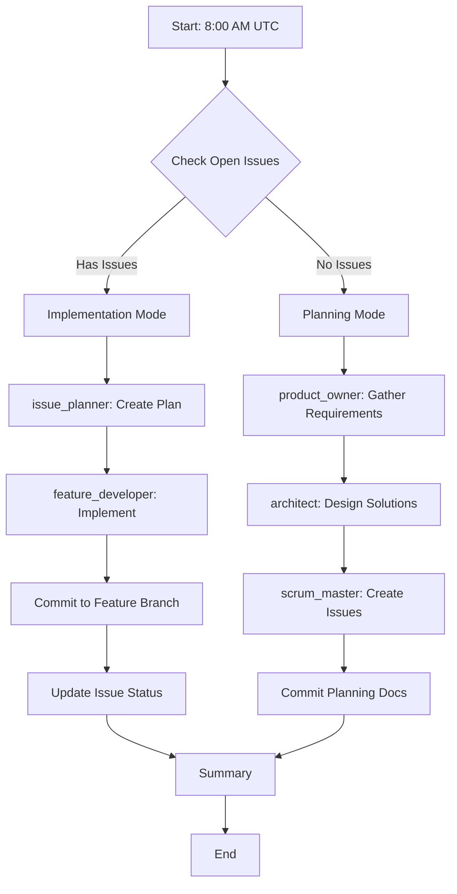
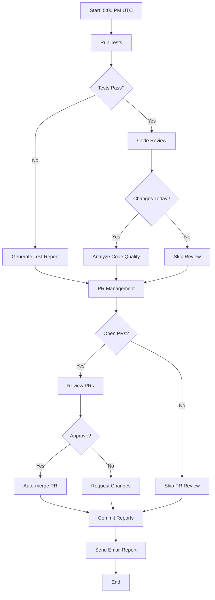

# CasaZen Agent Orchestrators

> Automated daily workflows that orchestrate AI agents for continuous development, testing, and deployment.

## Overview

The CasaZen project uses two main orchestrator workflows that run automatically every day:

1. **Daily Development Orchestrator** - 8:00 AM UTC
2. **Daily Testing & Review Orchestrator** - 5:00 PM UTC

These workflows coordinate multiple AI agents to implement features, run tests, review code, and manage pull requests autonomously.

---

## 🌅 Daily Development Orchestrator

**File**: `.github/workflows/daily-development.yml`
**Schedule**: Every day at 08:00 UTC (9:00 CET / 10:00 CEST)
**Trigger**: Automatic via cron, or manual via `workflow_dispatch`

### Workflow Logic



### Implementation Mode (Backlog Has Issues)

When there are open issues in the backlog:

1. **Check Backlog** (`check-backlog` job)
   - Lists all open issues (excluding regulatory issues)
   - Identifies the oldest issue for implementation
   - Outputs: `has_issues=true`, `issue_number`, `issue_count`

2. **Plan Implementation** (`implement-issue` job)
   - Agent: `issue_planner`
   - Reads issue details from GitHub
   - Creates detailed implementation plan
   - Saves plan to: `.claude/sprint/issue-{number}-plan.md`

3. **Implement Feature** (`implement-issue` job)
   - Agent: `feature_developer`
   - Reads the implementation plan
   - Implements the feature following project guidelines
   - Creates feature branch
   - Commits changes (Conventional Commits format)
   - **Limit**: Maximum 1 issue per day

4. **Update Issue**
   - Adds comment to issue about automated implementation
   - Labels: `in-progress`, `automated-dev`

### Planning Mode (Backlog Empty)

When there are no open issues:

1. **Product Owner Analysis** (`create-new-issues` job)
   - Agent: `product_owner`
   - Analyzes project needs
   - Reviews regulatory compliance requirements
   - Identifies 2-3 high-priority features/improvements
   - Saves to: `.claude/sprint/daily-{date}-requirements.md`

2. **Architecture Design**
   - Agent: `architect`
   - Reads requirements from product_owner
   - Designs technical implementation
   - Specifies affected layers/components
   - Saves to: `.claude/sprint/daily-{date}-architecture.md`

3. **Issue Creation**
   - Agent: `scrum_master`
   - Reads requirements and architecture
   - Creates 2 detailed GitHub issues for top priorities
   - Labels: `feature`/`bug`/`enhancement`, priority
   - Saves to: `.claude/sprint/daily-{date}-issues-created.md`

4. **Commit Planning Docs**
   - Commits all planning documents to repository
   - Message: `chore: daily sprint planning - new issues defined [automated]`

### Manual Trigger

Force planning mode even with existing issues:

```bash
gh workflow run daily-development.yml --field force_new_issues=true
```

### Outputs

- Sprint planning documents: `.claude/sprint/`
- Implementation plans: `.claude/sprint/issue-{number}-plan.md`
- Feature branches: `feature/{description}`
- GitHub Summary: Visible in Actions tab

---

## 🌆 Daily Testing & Review Orchestrator

**File**: `.github/workflows/daily-testing-and-review.yml`
**Schedule**: Every day at 17:00 UTC (6:00 PM CET / 7:00 PM CEST)
**Trigger**: Automatic via cron, or manual via `workflow_dispatch`

### Workflow Logic



### Phase 1: Testing

**Job**: `run-tests`

1. Setup environment (.NET 10, Claude Code)
2. Restore dependencies and build
3. **Run comprehensive test suite**:
   - Unit tests
   - Integration tests
   - Code coverage collection
   - Results saved to: `./TestResults/`

4. **Test Engineer Analysis**:
   - Agent: `test_engineer`
   - Analyzes test results (.trx files)
   - Reviews code coverage reports
   - Compares against targets (project.json):
     - Critical business logic: 100%
     - Services/Repositories: 80%
     - Controllers: 70%
   - Generates report: `.claude/reports/test-report-{date}.md`

5. **Outputs**:
   - `test_result`: `success` or `failure`
   - `test_summary`: Brief summary
   - Artifacts uploaded (30-day retention)

### Phase 2: Code Review

**Job**: `code-review`
**Depends on**: `run-tests` (runs even if tests fail)

1. **Get Today's Changes**:
   - Lists all commits from today
   - Outputs: `has_changes` (true/false), `commit_count`

2. **Code Reviewer Analysis** (if has_changes):
   - Agent: `code_reviewer`
   - Reviews all commits with `git log --patch`
   - Checks for:
     - Code quality (Microsoft C# conventions)
     - Security vulnerabilities (OWASP Top 10)
     - Async/await patterns
     - Test coverage for new code
     - Compliance with CLAUDE.md
   - Assigns quality score: A-F
   - Generates report: `.claude/reports/code-review-{date}.md`

3. **Outputs**:
   - `review_result`: `completed` or `skipped`
   - `review_summary`: Brief summary

### Phase 3: PR Management

**Job**: `pr-management`
**Depends on**: `run-tests`, `code-review`

1. **Check Open PRs**:
   - Lists all open pull requests
   - Outputs: `has_prs` (true/false), `pr_count`

2. **Release Manager Review** (if has_prs):
   - Agent: `release_manager`
   - Reviews each PR using `gh pr list`
   - Checks:
     - Test report (all tests passed?)
     - Code review report (quality score B or better?)
     - CI/CD status (`gh pr checks`)
   - **Decision criteria**:
     - ✅ **APPROVE & MERGE**: All tests pass + quality B+ + CI green
     - ❌ **REQUEST CHANGES**: Any check fails
   - Auto-merges approved PRs: `gh pr merge --auto --squash`
   - Generates report: `.claude/reports/pr-management-{date}.md`

3. **Outputs**:
   - `pr_result`: `completed` or `skipped`
   - `pr_summary`: Brief summary

### Phase 4: Commit Reports

**Job**: `commit-reports`

- Downloads all generated reports (test, code review, PR management)
- Commits to repository: `.claude/reports/`
- Message: `chore: daily testing and review reports [automated]`

### Phase 5: Email Report

**Job**: `send-email-report`
**Recipient**: `luca.lamal@hotmail.it`

Sends HTML email via SendGrid API with:

- **Executive Summary**: Status of all components
- **Testing Results**: Pass/fail, summary, link to full report
- **Code Review**: Quality score, findings, link to full report
- **PR Management**: Decisions made, link to full report
- **Next Steps**: Recommendations and timeline

Email includes workflow run link for detailed logs.

### Manual Trigger

Run testing & review cycle manually:

```bash
gh workflow run daily-testing-and-review.yml
```

### Outputs

- Test reports: `.claude/reports/test-report-{date}.md`
- Code review reports: `.claude/reports/code-review-{date}.md`
- PR management reports: `.claude/reports/pr-management-{date}.md`
- Email: Sent to luca.lamal@hotmail.it
- GitHub Summary: Visible in Actions tab

---

## 🔐 Required Secrets

Configure these in **Repository Settings → Secrets and variables → Actions**:

### Required Secrets

1. **`ANTHROPIC_API_KEY`**
   - Purpose: Claude Code API access
   - Used by: Both orchestrators
   - Get from: https://console.anthropic.com/

2. **`SENDGRID_API_KEY`**
   - Purpose: Email report delivery
   - Used by: Daily Testing & Review
   - Get from: https://app.sendgrid.com/

### Automatic Secrets

- **`GITHUB_TOKEN`**: Automatically provided by GitHub Actions
  - Used for: Issue management, PR operations, commits

---

## 📊 Development Cycle

### Daily Timeline (UTC)

```
06:00 ────────────────────────────────────────────

08:00 ──► DAILY DEVELOPMENT (9:00 CET / 10:00 CEST)
           │
           ├─ Check backlog
           ├─ Implement 1 issue OR create new issues
           └─ Push changes

12:00 ────────────────────────────────────────────

                Development work in progress...

17:00 ──► TESTING & REVIEW (6:00 PM CET / 7:00 PM CEST)
           │
           ├─ Run all tests
           ├─ Code review
           ├─ PR management
           ├─ Auto-merge if approved
           └─ Send email report

20:00 ────────────────────────────────────────────
```

### Weekly Pattern

- **Monday-Friday**: Full development + testing cycle
- **Saturday-Sunday**: Orchestrators run but typically no changes
- **Monthly**: Regulatory agents run (1st of month, 8:00 AM)

### Development Velocity

- **Current**: 1 issue/day maximum (configurable)
- **Testing**: 100% of daily work tested same day
- **Review**: All code reviewed before merge
- **Deployment**: Automatic merge if all checks pass

---

## 🚀 Agent Ecosystem

### Global Agents (Claude Code Built-in)

These agents are available globally and used by orchestrators:

| Agent | Purpose | Used By | Phase |
|-------|---------|---------|-------|
| `product_owner` | Requirements gathering | Development | Planning |
| `architect` | Architecture design | Development | Planning |
| `issue_planner` | Implementation planning | Development | Implementation |
| `feature_developer` | Code implementation | Development | Implementation |
| `test_engineer` | Test suite execution & analysis | Testing & Review | Testing |
| `code_reviewer` | Code quality review | Testing & Review | Review |
| `release_manager` | PR management & deployment | Testing & Review | PR Management |

### Project-Specific Agents

Domain-specific agents in `.claude/agents/`:

| Agent | Purpose | Schedule | Workflow |
|-------|---------|----------|----------|
| `scrum_master_casazen` | Cross-repo coordination | On-demand | Daily Development (Planning) |
| `regulatory_agent` | Collect regulatory updates | Monthly (1st, 8:00 AM) | `regulatory-agents.yml` |
| `analyzer_agent` | Compliance gap analysis | Monthly | `regulatory-agents.yml` |
| `github_agent` | Create compliance issues | Monthly | `regulatory-agents.yml` |

---

## 📁 Directory Structure

```
.claude/
├── agents/                    # Project-specific agent definitions
│   ├── scrum_master_casazen.md
│   ├── regulatory_agent.md
│   ├── analyzer_agent.md
│   └── github_agent.md
│
├── config/                    # Configuration
│   └── project.json          # Tech stack, conventions, structure
│
├── context/                   # Domain knowledge
│   ├── regulations/          # Italian rental regulations
│   ├── domain/               # Business domain knowledge
│   └── open_issues.md        # Current issues status
│
├── coordination/              # Cross-repo tracking
│   └── {feature}-status.md   # Feature coordination docs
│
├── reports/                   # Daily reports (auto-generated)
│   ├── test-report-{date}.md
│   ├── code-review-{date}.md
│   └── pr-management-{date}.md
│
├── sprint/                    # Sprint planning (auto-generated)
│   ├── issue-{number}-plan.md
│   ├── daily-{date}-requirements.md
│   ├── daily-{date}-architecture.md
│   └── daily-{date}-issues-created.md
│
└── ORCHESTRATORS.md          # This file
```

---

## 🔍 Monitoring & Debugging

### View Workflow Status

```bash
# List recent workflow runs
gh run list --workflow=daily-development.yml --limit 5
gh run list --workflow=daily-testing-and-review.yml --limit 5

# View specific run
gh run view {run-id}

# Watch live run
gh run watch {run-id}
```

### Check Reports

```bash
# View latest test report
cat .claude/reports/test-report-$(date +%Y%m%d).md

# View latest code review
cat .claude/reports/code-review-$(date +%Y%m%d).md

# View latest PR management
cat .claude/reports/pr-management-$(date +%Y%m%d).md
```

### Check Sprint Planning

```bash
# View today's planning docs
ls -la .claude/sprint/daily-$(date +%Y%m%d)-*

# View specific issue plan
cat .claude/sprint/issue-{number}-plan.md
```

### Troubleshooting

**Workflow not running?**
- Check cron syntax: https://crontab.guru/
- Verify repository is active (push within 60 days)
- Check Actions tab for errors

**Tests failing?**
- Review test report: `.claude/reports/test-report-{date}.md`
- Check workflow logs for detailed error messages
- Run tests locally: `dotnet test`

**PRs not auto-merging?**
- Check quality score in code review report (must be B or better)
- Verify all tests passed
- Check CI/CD status: `gh pr checks {pr-number}`

**Email not received?**
- Verify `SENDGRID_API_KEY` secret is set
- Check SendGrid dashboard for delivery status
- Check spam folder
- Review workflow logs for API errors

---

## ⚙️ Configuration

### Adjust Development Velocity

To implement more than 1 issue per day, modify `daily-development.yml`:

```yaml
# In implement-issue job, add loop:
- name: Implement Features
  run: |
    MAX_ISSUES=3  # Increase from 1 to desired number
    for i in $(seq 1 $MAX_ISSUES); do
      # Implementation logic...
    done
```

### Change Schedule

Edit cron expressions in workflow files:

```yaml
on:
  schedule:
    # Current: 8:00 AM UTC
    - cron: '0 8 * * *'
    # Change to: 7:00 AM UTC
    - cron: '0 7 * * *'
```

Use https://crontab.guru/ to generate cron expressions.

### Customize Email Recipients

Edit `daily-testing-and-review.yml`:

```yaml
"to": [
  {"email": "luca.lamal@hotmail.it", "name": "Luca La Malfa"},
  {"email": "additional@email.com", "name": "Additional Recipient"}
]
```

### Adjust Quality Thresholds

Modify agent prompts in workflows to change approval criteria:

```yaml
# Current: Quality B or better
claude -p "...quality score is B or better..."

# Change to: Quality A only
claude -p "...quality score is A..."
```

---

## 🎯 Best Practices

### For Development

1. **Let orchestrators run**: Don't interrupt daily cycles
2. **Review reports**: Check `.claude/reports/` daily
3. **Monitor email**: Read daily reports from bot
4. **Manual intervention**: Use `workflow_dispatch` for urgent issues
5. **Issue quality**: Well-written issues = better implementations

### For Testing

1. **Write comprehensive tests**: Higher coverage = more confidence
2. **Review test reports**: Don't ignore failing tests
3. **Quality standards**: Maintain B+ code quality
4. **CI/CD green**: Fix broken builds immediately

### For PR Management

1. **Trust the bot**: Let release_manager make merge decisions
2. **Request changes**: If quality is low, bot won't merge
3. **Manual review**: Override bot decisions when needed
4. **Deployment monitoring**: Watch production after auto-merges

---

## 📚 Related Documentation

- **Project Guidelines**: `CLAUDE.md`
- **Technical Configuration**: `.claude/config/project.json`
- **Main README**: `README.md`
- **CI/CD Pipeline**: `.github/workflows/ci-cd.yml`
- **Regulatory Agents**: `.github/workflows/regulatory-agents.yml`

---

## 📞 Support

**Issues with orchestrators?**
1. Check workflow logs: GitHub Actions tab
2. Review reports: `.claude/reports/`
3. Manual trigger: `gh workflow run {workflow-name}`
4. Contact: Create issue with `orchestrator` label

**Questions?**
- Email: luca.lamal@hotmail.it (daily reports)
- GitHub: Create issue with questions

---

**Last Updated**: 2026-03-30
**Maintained By**: CasaZen Development Team
