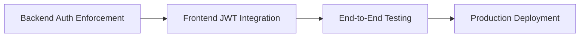

# Cross-Repo Status: Authentication Integration

## Issues
- **Backend Epic**: casazen/backend#105 - 
- **Backend PR**: casazen/backend#109 - 
- **Frontend**: casazen/frontend#42 - 

## Progress Checkpoints

### ✅ Checkpoint 1: Backend Authentication Enforced (COMPLETED)
**Completed**: 2026-05-04
- [x] `[Authorize]` attribute restored on all controllers
- [x] JWT audience validation re-enabled
- [x] 13 regression tests added (prevent future auth bypass)
- [x] PR #109 merged to main
- [x] Backend deployed with authentication enforcement

**Deliverables**:
- All API endpoints require valid Auth0 JWT tokens
- Audience validation: `https://casazen-api`
- Policy enforcement: `PropertyOwner` role required

### ⏳ Checkpoint 2: Frontend JWT Integration (IN PROGRESS)
**Target**: Day 1-2 from start
**Issue**: casazen/frontend#42

**Tasks**:
- [ ] Auth0Provider configured with correct domain, clientId, audience
- [ ] API client interceptor adds Authorization header
- [ ] `getAccessTokenSilently()` implemented with audience parameter
- [ ] Error handling for 401/403 responses
- [ ] Token refresh logic implemented
- [ ] Basic authentication flow working

**Blockers**: None (backend ready)

### 🔄 Checkpoint 3: End-to-End Testing (PENDING)
**Target**: Day 2-3
**Dependencies**: Checkpoint 2 complete

**Tasks**:
- [ ] Frontend can successfully authenticate users
- [ ] Properties CRUD operations work end-to-end
- [ ] Bookings CRUD operations work end-to-end
- [ ] Guest management operations work
- [ ] Payment processing operations work
- [ ] OTA integration operations work
- [ ] Token refresh tested (manual expiration test)
- [ ] 401 redirect to login tested
- [ ] 403 access denied handling tested

### 🚀 Checkpoint 4: Production Deployment (PENDING)
**Target**: Day 3-4
**Dependencies**: Checkpoint 3 complete

**Tasks**:
- [ ] Backend deployed to production (already done)
- [ ] Frontend deployed to production with auth changes
- [ ] Smoke tests pass in production
- [ ] User login flow verified
- [ ] Critical paths tested (property creation, booking)
- [ ] Monitoring confirms no auth failures

## Dependencies



## API Contract

### Backend Configuration
From `appsettings.json`:
```json
{
  "Auth0": {
    "Domain": "your-domain.auth0.com",
    "Audience": "https://casazen-api",
    "ClientId": "YOUR_CLIENT_ID",
    "ClientSecret": "YOUR_CLIENT_SECRET"
  }
}
```

**Critical for Frontend**:
- **Audience**: `https://casazen-api` (MUST match exactly)
- **Domain**: Get from backend team (appsettings.Development.json)
- **Scopes**: `openid profile email` (minimum)

### Authorization Header Format
```
Authorization: Bearer <JWT_TOKEN>
```

### Protected Endpoints
All endpoints under `/api/*` require authentication:
- Properties: `/api/properties/*`
- Bookings: `/api/bookings/*`
- Guests: `/api/guests/*`
- Payments: `/api/payments/*`
- OTA: `/api/ota/*`

### Error Responses

**401 Unauthorized** (missing/invalid token):
```json
{
  "type": "https://tools.ietf.org/html/rfc7235#section-3.1",
  "title": "Unauthorized",
  "status": 401,
  "traceId": "00-abc123..."
}
```

**403 Forbidden** (valid token, insufficient permissions):
```json
{
  "type": "https://tools.ietf.org/html/rfc7231#section-6.5.3",
  "title": "Forbidden",
  "status": 403,
  "traceId": "00-xyz789..."
}
```

## Current Blocker
**None** - Backend is ready, frontend can start implementation.

## Communication Log

### 2026-05-04 - Backend Auth Re-enabled
- **Event**: PR #109 merged to main
- **Impact**: All API endpoints now require authentication
- **Action**: Created frontend issue #42 with implementation guide
- **Status**: Waiting for frontend implementation

## Next Actions

**Frontend Team**:
1. Review issue casazen/frontend#42
2. Configure Auth0Provider with backend-compatible settings
3. Implement API client interceptor for Authorization header
4. Test against local backend (https://localhost:5001)
5. Report progress in issue comments

**Backend Team**:
- Monitor for frontend integration questions
- Provide Auth0 configuration values (Domain, ClientId)
- Ready to assist with debugging auth failures

## Success Metrics

**Definition of Done**:
- [ ] Frontend sends Authorization header on all API requests
- [ ] Backend accepts and validates tokens correctly
- [ ] Users can perform all authenticated operations:
  - Create/read/update/delete properties
  - Create/read/update/delete bookings
  - Manage guests
  - Process payments
  - Sync OTA integrations
- [ ] Error handling works (401 → login, 403 → access denied)
- [ ] Token refresh works automatically
- [ ] No authentication bypasses in production code
- [ ] Both repos deployed to production with auth working

## Estimated Timeline

- **Backend**: COMPLETED (2026-05-04)
- **Frontend**: 6-8 hours implementation + 2-3 hours testing
- **End-to-End Testing**: 4 hours
- **Production Deployment**: 2 hours
- **Total Remaining**: 2-3 days

## Risk Assessment

- **HIGH**: Users cannot use application until frontend auth implemented
- **MEDIUM**: Regulatory compliance at risk (Alloggiati Web reporting requires working auth)
- **LOW**: Backend rollback risk (tests prevent regression)

## Last Updated
**Date**: 2026-05-04
**Status**: Backend complete, frontend in progress
**Updated by**: Scrum Master Agent
