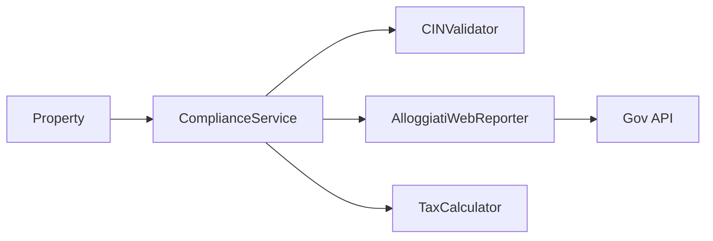
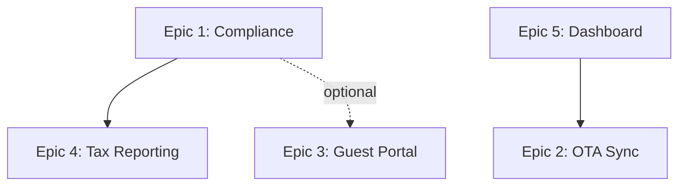

# Compliance-Driven Feature Creation

> **Agenti coinvolti**: `@regulatory_agent`, `@analyzer_agent`, `@scrum_master_casazen`, `@feature_developer`, `@github_agent`
> **Accesso**: GitHub MCP, WebSearch
> **Obiettivo**: Identificare gap di compliance, confrontare con competitor, generare feature da implementare, issue su github

**Workflow**: Regulatory Update → Gap Analysis → Competitive Research → Feature Planning → Issue Creation

---

## Workflow Overview

```
┌─────────────────────┐
│ 0. Planning & Epics │ → Verifica esistenza + Refinement Meeting
│    Check            │   (@product_owner, @architect, @scrum_master_casazen)
└──────────┬──────────┘
           │
┌──────────▼──────────┐
│ 1. Regulatory Update│ → @regulatory_agent aggiorna normative italiane
│    (@regulatory     │
│     _agent)         │
└──────────┬──────────┘
           │
┌──────────▼──────────┐
│ 2. Gap Analysis     │ → @analyzer_agent trova gap tra norme e codice
│    (@analyzer       │
│     _agent)         │
└──────────┬──────────┘
           │
┌──────────▼──────────┐
│ 3. Competitive      │ → WebSearch: cosa offrono tool competitor
│    Research         │   (Lodgify, Guesty, Hostaway, etc.)
└──────────┬──────────┘
           │
┌──────────▼──────────┐
│ 4. Codebase Check  │ → Verifica se feature già esistono (parzialmente)
│    (Grep/Glob)      │
└──────────┬──────────┘
           │
┌──────────▼──────────┐
│ 5. Feature Planning │ → Consolida gap + competitive insights
│                     │   → Priorità, scope, FE vs BE
└──────────┬──────────┘
           │
┌──────────▼──────────┐
│ 6. Issue Creation   │ → @scrum_master_casazen apre issue su GitHub
│    (@scrum_master   │   (distribuisce FE/BE, assegna label)
│     _casazen)       │
└──────────┬──────────┘
           │
      ┌────▼────┐
      │ DONE    │ → Issue create, pronte per implementazione
      └─────────┘
```

---

USA SEMPRE le indicazioni nel file

## STEP 0 — Planning & Epics Check (Prerequisites)

### Obiettivo

**CRITICAL**: Prima di procedere con feature creation, verificare se esiste già un planning strategico ed epics attive. Se non esistono, convocare refinement meeting per crearli.

### Verifica Esistenza Planning

**Controlli da eseguire**:

1. **Planning Document**: Verifica se esiste `.claude/context/planning/product-roadmap.md`
2. **Active Epics**: Verifica su GitHub se esistono issue con label `epic` aperte

**Comandi**:
```bash
# Verifica planning document
Read .claude/context/planning/product-roadmap.md

# Verifica epics attive (via GitHub MCP)
gh issue list --label epic --state open --repo casazen/backend
gh issue list --label epic --state open --repo casazen/frontend
```

### Decision Tree

```
Planning exists? ──NO──┐
                       │
    │                  │
   YES                 │
    │                  │
    ▼                  ▼
Epics active? ──NO──> CREATE PLANNING & EPICS (Step 0.1)
    │
   YES
    │
    ▼
SKIP to STEP 1 (Regulatory Update)
```

**Regola**: Se **planning NON esiste** O **epics attive = 0** → Procedi con Step 0.1
Altrimenti → **SKIP direttamente a STEP 1**

---

## STEP 0.1 — Refinement Meeting: Planning & Epics Creation

**Trigger**: Eseguito SOLO se planning o epics non esistono.

### Obiettivo

Convocare **refinement meeting strategico** con:
- `@product_owner` (requirements, prioritization)
- `@architect` (technical feasibility, architecture)
- `@scrum_master_casazen` (cross-repo coordination, backlog management)

**Output atteso**:
1. ✅ Product roadmap (planning strategico)
2. ✅ Epics create su GitHub (FE + BE)
3. ✅ Prioritization matrix

---

### Phase 1: Strategic Planning Discussion (In-Memory)

**IMPORTANTE**: Le discussioni tra agenti avvengono **in memoria** senza creare file intermedi. Solo l'output finale consolidato sarà scritto su disco.

Invoca i tre agenti in sequenza per discussione collaborativa:

#### 1. Product Owner - Vision & Requirements

**Prompt per @product_owner**:
```markdown
@product_owner, partecipa a strategic planning per CasaZen.

**Contesto**:
- Prodotto: Piattaforma gestione affitti brevi (Italia)
- Mercato: Property manager, host Airbnb/Booking.com
- Compliance: D.L. 145/2023, Alloggiati Web, Tourist Tax, GDPR

**Task**:
1. Definisci **Product Vision** (6-12 mesi)
2. Identifica **Key User Personas** (es. property owner, guest, admin)
3. Elenca **Top 5 Strategic Goals** (es. compliance automation, OTA sync, guest experience)
4. Proponi **High-Level Epics** basate su:
   - Compliance requirements (regulatory-driven)
   - Market trends (competitor analysis)
   - User pain points

**IMPORTANTE**: Rispondi in conversazione (in-memory), NON creare file .md
Il tuo output sarà usato da @architect per technical analysis

**Formato Output**:
Restituisci analisi strutturata in markdown (in conversazione) pronta per @architect
```

**Output atteso (in conversazione)**:
```markdown
## Product Vision

**Mission**: Semplificare gestione affitti brevi in Italia, automatizzando compliance e sync OTA.

**Target Market**:
- Property manager (10-50 proprietà)
- Host individuali (1-5 proprietà)
- Agenzie immobiliari

**Strategic Goals** (Q2-Q3 2026):
1. 🔴 100% Compliance normativa italiana (P0)
2. 🟡 OTA sync real-time (Airbnb, Booking.com)
3. 🟢 Guest self-service (check-in, pagamenti)
4. 🔵 Analytics & reporting fiscale
5. 🟣 Multi-property management dashboard

## Epic Candidates

### Epic 1: Italian Regulatory Compliance Automation
**Business Value**: Evitare sanzioni (€500-5000), mandatory per operare
**User Story**: Come property owner, voglio che il sistema gestisca automaticamente CIN, Alloggiati Web, Tourist Tax
**KPI**: Zero sanzioni normative, 100% compliance

### Epic 2: Real-Time OTA Synchronization
**Business Value**: Evitare double booking, automatizzare pricing
**User Story**: Come property manager, voglio sync automatico calendario e prezzi su tutte le OTA
**KPI**: Zero double booking, 95% sync success rate

### Epic 3: Guest Self-Service Portal
**Business Value**: Ridurre carico manuale check-in, migliorare guest experience
**User Story**: Come guest, voglio check-in digitale e accesso documenti senza contattare host
**KPI**: 80% self-service adoption, NPS > 8

### Epic 4: Financial & Tax Reporting
**Business Value**: Semplificare dichiarazione redditi, cedolare secca
**User Story**: Come property owner, voglio report automatici per commercialista
**KPI**: 100% transazioni tracciate, export F24 ready

### Epic 5: Multi-Property Dashboard
**Business Value**: Gestione centralizzata portfolio
**User Story**: Come property manager, voglio vista unified su tutte le proprietà
**KPI**: < 5s dashboard load time, real-time updates
```

---

#### 2. Architect - Technical Feasibility

**Prompt per @architect**:
```markdown
@architect, valuta technical feasibility delle epics proposte da @product_owner.

**Input**: Output di @product_owner (fornito sopra nella conversazione)

**Task**:
1. Per ogni epic proposta da @product_owner, analizza:
   - ✅ **Feasibility**: Tecnicamente realizzabile? Blockers?
   - 🏗️ **Architecture Impact**: Nuovi servizi? Integration esterne? DB schema changes?
   - ⏱️ **Effort Estimate**: Small (< 2 settimane), Medium (2-4 sett), Large (> 1 mese)
   - 🔗 **Dependencies**: Richiede altre epics prima? Infra setup?
   - ⚠️ **Risks**: Technical debt, security concerns, performance bottlenecks

2. Proponi **Technical Architecture** per top 3 epics (priorità)

**IMPORTANTE**: Rispondi in conversazione (in-memory), NON creare file .md
Il tuo output sarà usato da @scrum_master_casazen per consolidamento finale

**Formato Output**:
Restituisci analisi tecnica strutturata in markdown (in conversazione) con:
- Feasibility assessment per epic
- Architecture diagrams (mermaid) per epics complesse
- Risk mitigation strategies
```

**Output atteso (in conversazione)**:
```markdown
## Technical Feasibility Analysis

### Epic 1: Italian Regulatory Compliance Automation
✅ **Feasibility**: HIGH (domain knowledge available, clear requirements)
🏗️ **Architecture Impact**:
- Background workers (Alloggiati Web submission, tax calculation)
- Integration with government APIs (CIN validation, Alloggiati Web)
- DB schema: ComplianceReport, TaxCalculation entities

⏱️ **Effort**: Medium (3-4 settimane)
🔗 **Dependencies**:
- SSL certificate per Alloggiati Web API
- CIN validation API availability

⚠️ **Risks**:
- Government API downtime (mitigation: retry + manual fallback)
- Changing regulations (mitigation: modular compliance rules engine)

**Architecture**:


### Epic 2: Real-Time OTA Synchronization
✅ **Feasibility**: MEDIUM (complex integration, rate limits)
🏗️ **Architecture Impact**:
- Webhook listeners per OTA platforms
- Event-driven sync (RabbitMQ or Azure Service Bus)
- Conflict resolution logic (calendar overlap, pricing mismatch)

⏱️ **Effort**: Large (6-8 settimane)
🔗 **Dependencies**:
- OTA API access (Airbnb, Booking.com partnerships)
- Message broker infrastructure

⚠️ **Risks**:
- OTA API changes (mitigation: adapter pattern, versioning)
- Rate limiting (mitigation: exponential backoff, queue throttling)
- Sync conflicts (mitigation: last-write-wins + manual review)

### Epic 3: Guest Self-Service Portal
✅ **Feasibility**: HIGH (standard features)
🏗️ **Architecture Impact**:
- Separate frontend module (React SPA)
- Public API (guest-facing, different auth)
- Document storage (Azure Blob Storage)

⏱️ **Effort**: Medium (4-5 settimane)
🔗 **Dependencies**: None (can start immediately)
⚠️ **Risks**: Low (well-known patterns)

### Epic 4: Financial & Tax Reporting
✅ **Feasibility**: MEDIUM (accounting domain complexity)
⏱️ **Effort**: Medium (3-4 settimane)
⚠️ **Risks**: Tax calculation errors (mitigation: accountant validation, unit tests)

### Epic 5: Multi-Property Dashboard
✅ **Feasibility**: HIGH (mostly FE work)
⏱️ **Effort**: Small (2-3 settimane)
⚠️ **Risks**: Performance with 50+ properties (mitigation: pagination, caching)

## Recommended Prioritization (Technical Perspective)

1. **Epic 1** (Compliance): MUST-HAVE, legal requirement
2. **Epic 3** (Guest Portal): HIGH, low dependencies, high ROI
3. **Epic 5** (Dashboard): MEDIUM, foundational for other epics
4. **Epic 2** (OTA Sync): HIGH, but complex (parallel stream)
5. **Epic 4** (Reporting): LOW, can defer to Q3
```

---

#### 3. Scrum Master - Coordination & Final Consolidation

**Prompt per @scrum_master_casazen**:
```markdown
@scrum_master_casazen, consolida planning e crea epics finali.

**Input (dalla conversazione)**:
- Product vision & epics da @product_owner (output sopra)
- Technical feasibility da @architect (output sopra)

**Task**:
1. **Consolida feedback** da @product_owner e @architect (in memoria)
2. **Finalizza Epics** (max 5 epics per roadmap):
   - Combina business value + technical feasibility
   - Risolvi conflitti priorità (business vs tech)
   - Ordina per priorità finale

3. **Crea Product Roadmap FILE** ⭐ **UNICO FILE DA SCRIVERE**:
   - Path: `.claude/context/planning/product-roadmap.md`
   - Includi: Vision (da @product_owner) + Feasibility (da @architect) + Roadmap finale
   - Timeline: Q2-Q3 2026
   - Epics con dependencies graph
   - Resource allocation estimate

4. **Open GitHub Issues (Epics)**:
   - Crea issue con label `epic` su repository corrette
   - Template epic:
     ```markdown
     ## Epic: <Nome>

     **Business Value**: <Value proposition>
     **User Story**: <As a... I want... so that...>

     ## Scope
     - [ ] Frontend
     - [ ] Backend
     - [ ] Integration

     ## Success Criteria
     - [ ] Criterio 1
     - [ ] Criterio 2

     ## Dependencies
     - Depends on: <epic se applicabile>
     - Blocks: <epic se applicabile>

     ## Technical Notes
     <Architecture overview da @architect>

     ## Timeline
     **Effort**: <Small/Medium/Large>
     **Target**: <Q2/Q3 2026>

     ## Related Issues
     <Will be populated during feature breakdown>

     ---
     🤖 Generated via Strategic Planning Refinement
     Priority: <P0/P1/P2> | Business Value: <High/Medium/Low>
     ```

   - Label: `epic`, `priority:<level>`, `frontend` or `backend`

**Output**:
- `.claude/context/planning/product-roadmap.md` (consolidated planning)
- N GitHub issues created (epics)
```

**Output atteso (product-roadmap.md - consolidato completo)**:
```markdown
## Product Roadmap: Q2-Q3 2026

---

## Product Vision (from @product_owner)

**Mission**: Semplificare gestione affitti brevi in Italia, automatizzando compliance e sync OTA.

**Target Market**:
- Property manager (10-50 proprietà)
- Host individuali (1-5 proprietà)
- Agenzie immobiliari

**Strategic Goals** (Q2-Q3 2026):
1. 🔴 100% Compliance normativa italiana (P0)
2. 🟡 OTA sync real-time (Airbnb, Booking.com)
3. 🟢 Guest self-service (check-in, pagamenti)
4. 🔵 Analytics & reporting fiscale
5. 🟣 Multi-property management dashboard

---

## Technical Feasibility (from @architect)

### Epic-Level Analysis

**Epic 1: Regulatory Compliance Automation**
- ✅ Feasibility: HIGH
- 🏗️ Architecture: Background workers, Gov API integration, DB schema changes
- ⏱️ Effort: Medium (3-4 settimane)
- ⚠️ Risks: Gov API downtime, changing regulations

**Epic 2: OTA Real-Time Sync**
- ✅ Feasibility: MEDIUM
- 🏗️ Architecture: Webhook listeners, event-driven sync, conflict resolution
- ⏱️ Effort: Large (6-8 settimane)
- ⚠️ Risks: Rate limiting, API changes

**Epic 3-5**: [Similar structure...]

---

## Roadmap (consolidated)

### Epic Prioritization Matrix

| Priority | Epic                        | Business Value | Feasibility | Effort | Target |
|----------|-----------------------------|----------------|-------------|--------|--------|
| 🔴 P0    | Regulatory Compliance       | HIGH           | HIGH        | Medium | Q2     |
| 🟡 P1    | Guest Self-Service Portal   | MEDIUM         | HIGH        | Medium | Q2-Q3  |
| 🟡 P1    | Multi-Property Dashboard    | MEDIUM         | HIGH        | Small  | Q2     |
| 🟢 P2    | OTA Real-Time Sync          | HIGH           | MEDIUM      | Large  | Q3     |
| 🔵 P3    | Financial & Tax Reporting   | MEDIUM         | MEDIUM      | Medium | Q3     |

### Dependencies Graph



### Timeline

**Q2 2026** (Apr-Jun):
- Epic 1: Regulatory Compliance ✅ START
- Epic 5: Multi-Property Dashboard ✅ START
- Epic 3: Guest Self-Service Portal (START late Q2)

**Q3 2026** (Jul-Sep):
- Epic 2: OTA Real-Time Sync
- Epic 4: Financial Reporting

### Resource Allocation

- **Backend Developer**: 80% Epic 1, 20% Epic 5
- **Frontend Developer**: 50% Epic 5, 50% Epic 3
- **Full-Stack**: 100% Epic 2 (Q3)

### GitHub Epics Created

- casazen/backend#XXX: [Epic] Italian Regulatory Compliance Automation
- casazen/backend#YYY: [Epic] OTA Real-Time Synchronization
- casazen/frontend#ZZZ: [Epic] Guest Self-Service Portal
- casazen/frontend#AAA: [Epic] Multi-Property Dashboard
- casazen/backend#BBB: [Epic] Financial & Tax Reporting
```

---

### Output STEP 0.1

Al termine del refinement meeting:
- ✅ **Discussioni in-memory** tra @product_owner, @architect, @scrum_master_casazen
- ✅ **UNICO FILE SCRITTO**: `.claude/context/planning/product-roadmap.md` (consolidato completo)
  - Include: Vision, Technical Feasibility, Roadmap, Epics
  - Tutti gli insights dei 3 agenti in un unico documento
- ✅ 5 GitHub issues create (label `epic`)

**Benefit**: No file intermedi, conversazione fluida, output finale completo

**Next**: Procedi con **STEP 1 - Regulatory Update** per popolare epics con feature specifiche.

---

## STEP 1 — Regulatory Update

### Invoca @regulatory_agent

**Obiettivo**: Aggiornare `.claude/context/regulations/` con normative italiane recenti.

**Prompt**:
```markdown
@regulatory_agent, aggiorna le normative italiane per affitti brevi:

**Focus**:
- D.L. 145/2023 (CIN codes)
- Alloggiati Web (reporting ospiti)
- Tourist tax (tassa di soggiorno)
- GDPR (gestione dati ospiti)
- Cedolare secca (regime fiscale)
- Nuove normative 2024-2026 (se disponibili)

**Output atteso**:
- File `.claude/context/regulations/<normativa>.md` aggiornati
- Changelog con novità rispetto alla versione precedente
- Highlight: obblighi nuovi, scadenze, sanzioni

**Fonti**:
- Gazzetta Ufficiale
- Ministero del Turismo
- Agenzia delle Entrate
- Regioni (Lombardia, Lazio, Toscana, etc.)
```

### Output Atteso

Al termine:
- ✅ File regulations aggiornati
- ✅ Changelog con delta rispetto a versione precedente
- ✅ Identificazione nuovi obblighi normativi

**Esempio changelog**:
```markdown
## Regulatory Update: 2026-05-01

### Nuove Normative
- **CIN Code Extension**: Ora obbligatorio anche per B&B (prima solo affitti brevi)
- **Tourist Tax Update**: Milano aumenta tassa da €3 a €5/notte (dal 2026-06-01)

### Modifiche
- Alloggiati Web: deadline invio dati ridotta da 24h a 12h

### Scadenze
- 2026-06-01: Nuova tassa Milano
- 2026-07-01: CIN obbligatorio per B&B
```

---

## STEP 2 — Gap Analysis

### Invoca @analyzer_agent

**Obiettivo**: Confrontare normative aggiornate con la codebase, identificare gap di compliance.

**Prompt**:
```markdown
@analyzer_agent, analizza gap tra normative e codebase:

**Input**:
- Normative: `.claude/context/regulations/`
- Codebase: `casazen/backend` (focus: Entities, Services, Controllers)

**Verifica**:
1. **CIN Code**: Campo presente in Property entity? Validazione formato? API endpoint per gestione?
2. **Alloggiati Web**: Integration esistente? Endpoint per report ospiti? Deadline 12h gestita?
3. **Tourist Tax**: TaxRate entity aggiornata? Calcolo automatico? Gestione rate regionali?
4. **GDPR**: Data retention policy implementata? Consent management? Anonymizzazione dati?
5. **Cedolare secca**: Calcolo imposta? Report fiscale generato?

**Output**:
- File `.claude/context/gap-analysis-YYYY-MM-DD.md`
- Elenco gap con:
  - Normativa coinvolta
  - Feature mancante o incompleta
  - Gravità: 🔴 Critical (sanzioni), 🟡 High (obbligatorio), 🟢 Medium (best practice)
  - Impatto: FE, BE, o entrambi
```

### Output Atteso

**Esempio gap-analysis**:
```markdown
## Gap Analysis: 2026-05-01

### Gap Identificati

#### 1. CIN Code per B&B
**Normativa**: D.L. 145/2023 estensione
**Status**: ⚠️ INCOMPLETE
**Gravità**: 🔴 Critical (sanzioni da €500 se non conforme entro 2026-07-01)
**Gap**:
- Property entity ha campo CIN, ma validazione non copre formato B&B
- Frontend non mostra campo CIN per tipo "B&B"
**Impatto**: FE + BE

#### 2. Alloggiati Web - Deadline 12h
**Normativa**: Alloggiati Web aggiornamento 2026
**Status**: ❌ NOT IMPLEMENTED
**Gravità**: 🟡 High (obbligatorio, sanzioni amministrative)
**Gap**:
- Background job invia report ogni 24h, deve essere 12h
- Nessun alert se deadline non rispettata
**Impatto**: BE (background worker)

#### 3. Tourist Tax - Milano Rate Update
**Normativa**: Delibera Milano 2026
**Status**: ❌ NOT IMPLEMENTED
**Gravità**: 🟢 Medium (rate errato, ma non sanzionabile se corretto entro 30gg)
**Gap**:
- TaxRate table contiene €3 per Milano, deve essere €5 dal 2026-06-01
- Nessun sistema per aggiornamento automatico rate regionali
**Impatto**: BE (database migration + admin panel FE)
```

---

## STEP 3 — Competitive Research

### Obiettivo

Ricerca mercato: cosa offrono competitor per le stesse feature compliance.

**Tool competitor da analizzare**:
- Lodgify
- Guesty
- Hostaway
- Smoobu
- Beds24

### Ricerca con WebSearch

Per ogni gap identificato nello Step 2, ricerca feature nei competitor:

**Query esempio**:
```
"Lodgify CIN code Italy" OR "Guesty codice identificativo nazionale"
"Hostaway Alloggiati Web integration"
"Smoobu tourist tax Italy automation"
```

### Estrai Insights

Per ogni competitor, documenta:
- ✅ **Feature offerta**: Descrizione funzionalità
- 🎯 **UX approach**: Come è implementata (UI, automation, workflow)
- 💡 **Differenziatore**: Cosa fa meglio del nostro tool
- 📋 **Gap in CasaZen**: Cosa manca in confronto

**Esempio competitive research**:
```markdown
## Competitive Research: CIN Code Management

### Lodgify
- ✅ CIN field automaticamente richiesto per property in Italia
- 🎯 Validation automatica formato IT-XXXXX-XXXXXXXXXX
- 💡 Genera QR code CIN per display in proprietà
- 📋 CasaZen gap: no QR code generation

### Guesty
- ✅ CIN + Alloggiati Web integration nativa
- 🎯 Auto-submit ospiti a Alloggiati Web entro 6h da check-in
- 💡 Alert se submission fallisce
- 📋 CasaZen gap: no integration Alloggiati Web

### Hostaway
- ✅ Multi-region tax automation (Italia, Spagna, Francia)
- 🎯 Rate aggiornati automaticamente da data source governativa
- 💡 Dashboard compliance score
- 📋 CasaZen gap: no auto-update tax rate, no compliance dashboard
```

---

## STEP 4 — Codebase Feature Check

### Obiettivo

Verifica se feature competitor sono già presenti (parzialmente) nella codebase.

### Ricerca Locale

Usa Grep/Glob per cercare keyword:

**Query esempio**:
```bash
# CIN code
Grep: pattern="CIN|codice.*identificativo" glob="*.cs"
Glob: pattern="**/CIN*.cs"

# Alloggiati Web
Grep: pattern="Alloggiati|guest.*report" glob="*.cs"

# QR code
Grep: pattern="QRCode|qr.*code" glob="*.cs"

# Tax automation
Grep: pattern="TaxRate|tourist.*tax" glob="*.cs"
```

### Documenta Esistente

Per ogni feature:
- ✅ **Implementata**: Feature completamente presente
- ⚠️ **Parziale**: Feature presente ma incompleta
- ❌ **Mancante**: Feature assente

**Esempio**:
```markdown
## Codebase Feature Check

### CIN Code
- ✅ Campo `CinCode` presente in `Property` entity
- ⚠️ Validazione parziale (solo formato base, non copre B&B)
- ❌ QR code generation: MANCANTE

### Alloggiati Web
- ❌ Integration: MANCANTE (nessun file trovato)

### Tourist Tax
- ✅ `TaxRate` entity presente
- ⚠️ Rate hardcoded in migration, no auto-update
- ❌ Admin panel per gestione rate: MANCANTE
```

---

## STEP 5 — Feature Planning & Prioritization

### Consolida Insights

Combina risultati di Step 2, 3, 4 per creare un **backlog di feature**.

### Template Feature

Per ogni feature da implementare:

```markdown
## Feature: <Nome Feature>

### Origine
- 🔴 Compliance gap (analyzer_agent)
- 🏆 Competitive insight (competitor X fa meglio)
- 📈 Best practice (miglioramento qualità)

### Descrizione
<Cosa deve fare la feature>

### User Story
Come <utente>, voglio <funzionalità> per <beneficio>

**Esempio**:
Come proprietario, voglio generare un QR code del CIN per stamparlo e appenderlo in casa, per essere conforme alla normativa.

### Acceptance Criteria
- [ ] Criterio 1
- [ ] Criterio 2
- [ ] Criterio 3

### Scope
- [ ] Frontend (UI, componenti)
- [ ] Backend (API, business logic)
- [ ] Database (migration, schema change)
- [ ] Integration (servizi esterni)

### Priorità
- 🔴 **P0 - Critical**: Compliance obbligatoria con deadline < 30gg
- 🟡 **P1 - High**: Compliance obbligatoria con deadline > 30gg
- 🟢 **P2 - Medium**: Best practice o competitive parity
- 🔵 **P3 - Low**: Nice to have

**Scelta**: <P0/P1/P2/P3>
**Motivazione**: <Perché questa priorità?>

### Effort Estimate
- 🟢 **Small**: < 1 giorno (es. campo DB + validazione)
- 🟡 **Medium**: 2-3 giorni (es. endpoint API + UI form)
- 🔴 **Large**: > 3 giorni (es. integration esterna + background job)

**Stima**: <Small/Medium/Large>

### Dependencies
- Dipende da: <altra feature se applicabile>
- Bloccante per: <altra feature se applicabile>

### Technical Notes
<Note implementative, es.:>
- Usare library X per QR code generation
- API Alloggiati Web richiede certificato SSL
- Tax rate da salvare in tabella separata `RegionalTaxRate`
```

### Prioritization Matrix

Ordina feature per priorità + effort:

| Priorità | Feature                     | Effort | Score | Order |
|----------|----------------------------|--------|-------|-------|
| 🔴 P0    | CIN validation per B&B      | Small  | 10    | 1     |
| 🔴 P0    | Alloggiati Web 12h deadline | Medium | 9     | 2     |
| 🟡 P1    | QR Code CIN generation      | Small  | 8     | 3     |
| 🟡 P1    | Tax rate auto-update        | Large  | 7     | 4     |
| 🟢 P2    | Compliance dashboard        | Large  | 5     | 5     |

**Score**: Priorità decrescente (P0=10, P1=7, P2=5) - Effort crescente (Small=0, Medium=1, Large=2)

---

## STEP 6 — Issue Creation via @scrum_master_casazen

### Invoca @scrum_master_casazen

Per ogni feature nel backlog (ordinato per priorità), chiedi a `@scrum_master_casazen` di:

1. **Identificare Epic Parent**: Trova epic corrispondente dalle issue con label `epic`
   - Se feature è compliance-related → Epic "Regulatory Compliance"
   - Se feature è OTA-related → Epic "OTA Synchronization"
   - Se feature è guest-facing → Epic "Guest Self-Service"
   - etc.

2. Creare GitHub Issue su repository corretta (FE, BE, o entrambe)
3. **Linkare a Epic**: Menziona epic nella description: `Part of #<epic-number>`
4. Assegnare label appropriata
5. Linkare issue correlate (se feature span FE+BE)
6. Assegnare milestone (se deadline compliance)

**Prompt**:
```markdown
@scrum_master_casazen, crea GitHub Issue per le seguenti feature:

<Incolla backlog ordinato da Step 5>

**Per ogni feature**:
1. **Repository**:
   - Frontend: se scope include UI/UX
   - Backend: se scope include API/business logic/DB
   - Entrambe (2 issue linkate): se scope include FE+BE

2. **Issue Title**: `[Compliance] <Nome Feature>` o `[Feature] <Nome Feature>`

3. **Issue Body** (template):
   ```markdown
   ## Epic
   Part of #<epic-number> (<Epic Name>)

   ## Origine
   <Compliance gap / Competitive insight / Best practice>

   ## User Story
   <Come utente, voglio... per...>

   ## Acceptance Criteria
   - [ ] Criterio 1
   - [ ] Criterio 2

   ## Scope
   - [ ] Frontend
   - [ ] Backend
   - [ ] Database
   - [ ] Integration

   ## Technical Notes
   <Note implementative>

   ## Related
   - Compliance doc: `.claude/context/regulations/<normativa>.md`
   - Gap analysis: `.claude/context/gap-analysis-YYYY-MM-DD.md`
   - Competitor reference: <link ricerca>

   ---
   🤖 Generated via Compliance-Driven Feature Creation
   Priority: <P0/P1/P2/P3> | Effort: <Small/Medium/Large>
   ```

4. **Label**:
   - `compliance` (se gap normativo)
   - `enhancement` (se competitive parity)
   - `frontend` o `backend`
   - `priority:critical` / `priority:high` / `priority:medium`
   - `effort:small` / `effort:medium` / `effort:large`

5. **Milestone**:
   - Se deadline compliance: crea milestone `Compliance YYYY-MM-DD` e assegna

6. **Cross-reference**:
   - Se feature span FE+BE, menziona issue cross-repo nella description
```

### Output Atteso

Al termine:
- ✅ N issue create su GitHub (FE + BE)
- ✅ Issue ordinate per priorità (P0 in alto)
- ✅ Label e milestone assegnate
- ✅ Issue linkate se feature cross-repo

**Esempio issue create**:
```
casazen/backend:
- #789: [Compliance] CIN validation per B&B (P0, Small)
- #790: [Compliance] Alloggiati Web 12h deadline (P0, Medium)
- #791: [Feature] Tax rate auto-update (P1, Large)

casazen/frontend:
- #456: [Feature] QR Code CIN generation UI (P1, Small)
- #457: [Feature] Compliance dashboard (P2, Large)

Cross-linked:
- backend#791 ↔️ frontend#457 (Tax rate admin panel)
```

---

## STEP 7 — Next Steps

Dopo creazione issue:

### Immediate Actions (P0)

Per feature P0 (Critical) con deadline < 30gg:
1. ✅ Usa `feature-implementation.md` workflow
2. ✅ Invoca `@feature_developer` per implementazione urgente
3. ✅ Fast-track review (max 2 iterazioni invece di 3)
4. ✅ Deploy to production ASAP

### Planned Actions (P1, P2)

Per feature P1/P2:
- Pianifica in sprint planning
- Assegna a developer
- Implementa con workflow standard `feature-implementation.md`

### Monitoring

Imposta reminder per:
- **Deadline compliance**: 7 giorni prima della scadenza, verifica stato implementazione
- **Regulatory updates**: Mensile, ri-esegui questo workflow per nuove normative

---

## Regole Operative

### Best Practices

- ✅ **Regulatory-first**: Compliance gap hanno sempre priorità su competitive insights
- ✅ **Data-driven**: Basa decisioni su normative ufficiali, non su assunzioni
- ✅ **Competitor analysis**: Usa solo per UX inspiration, non copiare feature inutili
- ✅ **Incremental**: Implementa feature compliance in modo incrementale (MVP prima)
- ✅ **Parallelismo agenti**: Usa agenti in parallelo quando possibile, ma **un solo agente per ciclo completo** (no sottoprocessi paralleli dentro lo stesso workflow)

### Anti-Patterns

- ❌ **NO feature bloat**: Non implementare feature competitor se non c'è compliance need
- ❌ **NO gold plating**: Per P0, implementa MVP conforme, non soluzione perfetta
- ❌ **NO scope creep**: Ogni feature è una issue separata, no bundling
- ❌ **NO deadline miss**: P0 con deadline deve essere tracciato rigorosamente

### Escalation

- **Compliance ambigua**: Consulta esperto legale, non assumere interpretazione
- **Deadline impossibile**: Escalation immediata, potrebbe servire estensione o deroga
- **Integration bloccata**: Se servizio esterno (es. Alloggiati Web API) non disponibile, documenta e cerca alternativa

---

## Output Standard

Al termine del workflow:
- ✅ `.claude/context/regulations/` aggiornato
- ✅ `.claude/context/gap-analysis-YYYY-MM-DD.md` creato
- ✅ Competitive research documentato
- ✅ Backlog feature prioritizzato
- ✅ N issue create su GitHub (pronte per implementazione)

---

## Monitoring & Iteration

### Cadenza

- **Mensile**: Ri-esegui workflow completo (regulatory update → issue creation)
- **Trimestrale**: Deep dive competitive research (nuovi competitor, nuove feature)
- **Ad-hoc**: Se nuova normativa pubblicata (Gazzetta Ufficiale)

### Metriche

Traccia:
- **Compliance score**: % feature compliance implementate vs gap identificati
- **Time-to-compliance**: Giorni da pubblicazione normativa a feature deployed
- **Competitive gap**: Feature competitor non presenti in CasaZen

---

**Last Updated**: 2026-05-01
**Maintained By**: CasaZen Development Team
