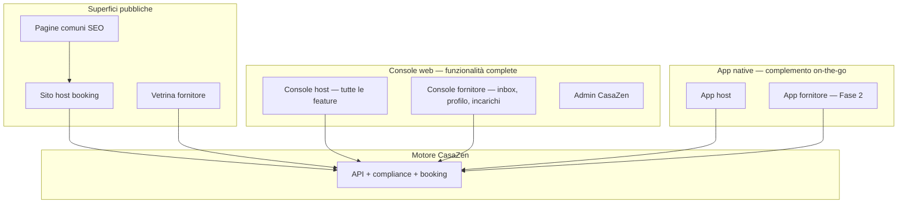
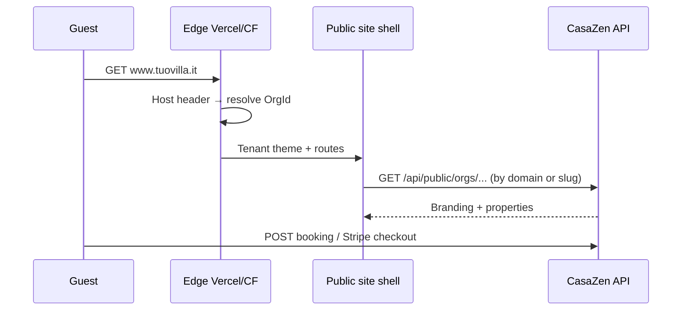
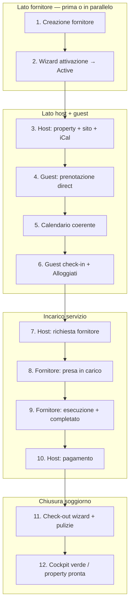

# CasaZen — Product planning (living document)

> **Last updated:** 2026-06-19  
> **Revision:** web completa + console fornitore + wizard compliance contestuali + native app complementare + …  
> **Spec index:** [`specs/README.md`](./specs/README.md) · **Template:** [`specs/_TEMPLATE.md`](./specs/_TEMPLATE.md)

---

## Sintesi

**Il MVP si chiude sul golden journey completo: web app host con tutte le funzionalità, console web fornitore, app nativa per l’uso in mobilità, wizard di compliance che si attivano al momento giusto (nuova casa, check-in ospite, check-out con pulizie), siti premium e iCal — tutto verificato E2E.**

---

## Visione di lungo periodo — ecosistema

| Pilastro | Cosa significa per l’utente |
|---|---|
| **Direct booking** | Sito che **sembra** del host; checkout e calendario sono il motore CasaZen |
| **Dominio flessibile** | Resta su `*.casazen.it` **oppure** `www.tuovilla.it` con CNAME — stesso motore |
| **Siti fornitore** | Vetrina professionale (servizi, zona, recensioni) — non una tabella admin |
| **SEO comuni** | Traffico → siti host / signup |
| **Console web host** | **Tutte** le funzionalità — non viene sostituita dall’app |
| **Console web fornitore** | Gestione profilo, richieste, incarichi, disponibilità |
| **App nativa** | Complemento per host/fornitore on-the-go (push, azioni rapide) — **subset** della web |
| **Compliance IT** | **Wizard contestuali** attivati quando serve un’azione (non solo dashboard) |
| **Calendario unificato** | iCal in/out per bloccare disponibilità OTA senza partner API |

**Modello economico:** abbonamento host (Starter con dominio CasaZen → Pro con dominio custom + branding avanzato) + take-rate solo su marketplace fornitori — **mai** commissione sul direct booking.

**Vincoli:** sviluppo part-time, budget contenuto; il redesign siti e l’app nativa sono scope MVP, non post-MVP.

---

## Modello siti — ispirazione Holidu

L’host **non compra un sito statico**: affitta il **motore di prenotazione** CasaZen con una shell brandizzata.

### Due modalità di pubblicazione (scelta host)

| Modalità | URL esempio | Percepito dal guest | Piano suggerito |
|---|---|---|---|
| **CasaZen-hosted** | `tuovilla.casazen.it` o `casazen.it/book/tuovilla` | Professionale; leggero legame CasaZen (footer “Powered by” su Starter) | Starter |
| **Dominio custom** | `www.tuovilla.it` | **Il sito è tuo** — zero marca CasaZen in evidenza (solo motore sotto) | Pro+ |

In entrambi i casi:
- Listing, calendario, checkout, pagamenti Connect, compliance → **stesso backend CasaZen**
- L’host configura branding (logo, colori, foto hero, testi) dalla console web
- Cambio modalità senza rifare le proprietà: aggiorna DNS o sottodominio

### Come funziona tecnicamente (target architettura)

| Componente | Responsabilità |
|---|---|
| `Org.CustomDomain` + `DomainVerificationStatus` | Dominio custom dichiarato e verificato (TXT/CNAME) |
| `Org.PublicHostMode` | `CasazenSubdomain` \| `CasazenPath` \| `CustomDomain` |
| Edge middleware (FE) | `Host` → tenant context prima del render |
| API tenant resolution | `GET /api/public/resolve-host?host=` → org + branding |
| SSL | Automatico via Vercel Custom Domains o Cloudflare for SaaS |
| Supplier org | Stesso pattern: `pulizie-roma.casazen.it` o dominio proprio |

**Non in scope MVP:** multi-dominio per org, wildcard DNS custom, export statico del sito (l’host non può “portarsi via” il motore).

### Gap vs oggi

| Oggi | Target |
|---|---|
| `/book/{slug}` funzionale ma **aspetto console** | Design system **marketing** dedicato (`PublicSiteShell`) |
| Solo path su dominio CasaZen | + sottodominio `*.casazen.it` in MVP; dominio custom in Fase 1–2 |
| Nessun sito fornitore | Vetrina fornitore con stesso design system |
| Web responsive per host | **Console web completa** + app nativa complementare |

---

## Web vs app nativa — entrambe necessarie

**La web app non sparisce e non si riduce.** È la console principale con **parità funzionale completa**: proprietà, calendario, prenotazioni, billing, compliance, marketplace, configurazione sito, iCal, admin di org.

| | Console web host | App nativa host |
|---|---|---|
| **Ruolo** | Lavoro completo da desktop/tablet | Azioni urgenti in mobilità |
| **Funzionalità** | **100%** — nulla escluso | **Subset** ottimizzato: calendario, booking, check-in/out rapido, push, richiesta fornitore |
| **Quando** | Setup, configurazione, wizard lunghi, report | In struttura, tra un check-in e l’altro, notifiche |

Stesso principio per i **fornitori**: console web completa nel MVP; app nativa fornitore in Fase 2.

### Console web fornitore (Must MVP)

Superficie autenticata dedicata (non la console host), con:

| Area | Funzionalità MVP |
|---|---|
| **Onboarding / creazione** | Signup fornitore **o** invito admin (comune pilota); account collegato ad Auth0 |
| **Wizard attivazione** | Profilo, servizi, zona, foto, documenti base → stato **`Pending`** / **`Active`** |
| **Inbox richieste** | Richieste host in arrivo; **presa in carico**, rifiuta, messaggio |
| **Incarichi** | Stato: `Richiesto` → **`PresoInCarico`** → `InCorso` → `Completato` → `Pagato` |
| **Disponibilità** | Calendario semplice (giorni liberi/occupati) |
| **Notifiche** | Email su nuova richiesta; (Fase 2) push app |

**Wizard attivazione fornitore** (parallelo al wizard property host):

| Step | Contenuto | Se manca |
|---|---|---|
| 1. Account | Signup / accetta invito | — |
| 2. Anagrafica | Ragione sociale, P.IVA opzionale, contatti | Pending |
| 3. Servizi | Categorie (pulizie, manutenzione…), zona/comuni serviti | Pending |
| 4. Vetrina | Foto, descrizione, tariffa indicativa | Pending |
| 5. **Attivazione** | Checkbox ToS fornitore + disponibilità | → **`Active`**: visibile agli host nel comune pilota |

Solo fornitori **`Active`** compaiono nella lista quando l’host sceglie un fornitore (richiesta soggiorno o check-out).

**Spec da creare:** `spec-supplier-console-web` (include wizard attivazione + presa in carico)

---

## App nativa — complemento on-the-go

**Decisione:** React Native + Expo — **in aggiunta** alla web, non al posto.

### MVP app host — copertura Golden Journey

| Step GJ | In app nativa MVP |
|---|---|
| 3 | Stato property, link sito (share) |
| 5–7 | **E2E completo** — calendario, dettaglio, richiesta fornitore |
| 6, 8–10 | Push + visualizzazione stato (aggiornamento dopo azioni web/fornitore) |
| 10 | Conferma/registrazione pagamento |
| 11–12 | Avvio check-out rapido + riepilogo compliance |

Setup pesante (wizard property completo, dominio custom, Connect KYC, billing): **web**; app con deep link o WebView accettabile per MVP.

### App fornitore nativa (Fase 2)

Stesse API della console web fornitore; push per nuove richieste.

---

## Siti pubblici — qualità “accattivante”

I siti host e fornitore usano un **design system pubblico separato** dalla console admin (`AppShell`).

### Principi

- Layout tipo **landing + catalogo** (hero, gallery full-bleed, tipografia editorial)
- 2–3 **temi template** selezionabili (es. Mare, Montagna, Urban) — non solo `themeColor`
- Mobile guest **perfetto** (la maggior parte del traffico SEO/booking è mobile)
- Performance: LCP < 2.5s, immagini ottimizzate, SSR/SSG dove possibile (Vercel)

### Superfici da ridisegnare (Must MVP)

| Superficie | Stato attuale | Target |
|---|---|---|
| Sito booking host | `/book/{slug}` — funzionale, aspetto tool | Vetrina Holidu-like |
| Pagine SEO comune | Backend OK, FE da allineare al design system | Stesso visual language + CTA |
| Vetrina fornitore v0 | Non esiste | Scheda servizi + zona + CTA contatto |

**Spec da creare:** `spec-public-site-design-system`, `spec-custom-domain-booking`, `spec-native-host-app`, `spec-supplier-console-web`, `spec-supplier-public-site`, `spec-ical-calendar-sync`, `spec-compliance-wizards`, `spec-guest-check-in-portal`, `spec-golden-journey-e2e`

---

## Integrazione calendario OTA — iCal (MVP)

**Decisione:** nel MVP **non** si integrano API OTA partner (#31–#35 restano freeze). Si usa **iCal** come ponte universale (Airbnb, Booking.com, VRBO espongono URL export/import).

| Capability | MVP | Post-MVP |
|---|---|---|
| **Import** URL iCal esterno → blocchi calendario | ✅ Must | Partner API quando disponibile |
| **Export** feed iCal per property → OTA importano CasaZen | ✅ Must | — |
| Job sync periodico (Hangfire, es. ogni 15–30 min) | ✅ Must | — |
| UI: incolla URL, stato ultimo sync, errori leggibili | ✅ Must | — |
| Push prezzi/disponibilità via API OTA | ❌ Freeze | Partner futuro |
| Pull prenotazioni OTA via API | ❌ Freeze | iCal import copre blocchi; booking pull via partner |

### Perché iCal nel MVP

- Unifica il calendario **prima** del partner OTA — evita doppie prenotazioni tra direct booking e Airbnb
- Riusa `BookingController` calendar + availability già esistenti
- Scope contenuto (part-time): parser RFC 5545, `CalendarBlock` entity, sync job
- L’host capisce subito il valore: “collego Airbnb e il mio sito sa quando sono occupato”

### Riuso tecnico

| Esistente | Estensione |
|---|---|
| `GET /api/bookings/calendar` | Include blocchi iCal + prenotazioni |
| `IsPropertyAvailableAsync` | Considera eventi iCal importati |
| `OtaIntegration` entity | Opzionale: `IntegrationType = ICal` + `ICalUrl` |
| `OtaSyncJob` | Nuovo `ICalSyncJob` o branch dedicato |

---

## Compliance italiana — wizard contestuali (MVP)

La compliance non è solo una dashboard: è una **serie di wizard** che si **attivano quando l’host (o il guest) deve compiere un’azione**. Ogni wizard ha step chiari, validazione, e outcome binario (ok / pending).

### Principio UX

| Elemento | Comportamento |
|---|---|
| **Trigger** | Evento o azione utente (crea property, conferma booking, giorno check-in…) |
| **Wizard** | Step guidati in italiano semplice + link normativa |
| **Esito** | Completato → stato avanza; incompleto → **pending** con reminder |
| **Cockpit** | Vista riepilogativa (semáfori) che riflette gli esiti dei wizard — **non** il punto di ingresso principale |

### Wizard 1 — Attivazione nuova proprietà (Must MVP)

**Trigger:** host crea o modifica una property.

| Step | Contenuto | Se manca |
|---|---|---|
| 1. Dati base | Indirizzo, comune, capacità, foto minime | Non procede |
| 2. **CIN** | Inserimento + validazione formato; se assente → guida “come ottenerlo” (link BDSR/normativa) | Property resta **`Pending`** |
| 3. Documentazione | Documenti richiesti (catasto, contratto, ecc. — lista configurabile per regione) | Pending |
| 4. Sicurezza | Checklist fumo/estintore/gas (D.L. 145/2023) | Warning; può essere pending configurabile |
| 5. Imposta soggiorno | Verifica comune in DB; se assente → avviso + link pagina SEO | Warning se comune noto senza tariffa |
| 6. iCal (opzionale) | Collegamento calendario OTA | Non blocca attivazione |
| **Fine** | Tutti i blocker risolti → **`Active`** (pubblicabile su sito); altrimenti **`Pending`** | Sito non mostra listing |

`Property.ComplianceStatus`: `Pending` \| `Active` \| `Suspended` — gate su publish e direct booking.

### Wizard 2 — Check-in ospite (Must MVP)

**Trigger:** prenotazione **Confirmed** (direct **o** OTA/iCal) — invio automatico **X giorni prima** del check-in (configurabile, default 3).

| Attore | Flusso |
|---|---|
| **Sistema** | Email/SMS al guest con link sicuro **guest check-in** (token monouso, scadenza) |
| **Guest** | Compila anagrafica, documento, consensi GDPR — **senza login** |
| **Sistema** | Alloggiati Web inviato in automatico quando dati completi + check-in date raggiunta |
| **Host** | Se entro **24h prima arrivo** dati incompleti → **notifica** (email + push app): “Mancano dati ospiti per [property]” |
| **Host (fallback)** | Da web o app può completare manualmente o inviare sollecito al guest |

Stesso flusso per prenotazioni OTA: la fonte booking non cambia il wizard guest.

**Entità:** `GuestCheckInSession` — stato `Inviato` → `InCompilazione` → `Completo` → `AlloggiatiInviato`.

### Wizard 3 — Check-out e turnover (Must MVP)

**Trigger:** giorno check-out (o host avvia check-out).

| Step | Contenuto |
|---|---|
| 1. Conferma partenza ospiti | Check-out operativo |
| 2. Compliance | Chiusura ciclo Alloggiati se applicabile; riepilogo tassa soggiorno riscossa |
| 3. **Pulizie / turnover** | Scelta fornitore da lista (comune property); crea `ServiceRequest` precompilato |
| 4. Pagamento servizio | Host paga fornitore; opz. addebito ospite se servizio extra richiesto dall’host |
| 5. Property pronta | Stato “pronta per prossimo ospite”; opz. block calendario pulizia |

Se check-out incompleto entro fine giornata → notifica host (stesso pattern check-in).

### Altre aree normative (wizard o step embedded)

| # | Area | Come si attiva nel MVP |
|---|---|---|
| 1 | CIN | Wizard property (step 2) |
| 2 | Alloggiati | Wizard check-in guest + job automatico |
| 3 | Imposta soggiorno | Checkout + calcolo in booking |
| 4 | Fiscale | Wizard onboarding host o al 3° property |
| 5 | OTA/CIN | Banner in setup iCal |
| 6 | GDPR | Checkout guest + wizard check-in guest |
| 7 | Sicurezza | Wizard property (step 4) |
| 8 | Regionale | Step embedded in wizard property per regione |

### Vista riepilogativa (Cockpit leggero)

Dashboard host (web + app) che aggrega: property pending, check-in guest incompleti, scadenze Alloggiati, checkout da chiudere. **Apre il wizard** relativo al click — non duplica i form.

**Spec:** `spec-compliance-wizards` (sostituisce/enfatizza `spec-compliance-cockpit` come vista secondaria)

**Non nel MVP:** versamento automatico imposta al Comune; dichiarazione redditi; 1.409 comuni tutti popolati.

### Debito noto (da chiudere prima del golden journey)

L’audit prod (`spec-production-e2e-flow-verification.md`, 2026-06-09) ha evidenziato flussi **rotti** nonostante il codice esista:

| Flusso | Problema | Fix richiesto MVP |
|---|---|---|
| Crea proprietà | 403 `no_org_context` senza onboarding | #271 + percorso org retroattivo |
| Calendario FE | GET senza `propertyId` → loop infinito | Fix parametri + stati vuoti |
| Piano / billing | 404 senza org | Gating dopo onboarding |
| Public booking prod | Non deployato / redirect errato | Release + test golden journey |
| Onboarding admin | Salta creazione org | Guard per admin che vogliono operare come host |

**Regola MVP:** nessuna feature conta come “fatta” finché non passa il golden journey (sotto).

---

## Golden Journey — percorso di riferimento MVP

Questo è il **test di accettazione prodotto** per la prima versione. Deve essere eseguibile **due volte**:

1. **Web** — Playwright E2E (12 step, happy path completo)
2. **App nativa host** — Maestro/Detox E2E sugli step operativi host (vedi [verifica mobile](#verifica-mobile-app-nativa--must-mvp))

Nessun workaround manuali in DB. Stessi dati, stesso backend, esiti coerenti tra web e app.

**12 step** — include **lato supply** (creazione + attivazione fornitore) e **presa in carico** esplicita prima dell’esecuzione.

### Dettaglio per fase — cosa deve funzionare

| Step | Attore | Azione | Stato / dato | Web | App host | App / mobile fornitore |
|---|---|---|---|---|---|---|
| **1** | Admin **o** fornitore | Creazione fornitore (invito o signup) | Account `Supplier` | ✅ E2E | — | ✅ web mobile* |
| **2** | Fornitore | Wizard attivazione → `Active` | `Pending` → `Active` | ✅ E2E | — | ✅ web mobile* |
| **3** | Host | Onboarding; wizard property; iCal; sito | Property `Active` | ✅ E2E setup | ✅ stato + share link | — |
| **4** | Guest | Prenotazione direct + pagamento | Booking `Confirmed` | ✅ E2E (sito) | — (guest web) | — |
| **5** | Host | Calendario: booking + iCal | Dati coerenti | ✅ E2E | **✅ E2E app** | — |
| **6** | Sistema + guest + host | Check-in guest; alert host se incompleto | Alloggiati | ✅ E2E | **✅ push + dettaglio booking** | — |
| **7** | Host | Richiesta fornitore | `Richiesto` | ✅ E2E | **✅ E2E app** | — |
| **8** | Fornitore | **Presa in carico** | `PresoInCarico` | ✅ E2E | — | **✅ web mobile*** |
| **9** | Fornitore | Segna completato | `Completato` | ✅ E2E | — | **✅ web mobile*** |
| **10** | Host | Pagamento fornitore | `Pagato` | ✅ E2E | **✅ E2E app** | — |
| **11** | Host | Wizard check-out + pulizie | Compliance ok | ✅ E2E | **✅ avvio + stato** | — |
| **12** | Host | Cockpit / property pronta | Nessun pending critico | ✅ E2E | **✅ vista riepilogo** | — |

\* **Fornitore MVP:** console web **responsive su telefono** (non app nativa fino a Fase 2); step 8–9 devono essere usabili da browser mobile senza layout rotto.

**Parità dati:** ciò che l’host vede su app al passo *N* deve corrispondere a ciò che vede su web (stesso booking, stesso stato incarico, stessi badge compliance).

**Ordine E2E consigliato:** step 1–2 (fornitore) prima dello step 7. In CI: **due suite** — `golden-journey-web.spec.ts` (12 step) + `golden-journey-host-app.e2e.ts` (step 5–7, 10–12).

### Verifica mobile app nativa — Must MVP

Il golden journey **non è chiuso** se funziona solo su browser desktop.

#### Suite app host (Maestro / Detox — CI su EAS o device farm)

Percorso minimo automatizzato sull’**app nativa host**, usando la stessa prenotazione creata nel run web (o seed condiviso):

| # | Step GJ | Scenario app | Assert |
|---|---|---|---|
| M1 | 5 | Apri calendario | Booking visibile; blocchi iCal coerenti con web |
| M2 | 5 | Tap prenotazione → dettaglio | Stessi dati guest/date del run web |
| M3 | 6 | Simula push “dati ospite mancanti” | Tap notifica → apre booking corretto |
| M4 | 7 | Da dettaglio booking → “Richiedi fornitore” | `ServiceRequest` creato; stato `Richiesto` |
| M5 | 8–9 | Dopo azione fornitore su web | App mostra `PresoInCarico` → `Completato` (refresh/push) |
| M6 | 10 | Segna pagamento / conferma pagamento | Stato `Pagato` allineato a web |
| M7 | 11–12 | Avvia check-out rapido; vista riepilogo | Nessun badge rosso critico |

#### Suite fornitore mobile (MVP = web responsive)

| # | Step GJ | Scenario | Assert |
|---|---|---|---|
| F1 | 8 | Browser mobile: inbox → **presa in carico** | CTA raggiungibile; stato aggiornato |
| F2 | 9 | Browser mobile: segna completato | Host vede aggiornamento su web e app |

#### Regole gate mobile

- **0 crash** app host durante la suite M1–M7
- **0 errori API 5xx** dalle chiamate app
- **Push** (step 6, 8–9): notifica ricevuta su device reale o simulatore con servizio push configurato
- **Offline graceful:** app mostra errore leggibile se API down (non schermo bianco)
- **Fase 2:** app fornitore nativa estende F1–F2 con stessi assert su binary Expo

### Gate di uscita MVP

**Tutti** veri su staging **e** prod:

1. Golden journey **web** completato end-to-end ≥1 volta (video o Playwright)
2. Golden journey **app host** suite M1–M7 verde in CI (Maestro/Detox)
3. Step fornitore **8–9** verificati su **browser mobile** (F1–F2)
4. Playwright 12-step automatizzato in CI
5. Per ogni step: **0 errori 500**; messaggi in italiano
6. **Parità web ↔ app:** stati booking e `ServiceRequest` identici dopo ogni azione
7. Compliance coerente con stato reale (no “verde” falso)
8. iCal: blocchi su sito pubblico; export URL ok
9. Siti host/fornitore: review visiva “accattivante”

### Micro-marketplace v0 — stati incarico (step 7–10)

| Stato | Significato | Chi agisce |
|---|---|---|
| `Richiesto` | Host ha inviato richiesta | Host |
| **`PresoInCarico`** | Fornitore ha **accettato** — impegno preso | Fornitore (step 8) |
| `InCorso` | Lavoro avviato (opzionale, auto su presa in carico) | Fornitore |
| `Completato` | Servizio erogato | Fornitore (step 9) |
| `Pagato` | Host ha saldato | Host (step 10) |
| `Rifiutato` | Fornitore ha declinato | Fornitore |

| Campo | Descrizione |
|---|---|
| `ServiceRequest` | `bookingId`, fornitoreId, categoria, urgenza, note |
| `chargeToGuest` | Addebito ospite se servizio extra richiesto dall’host |
| `takenAt` / `takenBy` | Timestamp e fornitore alla **presa in carico** (audit) |

---

## Analisi base esistente — cosa riusare

| Blocco | Riuso | Cosa cambia |
|---|---|---|
| Booking engine (API, Connect, webhooks) | **Alto** | Invariato — è il prodotto core |
| `Org` + slug | **Alto** | + campi dominio custom |
| Public read-model + checkout | **Alto** | Nuova shell UI |
| SEO `SeoContentPage` | **Alto** | Redesign FE + funnel |
| Console web host | **Medio** | Hardening + wizard; **nessuna feature rimossa** |
| Mobile bottom nav web (#252) | **Alto** | Resta per host mobile browser; parità con app dove possibile |
| `spec-branded-booking-site` | **Parziale** | Superata da design system + domini — non buttare API |

---

## Tabella priorità (Must / Should / Nice / Freeze)

### Must have — primo MVP

| Area | Perché Must | Ecosistema | Riuso | Mobile / siti |
|---|---|---|---|---|
| **App nativa host** | On-the-go; **non** sostituisce web | Push, azioni rapide | API alte | Subset complementare |
| **Public site design system** | Siti attuali non vendibili visivamente | Conversione SEO → booking | Medio (routes esistono) | Guest mobile-first |
| **Sito host ridisegnato** | Valore percepito = Holidu competitor | Motore case da affittare | Medio | Template + hero + gallery |
| **Hosting CasaZen** (`*.casazen.it` o path) | Default Starter; zero friction | Onboarding veloce | Alto (slug) | — |
| **Dominio custom (CNAME)** | Differenziatore Pro; modello Holidu | Host “staccati” ma legati al motore | Basso (nuovo) | SSL + middleware |
| **Onboarding PLG** (#271) | Self-serve + scelta modalità sito | Ogni host = nodo | Medio | Scelta dominio in wizard web |
| **Micro-marketplace v0** | Pezzo ecosistema; step 7–9 golden journey | Host → fornitore → pagamento | Basso | Tracciato in app; pagamento minimo |
| **SEO comuni + funnel** | Traffico | Lead | Alto | Design allineato |
| **Console web host completa** | Tutte le funzionalità — non ridotta | Core prodotto | Alto | 100% feature |
| **Console web fornitore** | Golden journey step 8; ecosistema supply | Fornitore operativo | Basso | Inbox + incarichi |
| **Compliance wizards** | Property, check-in guest, check-out | Normativa guidata | Medio | Notifiche in app |
| **iCal sync** | Calendario unico direct + OTA | Evita overbooking | Basso (nuovo) | Stato sync in app |
| **Golden journey E2E** | Definizione “funziona” | Qualità prodotto | — | Playwright + manuale |
| **Hardening flussi esistenti** | Codice c’è, prod rotto | Prerequisito tutto | Alto | Fix calendario, org, onboarding |
| **Billing / freemium** | Sostenibilità | Starter vs Pro gating dominio | Medio #230 | Web |

### Should have — entro Fase 2

| Area | Note |
|---|---|
| **Sito fornitore pubblico** (vetrina) | Stesso design system |
| **App fornitore nativa** | Push; stesse API console web |
| **Anteprima sito live** nella console | WYSIWYG branding |
| **Temi template** (3 varianti) | Oltre al solo colore primario |
| **Email transazionali** (#58) | Post-booking professionalità |
| **Security billing** (#273, #274) | Se billing attivo |

### Nice to have

| Area | Note |
|---|---|
| Rimozione “Powered by CasaZen” su Pro | Upsell |
| SaaS billing SDI/OSS completo | Post primi paganti |
| SSG per siti host | Performance scale |
| Addebito ospite per servizio extra | Stripe line item post-booking | Step 9 golden journey |

### Freeze (con eccezione iCal)

LTR #269, unified inbox, AI copilot, OTA API partner #31-35 (non iCal), marketplace full US-014, GVR, enterprise, EU. Sbloccato MVP: iCal. Scope ridotto: imposta soggiorno comuni pilota; fiscale wizard.

**Aggiunta freeze:** PWA come strategia mobile principale — **sostituita da app nativa**.

---

## MVP definito — aggiornato

L’exit criterion è il **[Golden Journey](#golden-journey--percorso-di-riferimento-mvp)** (**12 step**) + gate automatizzati. Sintesi:

1. **Fornitore:** creazione + wizard attivazione → `Active`
2. **Host:** property + iCal + sito live
3. **Guest:** prenotazione direct + check-in wizard
4. **Servizio:** richiesta → **presa in carico** → completato → pagato
5. **Chiusura:** check-out wizard (+ eventuale pulizie turnover)
6. E2E Playwright 12-step **web** + Maestro/Detox **app host** M1–M7; fornitore F1–F2 su mobile web

### Cosa vive dove (MVP)

| | Web host (completa) | App host | Web fornitore | App fornitore |
|---|---|---|---|---|
| Wizard property, billing, iCal, sito | ✅ | — | — | — |
| Wizard attivazione fornitore | — | — | ✅ | — |
| Calendario, bookings | ✅ | ✅ | — | — |
| Guest check-in / solleciti | ✅ | notifiche | — | — |
| Richiesta fornitore | ✅ | ✅ | — | — |
| **Presa in carico** + completa incarico | vede stato aggiornato | — | ✅ | Fase 2 |
| Pagamento servizio | ✅ | — | vede `Pagato` | — |
| Wizard check-out + pulizie | ✅ | avvio rapido | — | — |

**Regola:** ogni feature MVP deve essere usabile da **web**; gli step operativi host (**5–7, 10–12**) devono passare anche su **app nativa**. Fornitore: web mobile responsive in MVP, app nativa in Fase 2.

---

## Roadmap per fasi (part-time)

### Fase 0 — Allineamento + hardening (4–5 settimane)

| Deliverable | Contenuto |
|---|---|
| **Golden journey audit** | Riprodurre su staging ogni step; issue per ogni break |
| **Fix bloccanti** | org context, calendario FE, onboarding admin, public booking deploy |
| **Design brief** siti pubblici | Moodboard + 1 template |
| **Spike** | Expo scaffold; ADR domini custom; ADR iCal parser |
| **Spec** | `golden-journey-e2e`, `ical-calendar-sync`, `compliance-wizards`, `guest-check-in-portal` |

**Outcome:** golden journey eseguibile su staging almeno fino a step 4; lista fix prioritizzata per Fase 1

---

### Fase 1 — MVP vendibile (12–16 settimane part-time)

| Workstream | Contenuto |
|---|---|
| **Hardening** | Tutti i flussi esistenti usati nel golden journey — funzionanti |
| **iCal** | Import/export + sync job + UI |
| **Compliance** | Wizard property + guest check-in + check-out; vista riepilogativa |
| **Fornitore** | Console web + vetrina pubblica minima |
| **Siti** | Design system + redesign host + subdomain |
| **Domini** | Custom domain (almeno 1 beta) |
| **Mobile** | App host: calendario, bookings, check-in, fornitore, push |
| **Marketplace** | ServiceRequest tracciato + pagamento minimo |
| **E2E** | Playwright golden journey in CI |
| **Platform** | #271, billing/freemium, SEO funnel |

**Outcome:** golden journey **completo** su prod con 1 host beta; E2E verde in CI

**Non in Fase 1:** OTA API partner, app fornitore nativa, LTR, AI copilot, marketplace Connect full

---

### Fase 2 — Ecosistema minimo (10–14 settimane)

| Workstream | Contenuto |
|---|---|
| **Siti** | Vetrina fornitore pubblica + directory per comune |
| **Mobile** | App fornitore nativa (inbox, push) |
| **Platform** | Stato incarichi, email #58, billing completo |
| **Domini** | Custom domain anche per fornitore (opzionale) |

**Outcome:** 10 fornitori pilota; loop host→fornitore chiuso su app nativa entrambi i lati

---

### Fase 3 — Espansione (post-PMF)

Marketplace pagamenti, scale SEO, temi aggiuntivi, team seats leggeri, OTA se richiesto.

---

## Architettura planning

**Nuove spec (priorità creazione):**

| Slug | Fase | Contenuto |
|---|---|---|
| `native-host-app` | 1 | Expo, schermate, push, Auth0 |
| `public-site-design-system` | 1 | Template, componenti, guest UX |
| `custom-domain-booking` | 1 | CNAME, SSL, middleware, `Org` fields |
| `supplier-console-web` | 1 | Console fornitore: inbox, profilo, incarichi |
| `compliance-wizards` | 1 | Property, guest check-in, check-out + vista riepilogativa |
| `guest-check-in-portal` | 1 | Link ospite, token, GDPR, trigger Alloggiati |
| `golden-journey-e2e` | 0–1 | Playwright 12-step web + Maestro app host M1–M7 + fornitore mobile web F1–F2 |
| `micro-marketplace-v0` | 1 | ServiceRequest + stati + pagamento minimo |
| `supplier-public-site` | 1 | Vetrina fornitore pubblica |
| `native-supplier-app` | 2 | App fornitore (push) |
| `seo-funnel` | 1 | CTA analytics |

**Deprecata:** `spec-pwa-host-shell` — sostituita da `native-host-app` (complemento web).

---

## 3 trade-off da accettare

1. **iCal invece di partner OTA nel MVP** — sincronizzi blocchi/disponibilità, non prezzi né messaggi OTA. Accetti ritardo sync (15–30 min) in cambio di zero contratto partner.

2. **Wizard compliance, non automazione totale** — guidi property, check-in guest e check-out; Alloggiati e tassa automatizzati dove possibile; versamenti al Comune restano manuali.

3. **Web completa + app complementare** — sviluppi due client host ma **nessun flusso obbligatorio solo su app**; la console web resta la superficie principale.

---

## 3 raccomandazioni operative (prossimi 2 mesi)

1. **Fase 0 = fix ciò che esiste:** org/onboarding, calendario, deploy public booking. Poi iCal + compliance cockpit. **Ignora:** LTR, OTA API, AI, marketplace full.

2. **Una spec E2E (`golden-journey-e2e`)** — web 12-step **e** app host M1–M7 devono essere verdi; altrimenti non è MVP.

3. **Demo interna settimanale:** ripercorri i 12 step su **web** e ripeti step 5–12 su **telefono** (app host + fornitore da browser mobile).

---

## Piani prodotto e gating funzionalità

| Feature | Starter | Pro |
|---|---|---|
| Sito su `casazen.it/book/{slug}` o `*.casazen.it` | ✅ | ✅ |
| Dominio custom | ❌ | ✅ |
| Temi template premium | 1 | 3+ |
| Footer “Powered by CasaZen” | Visibile | Rimovibile |
| App nativa host | ✅ (subset) | ✅ |
| Console web fornitore | ✅ | ✅ |

---

## Stato attuale vs piano

| Asset | Azione |
|---|---|
| Booking engine, Connect, tenant | **Mantenere** — core |
| `/book/{slug}` attuale | **Rifare UI** — non buttare route/API |
| Web mobile nav #252 | Fallback browser; non strategia principale |
| `spec-branded-booking-site` | Evolvere verso design system + domini |
| #271, #230 | Completare con scelta dominio in onboarding |
| OTA API adapters (#31–35) | **Freeze** (iCal sì) |
| `spec-production-e2e-flow-verification` | Evolve → `golden-journey-e2e` |

---

## Invarianti tecniche

| ID | Regola |
|---|---|
| RF1 | `OrgId` su tabelle tenant-scoped |
| RF2 | Webhook Stripe platform ≠ Connect |
| RF3 | Migrazioni ordered |
| MoR | Operatore = MoR via Connect |
| Engine | Il booking engine resta CasaZen anche su dominio custom |
| Take-rate | Solo marketplace fornitori, mai direct booking |

---

## Revision log

| Data | Cambiamento | Motivo |
|---|---|---|
| 2026-06-19 | GJ: verifica **mobile** — app host Maestro M1–M7 + fornitore web mobile F1–F2 | Parità web/app obbligatoria |
| 2026-06-19 | Native app + siti premium + custom domain (Holidu) | Feedback utente |
| 2026-06-05 | Council roadmap v3 | Baseline business |

---

## Riferimenti

- Holidu model: host website + optional own domain, booking engine hosted
- Spec booking attuale: `specs/spec-branded-booking-site.md` (da estendere)
- Infra domini: `docs/INFRA.md` (Vercel custom domains)
- Regolamentazione IT: `.claude/context/_index.md`
- Gap prod noti: `specs/spec-production-e2e-flow-verification.md`
