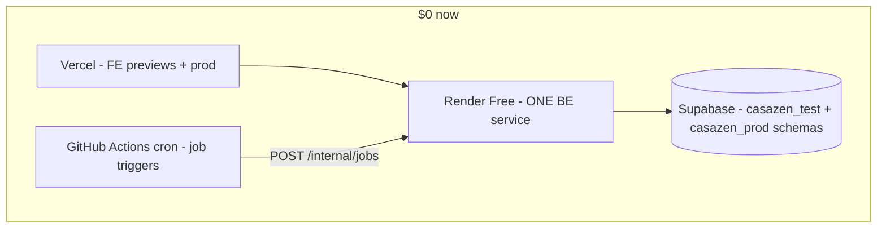

# Council Decision — Backend hosting at $0/month

**Date**: 2026-06-03  
**Topic**: Railway vs Render vs alternatives given zero budget constraint  
**Pattern**: Decision record (3 agents + Devil's Advocate)  
**Status**: RECOMMENDED — pending your confirmation

---

## Executive summary

| Question | Answer |
|----------|--------|
| Is Railway only paid? | **No.** After the 30-day trial you can **downgrade to Railway Free** ($0, ~$1 usage credit/month, 0.5 GB RAM, sleep/serverless). Hobby ($5/mo) is pushed in the UI but not mandatory. |
| Is Render the solution? | **Yes for a $0 *test* backend.** **No as sole long-term prod** while Hangfire runs in-process with 5–15 min jobs. |
| Best $0 path for CasaZen now | **Render Free** (or Railway Free if already wired) + **one** backend environment + **GitHub Actions cron** for critical jobs + Vercel + Supabase (unchanged). |
| When to pay | **~$5/month Railway Hobby** when you need reliable prod, dual env (test+prod), and always-on Hangfire — best match for existing `INFRA.md` and PR #181. |

---

## Council votes

| Agent | Vote | One-line position |
|-------|------|-------------------|
| Platform DevOps | PROPOSE | Render Free for test only; defer prod to Railway Hobby |
| SDLC Architect | PROPOSE | Keep native GitHub deploy; externalize jobs on $0 tier |
| Devil's Advocate | OBJECT | Render free ≠ prod; $5 may be cheaper than missed compliance jobs |

**Consensus**: Adopt **$0 staging architecture** now; plan **$5 upgrade** as explicit exit criterion.

---

## Railway — what you are seeing

```
Trial (30 days, $5 credit)
    → UI pushes Hobby ($5/mo minimum subscription)
    → You CAN manually select Free plan ($0)
```

| Plan | Cost | CasaZen fit |
|------|------|-------------|
| **Free** | $0 + $1 credit/mo | One small always-on or serverless service; **tight** for .NET 10 + Hangfire |
| **Hobby** | $5/mo (+ $5 usage credit) | Matches current `INFRA.md`; test + prod; no sleep |
| **Trial** | Temporary | Good for 30-day bootstrap only |

**Action if staying on Railway**: Workspace → Plans → **downgrade to Free** (do not leave on trial expiry without a plan).

---

## Option comparison ($0 constraint)

| Option | Monthly $ | Always-on API | Hangfire in-process | Test + prod @ $0 | GitHub native deploy | Verdict |
|--------|-----------|---------------|---------------------|------------------|----------------------|---------|
| **Render Free** | $0 | No (15 min sleep) | Fails when asleep | 2 services only if mostly sleeping | Yes | **Best $0 test host** |
| **Railway Free** | $0 | Serverless option | RAM tight (512 MB) | 2 envs exceed $1 credit | Yes (already done) | **OK if no migration** |
| **Railway Hobby** | ~$5 | Yes | Yes | Yes | Yes | **Best prod target** |
| **Fly.io** | Paid | — | — | — | No | **Out** (no free tier 2026) |
| **Cloud Run / Azure ACA** | Credits only | Scale-to-zero | Broken unless min instances ($$) | Complex | No | **Out** for Hangfire |
| **Oracle Free VM** | $0 | Yes | Yes | Yes | No (you ops TLS/Docker) | **Possible** if you accept ops |
| **GH Actions only** | $0 | N/A | N/A | N/A | CI only | **Invalid** (no API host) |

---

## Recommended architecture — Phase 0 ($0)



| Component | Choice | Notes |
|-----------|--------|-------|
| Database | Supabase Free | Already migrated (`eu-west-1` pooler) |
| Frontend | Vercel Free | Unchanged |
| Backend **test** | **Render Free** OR Railway Free | Docker `8080` already ready |
| Backend **prod** | **Defer** or same URL with tag deploy + documented best-effort | Do not promise SLA on $0 |
| Background jobs | **GitHub Actions cron** → secured HTTP endpoints | Required on sleeping hosts |
| Hangfire | Keep storage in Postgres; **do not rely** on in-process scheduler alone on free tier | Optional: reduce `WorkerCount` to 1–2 |

### SDLC preserved

- PR: build/test + Vercel preview + PR comment with BE URL
- Merge `main`: native deploy + `verify-test` (extend wait to ~120s for cold start)
- Tag `v*`: deploy prod service + `verify-prod` (health only — not job SLA)

---

## Render vs Railway at $0 — decision tree

```
Already connected Railway GitHub app and vars set?
├─ YES, trial ending soon
│   └─ Downgrade to Railway Free + serverless
│       └─ ONE environment (test only) until $5
└─ NO / want test+prod URLs on paper at $0
    └─ Render Free (2 services, accept sleep)
        └─ Add job cron in GitHub Actions
```

**Render is not automatically better** — it is better when you need **$0 + no Railway downgrade hassle + 750 h/mo budget** for sleeping services.

---

## Devil's Advocate — must not ignore

1. **Hangfire + sleep** = missed lease polls (5 min), booking pull (15 min), GDPR daily run.
2. **Supabase also sleeps** (7 days) — you already need keep-alive.
3. **"Free prod"** contradicts `INFRA.md` and compliance expectations.
4. **$5/month** ≈ cost of one debugging session on missed jobs.
5. **Migration** to Render touches Vercel `VITE_*`, Auth0 callbacks, Stripe webhooks, CI variable names.

---

## Exit criteria → paid tier

Upgrade to **Railway Hobby (~$5/mo)** when any of:

- Real users on production (not just demos)
- Alloggiati Web / lease registration must run on schedule
- Stripe webhooks must respond in &lt; few seconds consistently
- You want **test + prod** always-on without keepalive hacks

At upgrade: minimal change if you stayed on Railway; if on Render, copy env vars back to Railway per `INFRA.md`.

---

## Your decision (pick one)

| ID | Choice | Implication |
|----|--------|-------------|
| **A** | **Render Free** for BE test now, prod later on Railway Hobby | ~0.5 day infra doc + CI var rename + GH cron for jobs |
| **B** | **Railway Free** after downgrade, single env | Keep PR #181 vars; accept serverless/sleep; same GH cron |
| **C** | Pay **Railway Hobby $5** now | Simplest ops; matches `INFRA.md`; no Render migration |
| **D** | **Oracle free VM** | $0 always-on but you own patching/TLS/monitoring |

**Council recommendation**: **A** if strict $0; **C** if you can afford $5 before go-live.

---

## Next steps (if you choose A — Render)

1. Create Render web service from `casazen/backend` (Docker).
2. Set env vars (same as Railway list in `INFRA.md`).
3. Point Vercel Preview `VITE_API_BASE_URL` to Render URL.
4. Add GitHub variables `API_TEST_URL` / `API_PROD_URL` (or keep Railway names with new values).
5. Add `.github/workflows/jobs-cron.yml` for GDPR / critical jobs (design in follow-up issue).
6. Update `docs/INFRA.md` $0 phase section.

---

## Security note

Database password was shared in chat earlier — **rotate Supabase password** and update `secrets/supabase.local.env` + hosting env vars.
