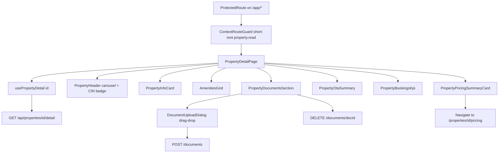

# Design Spec — Issue #152
# feat: Property detail — aggregate endpoint, documents storage, RBAC hardening, CIN compliance

**Stage**: 02 Design  
**Date**: 2026-06-05  
**Issue**: https://github.com/casazen/backend/issues/152  
**Input spec**: `Sessions/specs/spec-property-detail.md`  
**Branch target (Stage 03)**: `feature/152-property-detail` (backend + frontend)  
**Status**: COMPLETE — all gates passed

---

## Scope

Fullstack feature delivering a single aggregate property detail view for short-stay owners, property managers, and platform admins. The page surfaces anagrafica, CIN compliance, amenities, tariffs, documents, OTA sync status, bookings KPIs, and an entry point to AI pricing — all from `GET /api/properties/{id}/detail`.

### Codebase state at design time

| Area | State | Gap for #152 |
|---|---|---|
| `GET /api/properties/{id}/detail` | **Partial** — endpoint exists | Missing `amenities`, `timezone`, `photoUrls`, `PricingAdapterSummary`; `GetPropertyDetailAsync` does not `.Include(PricingAdapterConfig)` |
| Document CRUD endpoints | **Implemented** | Upload reuses `IImageStorageService` (image-only validation); needs document MIME/extension gate (PDF, DOC, DOCX, JPG, PNG) |
| `PropertyDocument` entity + table | **Implemented** (in PostgreSQL `InitialCreate`) | No schema change required on greenfield; verify on `casazen_test` before deploy |
| `PropertyAuthorizationService` | **Implemented** | `PropertyManager` + `Admin` bypass present; role claim source bug: controllers read `ClaimTypes.Role` but Auth0 emits `https://casazen.app/roles` |
| `PropertyManagerOrAdmin` policy | **Missing** | Add to `ServiceCollectionExtensions.cs` |
| `PUT /api/properties/{id}` RBAC | **Partial** — uses `authorizationService.CanAccess` | Works once role-claim fix applied |
| Admin cross-owner audit log | **Missing** | New `IAdminAccessAuditService` + structured log/DB row on privileged access |
| `property-detail-page.tsx` | **Stub** — uses `useProperty` → `GET /{id}` | Full refactor to aggregate DTO + section components |
| Frontend routes | **Implemented** — context manifest | `/app/short-rent/properties/:id` + legacy `/properties/:id` redirect |

### In scope

- Extend aggregate detail DTO and service layer
- Harden document upload validation
- Add `PropertyManagerOrAdmin` authorization policy
- Fix JWT role claim resolution in property controllers
- Admin/property-manager cross-owner audit logging
- Frontend detail page refactor with 7 section components
- TanStack Query hooks for detail + document mutations

### Out of scope

- OTA adapter implementation (read-only summary in detail)
- AI pricing engine logic changes (summary card links to existing `/pricing` routes)
- Layer separation (#182) — detail page stays in short-rent context
- Guest PII in detail response (aggregates only)

---

## Council Specialist Outputs

### api-designer

**Verdict**: Five endpoints — one extended aggregate GET, three document endpoints (already scaffolded), one RBAC-extended PUT. `PropertyDocuments` table exists in consolidated `InitialCreate`; Stage 03 runs `dotnet ef database update` on `casazen_test` — new migration only if schema drift detected.

**Key contract decisions**:

| Decision | Resolution |
|---|---|
| `downloadUrl` vs `storageUrl` | Response field **`downloadUrl`** (maps from entity `StorageUrl`; relative path served by static files middleware) |
| `fileType` vs `documentType` | Response field **`fileType`** — string MIME or extension derived from `DocumentType` enum + filename |
| OTA DTO shape | **`platform`, `syncStatus`, `lastSyncAt`** per AC1; retain `id`, `isActive` for UI; never `apiKey`/`apiSecret` |
| `PricingAdapterSummary` | New nested DTO; defaults `{ isEnabled: false }` when no config row |

### frontend-designer

**Verdict**: Refactor `property-detail-page.tsx` to consume `usePropertyDetail(id)`. Route unchanged in manifest (`/app/short-rent/properties/:id`, legacy `/properties/:id`). Seven new presentational components under `src/features/properties/components/`. Upload via shadcn `Dialog` + drag-and-drop zone.

**CIN badge**: Clickable `PropertyCinBadge` with `Tooltip` explaining D.L. 145/2023 obligation (Italian end-user text).

**Pricing link**: `→ Gestisci prezzi AI` navigates to `/app/short-rent/properties/:id/pricing` (legacy `/properties/:id/pricing`).

### security-by-design

**Verdict**: All endpoints authenticated. Owner-scoped IDOR via `IPropertyAuthorizationService`; privileged roles bypass with audit trail. OTA `apiKey`/`apiSecret` excluded at DTO mapping layer (AC7 regression test exists). `BookingsSummary` exposes counts/dates only — no guest names or contact data.

**Threat priority**: IDOR on `{id}` path params, OTA secret leakage in JSON serialization, PII in booking aggregates, missing audit on admin cross-owner reads.

---

## API Contract

### Summary

| Change type | Count |
|---|---|
| New endpoints | 0 (scaffolded — extend contracts) |
| Modified endpoints | 2 (`GET /detail` response schema, `PUT /{id}` RBAC documentation) |
| Document endpoints | 3 (validate + align response fields) |
| New auth policy | 1 (`PropertyManagerOrAdmin`) |

### Controller-level authentication

`PropertiesController` carries:

```csharp
[Authorize(Policy = "PropertyOwner")]
[Authorize(Policy = "RequireContext:short-rent:property.read")]
```

Per-action write gate: `[Authorize(Policy = "RequireContext:short-rent:property.write")]`.

**Stage 03 fix (required)**: `GetUserRoles()` must read `https://casazen.app/roles` claims (same as `ContextAuthorizationService`), not `ClaimTypes.Role` alone.

### New authorization policy

**File**: `Casazen.Web/Extensions/ServiceCollectionExtensions.cs`

```csharp
.AddPolicy("PropertyManagerOrAdmin", policy =>
    policy.RequireRole("PropertyManager", "Admin"))
```

Used for documentation and optional action-level attributes; runtime property access continues through `IPropertyAuthorizationService.CanAccess` which already treats `PropertyManager` and `Admin` as privileged.

---

### GET /api/properties/{id}/detail

| | |
|---|---|
| **Method / Path** | `GET /api/properties/{id}/detail` |
| **Auth** | `[Authorize(Policy = "PropertyOwner")]` + `[Authorize(Policy = "RequireContext:short-rent:property.read")]` + `authorizationService.CanAccess(userId, ownerId, roles)` |
| **Path params** | `id: Guid` |
| **Query params** | none |
| **Response 200** | `PropertyDetailResponse` (see schema below) |
| **Errors** | 401 (no JWT), 403 (not owner/manager/admin), 404 (property not found or inactive) |

**Response schema** (`PropertyDetailResponse`):

```typescript
interface PropertyDetailResponse {
  // Property core fields
  id: string;
  ownerId: string;
  name: string;
  description: string;
  address: string;
  city: string;
  postalCode: string;
  bedrooms: number;
  bathrooms: number;
  maxGuests: number;
  nightlyRate: number;
  cleaningFee: number;
  damageDeposit: number;
  cinCode: string | null;
  cinStatus: 'Valid' | 'Missing' | 'Invalid';  // computed: ^IT-\d{5}-\d{10}$
  timezone: string;                               // IANA, default Europe/Rome
  amenities: string[];                            // PropertyAmenity enum names
  photoUrls: string[];
  houseRules: string;
  isActive: boolean;
  createdAt: string;                              // ISO 8601 UTC
  updatedAt: string;

  // Nested aggregates
  documents: PropertyDocumentDto[];
  otaIntegrations: OtaIntegrationSummaryDto[];
  bookingsSummary: BookingsSummaryDto;
  pricingAdapterSummary: PricingAdapterSummaryDto;
}

interface PropertyDocumentDto {
  id: string;
  fileName: string;
  fileType: string;        // MIME or extension label (e.g. "application/pdf")
  uploadedAt: string;
  downloadUrl: string;     // maps from StorageUrl — NEVER expose raw filesystem path
}

interface OtaIntegrationSummaryDto {
  id: string;
  platform: string;
  syncStatus: 'Pending' | 'InProgress' | 'Success' | 'Failed' | null;
  lastSyncAt: string;
  isActive: boolean;
  syncEnabled: boolean;
  // EXCLUDED: apiKey, apiSecret, externalPropertyId in minimal AC1 view;
  // retain id/isActive/syncEnabled for UI cards — no secrets
}

interface BookingsSummaryDto {
  totalBookings: number;
  upcomingBookings: number;
  activeBookings: number;
  nextCheckIn: string | null;
  nextCheckOut: string | null;
}

interface PricingAdapterSummaryDto {
  isEnabled: boolean;
  lastAdaptedAt: string | null;
  nextScheduledRunAt: string | null;
}
```

**CIN status computation** (server-side, `PropertyService.ResolveCinStatus`):

| Condition | `cinStatus` |
|---|---|
| `cinCode` null/empty | `Missing` |
| Matches `^IT-\d{5}-\d{10}$` | `Valid` |
| Otherwise | `Invalid` |

**AC7 regression**: Serialized JSON body must not contain `apiKey` or `apiSecret` (case-insensitive). Enforced by `OtaIntegrationSummaryDto` shape + unit test `GetPropertyDetailAsync_OtaIntegrations_DoNotExposeApiKey`.

**Privileged access audit**: When caller has `Admin` or `PropertyManager` role AND `userId != ownerId`, call `IAdminAccessAuditService.LogAsync(userId, propertyId, "PropertyDetail.Read", ownerId)` before returning 200.

**Frontend usage**: `propertiesApi.getDetail(id)` → `usePropertyDetail(id)`

---

### GET /api/properties/{id}/documents

| | |
|---|---|
| **Method / Path** | `GET /api/properties/{id}/documents` |
| **Auth** | `[Authorize(Policy = "PropertyOwner")]` + `[Authorize(Policy = "RequireContext:short-rent:property.read")]` + `CanAccess` |
| **Path params** | `id: Guid` |
| **Response 200** | `PropertyDocumentDto[]` (same shape as detail nested documents) |
| **Errors** | 401, 403, 404 |

**Frontend usage**: `propertiesApi.getDocuments(id)` — used for document section refresh after upload/delete; detail page primarily uses embedded `documents` from `/detail`.

---

### POST /api/properties/{id}/documents

| | |
|---|---|
| **Method / Path** | `POST /api/properties/{id}/documents` |
| **Auth** | `[Authorize(Policy = "PropertyOwner")]` + `[Authorize(Policy = "RequireContext:short-rent:property.write")]` + `CanAccess` (owner, PropertyManager, Admin) |
| **Content-Type** | `multipart/form-data` |
| **Form fields** | `file: IFormFile` (required), `documentType: string` (required — enum name) |
| **Accepted formats** | PDF (`.pdf`), DOC (`.doc`), DOCX (`.docx`), JPG/JPEG (`.jpg`, `.jpeg`), PNG (`.png`) |
| **Max size** | 10 MB |
| **Response 201** | `PropertyDocumentDto` |
| **Errors** | 400 (invalid type/size/MIME), 401, 403, 404, 500 (storage failure) |

**`documentType` enum values**: `CinCertificate`, `FloorPlan`, `InsurancePolicy`, `PropertyLicense`, `SafetyCompliance`, `Ape`, `Other`

**Stage 03**: Add `IDocumentStorageService` (or extend `IImageStorageService` with `ValidateDocument`) — do not accept WebP-only image validation for compliance documents.

**Frontend usage**: `propertiesApi.uploadDocument(id, formData)` → `useUploadPropertyDocument()`

---

### DELETE /api/properties/{id}/documents/{docId}

| | |
|---|---|
| **Method / Path** | `DELETE /api/properties/{id}/documents/{docId}` |
| **Auth** | `[Authorize(Policy = "PropertyOwner")]` + `[Authorize(Policy = "RequireContext:short-rent:property.write")]` + `CanAccess` |
| **Path params** | `id: Guid`, `docId: Guid` |
| **Response 204** | No content |
| **Errors** | 401, 403, 404 (property or document not found / wrong property) |

**Privileged access audit**: Log `PropertyDocument.Delete` on cross-owner privileged delete.

**Frontend usage**: `propertiesApi.deleteDocument(id, docId)` → `useDeletePropertyDocument()`

---

### PUT /api/properties/{id}

| | |
|---|---|
| **Method / Path** | `PUT /api/properties/{id}` |
| **Auth** | `[Authorize(Policy = "PropertyOwner")]` + `[Authorize(Policy = "RequireContext:short-rent:property.write")]` + `CanAccess` |
| **Request body** | `UpdatePropertyRequest` (existing — no schema change) |
| **RBAC extension (AC5)** | `PropertyManager` and `Admin` may update without `OwnerId` match via `IPropertyAuthorizationService.CanAccess` |
| **Response 204** | No content |
| **Errors** | 401, 403, 404 |

**Privileged access audit**: Log `Property.Update` on cross-owner privileged update.

**Frontend usage**: unchanged — `useUpdateProperty()` on edit page

---

### Public endpoints (unchanged — reference)

| Method / Path | Auth | Notes |
|---|---|---|
| `GET /api/properties/health` | `[AllowAnonymous]` | Liveness only |
| `GET /api/properties/search` | `[AllowAnonymous]` | Public search — not used by detail page |

---

## Frontend Flow

### Architecture diagram



### Route map

Routes defined in `src/config/route-manifest.ts`. All property routes inherit app-level `<ProtectedRoute>` from `src/routes/index.tsx` and `ContextRouteGuard` with `property.read` / `property.write`.

| Path (canonical) | Legacy redirect | Guard | Component |
|---|---|---|---|
| `/app/short-rent/properties` | `/properties` | `ProtectedRoute` + `property.read` | `PropertiesPage` |
| `/app/short-rent/properties/create` | `/properties/create` | `ProtectedRoute` + `property.write` | `PropertyCreatePage` |
| `/app/short-rent/properties/:id` | `/properties/:id` | `ProtectedRoute` + `property.read` | **`PropertyDetailPage`** (refactor) |
| `/app/short-rent/properties/:id/edit` | `/properties/:id/edit` | `ProtectedRoute` + `property.write` | `PropertyEditPage` |
| `/app/short-rent/properties/:id/pricing` | `/properties/:id/pricing` | `ProtectedRoute` + `property.read` | `PricingDashboardPage` |
| `/app/short-rent/properties/:id/pricing/history` | `/properties/:id/pricing/history` | `ProtectedRoute` + `property.read` | `PricingHistoryPage` |

**AC11**: Every `/properties/*` legacy path redirects into guarded `/app/short-rent/properties/*` — `<ProtectedRoute>` is never removed.

### ProtectedRoute matrix

| Path pattern | ProtectedRoute | Additional guard | Redirect on deny |
|---|---|---|---|
| `/login` | None (public) | — | — |
| `/search` | None (public) | — | — |
| `/app/*` | Auth only (layout) | `WorkspaceProvider` | `/login` |
| `/app/short-rent/properties` | Inherited | `ContextRouteGuard` + `property.read` | context default |
| `/app/short-rent/properties/:id` | Inherited | `ContextRouteGuard` + `property.read` | context default |
| `/app/short-rent/properties/:id/edit` | Inherited | `ContextRouteGuard` + `property.write` | context default |
| `/app/short-rent/properties/:id/pricing` | Inherited | `ContextRouteGuard` + `property.read` | context default |
| `/app/short-rent/properties/:id/pricing/history` | Inherited | `ContextRouteGuard` + `property.read` | context default |
| `/properties/*` (legacy) | Inherited via redirect | Same as canonical target | — |

### User journey (AC8–AC12)

1. Owner navigates to `/properties/{id}` (or `/app/short-rent/properties/{id}`)
2. `ProtectedRoute` validates JWT; `ContextRouteGuard` checks `property.read` permission
3. `usePropertyDetail(id)` fetches aggregate DTO
4. Page renders sections:
   - **Header**: photo carousel (`photoUrls`), name, city, `PropertyCinBadge` (green/yellow/red by `cinStatus`)
   - **Info card**: bedrooms, bathrooms, maxGuests, nightlyRate, cleaningFee, damageDeposit, timezone
   - **Amenities grid**: icon + Italian label per amenity (empty state hidden)
   - **Documents**: file list with download link (`downloadUrl`) + "Carica documento" button
   - **OTA Integrations**: platform card with sync status icon + `lastSyncAt` — no apiKey field (AC12)
   - **Bookings KPI**: 4 cards — totale, upcoming, active, prossimo check-in
   - **AI Pricing card**: ON/OFF badge, `lastAdaptedAt`, `nextScheduledRunAt`, link "→ Gestisci prezzi AI"
5. CIN badge click (AC9) → tooltip with D.L. 145/2023 explanation (Italian)
6. Upload (AC10) → modal dialog, drag-and-drop or file picker, `documentType` select, POST multipart
7. On upload/delete success → invalidate `['properties', id, 'detail']` query

### Component plan

| Component | Status | Location | Responsibility |
|---|---|---|---|
| `PropertyDetailPage` | **refactor** | `src/features/properties/property-detail-page.tsx` | Orchestrates sections; uses `usePropertyDetail` |
| `PropertyCinBadge` | **new** | `src/features/properties/components/property-cin-badge.tsx` | Color-coded badge + regulatory tooltip (AC9) |
| `PropertyDocumentsSection` | **new** | `src/features/properties/components/property-documents-section.tsx` | List, download links, upload trigger |
| `DocumentUploadDialog` | **new** | `src/features/properties/components/document-upload-dialog.tsx` | Modal drag-drop + file picker (AC10) |
| `PropertyOtaSummary` | **new** | `src/features/properties/components/property-ota-summary.tsx` | Platform cards, sync status — no apiKey (AC12) |
| `PropertyBookingsKpi` | **new** | `src/features/properties/components/property-bookings-kpi.tsx` | 4 KPI cards from `bookingsSummary` |
| `PropertyPricingSummaryCard` | **new** | `src/features/properties/components/property-pricing-summary-card.tsx` | AI pricing summary + nav link |
| `PropertyPhotoCarousel` | **new** | `src/features/properties/components/property-photo-carousel.tsx` | Header image carousel |
| `PropertyInfoCard` | **new** | `src/features/properties/components/property-info-card.tsx` | Capacity + tariff sidebar card |
| `PropertyAmenitiesGrid` | **new** | `src/features/properties/components/property-amenities-grid.tsx` | Amenity icons + labels |

### State / API hooks

**File**: `src/queries/use-properties.ts`

```typescript
// New query
export function usePropertyDetail(id: string) {
  return useQuery({
    queryKey: [PROPERTIES_KEY, id, 'detail'],
    queryFn: () => propertiesApi.getDetail(id),
    enabled: !!id,
  });
}

// New mutations
export function useUploadPropertyDocument() { /* POST multipart; invalidate detail */ }
export function useDeletePropertyDocument() { /* DELETE; invalidate detail */ }
```

**File**: `src/api/properties.api.ts` — add `getDetail`, `uploadDocument`, `deleteDocument`

**File**: `src/types/property.types.ts` — add `PropertyDetailDto`, `PropertyDocumentDto`, `OtaIntegrationSummaryDto`, `PricingAdapterSummaryDto`, `BookingsSummaryDto`, `CinStatus`

### CIN badge UX (AC9)

| `cinStatus` | Badge color | Italian label | Tooltip (on click) |
|---|---|---|---|
| `Valid` | green (`success`) | CIN valido | Spiega obbligo D.L. 145/2023 — codice conforme al formato IT-XXXXX-XXXXXXXXXX |
| `Missing` | yellow (`warning`) | CIN mancante | Obbligo di registrazione BDSR; sanzioni per mancata comunicazione |
| `Invalid` | red (`destructive`) | CIN non valido | Formato richiesto: IT-XXXXX-XXXXXXXXXX (5 cifre struttura + 10 cifre unità) |

### Loading / error states

| State | UI |
|---|---|
| Loading | `<LoadingScreen message="Caricamento proprietà..." />` |
| 404 / null | Centered "Proprietà non trovata" inside `AppShell` |
| 403 | Toast "Accesso negato" + redirect to `/app/short-rent/properties` |
| Upload error | Toast with server `error` message; dialog stays open |

---

## Security Notes

### Auth gates

| Surface | Requirement |
|---|---|
| All `/api/properties/{id}/*` | JWT Bearer + `RequireContext:short-rent:property.read/write` |
| Owner IDOR | `IPropertyAuthorizationService.CanAccess` on every `{id}` operation |
| PropertyManager / Admin bypass | Privileged roles in `CanAccess`; cross-owner actions audited |
| `PropertyManagerOrAdmin` policy | Registered for reuse; documents write requires `CanAccess` not policy alone |
| Frontend `/properties/*` | `<ProtectedRoute>` at `/app` layout + `ContextRouteGuard` |
| OTA secrets | Excluded from `OtaIntegrationSummaryDto`; never rendered in UI (AC12) |
| Document download URLs | Relative `downloadUrl` only; no storage root path leakage |

### IDOR threat model

| Endpoint | Attack | Mitigation |
|---|---|---|
| `GET /detail` | User A requests User B's `{id}` | `CanAccess(userId, ownerId, roles)` → 403 |
| `POST /documents` | Upload to another owner's property | Property existence check + `CanAccess` → 403 |
| `DELETE /documents/{docId}` | Delete doc from another property | Verify `document.PropertyId == id` + `CanAccess` → 404/403 |
| `PUT /{id}` | Modify another owner's property | `CanAccess` with manager/admin bypass + audit |

### OTA key handling

| Layer | Rule |
|---|---|
| Entity | `OtaIntegration.ApiKey`, `ApiSecret` stored encrypted/at rest in DB |
| DTO mapping | `PropertyService.GetPropertyDetailAsync` maps to `OtaIntegrationSummaryDto` — no key fields |
| Serialization | AC7 integration test: case-insensitive body must not contain `apikey` |
| Frontend | `PropertyOtaSummary` types omit `apiKey`; TypeScript compile-time guard |

### PII and logging

| Data | Rule |
|---|---|
| `BookingsSummary` | Counts and dates only — no guest name, email, document number |
| Document `uploadedBy` | Auth0 `sub` — acceptable operator ID, not guest PII |
| Error responses | No stack traces with connection strings in production |
| Structured logs | Do not log file contents, OTA keys, or guest fields in detail flow |

### Threat summary (STRIDE)

| Threat | Surface | Mitigation |
|---|---|---|
| Spoofing | Document upload | JWT required; `uploadedBy` from token `sub` |
| Tampering | Cross-owner property edit | `CanAccess` + audit on privileged write |
| Repudiation | Admin reads owner data | `IAdminAccessAuditService` log entry |
| Information disclosure | OTA apiKey in JSON | DTO whitelist + regression test |
| Information disclosure | IDOR on detail | Owner-scoped authorization |
| Elevation of privilege | PropertyOwner → admin | JWT role from Auth0; no client-side role injection |
| Denial of service | 10 MB upload bomb | Size validation server-side |

### Admin access audit (new — Stage 03)

**Interface**: `IAdminAccessAuditService`

```csharp
Task LogPrivilegedPropertyAccessAsync(
    string actorUserId,
    Guid propertyId,
    string ownerId,
    string action,          // e.g. "PropertyDetail.Read"
    CancellationToken ct = default);
```

**Implementation**: Structured `ILogger` entry at `Warning` level with fixed schema `{ Event: "PrivilegedPropertyAccess", ActorUserId, PropertyId, OwnerId, Action, Timestamp }`. Optional follow-up: persist to `AdminAccessAuditLogs` table (out of scope unless PO requests persistence in #152).

**Trigger points**: `GetDetail`, `GetDocuments`, `UploadDocument`, `DeleteDocument`, `Update` when `CanAccess` returns true via privileged role (not owner match).

---

## Migration Plan

### Database — PropertyDocuments

The `PropertyDocuments` table is **already present** in PostgreSQL `InitialCreate` (`20260603080357_InitialCreate.cs`):

| Column | Type | Notes |
|---|---|---|
| `Id` | `uuid` PK | |
| `PropertyId` | `uuid` FK → `Properties` | CASCADE delete |
| `FileName` | `varchar(500)` | |
| `StorageUrl` | `varchar(2000)` | Served as `downloadUrl` in API |
| `DocumentType` | `varchar` (enum string) | |
| `UploadedBy` | `varchar(255)` | Auth0 `sub` |
| `UploadedAt` | `timestamp` | UTC |

**Index**: `IX_PropertyDocuments_PropertyId`

### Stage 03 migration steps

| Step | Action | Rollback |
|---|---|---|
| 1 | Run `dotnet ef database update` on `casazen_test` | N/A |
| 2 | Verify `PropertyDocuments` table + index exist | — |
| 3 | Extend `PropertyDetailResponse` + `PropertyService.GetPropertyDetailAsync` (include `PricingAdapterConfig`, amenities, timezone, photos) | Revert service/DTO |
| 4 | Add `PricingAdapterSummaryDto` mapping | Revert DTO |
| 5 | Add `PropertyManagerOrAdmin` policy | Remove policy line |
| 6 | Fix `GetUserRoles()` claim source in property controllers | Revert claim read |
| 7 | Add document MIME validation service | Revert validation |
| 8 | Add `IAdminAccessAuditService` + wire in controller | Remove service registration |
| 9 | Frontend refactor + hooks | Revert FE files |
| 10 | Unit + integration tests (AC7, RBAC, CIN status) | — |

**New EF migration**: Only required if Stage 03 introduces schema drift (e.g., audit log table). For #152 core scope: **no new migration** — table exists in `InitialCreate`.

### Repository change

`PropertyRepository.GetPropertyDetailAsync` — add `.Include(p => p.PricingAdapterConfig)`:

```csharp
return await context.Properties
    .Include(p => p.PropertyDocuments)
    .Include(p => p.OtaIntegrations)
    .Include(p => p.Bookings)
    .Include(p => p.PricingAdapterConfig)
    .FirstOrDefaultAsync(p => p.Id == id && p.IsActive);
```

### Deploy dependency

Migration (or `database update`) must be applied to `casazen_test` before Stage 05 test deploy. Blocks Compliance Epic CIN display and OTA Integration Epic.

---

## GDPR Scope

### Guest entity

**No guest PII in property detail.** `BookingsSummary` returns aggregate counts and next check-in/out dates only — no `GuestId`, name, email, `DocumentNumber`, or nationality.

| Field | Exposed in detail? | Legal basis |
|---|---|---|
| `totalBookings` | Yes (count) | Legitimate interest — owner property management |
| `upcomingBookings` | Yes (count) | Same |
| `activeBookings` | Yes (count) | Same |
| `nextCheckIn` / `nextCheckOut` | Yes (dates only) | Same — no guest identity |
| Guest name/email/document | **No** | N/A |

### Property documents

Documents may contain owner-uploaded compliance files (CIN certificate, APE). Access restricted by `CanAccess`. Download URLs are authenticated-context only (same JWT session). No document content in logs.

### Admin / PropertyManager cross-owner access (Art. 32)

When platform admin or property manager accesses another owner's property data:

| Requirement | Implementation |
|---|---|
| Accountability | `IAdminAccessAuditService` logs actor, property, owner, action, timestamp |
| Data minimization | Detail DTO excludes guest PII |
| Legal basis | Accepted as operational risk by PO (2026-05-12) — Art. 28 DPA for PropertyManager deferred |

### Data not stored client-side

- No property detail payload in `localStorage`
- No OTA keys in React state beyond API response (which omits them)
- Upload dialog clears selected file on close

### Regulatory modules

| Regulation | #152 touchpoint |
|---|---|
| CIN (D.L. 145/2023) | `cinStatus` indicator + tooltip; format validation server-side |
| GDPR Art. 17 | N/A — no guest erasure flow in this feature |
| OTA Reg. EU 2024/1028 | Read-only sync status display; no new OTA write surface |

---

## Acceptance Criteria Traceability

| AC | Design element |
|---|---|
| AC1 | `PropertyDetailResponse` full schema with all nested DTOs including `PricingAdapterSummary` |
| AC2 | `GET /documents` contract |
| AC3 | `POST /documents` multipart + role gating + format/size limits |
| AC4 | `DELETE /documents/{docId}` → 204 |
| AC5 | `PUT /{id}` + `CanAccess` with PropertyManager/Admin bypass |
| AC6 | `PropertyManagerOrAdmin` policy in `ServiceCollectionExtensions.cs` |
| AC7 | OTA DTO excludes keys + regression test reference |
| AC8 | Section component breakdown + `usePropertyDetail` |
| AC9 | `PropertyCinBadge` + tooltip |
| AC10 | `DocumentUploadDialog` drag-drop |
| AC11 | ProtectedRoute matrix — all `/properties/*` guarded |
| AC12 | `PropertyOtaSummary` — no apiKey in types or render |

---

## Open Questions

All resolved for Stage 02.

| # | Question | Decision |
|---|---|---|
| 1 | `downloadUrl` vs `storageUrl` in API? | **`downloadUrl`** in response — maps from `StorageUrl` |
| 2 | Separate `AddPropertyDocuments` migration? | **Not needed** — table in PostgreSQL `InitialCreate`; verify on deploy |
| 3 | Audit log persistence: DB table or structured log? | **Structured log** (`ILogger` Warning) for #152; DB table deferred |
| 4 | JWT role claim source in controllers? | **Fix to `https://casazen.app/roles`** in Stage 03 |
| 5 | Frontend route prefix after #182 context work? | **Use `/app/short-rent/properties/:id`** with legacy `/properties/:id` redirect |
| 6 | PropertyManager GDPR Art. 28 DPA? | **Accepted as risk by PO** (2026-05-12) — documented, not blocking |

---

## Harness Gate Status

| Gate | Status | Owner | Notes |
|---|---|---|---|
| G1: Spec file exists | ✅ | coordinator | `Sessions/design-152.md` |
| G2: API contract complete | ✅ | api-designer | All 5 endpoints: method, path, auth, request/response, errors |
| G3: Auth decisions | ✅ | security-by-design | Every endpoint has `[Authorize]` or `[AllowAnonymous]` justification |
| G4: Frontend flow defined | ✅ | frontend-designer | Route map, journey, component plan, hooks |
| G5: ProtectedRoute specified | ✅ | frontend-designer | Matrix for all `/properties/*` and canonical paths |
| G6: Security notes | ✅ | security-by-design | OTA keys, PII, IDOR, audit, STRIDE |
| G7: Migration plan | ✅ | api-designer | PropertyDocuments schema + deploy steps |
| G8: GDPR scope | ✅ | security-by-design | BookingsSummary aggregates only; admin audit |

**Handoff → Stage 03**: Issue `#152`, spec `Sessions/design-152.md`, branch `feature/152-property-detail` (backend + frontend).
