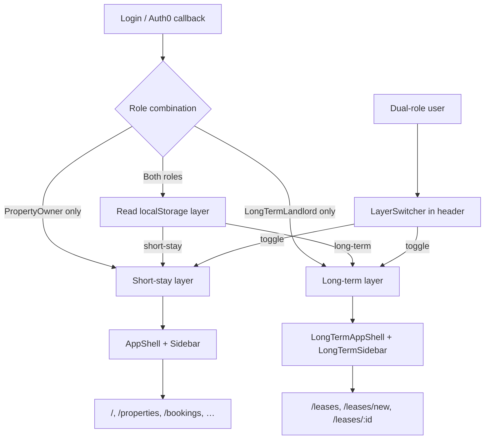
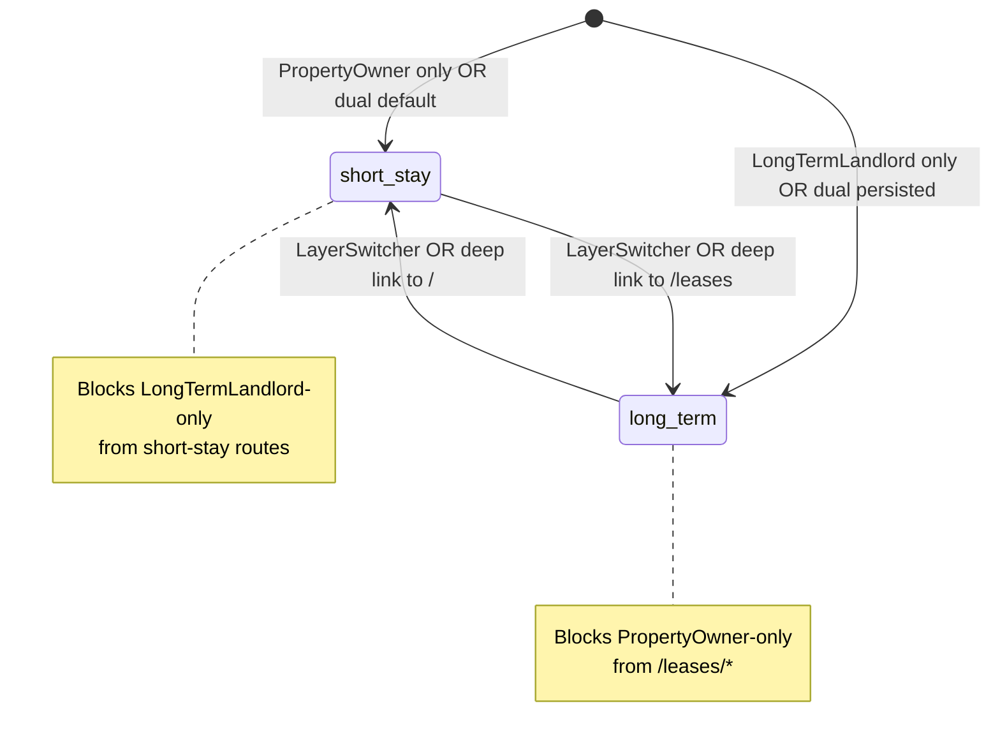

# Design Spec — Issue #182
# feat: long-term UI layer separation

**Stage**: 02 Design  
**Date**: 2026-06-03  
**Issue**: https://github.com/casazen/backend/issues/182  
**Planning ref**: `Sessions/planning-182.md`  
**Prior lease design**: `Sessions/design-177.md` (lease pages reused unchanged)  
**Branch target (Stage 03)**: `feature/182-long-term-ui-layer` in `casazen/frontend`  
**Status**: COMPLETE — all gates passed

---

## Scope

Frontend-only navigation/shell architecture. No backend API changes, no EF Core migrations, no new Auth0 roles.

Separates the CasaZen UI into two role-aware **layers**:

| Layer | Shell | Primary audience |
|---|---|---|
| Short-stay | Existing `AppShell` + `Sidebar` (minus Leases) | `PropertyOwner` |
| Long-term | New `LongTermAppShell` + `LongTermSidebar` | `LongTermLandlord` |

Reuses lease feature components from #177 at unchanged paths (`/leases`, `/leases/new`, `/leases/:id`). This issue removes per-page `AppShell` from lease pages and introduces layout routes so shells are inherited from the router.

---

## Council Specialist Outputs

### api-designer

**Verdict**: No new or changed REST endpoints. All lease CRUD continues to consume endpoints documented in `Sessions/design-177.md`. JWT role claim `https://casazen.app/roles` already carries `PropertyOwner` and `LongTermLandlord` — no Auth0 Action or backend policy changes required.

**Migration**: N/A — no database schema impact.

### frontend-designer

**Routing decision (resolved)**: **Option B — React Router layout routes with preserved `/leases/*` paths.**

Rationale:

| Criterion | Option A (`/long-term/*` prefix) | Option B (layout on `/leases/*`) ✅ |
|---|---|---|
| Deep links from #177 | Requires redirects for every bookmark | Zero URL breakage |
| Effort | Route migration + redirect map | Layout wrapper only |
| AC4 compliance | Extra redirect layer | Direct reuse |

**Default home after login**:

| Persona | Redirect target |
|---|---|
| `PropertyOwner` only | `/` |
| `LongTermLandlord` only | `/leases` |
| Dual-role | Last-used layer home (`/` or `/leases`) from `localStorage`, default `short-stay` → `/` |

**Long-term-only default home**: `/leases` (lease list serves as long-term dashboard until a dedicated dashboard exists).

**Cross-layer property nav**: Not exposed. Long-term layer does not link to short-stay Properties; shared property data is API-only (property selector inside lease create form continues to call `GET /api/properties`).

### security-by-design

Layer separation is a **UX authorization boundary**, not a substitute for server-side policy. All `/api/leases/*` calls remain gated by backend `LongTermLandlord` policy. Frontend guards prevent navigation confusion and reduce accidental exposure of short-stay OTA/booking surfaces to long-term-only users.

`localStorage` layer preference stores only `'short-stay' | 'long-term'` — no PII, no tokens.

---

## API Contract

### Summary

| Change type | Count |
|---|---|
| New endpoints | 0 |
| Modified endpoints | 0 |
| Deprecated endpoints | 0 |

**No API changes for this issue.** Frontend consumes existing endpoints unchanged.

### Endpoints consumed (unchanged — reference only)

All endpoints below are **already implemented** in the backend. This issue does not alter contracts; lease pages continue to call them from within the long-term shell.

| Method / Path | Auth | Change in #182 | Frontend usage |
|---|---|---|---|
| `GET /api/leases` | `[Authorize(Policy = "LongTermLandlord")]` | N/A — unchanged | `useLeases()` |
| `GET /api/leases/{id}` | `[Authorize(Policy = "LongTermLandlord")]` | N/A — unchanged | `useLease(id)` |
| `POST /api/leases` | `[Authorize(Policy = "LongTermLandlord")]` | N/A — unchanged | `useCreateLease()` |
| `POST /api/leases/{id}/signing` | `[Authorize(Policy = "LongTermLandlord")]` | N/A — unchanged | `useInitiateSigning()` |
| `POST /api/leases/{id}/registration` | `[Authorize(Policy = "LongTermLandlord")]` | N/A — unchanged | `useTriggerRegistration()` |
| `GET /api/leases/{id}/registration` | `[Authorize(Policy = "LongTermLandlord")]` | N/A — unchanged | `useLeaseRegistration()` |
| `GET /api/leases/{id}/registration/receipt` | `[Authorize(Policy = "LongTermLandlord")]` | N/A — unchanged | `leasesApi.downloadReceipt()` |
| `GET /api/properties` | `[Authorize]` (owner-scoped) | N/A — unchanged | Property select in lease create |
| `GET /api/properties/{id}/documents` | `[Authorize]` (owner-scoped) | N/A — unchanged | APE pre-check in lease create |

### Authentication policy (frontend — unchanged)

| Concern | Implementation |
|---|---|
| JWT | Axios interceptor attaches Bearer token (`src/lib/axios.ts`) |
| Role claim | Auth0 namespace `https://casazen.app/roles` |
| Route guard | `<ProtectedRoute role="LongTermLandlord">` on long-term layout |
| Demo mode | `VITE_DEMO_MODE=true`; demo user roles in `demo.config.ts` |

---

## Frontend Flow

### Architecture diagram



### Layer state machine



### User journeys

#### AC1 — PropertyOwner only

1. Post-login redirect → `/`
2. `AppShell` + short-stay `Sidebar` (Dashboard, Properties, Bookings, OTA, Payments, Search, Profile)
3. No "Leases" nav item; no `LayerSwitcher`
4. Manual `/leases` → `ProtectedRoute` redirects to `/` + toast

#### AC2 — LongTermLandlord only

1. Post-login redirect → `/leases`
2. `LongTermAppShell` + `LongTermSidebar` (Leases, Profile)
3. No short-stay nav items
4. Manual `/` or `/bookings` → `ShortStayLayerGuard` redirects to `/leases`

#### AC3 — Dual-role

1. Post-login → last-used layer home (default short-stay → `/`)
2. `LayerSwitcher` visible in header of active shell
3. Toggle persists `casazen:active-layer` in `localStorage`
4. Toggle navigates to target layer default home

#### AC4–AC6 — Lease navigation

1. Lease pages render as `<Outlet />` content inside `LongTermAppShell` — no `AppShell` import
2. `LongTermSidebar` highlights active lease route
3. Dual-role user in long-term layer: all lease nav stays inside long-term shell

---

### Route map (target)

React Router v6 nested layout routes in `src/routes/index.tsx`:

```typescript
// Pseudocode — illustrative structure
createBrowserRouter([
  { path: '/login', element: <LoginPage /> },
  { path: '/search', element: <SearchPage /> }, // unchanged — public

  {
    element: (
      <ProtectedRoute>
        <AppLayerProvider>
          <Outlet />
        </AppLayerProvider>
      </ProtectedRoute>
    ),
    children: [
      // ── Short-stay layer ──
      {
        element: <ShortStayLayerGuard><Outlet /></ShortStayLayerGuard>,
        children: [
          { path: '/', element: <ProtectedRoute><DashboardPage /></ProtectedRoute> },
          { path: '/properties', element: <ProtectedRoute><PropertiesPage /></ProtectedRoute> },
          { path: '/properties/create', element: <ProtectedRoute><PropertyCreatePage /></ProtectedRoute> },
          { path: '/properties/:id', element: <ProtectedRoute><PropertyDetailPage /></ProtectedRoute> },
          { path: '/properties/:id/edit', element: <ProtectedRoute><PropertyEditPage /></ProtectedRoute> },
          { path: '/properties/:id/pricing', element: <ProtectedRoute><PricingDashboardPage /></ProtectedRoute> },
          { path: '/properties/:id/pricing/history', element: <ProtectedRoute><PricingHistoryPage /></ProtectedRoute> },
          { path: '/bookings', element: <ProtectedRoute><BookingsPage /></ProtectedRoute> },
          { path: '/bookings/create', element: <ProtectedRoute><BookingCreatePage /></ProtectedRoute> },
          { path: '/bookings/calendar', element: <ProtectedRoute><CalendarPage /></ProtectedRoute> },
          { path: '/bookings/:id', element: <ProtectedRoute><BookingDetailPage /></ProtectedRoute> },
          { path: '/bookings/:id/edit', element: <ProtectedRoute><BookingEditPage /></ProtectedRoute> },
          { path: '/payments', element: <ProtectedRoute><PaymentsPage /></ProtectedRoute> },
          { path: '/payments/create', element: <ProtectedRoute><PaymentCreatePage /></ProtectedRoute> },
          { path: '/payments/revenue', element: <ProtectedRoute><RevenuePage /></ProtectedRoute> },
          { path: '/payments/:id', element: <ProtectedRoute><PaymentDetailPage /></ProtectedRoute> },
          { path: '/ota', element: <ProtectedRoute><OtaPage /></ProtectedRoute> },
          { path: '/ota/create', element: <ProtectedRoute><OtaSetupPage /></ProtectedRoute> },
          { path: '/profile', element: <ProtectedRoute><LayerAwareProfilePage /></ProtectedRoute> },
        ],
      },

      // ── Long-term layer ──
      {
        element: (
          <ProtectedRoute role="LongTermLandlord">
            <LongTermAppShell>
              <Outlet />
            </LongTermAppShell>
          </ProtectedRoute>
        ),
        children: [
          { path: '/leases', element: <LeasesPage /> },
          { path: '/leases/new', element: <LeaseCreatePage /> },
          { path: '/leases/:id', element: <LeaseDetailPage /> },
        ],
      },
    ],
  },

  { path: '*', element: <Navigate to="/" replace /> },
]);
```

**Note**: Short-stay feature pages retain their existing per-page `AppShell` wrapper in this iteration to limit diff scope. `ShortStayLayerGuard` runs before page render; lease pages drop `AppShell` because `LongTermAppShell` provides it via layout. A follow-up issue may migrate short-stay pages to a `ShortStayAppShell` layout route and remove duplicate shells.

---

### ProtectedRoute matrix

Every authenticated route must declare its guard. Layout-level guards compose with route-level guards.

| Path | ProtectedRoute | Additional guard | Redirect on deny |
|---|---|---|---|
| `/login` | None (public) | — | — |
| `/search` | None (public) | — | — |
| `/` | Auth only | `ShortStayLayerGuard` | `/leases` if long-term-only |
| `/properties` | Auth only | `ShortStayLayerGuard` | `/leases` if long-term-only |
| `/properties/create` | Auth only | `ShortStayLayerGuard` | `/leases` if long-term-only |
| `/properties/:id` | Auth only | `ShortStayLayerGuard` | `/leases` if long-term-only |
| `/properties/:id/edit` | Auth only | `ShortStayLayerGuard` | `/leases` if long-term-only |
| `/properties/:id/pricing` | Auth only | `ShortStayLayerGuard` | `/leases` if long-term-only |
| `/properties/:id/pricing/history` | Auth only | `ShortStayLayerGuard` | `/leases` if long-term-only |
| `/bookings` | Auth only | `ShortStayLayerGuard` | `/leases` if long-term-only |
| `/bookings/create` | Auth only | `ShortStayLayerGuard` | `/leases` if long-term-only |
| `/bookings/calendar` | Auth only | `ShortStayLayerGuard` | `/leases` if long-term-only |
| `/bookings/:id` | Auth only | `ShortStayLayerGuard` | `/leases` if long-term-only |
| `/bookings/:id/edit` | Auth only | `ShortStayLayerGuard` | `/leases` if long-term-only |
| `/payments` | Auth only | `ShortStayLayerGuard` | `/leases` if long-term-only |
| `/payments/create` | Auth only | `ShortStayLayerGuard` | `/leases` if long-term-only |
| `/payments/revenue` | Auth only | `ShortStayLayerGuard` | `/leases` if long-term-only |
| `/payments/:id` | Auth only | `ShortStayLayerGuard` | `/leases` if long-term-only |
| `/ota` | Auth only | `ShortStayLayerGuard` | `/leases` if long-term-only |
| `/ota/create` | Auth only | `ShortStayLayerGuard` | `/leases` if long-term-only |
| `/profile` | Auth only | `LayerAwareProfilePage` picks shell | — |
| `/leases` | `role="LongTermLandlord"` | Layout: `LongTermAppShell` | `/` + toast if PropertyOwner-only |
| `/leases/new` | `role="LongTermLandlord"` | Layout: `LongTermAppShell` | `/` + toast if PropertyOwner-only |
| `/leases/:id` | `role="LongTermLandlord"` | Layout: `LongTermAppShell` | `/` + toast if PropertyOwner-only |

#### Guard component specs

**`ShortStayLayerGuard`** (`src/components/auth/short-stay-layer-guard.tsx`)

```typescript
// If isLongTermOnly(user) → <Navigate to="/leases" replace />
// If isDualRole(user) && activeLayer === 'long-term' → <Navigate to="/leases" replace />
// Else → <Outlet />
```

**Dual-role deep link to `/leases`**: When a dual-role user hits `/leases` while `activeLayer === 'short-stay'`, `useAppLayer` auto-sets layer to `'long-term'` (no toast) so AC6 is satisfied.

**Dual-role deep link to `/`**: Symmetric — sets layer to `'short-stay'`.

---

### Component plan

| Component | Status | Location | Responsibility |
|---|---|---|---|
| `LongTermAppShell` | **new** | `src/components/layout/long-term-app-shell.tsx` | Layout: `LongTermSidebar` + `Header` (with `LayerSwitcher`) + `<main><Outlet/></main>` |
| `LongTermSidebar` | **new** | `src/components/layout/long-term-sidebar.tsx` | Long-term nav config; subtitle "Long-Term Rental" |
| `LayerSwitcher` | **new** | `src/components/layout/layer-switcher.tsx` | Segmented control: Short-stay ↔ Long-term; dual-role only |
| `ShortStayLayerGuard` | **new** | `src/components/auth/short-stay-layer-guard.tsx` | Blocks long-term-only and wrong-layer dual-role from short-stay routes |
| `AppLayerProvider` | **new** | `src/contexts/app-layer-context.tsx` | Context wrapping `useAppLayer` for tree access |
| `LayerAwareProfilePage` | **new** | `src/features/profile/layer-aware-profile-page.tsx` | Renders `ProfilePage` content in `AppShell` or `LongTermAppShell` based on effective layer |
| `useAppLayer` | **new** | `src/hooks/use-app-layer.ts` | Layer state, persistence, default home resolver |
| `auth-roles.ts` | **modified** | `src/lib/auth-roles.ts` | Add `isShortStayOnly`, `isLongTermOnly`, `isDualRole`, role constants |
| `Sidebar` | **modified** | `src/components/layout/sidebar.tsx` | Remove Leases item entirely |
| `Header` | **modified** | `src/components/layout/header.tsx` | Accept optional `slotStart` prop for `LayerSwitcher` |
| `LongTermAppShell` Header | — | composes | Passes `<LayerSwitcher />` when `isDualRole(user)` |
| `AppShell` Header | **modified** | via `AppShell` | Passes `<LayerSwitcher />` when dual-role |
| `LeasesPage` | **modified** | `src/features/leases/leases-page.tsx` | Remove `AppShell` wrapper — content only |
| `LeaseCreatePage` | **modified** | `src/features/leases/lease-create-page.tsx` | Remove `AppShell` wrapper |
| `LeaseDetailPage` | **modified** | `src/features/leases/lease-detail-page.tsx` | Remove `AppShell` wrapper |
| `LoginPage` | **modified** | `src/pages/login-page.tsx` | Post-login redirect via `getDefaultHomePath(user, layer)` |
| `routes/index.tsx` | **modified** | `src/routes/index.tsx` | Nested layout routes per above |
| `ProtectedRoute` | reused | `src/components/auth/protected-route.tsx` | Unchanged — role prop on long-term layout |

---

### `LongTermSidebar` nav config

| Label | Path | Icon | Notes |
|---|---|---|---|
| Leases | `/leases` | `FileText` | Default active for long-term home |
| Profile | `/profile` | `User` | Uses `LayerAwareProfilePage` |

Future long-term items (dashboard, rent collection) append here without touching short-stay sidebar.

---

### `useAppLayer` hook spec

**File**: `src/hooks/use-app-layer.ts`  
**Storage key**: `casazen:active-layer`  
**Values**: `'short-stay' | 'long-term'`

```typescript
type AppLayer = 'short-stay' | 'long-term';

interface UseAppLayerReturn {
  activeLayer: AppLayer;
  setLayer: (layer: AppLayer) => void;       // persist + navigate to default home
  effectiveLayer: AppLayer;                   // forced layer for single-role users
  canSwitchLayer: boolean;                    // isDualRole(user)
  getDefaultHomePath: (layer?: AppLayer) => string;
}

// getDefaultHomePath: short-stay → '/', long-term → '/leases'

// Initial layer resolution:
// 1. isShortStayOnly → 'short-stay' (ignore localStorage)
// 2. isLongTermOnly → 'long-term' (ignore localStorage)
// 3. isDualRole → read localStorage; fallback 'short-stay'
```

**Login redirect** (`LoginPage`):

```typescript
const home = getDefaultHomePath(resolveInitialLayer(user));
navigate(home, { replace: true });
```

---

### `auth-roles.ts` additions

```typescript
export const ROLE_PROPERTY_OWNER = 'PropertyOwner';
export const ROLE_LONG_TERM_LANDLORD = 'LongTermLandlord';

export function isShortStayOnly(user: UserWithRoles): boolean {
  return hasRole(user, ROLE_PROPERTY_OWNER) && !hasRole(user, ROLE_LONG_TERM_LANDLORD);
}

export function isLongTermOnly(user: UserWithRoles): boolean {
  return hasRole(user, ROLE_LONG_TERM_LANDLORD) && !hasRole(user, ROLE_PROPERTY_OWNER);
}

export function isDualRole(user: UserWithRoles): boolean {
  return hasRole(user, ROLE_PROPERTY_OWNER) && hasRole(user, ROLE_LONG_TERM_LANDLORD);
}
```

---

### `LayerSwitcher` UX spec

| Property | Value |
|---|---|
| Visibility | `isDualRole(user)` only |
| Placement | Header left area (after mobile menu button), both shells |
| Control type | Segmented toggle or two-button group |
| Labels | "Short-stay" / "Long-term" (English UI chrome; end-user labels may localize later) |
| Active state | Matches `activeLayer` |
| On change | `setLayer(target)` → persist + navigate |
| a11y | `role="tablist"`, keyboard arrow navigation, `aria-selected` on active segment |

---

### Lease page refactor (minimal)

Remove `<AppShell>` wrapper from three lease pages. Keep `PageHeader`, query hooks, and feature components unchanged. Loading states that currently return early inside `AppShell` should return `<LoadingScreen />` at page root (layout already provides chrome).

**Before** (`leases-page.tsx`):

```tsx
return (
  <AppShell>
    <div className="space-y-6">…</div>
  </AppShell>
);
```

**After**:

```tsx
return (
  <div className="space-y-6">…</div>
);
```

---

### Demo mode considerations

Current `demo.config.ts` grants `LongTermLandlord` only. For #182 testing:

| Demo config | Expected behaviour |
|---|---|
| `roles: ['LongTermLandlord']` (current) | Long-term shell only; `/` redirects to `/leases` |
| Add dual-role demo profile (optional, Stage 03) | `{ roles: ['PropertyOwner', 'LongTermLandlord'] }` for switcher E2E |

Stage 03 should add a dual-role demo user or env toggle if E2E covers AC3.

---

## Security Notes

### Auth gates

| Surface | Requirement |
|---|---|
| Long-term layout (`/leases/*`) | `<ProtectedRoute role="LongTermLandlord">` at layout boundary |
| Short-stay routes | Auth + `ShortStayLayerGuard` (blocks long-term-only users) |
| Layer preference (`localStorage`) | Non-sensitive enum only — no JWT, no PII |
| API calls | Unchanged — backend enforces `LongTermLandlord` on lease endpoints |
| OTA / Stripe surfaces | Hidden by nav removal in long-term layer; not security boundary alone |

### Threat model (STRIDE)

| Threat | Surface | Mitigation |
|---|---|---|
| Spoofing | Layer switch | Layer state is client UX only; API still requires valid JWT |
| Tampering | Manual URL to `/leases` | `ProtectedRoute role` + backend 403 |
| Tampering | Manual URL to `/bookings` as long-term-only | `ShortStayLayerGuard` redirect |
| Information disclosure | Wrong shell showing OTA/booking data | Guard + role-appropriate nav; API owner-scoping unchanged |
| Elevation of privilege | PropertyOwner accessing leases | Frontend redirect + backend `LongTermLandlord` policy |
| Repudiation | N/A | No new audit events |

### Client-side storage

| Key | Content | Risk |
|---|---|---|
| `casazen:active-layer` | `'short-stay'` or `'long-term'` | None — preference only |

Do **not** store roles, tokens, or user profile in additional localStorage keys for this feature.

### Secrets / integrations

| Integration | Impact |
|---|---|
| Auth0 | No change |
| Stripe webhooks | N/A |
| OTA keys | N/A — OTA nav not rendered in long-term shell |
| E-sign URLs | Unchanged (#177) — external links with `rel="noopener noreferrer"` |

---

## Migration Plan

### Database / backend

**N/A** — no EF Core migrations, no API versioning, no Auth0 Action changes.

### Frontend migration steps (Stage 03)

| Step | Action | Rollback |
|---|---|---|
| 1 | Add `auth-roles` helpers + `useAppLayer` + `AppLayerProvider` | Delete new files |
| 2 | Create `LongTermAppShell`, `LongTermSidebar`, `LayerSwitcher` | Delete new files |
| 3 | Create `ShortStayLayerGuard`, `LayerAwareProfilePage` | Delete new files |
| 4 | Refactor `routes/index.tsx` to nested layouts | Restore flat routes |
| 5 | Remove Leases from `sidebar.tsx` | Restore nav item |
| 6 | Strip `AppShell` from lease pages | Restore wrappers |
| 7 | Update `LoginPage` redirect logic | Restore `navigate('/')` |
| 8 | Wire `LayerSwitcher` into both shell headers | Remove prop |
| 9 | Unit tests: role helpers, `useAppLayer`, guards | — |
| 10 | E2E: AC1–AC6 persona flows | — |

### Deep link compatibility

| URL | Behaviour after migration |
|---|---|
| `/leases`, `/leases/new`, `/leases/:id` | Unchanged paths — no redirects required |
| Bookmarks from #177 | Continue to work for `LongTermLandlord` users |

### Out-of-scope deferrals

- Migrating all short-stay pages off per-page `AppShell` to a single short-stay layout route (future cleanup issue)
- Dedicated long-term dashboard route ( `/leases` remains home)
- Mobile drawer sidebar parity for `LongTermSidebar` (reuse existing `useUiStore.toggleSidebar` pattern if mobile nav exists for short-stay)

---

## GDPR Scope

**Guest entity (`Guest`)**: N/A — short-stay guest PII flows are not touched. Long-term layer does not surface guest/booking modules.

**Lease party PII**: Unchanged from #177. Reused lease components retain existing obligations:

| Field | UI exposure | Frontend rule |
|---|---|---|
| `firstName`, `lastName` | Lease form + detail | No localStorage persistence |
| `fiscalCode` | Lease form + detail | No toasts/logs |
| `contactEmail` | Lease form + detail | No toasts/logs |
| `citizenship` | Form input | Questura banner uses `isExtraEU` flag only |

**Layer preference storage**: `casazen:active-layer` is not personal data — no GDPR impact.

**Regulatory modules** (CIN, Alloggiati Web, tourist tax): Remain in short-stay layer only; not accessible from long-term shell nav.

---

## Acceptance Criteria Traceability

| AC | Design element |
|---|---|
| AC1 | Leases removed from `Sidebar`; no `LayerSwitcher` for `isShortStayOnly`; `/leases` blocked by `ProtectedRoute role` |
| AC2 | `LongTermAppShell` + `LongTermSidebar`; `ShortStayLayerGuard` redirects long-term-only from `/`; post-login → `/leases` |
| AC3 | `LayerSwitcher` + `useAppLayer` + `localStorage` persistence |
| AC4 | `/leases/*` layout route with content-only lease pages (no CRUD rewrite) |
| AC5 | `ProtectedRoute role="LongTermLandlord"` on long-term layout → PropertyOwner-only redirect to `/` |
| AC6 | Dual-role long-term nav via `LongTermSidebar`; auto layer switch on `/leases` deep link |

---

## Open Questions

All resolved for Stage 02.

| # | Question | Decision |
|---|---|---|
| 1 | Route prefix: `/long-term/*` vs keep `/leases/*`? | **Keep `/leases/*`** with `LongTermAppShell` layout route (Option B) |
| 2 | Long-term-only default home? | **`/leases`** (list page as interim dashboard) |
| 3 | Cross-layer Properties nav? | **No** — layers are isolated; property data via API in lease create only |
| 4 | Profile page shell? | **`LayerAwareProfilePage`** selects shell based on effective layer |
| 5 | Short-stay pages layout migration? | **Deferred** — retain per-page `AppShell`; only lease pages use layout route in #182 |
| 6 | Dual-role deep link layer sync? | **Auto-switch** layer when navigating to a route belonging to the other layer |

---

## Harness Gate Status

| Gate | Status | Notes |
|---|---|---|
| G1: Spec file exists | ✅ | `Sessions/design-182.md` |
| G2: API contract complete | ✅ | Explicit "No API changes" table + unchanged endpoint reference |
| G3: Auth on every endpoint | ✅ | All endpoints marked N/A unchanged with existing auth documented |
| G4: Frontend flow defined | ✅ | Architecture diagrams, route map, component plan |
| G5: ProtectedRoute specified | ✅ | Full matrix for all authenticated routes |
| G6: Security notes | ✅ | Auth gates, STRIDE, localStorage scope |
| G7: Migration plan | ✅ | Frontend step plan; backend N/A |
| G8: GDPR scope | ✅ | Guest N/A; lease party PII unchanged from #177 |

**Handoff → Stage 03**: Issue `#182`, spec `Sessions/design-182.md`, branch `feature/182-long-term-ui-layer` (frontend repo).
