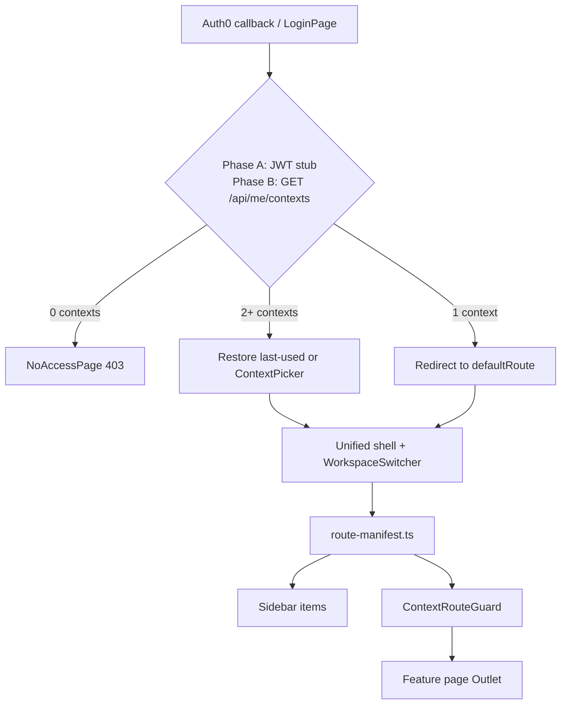

# Design Spec — Issue #189
# feat: context workspace switcher (short-rent, long-rent, admin)

**Stage**: 02 Design  
**Date**: 2026-06-04  
**Issue**: https://github.com/casazen/backend/issues/189  
**Planning ref**: `Sessions/pipeline-context-workspace-switch/`  
**Analysis ref**: `Sessions/specs/spec-split-layer.md`, `Sessions/pipeline-context-workspace-switch/external-analysis.md`  
**Prior work**: `Sessions/design-182.md` (#182 — layer shells; **extend, do not duplicate**)  
**Branch target (Stage 03)**: `feature/189-context-workspace-switch` (frontend + backend)  
**Status**: COMPLETE — all gates passed

---

## Scope

Generalize the #182 **layer** model into three first-class **application contexts** (`short-rent`, `long-rent`, `admin`) with:

- Canonical URLs under `/app/:context/*`
- Central **route manifest** (nav, guards, default landings)
- **Workspace switcher** (Italian UI labels) for multi-context users
- Backend **contextual authorization** (membership + permissions), with a phased JWT stub during migration

**Out of scope**: Re-implementing lease UI (#177), admin feature pages beyond routing/shell, new regulated data flows, OTA/Stripe/Hangfire logic changes.

**Extends #182**: Keeps lease pages, three shells, and existing API contracts; migrates paths and auth model. Does not re-open closed #182 deliverables.

---

## Phased delivery

| Phase | Repo | Deliverable | Membership source |
|---|---|---|---|
| **A** | Frontend | Context-prefixed routes, route manifest, workspace switcher, legacy redirects, post-login context resolution | JWT roles → synthetic contexts (client-side mapper; same mapping server will use in B) |
| **B** | Backend | EF tables, seed, `GET /api/me/contexts`, contextual policy handler on critical controllers | DB `UserContextMembership` (+ JWT fallback until C) |
| **C** | Backend + Auth0 | Optional: Auth0 Action / Management API alignment; reduce duplicate global operational roles | DB authoritative; JWT roles for identity/bootstrap only |

Stages 03–05 may ship **A then B** in one PR pair or sequential PRs; **C** is a follow-up slice in the same issue if feasible, otherwise a child issue.

---

## Council specialist outputs (summary)

| Specialist | Verdict |
|---|---|
| **api-designer** | One new bootstrap endpoint; existing REST paths unchanged; Phase B adds `RequireContext` policy without breaking request/response schemas |
| **frontend-designer** | Manifest-driven router; unify shell chrome; deprecate `AppLayer` / `ShortStayLayerGuard` in favor of `WorkspaceContext` + `ContextRouteGuard` |
| **security-by-design** | FE guards are UX only; BE evaluates membership per context; bootstrap returns least privilege; no PII in `localStorage` |

---

## API Contract

### Summary

| Change type | Phase | Count |
|---|---|---|
| New endpoints | B | 1 (`GET /api/me/contexts`) |
| Modified auth (policy handler) | B | Critical controllers (see below) — no schema change |
| Unchanged endpoints | A–C | All existing REST paths and DTOs |

### New — `GET /api/me/contexts` (Phase B)

Bootstrap for workspace switcher, post-login routing, and FE permission checks.

| | |
|---|---|
| **Method / Path** | `GET /api/me/contexts` |
| **Auth** | `[Authorize]` — caller must be authenticated; upserts `User` on first call (same as `GET /api/users/me`) |
| **Request** | None |
| **Response 200** | `UserContextsResponse` |

```json
{
  "userId": "auth0|abc123",
  "contexts": [
    {
      "contextKey": "short-rent",
      "displayName": "Affitti brevi",
      "roleKey": "property_owner",
      "permissions": ["booking.read", "property.read", "payment.read", "ota.read"],
      "defaultRoute": "/app/short-rent"
    },
    {
      "contextKey": "long-rent",
      "displayName": "Affitti lungo termine",
      "roleKey": "long_term_landlord",
      "permissions": ["lease.read", "lease.create"],
      "defaultRoute": "/app/long-rent/leases"
    }
  ],
  "lastUsedContextKey": "short-rent"
}
```

| Field | Type | Notes |
|---|---|---|
| `contexts[].contextKey` | `"short-rent" \| "long-rent" \| "admin"` | Stable enum string |
| `contexts[].displayName` | `string` | Italian label for switcher (server may return; FE manifest is fallback) |
| `contexts[].roleKey` | `string` | Per-context role slug |
| `contexts[].permissions` | `string[]` | Capability keys used by manifest `requiredPermissions` |
| `contexts[].defaultRoute` | `string` | Canonical FE path (manifest `isDefault` route) |
| `lastUsedContextKey` | `string?` | Optional server preference (Phase B+); FE still persists `casazen:active-context` in Phase A |

| Status | Body |
|---|---|
| 401 | Standard unauthorized |
| 403 | `{ "error": "User account inactive" }` when `User.IsActive == false` |
| 200 empty contexts | `{ "contexts": [] }` — FE shows managed “no access” page (not redirect to `/`) |

**C# DTOs** (new in `Casazen.Web/DTOs/Auth/`):

```csharp
public record UserContextsResponse(string UserId, IReadOnlyList<ContextBootstrapDto> Contexts, string? LastUsedContextKey);
public record ContextBootstrapDto(string ContextKey, string DisplayName, string RoleKey, IReadOnlyList<string> Permissions, string DefaultRoute);
```

**Implementation notes**:

- Resolve `sub` from JWT; load memberships from `UserContextMembership` joined to `Role` / `RolePermission`.
- If no rows exist (migration window), **synthesize** from JWT `https://casazen.app/roles` using the same map as Phase A FE stub (see Migration Plan).
- `GET /api/users/me` remains unchanged; clients may call both; bootstrap is the single source for **navigation authorization**.

---

### Optional — `PUT /api/me/contexts/active` (Phase B, nice-to-have)

| | |
|---|---|
| **Method / Path** | `PUT /api/me/contexts/active` |
| **Auth** | `[Authorize]` |
| **Request** | `{ "contextKey": "short-rent" }` |
| **Response 204** | No body |
| **Errors** | 400 invalid key; 403 not a member of context |

Persists `User.LastUsedContextKey` (new nullable column on `User`). FE may continue using `localStorage` only if this endpoint is deferred.

---

### Unchanged endpoints (reference — Phase A–C)

No path or DTO changes. Phase B adds **contextual policy evaluation** behind existing `[Authorize(Policy = "...")]` attributes; clients keep calling the same URLs.

#### Public / webhooks

| Method / Path | Auth | Notes |
|---|---|---|
| `POST /api/auth/register` | `[AllowAnonymous]` | Dev-oriented registration |
| `GET /api/health` | Public | Health check |
| `GET /api/health/auth-test` | Public | Auth probe |
| `POST /webhooks/stripe` | Signature validation (not JWT) | Stripe |
| `POST /webhooks/ota/{platform}` | Platform secret | OTA |
| `POST /webhooks/esign` | Provider validation | E-sign |

#### Authenticated — general

| Method / Path | Auth (today) | Context (Phase B) | Change |
|---|---|---|---|
| `GET /api/auth/profile` | `[Authorize]` | N/A | Unchanged |
| `POST /api/auth/logout` | `[Authorize]` | N/A | Unchanged |
| `GET /api/users/me` | `[Authorize]` | N/A | Unchanged |
| `PUT /api/users/me` | `[Authorize]` | N/A | Unchanged |
| `GET /api/pricing-adapter/*` | `[Authorize]` | `short-rent` | Policy handler added |
| `GET /api/gdpr/guests/*` | `[Authorize]` | `short-rent` | Policy handler added |

#### Short-rent (`PropertyOwner` policy today)

| Method / Path | Auth | Context | `requiredPermissions` (manifest alignment) |
|---|---|---|---|
| `GET/POST/PUT/DELETE /api/properties*` | `PropertyOwner` | `short-rent` | `property.read` / `property.write` |
| `GET/POST/PUT/DELETE /api/bookings*` | `PropertyOwner` | `short-rent` | `booking.read` / `booking.write` |
| `GET/POST/PUT/DELETE /api/guests*` | `PropertyOwner` | `short-rent` | `guest.read` / `guest.write` |
| `GET/POST /api/payments*` | `PropertyOwner` | `short-rent` | `payment.read` / `payment.write` |
| `GET/POST /api/ota*` | `PropertyOwner` | `short-rent` | `ota.read` / `ota.write` |
| `GET/POST/PUT/DELETE /api/properties/{id}/ota-integrations*` | `PropertyOwner` | `short-rent` | `ota.read` / `ota.write` |
| `GET/POST /api/tourist-tax-rates*` (non-admin) | `[Authorize]` | `short-rent` | `booking.read` |

#### Long-rent

| Method / Path | Auth | Context | Permissions |
|---|---|---|---|
| `GET/POST /api/leases*` | `LongTermLandlord` | `long-rent` | `lease.read`, `lease.create`, `lease.sign`, `lease.register` |

#### Admin

| Method / Path | Auth | Context | Permissions |
|---|---|---|---|
| `GET/PUT/DELETE /api/users*` | `AdminOnly` | `admin` | `admin.users.read`, `admin.users.manage` |
| `GET /api/admin/stats` | `AdminOnly` | `admin` | `admin.stats.read` |
| `GET /api/admin/cin-compliance` | `AdminOnly` | `admin` | `admin.cin.read` |
| `GET /api/admin/jobs` | `AdminOnly` | `admin` | `admin.jobs.read` |
| `POST/PUT/DELETE /api/tourist-tax-rates` (mutations) | `AdminOnly` | `admin` | `admin.tax.manage` |

### Phase B — contextual authorization mechanism

| Component | Responsibility |
|---|---|
| `IContextAuthorizationService` | Given `userId`, `contextKey`, `permissionKey` → bool |
| `ContextAuthorizationHandler` | ASP.NET authorization handler for policy `RequireContext` |
| Policy registration | `.AddPolicy("RequireContext:short-rent:booking.read", ...)` or single policy with `ContextRequirement` |
| Request context | Optional header `X-Casazen-Context: short-rent` for ambiguous endpoints; **leases/bookings/admin controllers infer fixed context** from route namespace |

**Enforcement order**: JWT valid → user active → membership in context → permission in context → existing resource-level checks (owner IDOR on leases/properties).

**Phase A**: No backend change; FE uses JWT stub identical to synthesis map below.

---

## Frontend Flow

### Architecture



### Context model

| `contextKey` | Italian label (UI) | Default landing (`isDefault`) | Shell (Phase A) |
|---|---|---|---|
| `short-rent` | Affitti brevi | `/app/short-rent` | `AppShell` + short-stay sidebar (manifest-driven) |
| `long-rent` | Affitti lungo termine | `/app/long-rent/leases` | `LongTermAppShell` |
| `admin` | Amministrazione | `/app/admin` | `AdminAppShell` |

**State**: Replace `AppLayer` (`short-stay` \| `long-term`) with `AppContextKey` (`short-rent` \| `long-rent` \| `admin`).

**Storage key**: `casazen:active-context` (rename from `casazen:active-layer`; migration reads old key once).

---

### Route manifest (`src/config/route-manifest.ts`)

Single source for router registration, sidebar, default redirects, and guards.

```typescript
export type AppContextKey = 'short-rent' | 'long-rent' | 'admin';

export interface RouteManifestEntry {
  /** Canonical path, e.g. /app/short-rent/bookings */
  path: string;
  context: AppContextKey;
  /** Empty = auth only within context */
  requiredPermissions: string[];
  navLabel?: string; // Italian
  icon?: string; // lucide icon name
  isDefault?: boolean; // one per context
  /** Lazy component import */
  component: () => Promise<{ default: React.ComponentType }>;
  /** Legacy paths that redirect here (Phase A) */
  legacyPaths?: string[];
}
```

**Manifest rules**:

1. Every protected operational route appears exactly once with `path` under `/app/{context}/...`.
2. `isDefault: true` exactly one entry per context the user can access.
3. Sidebar = `entries.filter(e => e.context === activeContext && e.navLabel)`.
4. `WorkspaceSwitcher` = distinct `contextKey` from bootstrap (not global JWT role names).

---

### Canonical route map (target)

All paths below are **authenticated** unless noted.

#### Public (unchanged)

| Path | Guard |
|---|---|
| `/login` | None |
| `/search` | None |

#### Short-rent — `/app/short-rent/*`

| Canonical path | navLabel (IT) | requiredPermissions | Legacy redirects |
|---|---|---|---|
| `/app/short-rent` | Dashboard | `[]` | `/`, `/app/short-rent/` |
| `/app/short-rent/properties` | Proprietà | `property.read` | `/properties` |
| `/app/short-rent/properties/create` | — | `property.write` | `/properties/create` |
| `/app/short-rent/properties/:id` | — | `property.read` | `/properties/:id` |
| `/app/short-rent/properties/:id/edit` | — | `property.write` | `/properties/:id/edit` |
| `/app/short-rent/properties/:id/pricing` | — | `property.read` | `/properties/:id/pricing` |
| `/app/short-rent/properties/:id/pricing/history` | — | `property.read` | `/properties/:id/pricing/history` |
| `/app/short-rent/bookings` | Prenotazioni | `booking.read` | `/bookings` |
| `/app/short-rent/bookings/create` | — | `booking.write` | `/bookings/create` |
| `/app/short-rent/bookings/calendar` | Calendario | `booking.read` | `/bookings/calendar` |
| `/app/short-rent/bookings/:id` | — | `booking.read` | `/bookings/:id` |
| `/app/short-rent/bookings/:id/edit` | — | `booking.write` | `/bookings/:id/edit` |
| `/app/short-rent/payments` | Pagamenti | `payment.read` | `/payments` |
| `/app/short-rent/payments/create` | — | `payment.write` | `/payments/create` |
| `/app/short-rent/payments/revenue` | Ricavi | `payment.read` | `/payments/revenue` |
| `/app/short-rent/payments/:id` | — | `payment.read` | `/payments/:id` |
| `/app/short-rent/ota` | OTA | `ota.read` | `/ota` |
| `/app/short-rent/ota/create` | — | `ota.write` | `/ota/create` |
| `/app/short-rent/profile` | Profilo | `[]` | `/profile` (when active context is short-rent) |

#### Long-rent — `/app/long-rent/*`

| Canonical path | navLabel (IT) | requiredPermissions | Legacy redirects |
|---|---|---|---|
| `/app/long-rent/leases` | Contratti | `lease.read` | `/leases` |
| `/app/long-rent/leases/new` | — | `lease.create` | `/leases/new` |
| `/app/long-rent/leases/:id` | — | `lease.read` | `/leases/:id` |
| `/app/long-rent/profile` | Profilo | `[]` | `/profile` (when active context is long-rent) |

#### Admin — `/app/admin/*`

| Canonical path | navLabel (IT) | requiredPermissions | Legacy redirects |
|---|---|---|---|
| `/app/admin` | Dashboard | `admin.stats.read` | `/admin` |
| `/app/admin/users` | Utenti | `admin.users.read` | `/admin/users` |
| `/app/admin/cin` | CIN | `admin.cin.read` | `/admin/cin` |
| `/app/admin/jobs` | Job | `admin.jobs.read` | `/admin/jobs` |

**Profile route**: Context-scoped `/app/{context}/profile` replaces `LayerAwareProfilePage` shell selection; same `ProfilePage` content, shell from parent layout route.

---

### Router structure (`src/routes/index.tsx`)

```typescript
// Pseudocode — Phase A target
createBrowserRouter([
  { path: '/login', element: <LoginPage /> },
  { path: '/search', element: <SearchPage /> },

  // Legacy redirect layer (Phase A) — <LegacyRedirect />
  { path: '/', element: <LegacyRedirect /> },
  { path: '/properties/*', element: <LegacyRedirect /> },
  // ... all legacyPaths from manifest

  {
    path: '/app',
    element: (
      <ProtectedRoute>
        <WorkspaceProvider>
          <Outlet />
        </WorkspaceProvider>
      </ProtectedRoute>
    ),
    children: [
      { path: ':context', element: <ContextLayout />, children: [
        // Generated from manifest: ContextRouteGuard per route
      ]},
      { path: 'choose-context', element: <ContextPickerPage /> },
      { path: 'no-access', element: <NoAccessPage /> },
    ],
  },

  { path: '*', element: <Navigate to="/app/choose-context" replace /> },
]);
```

`ContextLayout` selects shell by `:context` param and renders `<WorkspaceSwitcher />` when `contexts.length > 1`.

---

### Post-login flow

| Condition | Behaviour |
|---|---|
| 0 contexts | `/app/no-access` with Italian copy |
| 1 context | `navigate(contexts[0].defaultRoute, { replace: true })` |
| 2+ contexts, valid `casazen:active-context` in storage | Restore if still in `contexts`; else picker |
| 2+ contexts, no storage | `/app/choose-context` or auto short-rent if product prefers (default: **picker**) |
| Deep link to wrong context | `ContextRouteGuard` → redirect to first allowed context default or `/app/no-access` |

**LoginPage** (Phase A): call `resolveContexts(user)` stub; Phase B: `GET /api/me/contexts` then same branching.

---

### Workspace switcher (`workspace-switcher.tsx`)

Replaces `layer-switcher.tsx` (deprecate after Phase A).

| Property | Value |
|---|---|
| Visibility | `availableContexts.length > 1` |
| Placement | Header `slotStart` in all shells |
| Labels | Italian: *Affitti brevi*, *Affitti lungo termine*, *Amministrazione* |
| On change | Set `activeContext`, persist storage, `navigate(defaultRoute for context)` |
| a11y | `role="tablist"`, keyboard navigation (same as #182) |

Admin-only users see only admin in switcher; dual/triple membership sees all granted contexts.

---

### ProtectedRoute / context guard matrix

Every authenticated route uses **two layers**: auth wrapper + context guard.

| Route pattern | `<ProtectedRoute>` | Context guard | Deny behaviour |
|---|---|---|---|
| `/login`, `/search` | None | — | — |
| `/app/choose-context`, `/app/no-access` | Auth only | Membership check on choose-context | — |
| `/app/short-rent/*` | Auth | `ContextRouteGuard context="short-rent"` + permission | Redirect to first allowed context default; toast IT |
| `/app/long-rent/*` | Auth | `ContextRouteGuard context="long-rent"` + permission | Same |
| `/app/admin/*` | Auth | `ContextRouteGuard context="admin"` + permission | Same |
| Legacy `/*` redirects | Auth if target is protected | Resolved by redirect target | 302 to canonical |

**`ContextRouteGuard`** (`src/components/auth/context-route-guard.tsx`):

```typescript
// 1. If :context not in availableContexts → Navigate to first allowed defaultRoute
// 2. If requiredPermissions not subset of context.permissions → NoAccessPage or redirect
// 3. If URL context !== activeContext and user can access both → set activeContext from URL (deep link sync, #182 pattern)
// 4. Else <Outlet />
```

**JWT stub permissions (Phase A)** — map roles to full permission sets per context:

| JWT role | Context | Stub permissions |
|---|---|---|
| `PropertyOwner` | `short-rent` | All short-rent manifest permissions for owner |
| `LongTermLandlord` | `long-rent` | All `lease.*` |
| `Admin` | `admin` | All `admin.*` |

**Deprecate** (remove in Phase A PR):

- `ShortStayLayerGuard` — replaced by context prefix + guard
- `useAppLayer` / `AppLayerProvider` — replaced by `useWorkspace` / `WorkspaceProvider`
- Role-only `ProtectedRoute role="LongTermLandlord"` on layout — replaced by manifest permissions; keep auth-only `ProtectedRoute` at `/app` root

---

### Component plan

| Component | Status | Location |
|---|---|---|
| `route-manifest.ts` | **new** | `src/config/route-manifest.ts` |
| `WorkspaceProvider` | **new** | `src/contexts/workspace-provider.tsx` |
| `useWorkspace` | **new** | `src/hooks/use-workspace.ts` |
| `WorkspaceSwitcher` | **new** | `src/components/layout/workspace-switcher.tsx` |
| `ContextRouteGuard` | **new** | `src/components/auth/context-route-guard.tsx` |
| `ContextLayout` | **new** | `src/components/layout/context-layout.tsx` |
| `LegacyRedirect` | **new** | `src/routes/legacy-redirect.tsx` |
| `ContextPickerPage` | **new** | `src/pages/context-picker-page.tsx` |
| `NoAccessPage` | **new** | `src/pages/no-access-page.tsx` |
| `contextsApi.getContexts` | **new** | `src/api/contexts.ts` (Phase B wire-up; stub Phase A) |
| `auth-roles.ts` | **modified** | Add `deriveContextsFromRoles()` for Phase A stub |
| `routes/index.tsx` | **modified** | Manifest-driven tree + legacy routes |
| `LoginPage` | **modified** | Context-aware post-login |
| `AppShell`, `LongTermAppShell`, `AdminAppShell` | **modified** | Nav from manifest; `WorkspaceSwitcher` in header |
| `layer-switcher.tsx`, `app-layer-*` | **deprecated** | Remove after migration |
| Feature `*Page` components | **unchanged** | No business logic rewrite; paths only |

---

### Internal links and API client (Phase A checklist)

- Replace hardcoded `href`/`navigate('/bookings')` with manifest helpers: `pathFor('bookings.list')` or imported constants.
- Axios: no header required Phase A; Phase B optional `X-Casazen-Context` from `activeContext`.

---

## Security Notes

### Auth gates

| Surface | Requirement |
|---|---|
| Bootstrap API | `[Authorize]` only; returns contexts for **authenticated sub**; never leak other users' memberships |
| FE `ContextRouteGuard` | UX boundary; must not be sole enforcement |
| BE Phase B | `IContextAuthorizationService` on all critical controllers; 403 if membership/permission missing |
| Admin routes | Still require `Admin` membership in `admin` context; global JWT `Admin` until Phase C |
| Webhooks | Unchanged — no JWT; signature/secret validation |
| `localStorage` | Only `casazen:active-context` enum — no roles, tokens, or PII |

### JWT stub transition risk (Phase A)

| Risk | Mitigation |
|---|---|
| Client-side role mapping bypassed | Phase B makes bootstrap authoritative; API policies enforced server-side |
| Stale dual source (JWT vs DB) | Document: FE reads bootstrap when available; stub only when `GET /api/me/contexts` 404 or Phase A flag |
| User with JWT role but no DB row | Synthesis on bootstrap; admin UI to assign memberships later |

### Threat model (STRIDE)

| Threat | Surface | Mitigation |
|---|---|---|
| Spoofing | Context header tampering | Server validates membership for claimed context; infer context from controller on resource APIs |
| Tampering | Deep link to `/app/admin/users` | Context guard + `AdminOnly` policy + membership |
| Tampering | Legacy URL bypass | Legacy redirect routes still run guards on destination |
| Elevation | PropertyOwner opens leases via URL | `long-rent` membership check + `LongTermLandlord` policy |
| Information disclosure | Bootstrap over-fetch | Return only caller's contexts and permission keys |
| Repudiation | Context switch | Optional server log `ContextSwitched` (Phase C); not blocking |

### PII

| Data | Handling |
|---|---|
| Bootstrap response | No email/name required; `userId` is Auth0 sub |
| Profile pages | Unchanged GDPR rules from existing flows |
| Guest / lease party PII | Unchanged — not introduced by this issue |

### Secrets / integrations

| Integration | Impact |
|---|---|
| Auth0 | Phase C only — optional Action to stop duplicating operational roles |
| OTA keys | Remain server-side; admin/long-rent manifests exclude OTA nav |
| Stripe webhooks | N/A |

---

## Migration Plan

### Database — EF Core (Phase B)

**Migration name**: `AddContextAuthorization`

#### Entities

**`AppContext`** (lookup)

| Column | Type | Notes |
|---|---|---|
| `Key` | `string` PK | `short-rent`, `long-rent`, `admin` |
| `DisplayName` | `string` | Italian display |

**`Role`** (per-context role definition)

| Column | Type | Notes |
|---|---|---|
| `Id` | `int` PK | |
| `ContextKey` | `string` FK → `AppContext` | |
| `RoleKey` | `string` | e.g. `property_owner`, `long_term_landlord`, `platform_admin` |
| Unique | `(ContextKey, RoleKey)` | |

**`RolePermission`**

| Column | Type | Notes |
|---|---|---|
| `RoleId` | `int` FK → `Role` | |
| `PermissionKey` | `string` | e.g. `booking.read` |
| Unique | `(RoleId, PermissionKey)` | |

**`UserContextMembership`**

| Column | Type | Notes |
|---|---|---|
| `Id` | `Guid` PK | |
| `UserId` | `string` FK → `User.Id` | Auth0 sub |
| `ContextKey` | `string` FK → `AppContext` | |
| `RoleId` | `int` FK → `Role` | |
| Unique | `(UserId, ContextKey)` | One role per context per user |

**`User`** (optional column)

| Column | Type | Notes |
|---|---|---|
| `LastUsedContextKey` | `string?` | For `PUT /api/me/contexts/active` |

Existing `User.Role` enum **retained** for admin user management and Auth0 sync until Phase C; bootstrap prefers `UserContextMembership` when present.

#### Seed data (dev)

| Context | Role | Permissions |
|---|---|---|
| `short-rent` | `property_owner` | `property.read`, `property.write`, `booking.read`, `booking.write`, `payment.read`, `payment.write`, `ota.read`, `ota.write`, `guest.read`, `guest.write` |
| `long-rent` | `long_term_landlord` | `lease.read`, `lease.create`, `lease.sign`, `lease.register` |
| `admin` | `platform_admin` | `admin.stats.read`, `admin.users.read`, `admin.users.manage`, `admin.cin.read`, `admin.jobs.read`, `admin.tax.manage` |

**Seed script**: For each existing `User` with `User.Role`, insert membership row(s) using JWT alignment map:

| `UserRole` / JWT | Context memberships |
|---|---|
| `PropertyOwner` | `short-rent` → `property_owner` |
| `LongTermLandlord` | `long-rent` → `long_term_landlord` |
| `Admin` | `admin` → `platform_admin` |
| Combined JWT roles (dual) | Multiple rows |

#### JWT → context synthesis (Phase A stub & Phase B fallback)

```text
PropertyOwner      → short-rent / property_owner
LongTermLandlord   → long-rent / long_term_landlord
Admin              → admin / platform_admin
```

### Backend rollout (Phase B)

| Step | Action |
|---|---|
| 1 | Add entities + migration + seed |
| 2 | `IContextAuthorizationService` + handler |
| 3 | `GET /api/me/contexts` |
| 4 | Apply handler to `LeasesController`, `BookingController`, `PropertiesController`, `AdminController`, `UsersController` (admin actions) |
| 5 | Integration tests: bootstrap + 403 without membership |

### Frontend rollout (Phase A)

| Step | Action |
|---|---|
| 1 | Add `route-manifest.ts` with full route table |
| 2 | `WorkspaceProvider` + JWT stub |
| 3 | Refactor `routes/index.tsx` + `LegacyRedirect` |
| 4 | `WorkspaceSwitcher` in shells; remove layer switcher |
| 5 | Update `LoginPage` post-login |
| 6 | grep internal links → canonical paths |
| 7 | E2E: legacy redirects, single/multi context, 403 deep link |

### Legacy redirect removal

Temporary redirects live **Phase A–B**; remove in follow-up issue after analytics show near-zero legacy hits (design documents mapping; do not delete in #189 initial merge).

---

## GDPR Scope

**Guest entity (`Guest`)**: N/A — no new guest data fields; short-rent guest flows unchanged.

**Lease party PII**: Unchanged from #177/#182 — context routing does not alter form or API payloads.

**User profile PII** (`FirstName`, `LastName`, `Email`, `PhoneNumber`): Unchanged; `GET /api/me/contexts` does not expose extra PII beyond `userId`.

**Storage**: `casazen:active-context` is not personal data.

**Regulatory modules** (CIN, Alloggiati, tourist tax): Remain in `short-rent` / `admin` contexts per manifest; no new processing purposes.

---

## Acceptance criteria traceability

| AC | Design element |
|---|---|
| Canonical context prefixes | Route manifest; all operational routes under `/app/{context}/*` |
| Centralized manifest | `route-manifest.ts` drives nav, defaults, guards |
| Workspace switcher | `WorkspaceSwitcher` + Italian labels; updates `activeContext`, nav, URL |
| Post-login context resolution | Bootstrap stub/API + single/multi/picker flows |
| No access to forbidden context | `ContextRouteGuard` + `NoAccessPage` |
| API contextual auth | Phase B membership + policy handler; Phase A documented gap |
| Legacy URL redirects | `legacyPaths` on manifest entries + `LegacyRedirect` |

---

## Open Questions

All resolved for Stage 02.

| # | Question | Decision |
|---|---|---|
| 1 | URL prefix `/app/:context` vs `/` only? | **`/app/:context/*`** per issue AC and external analysis |
| 2 | Keep three shells or one unified shell? | **Keep three shells** in Phase A; shared header/workspace chrome; nav from manifest (#182 investment preserved) |
| 3 | Phase A membership source? | **JWT stub** identical to BE synthesis map |
| 4 | Profile route placement? | **`/app/{context}/profile`** — drops `LayerAwareProfilePage` |
| 5 | `PUT /api/me/contexts/active` in scope? | **Nice-to-have Phase B**; `localStorage` sufficient for #189 MVP |
| 6 | Phase C in #189 or child issue? | **Same issue if feasible**; otherwise child issue — not blocking A/B |
| 7 | Permission granularity for Phase B? | **Coarse keys** per manifest column; expand later without route renames |

---

## Harness gate status

| Gate | Status | Notes |
|---|---|---|
| G1: Spec file exists | ✅ | `Sessions/design-189.md` |
| G2: API contract complete | ✅ | New bootstrap endpoint + unchanged endpoint tables with schemas |
| G3: Auth on every endpoint | ✅ | Each endpoint has `[Authorize]` / `[AllowAnonymous]` / webhook justification |
| G4: Frontend flow defined | ✅ | Manifest, router, post-login, switcher, diagrams |
| G5: ProtectedRoute specified | ✅ | Full matrix + `ContextRouteGuard` for every authenticated route |
| G6: Security notes | ✅ | Auth gates, STRIDE, PII, JWT transition |
| G7: Migration plan | ✅ | EF entities, seed, phased FE/BE steps |
| G8: GDPR scope | ✅ | Guest N/A; lease/profile unchanged |

**Handoff → Stage 03**: Issue `#189`, spec `Sessions/design-189.md`, branches `feature/189-context-workspace-switch` (frontend and backend repos).
