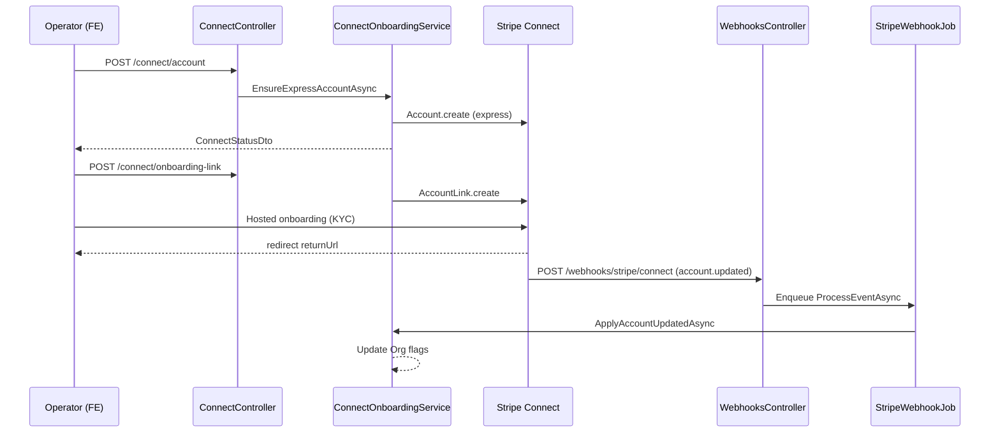

# Design — Issue #224 Stripe Connect Onboarding (Operator / Landlord = Merchant of Record)

> **Stage 02 — Design** · Spec: `Sessions/specs/spec-connect-onboarding.md` (US-002 / US-007 enabler) · Phase 1 (MVP Sellable — payments enabler; unblocks Phase 1.5 LTR rent)
> **Architecture**: AD-5 (operator/landlord = merchant of record, never CasaZen), RF2 (platform vs connected-account webhook routing), C3/C6 (charge-gating before PaymentIntent)
> **Stack**: .NET 10 · EF Core · PostgreSQL (Supabase) · Stripe Connect Express · layered `Casazen.Core` / `Casazen.Infrastructure` / `Casazen.Web` · React 19 SPA (`casazen/frontend`)
> **Specialist synthesis**: `api-designer` (API Contract + Migration Plan) · `frontend-designer` (Frontend Flow + ProtectedRoute) · `security-by-design` (Security Notes + GDPR Scope).

This spec closes the blocking gap between `spec-tenant-boundary` (which defines `Org.StripeConnectedAccountId`) and downstream payment flows (`spec-direct-checkout`, `spec-ltr-recurring-rent`, `spec-branded-booking-site`). Operators and landlords onboard via Stripe-hosted Express Account Links; CasaZen stores only the connected-account id and capability flags (`charges_enabled`, `payouts_enabled`, `details_submitted`, `requirements.currently_due`). Funds settle directly to the operator — CasaZen never holds operator money.

**Grounding note (verified against source):** `Org` already has `StripeConnectedAccountId` (tenant-boundary). Implementation uses `StripeConnectGateway` + `ConnectOnboardingService` (not a separate `StripeConnectService` filename — same responsibility as spec). `ConnectController` is live at `/api/connect` with `RequireContext:short-rent:property.write`. Connect webhook ingress is `POST /webhooks/stripe/connect` verified with `Stripe:ConnectWebhookSecret` (RF2). Migration `20260610055007_AddConnectStatusFields` adds capability columns. Frontend route `/app/short-rent/settings/payments` is registered in `route-manifest.ts` with `property.write` permission; page component `ConnectPaymentsPage` implements AC8–AC10.

**Branch for Stage 03:** `feature/224-stripe-connect-onboarding`

---

## API Contract

**Conventions** — JSON camelCase; `OrgId` resolved server-side from `ITenantContext` (never accepted from client). All Connect management endpoints require a valid Auth0 JWT. "Org admin" in the issue maps to the existing **operator with `property.write`** in the short-rent context — the same principal who manages properties and payout configuration. Long-rent landlords use the **same `Org` connected account** (AC6); no separate landlord onboarding API.

### A. Connect management endpoints (AC1–AC3)

| # | Method | Path | Request schema | Response schema | Auth requirement (decision) |
|---|---|---|---|---|---|
| 1 | `POST` | `/api/connect/account` | _none_ (empty body) | `200 ConnectStatusDto` — see schema below. Idempotent: second call returns existing account without re-creating. | **`[Authorize(Policy = "RequireContext:short-rent:property.write")]`** — Org operator with property write permission (tenant admin for payout setup). `404` if caller has no `OrgId`. |
| 2 | `POST` | `/api/connect/onboarding-link` | `OnboardingLinkRequestDto`: `{ returnUrl: string (required, absolute URL), refreshUrl: string (required, absolute URL) }` | `200 OnboardingLinkResponseDto`: `{ url: string }` — Stripe Account Link URL (short-lived; mint fresh on each request). Ensures Express account exists (calls AC1 logic internally). | **`[Authorize(Policy = "RequireContext:short-rent:property.write")]`** — same operator principal as #1. `400` if URLs missing. |
| 3 | `GET` | `/api/connect/status` | **Query:** `refresh?: bool` (default `true`) — when `true` and `StripeConnectedAccountId` is set, pulls live capabilities from Stripe before responding | `200 ConnectStatusDto` — cached flags from `Org`, optionally refreshed. `404` if no org for caller. | **`[Authorize(Policy = "RequireContext:short-rent:property.write")]`** — operator-only status read (not guest-facing). |

#### `ConnectStatusDto` (response for #1 and #3)

```json
{
  "connectedAccountId": "acct_xxx",
  "chargesEnabled": false,
  "payoutsEnabled": false,
  "detailsSubmitted": false,
  "requirementsDue": ["individual.verification.document"]
}
```

| Field | Type | Source |
|---|---|---|
| `connectedAccountId` | `string?` | `Org.StripeConnectedAccountId` — omitted/null when not yet created |
| `chargesEnabled` | `bool` | `Org.ConnectChargesEnabled` ← Stripe `account.charges_enabled` |
| `payoutsEnabled` | `bool` | `Org.ConnectPayoutsEnabled` ← Stripe `account.payouts_enabled` |
| `detailsSubmitted` | `bool` | `Org.ConnectDetailsSubmitted` ← Stripe `account.details_submitted` |
| `requirementsDue` | `string[]` | Deserialised from `Org.ConnectRequirementsDueJson` ← Stripe `requirements.currently_due` |

#### `OnboardingLinkRequestDto` / `OnboardingLinkResponseDto` (#2)

```json
// Request
{ "returnUrl": "https://app.casazen.it/app/short-rent/settings/payments?stripe_return=1",
  "refreshUrl": "https://app.casazen.it/app/short-rent/settings/payments?stripe_refresh=1" }

// Response
{ "url": "https://connect.stripe.com/setup/..." }
```

**AC1 behaviour:** `EnsureExpressAccountAsync` creates a Stripe Connect **Express** account (`type = express`) with capabilities `card_payments` + `transfers` requested, using `Org.ContactEmail`. Persists `StripeConnectedAccountId`. If already set, skips create and refreshes status.

**AC2 behaviour:** `CreateAccountOnboardingLinkAsync` uses Stripe `AccountLink` with `type = account_onboarding`, server-supplied `returnUrl` / `refreshUrl` (validated non-empty; FE supplies same-origin URLs).

**AC3 behaviour:** `GetStatusAsync(orgId, refresh)` returns cached `Org` flags; when `refresh=true` and account id exists, calls `StripeConnectGateway.GetAccountAsync` and persists snapshot before mapping.

### B. Connect webhook endpoint (AC4 — RF2)

| # | Method | Path | Request schema | Response schema | Auth requirement (decision) |
|---|---|---|---|---|---|
| 4 | `POST` | `/webhooks/stripe/connect` | Raw Stripe event JSON body; header `Stripe-Signature` required | `200` empty body (ack within 3s). `400` invalid signature. `500` if `Stripe:ConnectWebhookSecret` not configured. | **`[AllowAnonymous]` — explicit public justification:** inbound Stripe Connect webhook; authenticity via HMAC signature (`EventUtility.ConstructEvent` + `Stripe:ConnectWebhookSecret`). No JWT — org resolved from `account.id` in event payload. **Platform-account events MUST NOT use this route** (separate secret on `/webhooks/stripe`). |

**Handled event (AC4):**

| Event type | Handler | Side effect |
|---|---|---|
| `account.updated` | `StripeWebhookHandler.HandleAccountUpdatedAsync` → `ConnectOnboardingService.ApplyAccountUpdatedAsync` | Lookup `Org` by `StripeConnectedAccountId == account.id`; update `ConnectChargesEnabled`, `ConnectPayoutsEnabled`, `ConnectDetailsSubmitted`, `ConnectRequirementsDueJson`; `UpdatedAt` bump |

**Processing model:** `WebhooksController.StripeConnectWebhook` verifies signature, enqueues `StripeWebhookJob.ProcessEventAsync(eventId, eventType, json)` (Hangfire), returns `200` immediately. Capability-flag writes are **naturally idempotent** (last-write-wins on flags); duplicate `eventId` replays produce the same org state.

**Ingress separation (RF2):**

| Route | Secret config key | Events |
|---|---|---|
| `POST /webhooks/stripe` | `Stripe:WebhookSecret` | Platform billing (`customer.subscription.*`, `invoice.*`) — owned by `spec-saas-billing` |
| `POST /webhooks/stripe/connect` | `Stripe:ConnectWebhookSecret` | Connected-account lifecycle (`account.updated`; future `payment_intent.*` on connected account from `spec-direct-checkout`) |

### C. Downstream charge gate contract (AC5 — not new endpoints in #224)

Downstream specs **MUST** gate before creating a `PaymentIntent` on the connected account:

| Consumer | Check | Failure response |
|---|---|---|
| `spec-direct-checkout` AC3 | `Org.ConnectChargesEnabled == true` (and `StripeConnectedAccountId` present) | `409` `{ error: "Complete Stripe onboarding before accepting guest payments" }` (Italian FE message derived separately) |
| `spec-ltr-recurring-rent` | Same check on landlord's `Org` | `409` with equivalent "complete onboarding" error |

Account created but `charges_enabled == false` is treated as **not onboarded** (AC5).

### D. Service / layer map

| Layer | Type | Responsibility |
|---|---|---|
| `ConnectController` | Web | HTTP mapping; `RequireOrgId()` from `ITenantContext` |
| `IConnectOnboardingService` / `ConnectOnboardingService` | Application | Idempotent account ensure, link creation, status cache, webhook snapshot apply |
| `IStripeConnectGateway` / `StripeConnectGateway` | Infrastructure | Stripe SDK: `AccountService`, `AccountLinkService`; `MapAccount` for snapshots |
| `StripeWebhookHandler` | Infrastructure | `account.updated` dispatch (connect route only in practice) |
| `StripeWebhookJob` | Web (Hangfire) | Async event processing |

**Config keys (non-secret identifiers in DB; secrets in env):**

| Key | Purpose |
|---|---|
| `Stripe:SecretKey` | Platform API key — used by `StripeConnectGateway` for account create/retrieve/link |
| `Stripe:ConnectWebhookSecret` | HMAC verification for `/webhooks/stripe/connect` |

---

## Frontend Flow

Repo `casazen/frontend` (React 19, feature-slice, TanStack Query, Auth0). Issue #224 adds the **Pagamenti / Payouts** settings surface for Stripe Connect onboarding (AC8–AC10). All user-facing strings are **Italian**.

### Route changes & guard status

| Route | Status in #224 | Guard |
|---|---|---|
| `/app/short-rent/settings/payments` | **New** — `ConnectPaymentsPage` | **`<ProtectedRoute>`** (parent in `routes/index.tsx`) → **`ContextRouteGuard`** (`short-rent`, `requiredPermissions: ['property.write']`) |
| `/app/short-rent/settings/plan` | Unchanged (cross-link from payments page) | **`<ProtectedRoute>`** + `property.read` |
| `/book/:orgSlug/*` (public branded site) | Unchanged — checkout gate is backend AC5; FE shows banner on operator settings only (AC10) | **Public** — no `<ProtectedRoute>` |

> **Gate G5:** The new authenticated route `/app/short-rent/settings/payments` is behind `<ProtectedRoute>` (JWT required) and `ContextRouteGuard` with `property.write` (operator/admin capability). Anonymous users cannot access Connect management.

### Component breakdown

| Component / file | Type | Responsibility |
|---|---|---|
| `src/types/connect.types.ts` | create | `ConnectStatus`, `OnboardingLinkResponse`, `ConnectUiStatus`; `resolveConnectUiStatus()` maps API flags → `disconnected` \| `pending` \| `active` |
| `src/api/connect.api.ts` | create | `createAccount()`, `createOnboardingLink(returnUrl, refreshUrl)`, `getStatus(refresh)` → `/connect/*` |
| `src/queries/use-connect.ts` | create | `useConnectStatus(refresh)`; `useStartConnectOnboarding()` — ensures account, mints link, `window.location.assign(url)` |
| `src/features/settings/payments-page.tsx` | create | `ConnectPaymentsPage` — status badge, CTA, return handling, checkout-gate banner (AC8–AC10) |
| `src/config/route-manifest.ts` | modify | Entry: path `/app/short-rent/settings/payments`, `property.write`, navLabel `Pagamenti`, icon `Wallet` |

### UX states (AC8–AC10)

| UI status | Condition (`resolveConnectUiStatus`) | Badge (Italian) | CTA |
|---|---|---|---|
| `disconnected` | No `connectedAccountId` | **Non collegato** | **Collega Stripe** |
| `pending` | Account exists, `!chargesEnabled` | **In verifica** | **Completa la verifica** (re-mints onboarding link) |
| `active` | `chargesEnabled === true` | **Attivo** | None (informational copy only) |

**Return / refresh handling (AC9):** Stripe redirects to `returnUrl` / `refreshUrl` with query `stripe_return=1` or `stripe_refresh=1`. Page detects param, invalidates `CONNECT_STATUS_KEY`, re-fetches with `refresh=true`, clears query params. If `requirementsDue.length > 0` and not active, shows amber alert prompting **Completa la verifica**.

**Checkout publish gate banner (AC10):** When `!chargesEnabled`, destructive alert (`connect-checkout-gate-banner`) states branded booking site / direct checkout cannot go live; links to `/book/{org.slug}` when slug available.

### Onboarding mutation flow

```
Operator → /app/short-rent/settings/payments [ProtectedRoute + property.write]
  → useConnectStatus()
  → GET /api/connect/status?refresh=true

Operator clicks "Collega Stripe" / "Completa la verifica"
  → useStartConnectOnboarding.mutateAsync()
    → POST /api/connect/account (idempotent)
    → POST /api/connect/onboarding-link { returnUrl, refreshUrl }
  → window.location.assign(stripeUrl)

Stripe hosted KYC → redirect to returnUrl
  → page invalidates status query → GET /api/connect/status?refresh=true
  → UI updates badge / requirements alert

(Async) Stripe account.updated → POST /webhooks/stripe/connect
  → StripeWebhookJob → Org capability flags updated
```

### Data flow diagram



---

## Security Notes

### Threat model (STRIDE)

| Threat | Vector | Mitigation |
|---|---|---|
| **Spoofed webhook** | Attacker POSTs fake `account.updated` | `Stripe:ConnectWebhookSecret` HMAC via `EventUtility.ConstructEvent`; `400` on bad signature — never bypass |
| **Cross-tenant account hijack** | Operator A manipulates Org B's `StripeConnectedAccountId` | `OrgId` from `ITenantContext` only; no client-supplied org or account id on management endpoints |
| **Unauthorized onboarding** | Non-operator calls `/api/connect/*` | `RequireContext:short-rent:property.write` + valid JWT; `404` without org |
| **PII exfiltration via API** | Connect status leaks bank/KYC data | Response exposes only account id + boolean flags + requirement field **names** (not document content) |
| **Premature charge** | Guest pays before `charges_enabled` | AC5 downstream `409` gate; AC10 FE banner prevents operator surprise |
| **Secret leakage** | `Stripe:SecretKey` / `ConnectWebhookSecret` in DB or responses | Secrets in configuration/env only; DTOs never include keys |
| **Webhook timeout abuse** | Slow handler blocks Stripe retries | ≤3s ack; Hangfire async processing |

### Webhook secrets (RF2)

| Route | Secret | Verification |
|---|---|---|
| `/webhooks/stripe` | `Stripe:WebhookSecret` | Platform events — **not** used for Connect onboarding |
| `/webhooks/stripe/connect` | `Stripe:ConnectWebhookSecret` | Connect events (`account.updated`) — **this issue** |

Stripe Dashboard must register **two** webhook endpoints (or one Connect-specific endpoint pointing at `/webhooks/stripe/connect`). Mixing secrets across routes is a critical misconfiguration — events fail signature verification.

### PII / funds flow

| Data | Where collected | CasaZen storage |
|---|---|---|
| Identity / KYC documents | Stripe hosted onboarding only | **None** — AC7 |
| Bank account / IBAN | Stripe Connect account | **None** |
| Card data (guest payments) | Stripe Checkout / PaymentIntent (downstream) | **None** |
| Connected account id | Stripe API response | `Org.StripeConnectedAccountId` (non-secret reference) |
| Capability flags | Stripe `account.updated` / retrieve | `Org.ConnectChargesEnabled`, `ConnectPayoutsEnabled`, `ConnectDetailsSubmitted` |
| Requirement field names | Stripe `requirements.currently_due` | `Org.ConnectRequirementsDueJson` (JSON array of strings — field identifiers, not document images) |

**Merchant of record:** Operator/landlord is MoR; charges use connected account with `application_fee_amount = 0` (downstream). CasaZen never holds operator funds (AD-5).

### Auth decisions summary

| Surface | Principal | Policy |
|---|---|---|
| `/api/connect/*` | Auth0 JWT, operator with `property.write` | `[Authorize(Policy = "RequireContext:short-rent:property.write")]` |
| `/webhooks/stripe/connect` | Stripe (HMAC) | `[AllowAnonymous]` + signature verification |
| Public booking/checkout | Anonymous guest | Out of scope — gated downstream on `ConnectChargesEnabled` |

---

## Migration Plan

**Migration name:** `AddConnectStatusFields` (`20260610055007_AddConnectStatusFields.cs`)

**Precondition:** `Org` table and `StripeConnectedAccountId` column exist (`spec-tenant-boundary` migrations applied).

### Schema changes (`Orgs` table)

| Column | Type | Nullable | Default | Purpose |
|---|---|---|---|---|
| `ConnectChargesEnabled` | `boolean` | NOT NULL | `false` | Cached `charges_enabled` |
| `ConnectPayoutsEnabled` | `boolean` | NOT NULL | `false` | Cached `payouts_enabled` |
| `ConnectDetailsSubmitted` | `boolean` | NOT NULL | `false` | Cached `details_submitted` |
| `ConnectRequirementsDueJson` | `text` | NULL | — | Serialised `string[]` of Stripe requirement keys; `NULL` when empty |

**No changes** to `StripeConnectedAccountId` (already `character varying(255)`, nullable).

### EF Core

| File | Change |
|---|---|
| `Casazen.Core/Entities/Org.cs` | Add four properties (see above) |
| `Casazen.Infrastructure/Data/AppDbContext.cs` | Convention mapping (no special config required) |
| `Casazen.Infrastructure/Migrations/20260610055007_AddConnectStatusFields.cs` | `Up`/`Down` per RF3 |
| `AppDbContextModelSnapshot.cs` | Updated snapshot |

### Deploy sequence

1. Apply migration to target DB (`dotnet ef database update --project Casazen.Infrastructure`).
2. Configure `Stripe:ConnectWebhookSecret` in Railway/env **before** enabling Connect webhook in Stripe Dashboard.
3. Register Connect webhook URL → `{API_BASE}/webhooks/stripe/connect`, events: `account.updated` (minimum for #224).
4. Deploy backend + frontend; existing orgs start with all flags `false` until operator completes onboarding or a webhook arrives.

### Rollback (`Down`)

Drops the four columns; `StripeConnectedAccountId` retained. Operators would need to re-onboard if re-migrated forward (account id still points at Stripe — flags repopulate on next status refresh/webhook).

### OTA / job impact

- **OTA adapters:** No impact.
- **Background jobs:** `StripeWebhookJob` processes `account.updated` from connect route (existing job, new event branch).

---

## GDPR Scope

**Regulatory driver:** Issue label `compliance:gdpr`. Operator KYC is performed by Stripe as payment institution; CasaZen acts as processor for minimal account metadata only.

**Data stored by CasaZen on `Org` (AC7):**

| Field | Personal data? | Lawful basis | Retention |
|---|---|---|---|
| `StripeConnectedAccountId` | Indirect identifier (Stripe account reference, not name/email) | Contract performance (enabling operator payouts) | While org active + Stripe relationship |
| `ConnectChargesEnabled` / `ConnectPayoutsEnabled` / `ConnectDetailsSubmitted` | No — boolean capability flags | Contract performance | Same as org |
| `ConnectRequirementsDueJson` | Low sensitivity — Stripe requirement **field names** only (e.g. `individual.verification.document`), not document content | Contract performance | Refreshed on webhook/status pull; cleared when requirements satisfied |

**Explicitly NOT stored (AC7):**

- Operator legal name, tax ID, date of birth
- Bank account numbers, IBAN, sort codes
- Identity document images or verification payloads
- Card numbers or payment method details

**Guest PII:** Not involved in Connect onboarding endpoints. Guest payment PII remains in Stripe/downstream checkout specs.

**Data subject rights:** Operator manages KYC data directly in Stripe Express Dashboard. CasaZen DSAR for Connect data is limited to account id + flags; erasure of org should clear `StripeConnectedAccountId` and capability columns (Stripe account deletion is a separate Stripe-side process, owned by ops runbook).

**Cross-border:** Stripe Connect processing follows Stripe's DPA; no additional CasaZen persistence of KYC artifacts.

---

## Open Questions

All resolved.

1. **"Org admin" vs existing auth policy?**
   **Resolved:** Map to `RequireContext:short-rent:property.write` — the operator principal who manages the org's properties and payout setup. No new `OrgAdmin` role in #224. Long-rent landlords sharing the same `Org` use the same endpoints (AC6).

2. **`StripeConnectService` vs `StripeConnectGateway` naming?**
   **Resolved:** Implementation uses `IStripeConnectGateway` / `StripeConnectGateway` for Stripe SDK calls and `IConnectOnboardingService` for domain orchestration. Spec table name is conceptual; code follows gateway + service split.

3. **`requirementsDue` API vs `ConnectRequirementsDueJson` DB column?**
   **Resolved:** DB stores JSON text; API DTO exposes `requirementsDue: string[]` via deserialisation in `ConnectOnboardingService.MapStatus`. Empty → `[]` in response, `NULL` in DB.

4. **Webhook `source = connected` discriminator in `StripeWebhookJob`?**
   **Resolved:** RF2 separation is at **ingress** — distinct routes and signing secrets. Both routes enqueue the same `StripeWebhookJob`, but platform events cannot verify against `ConnectWebhookSecret` and vice versa. `account.updated` is only subscribed on the Connect endpoint.

5. **LTR landlord separate onboarding?**
   **Resolved:** No. Same `Org.StripeConnectedAccountId` and capability flags for short-rent and long-rent (AC6). `spec-ltr-recurring-rent` resolves landlord MoR from the lease's org.

6. **FE route path `/settings/payments` vs manifest prefix?**
   **Resolved:** Full path `/app/short-rent/settings/payments` per `ROUTE_MANIFEST` convention (context-prefixed). Return URLs use `window.location.origin` + that path.

7. **Event idempotency store?**
   **Resolved:** Not required for #224 — capability flag updates are idempotent last-write-wins. If duplicate processing becomes observable under load, a `ProcessedStripeEvents` table can be added in a later hardening pass without contract change.
