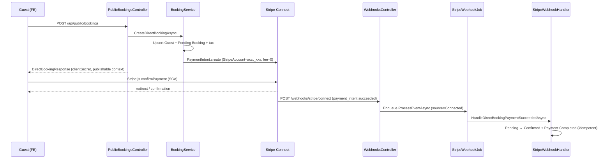

# Design — Issue #226 Direct Checkout (Stripe Connect, Operator = Merchant of Record)

> **Stage 02 — Design** · Spec: `Sessions/specs/spec-direct-checkout.md` (US-002) · Phase 1 (MVP Sellable — direct booking)
> **Architecture**: AD-5 (operator = merchant of record, CasaZen never holds guest funds), RF2 (platform vs connected-account webhook routing), C3 (charge-gating via `ConnectChargesEnabled`)
> **Stack**: .NET 10 · EF Core · PostgreSQL (Supabase) · Stripe Connect Express · layered `Casazen.Core` / `Casazen.Infrastructure` / `Casazen.Web` · React 19 SPA (`casazen/frontend`)
> **Specialist synthesis**: `api-designer` (API Contract + Migration Plan) · `frontend-designer` (Frontend Flow + ProtectedRoute) · `security-by-design` (Security Notes + GDPR Scope).

Anonymous guests book and pay on the branded public surface (`/book/:orgSlug/...`). Funds settle to the operator's Stripe **connected account** via a direct-charge `PaymentIntent` (`application_fee_amount = 0`). CasaZen confirms the booking asynchronously on connected-account `payment_intent.succeeded` (RF2). Tourist tax is computed server-side from `TouristTaxRate`; Alloggiati Web remains on operator check-in only (`BookingsController.CheckIn` → `AlloggiatiWebReportJob`).

**Grounding note (verified against source):** Public read-model lives in `PublicOrgController` (`GET /api/public/orgs/{slug}/properties/{propertyId}` → `PropertyService.GetPublicPropertyForOrgAsync`, `IsActive` filter in `PropertyRepository.GetSearchQueryable`). Connect onboarding (#224) populated `Org.StripeConnectedAccountId` + `ConnectChargesEnabled` via `ConnectOnboardingService` / `POST /webhooks/stripe/connect`. Current `StripeService.CreatePaymentIntentAsync` creates PI on the **platform** account only — #226 adds a connected-account overload. `StripeWebhookHandler.HandlePaymentSucceededAsync` today only **updates** an existing `Payment` row by `TransactionId`; it does not confirm bookings — #226 extends this for `metadata.kind = "direct-booking"` on the Connect route. Frontend checkout shell is `CheckoutPlaceholderPage` at `/book/:orgSlug/property/:propertyId/checkout` (to be replaced). `axios.ts` already skips auth for `/public/orgs` — extend for `/public/bookings`.

**Branch for Stage 03:** `feature/226-direct-checkout`

---

## API Contract

**Conventions** — JSON camelCase; amounts in API responses are **decimal EUR** for display; Stripe `PaymentIntent.Amount` is **integer cents** (server converts). `propertyId`, dates, and guest fields come from the client; **prices, org id, connected account id, and publishable key context are server-derived**. No JWT on public booking endpoints.

### A. Public direct booking endpoint (AC1–AC3, AC6, AC8, AC9)

| # | Method | Path | Request schema | Response schema | Auth requirement (decision) |
|---|---|---|---|---|---|
| 1 | `POST` | `/api/public/bookings` | `CreateDirectBookingRequest` — see below | `200 DirectBookingResponse` — see below | **`[AllowAnonymous]` — explicit public justification:** anonymous guest checkout on branded booking site; abuse mitigated by per-IP rate limit (AC9) and server-side validation. No `OrgId` / `ownerId` accepted from client. |

#### `CreateDirectBookingRequest` (#1 request)

```json
{
  "propertyId": "3fa85f64-5717-4562-b3fc-2c963f66afa6",
  "checkInDate": "2026-07-01",
  "checkOutDate": "2026-07-05",
  "numberOfAdults": 2,
  "numberOfChildren": 0,
  "guest": {
    "firstName": "Mario",
    "lastName": "Rossi",
    "email": "mario.rossi@example.com",
    "phone": "+393331234567",
    "country": "IT"
  },
  "consent": {
    "dataProcessing": true,
    "consentVersion": "2026-06-direct-checkout-v1"
  },
  "specialRequests": "Arrivo tardivo"
}
```

| Field | Type | Validation |
|---|---|---|
| `propertyId` | `Guid` | Required; property must exist and `IsActive == true` |
| `checkInDate` / `checkOutDate` | `date` (ISO) | Required; normalized to UTC date; `checkOut > checkIn` |
| `numberOfAdults` | `int` | Required; `>= 1` |
| `numberOfChildren` | `int` | Required; `>= 0`; `numberOfAdults + numberOfChildren <= property.MaxGuests` |
| `guest.firstName` / `lastName` | `string` | Required, max 100 |
| `guest.email` | `string` | Required, valid email |
| `guest.phone` | `string` | Optional, max 20 |
| `guest.country` | `string` | Required, max 100 |
| `consent.dataProcessing` | `bool` | Must be `true` |
| `consent.consentVersion` | `string` | Required; must match server-allowed version constant |
| `specialRequests` | `string?` | Optional, max 1000 |

#### `DirectBookingResponse` (#1 response — AC3, AC8)

```json
{
  "bookingId": "7c9e6679-7425-40de-944b-e07fc1f90ae7",
  "clientSecret": "pi_xxx_secret_xxx",
  "connectedAccountPublishableContext": {
    "publishableKey": "pk_test_...",
    "stripeAccountId": "acct_xxx"
  },
  "amount": 520.00,
  "currency": "EUR",
  "touristTaxAmount": 8.00,
  "basePrice": 512.00
}
```

| Field | Type | Source |
|---|---|---|
| `bookingId` | `Guid` | New `Booking.Id` (`Status = Pending`, `Source = Direct`) |
| `clientSecret` | `string` | Stripe `PaymentIntent.ClientSecret` on connected account |
| `connectedAccountPublishableContext.publishableKey` | `string` | `IConfiguration["Stripe:PublishableKey"]` (platform publishable key — used with `stripeAccount` option) |
| `connectedAccountPublishableContext.stripeAccountId` | `string` | `Org.StripeConnectedAccountId` (non-secret connected account id for Stripe.js) |
| `amount` | `decimal` | `TotalPrice` (= charged PI amount in EUR) |
| `currency` | `string` | Property/public read-model currency (default `"EUR"`) |
| `touristTaxAmount` | `decimal` | Server-computed tourist tax (AC6) |
| `basePrice` | `decimal` | `nightlyRate × nights + cleaningFee` (display-only breakdown; optional but recommended for AC13 FE) |

**Explicitly omitted from response (AC8):** `ownerId`, `OrgId`, Stripe secret key, other guests' data, operator PII.

#### Error responses (#1)

| HTTP | Condition | Body (example) |
|---|---|---|
| `400` | Validation failure, missing consent, invalid dates, too many guests | `{ "error": "...", "message": "..." }` |
| `404` | Property not found or `IsActive == false` | Empty / `{ "error": "Property not found" }` (anti-enumeration — same for inactive) |
| `409` | Dates unavailable (`IBookingService.IsPropertyAvailableAsync` false) | `{ "error": "Property not available for selected dates" }` |
| `409` | Operator not payment-ready: missing `StripeConnectedAccountId` or `ConnectChargesEnabled == false` (#224 AC5 gate) | `{ "error": "Complete Stripe onboarding before accepting guest payments" }` |
| `429` | Per-IP rate limit exceeded (AC9) | `{ "error": "Too many requests" }` + `Retry-After` header |
| `500` | Stripe PI creation failure | Generic error (no Stripe secret leakage) |

#### Server-side processing sequence (#1 — AC2, AC3)

1. **Resolve property** — `IPropertyRepository.GetByIdAsync(propertyId)` (existing filter: `IsActive`); load `Org` via `property.OrgId`. `404` if null.
2. **Charge gate** — `Org.StripeConnectedAccountId` not null **and** `Org.ConnectChargesEnabled == true`; else `409`.
3. **Availability** — `IBookingService.IsPropertyAvailableAsync` with **Pending TTL filter** (AC9): treat `Pending` + `Source = Direct` bookings older than `DirectBooking:PendingTtlMinutes` (default **15**) as non-blocking; optionally cancel them in the same transaction. `409` if still conflicting.
4. **Guest upsert** — match `Guest` by email (`IGuestService.GetGuestByEmailAsync`); create or update with consent fields + request IP (`HttpContext.Connection.RemoteIpAddress`).
5. **Amounts (server-only, AC2, AC6)** — `nights = (checkOut - checkIn).Days`; `basePrice = property.NightlyRate * nights + property.CleaningFee`; `touristTaxAmount = ITouristTaxService.CalculateTouristTaxAsync(property.City, numberOfAdults, numberOfChildren, checkIn, checkOut)` (uses `TouristTaxRate.RatePerPersonPerNight`, `MaxNights`, adults-only taxation per `TouristTaxService`); `totalPrice = basePrice + touristTaxAmount`. Set `Booking.NumberOfAdults`, `NumberOfChildren`, `NumberOfGuests`, `TouristTaxAmount`, `TouristTax` (mirror for existing reports), `OrgId`.
6. **Persist booking** — `Status = Pending`, `Source = Direct` via new `IBookingService.CreateDirectBookingAsync`.
7. **PaymentIntent (connected account, AC3)** — `IStripeService.CreateConnectedAccountPaymentIntentAsync(connectedAccountId, amountCents, currency, metadata)`:
   - `RequestOptions.StripeAccount = Org.StripeConnectedAccountId`
   - `ApplicationFeeAmount = 0` (no CasaZen fee; operator = MoR)
   - `AutomaticPaymentMethods.Enabled = true` (PSD2/SCA)
   - `Metadata`: `{ bookingId, propertyId, orgId, kind: "direct-booking" }`
8. **Payment row (optional traceability)** — insert `Payment` with `Status = Pending`, `StripePaymentIntentId`, `TransactionId = paymentIntent.Id`, `Amount = totalPrice`, `OrgId`, `BookingId`.
9. **Return** `DirectBookingResponse`.

**Rate limiting (AC9):** Register ASP.NET Core fixed-window limiter policy `PublicBookingCreate` in `Program.cs` / `ServiceCollectionExtensions` — e.g. **10 requests / minute / IP** on `PublicBookingsController` via `[EnableRateLimiting("PublicBookingCreate")]`. Distinct from OTA `OtaRateLimiter` singleton.

### B. Connect webhook endpoint — extended event handling (AC4–AC5, RF2)

| # | Method | Path | Request schema | Response schema | Auth requirement (decision) |
|---|---|---|---|---|---|
| 2 | `POST` | `/webhooks/stripe/connect` | Raw Stripe event JSON; header `Stripe-Signature` required; connected-account events include non-null `event.Account` / `Stripe-Account` context | `200` empty body (ack ≤3s). `400` invalid signature. `500` if `Stripe:ConnectWebhookSecret` missing. | **`[AllowAnonymous]` — explicit public justification:** inbound Stripe Connect webhook; HMAC via `EventUtility.ConstructEvent` + `Stripe:ConnectWebhookSecret`. Already implemented in `WebhooksController.StripeConnectWebhook` (#224); **#226 extends handled event types only.** |

**Ingress separation (RF2) — unchanged from #224, now includes payment events:**

| Route | Secret | Events handled after #226 |
|---|---|---|
| `POST /webhooks/stripe` | `Stripe:WebhookSecret` | Platform billing only (`customer.subscription.*`, `invoice.*` — `spec-saas-billing`). **Must not** confirm direct bookings. |
| `POST /webhooks/stripe/connect` | `Stripe:ConnectWebhookSecret` | `account.updated` (#224); **`payment_intent.succeeded`**, **`payment_intent.payment_failed`**, **`payment_intent.canceled`** (#226 direct checkout) |

**Stripe Dashboard action:** Add `payment_intent.succeeded`, `payment_intent.payment_failed`, `payment_intent.canceled` to the Connect webhook endpoint (same URL `{API_BASE}/webhooks/stripe/connect`).

#### Handled Connect events (#226)

| Event type | Handler | Side effect | Idempotency |
|---|---|---|---|
| `payment_intent.succeeded` | `StripeWebhookHandler.HandleDirectBookingPaymentSucceededAsync` | Read `metadata.kind == "direct-booking"` + `bookingId`; load `Booking`; if already `Confirmed`, no-op; else `Pending → Confirmed`; upsert `Payment` (`StripePaymentIntentId`, `Status = Completed`, `ProcessedAt = UtcNow`) | By `PaymentIntent.Id` via `IPaymentRepository.GetByTransactionIdAsync` |
| `payment_intent.payment_failed` | `StripeWebhookHandler.HandleDirectBookingPaymentFailedAsync` | Record/update `Payment` `Status = Failed`; booking stays `Pending` (or `Cancelled` if past Pending TTL — see AC5) | Same PI id |
| `payment_intent.canceled` | Same as failed | Same | Same PI id |
| `account.updated` | Existing `HandleAccountUpdatedAsync` → `ConnectOnboardingService.ApplyAccountUpdatedAsync` | Unchanged (#224) | Last-write-wins on org flags |

**Processing model:** `WebhooksController.StripeConnectWebhook` verifies signature → enqueues `StripeWebhookJob.ProcessEventAsync(eventId, eventType, json, WebhookSource.Connected)` (add `source` discriminator parameter). Handler **ignores** `payment_intent.*` where `metadata.kind != "direct-booking"` (log + no-op). Platform route passes `WebhookSource.Platform`; handler skips direct-booking branches on platform source.

**Alloggiati (AC7):** No webhook side effects for police reporting. Confirmed direct bookings follow existing `POST /api/bookings/{id}/check-in` → `BackgroundJob.Enqueue<AlloggiatiWebReportJob>` in `BookingsController` (operator-authenticated, unchanged).

### C. Existing public read endpoints (consumer — no contract change)

| # | Method | Path | Used by checkout for |
|---|---|---|---|
| 3 | `GET` | `/api/public/orgs/{slug}` | Org branding shell (`PublicOrgController`) |
| 4 | `GET` | `/api/public/orgs/{slug}/properties/{propertyId}` | Property detail + rates (`PublicPropertyDetailDto`) for price preview (AC13) |

Both remain **`[AllowAnonymous]`** per #212.

### D. Service / layer map

| Layer | Type | Responsibility |
|---|---|---|
| `PublicBookingsController` | Web | `[AllowAnonymous] POST /api/public/bookings`; rate limit; IP capture for consent |
| `CreateDirectBookingRequest` / `DirectBookingResponse` | Web DTOs | Request/response contracts |
| `IBookingService.CreateDirectBookingAsync` | Application | Guest upsert orchestration, amount computation, availability + TTL, PI creation |
| `BookingService` | Infrastructure | Implementation; delegates tax to `ITouristTaxService`, Stripe to `IStripeService` |
| `IStripeService` | Infrastructure | New `CreateConnectedAccountPaymentIntentAsync(...)` overload on `StripeService` |
| `StripeWebhookHandler` | Infrastructure | Direct-booking payment event branches; booking confirmation |
| `StripeWebhookJob` | Web (Hangfire) | Async processing; optional `WebhookSource` enum |
| `WebhooksController` | Web | Existing Connect ingress (#224); pass `source` to job |
| `IBookingRepository.IsAvailableAsync` | Infrastructure | Extend query to exclude expired `Pending` direct holds (AC9) |
| `ExpirePendingDirectBookingsJob` (new, optional) | Web (Hangfire) | Recurring job marks expired `Pending`/`Direct` → `Cancelled` (AC5 cleanup) |

**Config keys:**

| Key | Purpose |
|---|---|
| `Stripe:SecretKey` | Platform API key — used with `StripeAccount` request option for connected PI create |
| `Stripe:PublishableKey` | Returned in `connectedAccountPublishableContext` for Stripe.js |
| `Stripe:ConnectWebhookSecret` | HMAC for `/webhooks/stripe/connect` |
| `Stripe:WebhookSecret` | Platform route only (unchanged) |
| `DirectBooking:PendingTtlMinutes` | Pending hold TTL (default `15`) |
| `DirectBooking:ConsentVersion` | Allowed `consent.consentVersion` value |
| `DirectBooking:RateLimitPermitLimit` | Default `10` per minute per IP |

---

## Frontend Flow

Repo `casazen/frontend` (React 19, feature-slice, TanStack Query, Auth0). Issue #226 replaces the checkout placeholder with a **two-step anonymous checkout** (guest + consent → Stripe Elements payment). All user-facing strings are **Italian**.

### Route changes & guard status

| Route | Status in #226 | Guard |
|---|---|---|
| `/book/:orgSlug` | Unchanged — `OrgLandingPage` | **Public** — no `<ProtectedRoute>` |
| `/book/:orgSlug/property/:propertyId` | Unchanged — `PublicPropertyPage` (date selection → navigates to checkout with query params) | **Public** |
| `/book/:orgSlug/property/:propertyId/checkout` | **Modify** — replace `CheckoutPlaceholderPage` with `CheckoutPage` (AC10–AC14) | **Public** — no `<ProtectedRoute>` |
| `/book/:orgSlug/property/:propertyId/checkout/confirmation` | **New** — `CheckoutConfirmationPage` (AC12 success state) | **Public** |
| `/app/short-rent/settings/payments` | Unchanged (#224) — operator Connect onboarding | **`<ProtectedRoute>`** + `ContextRouteGuard` (`property.write`) |

> **Gate G5:** All new/modified checkout routes under `/book/:orgSlug/...` are **public** (no `<ProtectedRoute>`). The only authenticated surface touched indirectly is operator check-in / Alloggiati (existing `BookingsController`, out of scope for guest FE).

### Component breakdown

| Component / file | Type | Responsibility |
|---|---|---|
| `src/features/public-booking/checkout-page.tsx` | create (replaces placeholder) | Step 1: guest form, GDPR consent, `PriceBreakdown`; Step 2: Stripe `Elements` + `PaymentElement`; calls `useCreateDirectBooking` then `confirmPayment` |
| `src/features/public-booking/checkout-confirmation-page.tsx` | create | Success screen with booking reference (`bookingId`), dates, amount (AC12) |
| `src/features/public-booking/components/price-breakdown.tsx` | create | Lines: nightly × nights, cleaning fee, **Tassa di soggiorno** (AC13) |
| `src/features/public-booking/components/consent-checkbox.tsx` | create | Mandatory GDPR gate — "Acconsento al trattamento dei dati" (AC13) |
| `src/features/public-booking/components/stripe-payment-form.tsx` | create | `@stripe/react-stripe-js` wrapper; `loadStripe(publishableKey, { stripeAccount })` from API response |
| `src/api/public-booking.api.ts` | create | `createDirectBooking(payload)` → `POST /api/public/bookings` |
| `src/queries/use-public-booking.ts` | create | `useCreateDirectBooking()` mutation (no auth header) |
| `src/types/booking.types.ts` | modify | `CreateDirectBookingRequest`, `DirectBookingResponse`, `ConnectedAccountPublishableContext` |
| `src/lib/axios.ts` | modify | Add `/public/bookings` to public endpoint skip list (AC11) |
| `src/routes/index.tsx` | modify | Swap `CheckoutPlaceholderPage` → `CheckoutPage`; add confirmation child route |
| `package.json` | modify | Add `@stripe/stripe-js`, `@stripe/react-stripe-js` (AC14) |

### Checkout UX flow (AC10–AC14)

```
Guest → PublicPropertyPage (select dates)
  → navigate /book/{slug}/property/{id}/checkout?checkIn=&checkOut=

CheckoutPage Step 1 — guest + consent
  → PriceBreakdown (client preview from PublicPropertyDetailDto; server amounts authoritative after submit)
  → ConsentCheckbox required
  → Submit disabled until consent checked

CheckoutPage Step 2 — payment
  → useCreateDirectBooking.mutateAsync(payload)
  → POST /api/public/bookings (no Authorization header)
  → initialize Stripe: loadStripe(response.connectedAccountPublishableContext.publishableKey,
                              { stripeAccount: response.connectedAccountPublishableContext.stripeAccountId })
  → Elements + PaymentElement with clientSecret
  → stripe.confirmPayment({ elements, confirmParams: { return_url: confirmationUrl } })
  → SCA/3DS handled by Stripe.js (AC12)

Success → /book/{slug}/property/{id}/checkout/confirmation?bookingId={id}
Failure → inline Italian error on payment step + retry (same bookingId / new PI policy: allow retry via re-submit or dedicated "Riprova pagamento" calling create again if PI expired)
```

**Operator not onboarded:** If API returns `409`, show destructive alert linking to operator-facing copy (guest-safe message: "Pagamenti non ancora disponibili per questa struttura") — mirrors #224 checkout-gate banner on operator settings, not guest actionable.

**Date params:** Read `checkIn` / `checkOut` from URL search params (set by `PublicPropertyPage` navigation); validate present before enabling submit.

### Data flow diagram



---

## Security Notes

### Threat model (STRIDE)

| Threat | Vector | Mitigation |
|---|---|---|
| **Price manipulation** | Guest tampers with amounts in request | Server computes all prices (AC2); client prices ignored; PI amount matches server `TotalPrice` |
| **Booking for unavailable dates** | Race / hold bypass | DB availability check; `Pending` direct holds block inventory until TTL (AC9) |
| **Pay before operator onboarded** | Guest checks out when Connect inactive | `ConnectChargesEnabled` + `StripeConnectedAccountId` gate → `409` (#224 AC5) |
| **Cross-tenant payment routing** | Attacker supplies another org's property | `OrgId` derived from `Property.OrgId`; connected account from property's org only |
| **PII exfiltration** | Public API returns internal ids | Response whitelist (AC8): no `ownerId`, org secrets, other guests |
| **Card data exposure** | PAN through CasaZen servers | Stripe Elements + `automatic_payment_methods`; PCI scope stays with Stripe (AC14) |
| **Webhook spoofing** | Fake `payment_intent.succeeded` | `Stripe:ConnectWebhookSecret` HMAC on `/webhooks/stripe/connect` only; wrong route rejects signature |
| **Webhook replay** | Duplicate event confirms twice | Idempotent by `PaymentIntent.Id` + skip if booking already `Confirmed` |
| **Abuse / scraping** | Mass booking creation | Per-IP rate limit on `POST /api/public/bookings` (AC9) |
| **Consent bypass** | Submit without GDPR consent | Server rejects `consent.dataProcessing != true` → `400` |
| **Secret leakage** | API returns Stripe secret key | Only `clientSecret` (intended for client) + publishable key; never `Stripe:SecretKey` |

### Webhook secrets (RF2)

| Route | Secret | Verification | #226 events |
|---|---|---|---|
| `/webhooks/stripe` | `Stripe:WebhookSecret` | Platform billing — **not** direct checkout | No booking confirmation |
| `/webhooks/stripe/connect` | `Stripe:ConnectWebhookSecret` | Connect account events | `payment_intent.*` (direct booking) + `account.updated` |

Connected-account events arrive with non-null `event.Account`. Handler must **require** `metadata.kind == "direct-booking"` before mutating bookings. Platform-account `payment_intent.succeeded` events must not confirm direct bookings even if metadata were tampered — ingress separation prevents verified delivery on wrong secret.

### PII / funds flow

| Data | Where collected | CasaZen storage | Notes |
|---|---|---|---|
| Guest name, email, phone, country | Public checkout form | `Guest` entity | Upsert by email; consent metadata |
| Card / payment method | Stripe.js only | **None** | Operator connected account is MoR |
| PaymentIntent id | Stripe API | `Payment.StripePaymentIntentId`, `TransactionId` | Non-secret reference |
| Consent IP | Server | `Guest.ConsentIpAddress` | From `HttpContext` |
| Operator payout / KYC | Stripe Connect (#224) | Account id + flags only on `Org` | Not guest checkout scope |

**Merchant of record:** Operator receives funds directly (`application_fee_amount = 0`); CasaZen never holds or settles guest funds (AD-5 / C3).

### Auth decisions summary

| Surface | Principal | Policy |
|---|---|---|
| `POST /api/public/bookings` | Anonymous guest | `[AllowAnonymous]` + rate limit + validation |
| `GET /api/public/orgs/*` | Anonymous | `[AllowAnonymous]` (existing) |
| `POST /webhooks/stripe/connect` | Stripe (HMAC) | `[AllowAnonymous]` + `Stripe:ConnectWebhookSecret` |
| `POST /api/bookings/{id}/check-in` | Operator JWT | Existing `PropertyOwner` + `booking.write` (Alloggiati enqueue) |

---

## Migration Plan

**N/A — no schema changes**

All required fields already exist:

| Entity | Existing fields used |
|---|---|
| `Booking` | `Source`, `Status`, `BasePrice`, `TouristTax` / `TouristTaxAmount`, `NumberOfAdults`, `NumberOfChildren`, `OrgId`, `CreatedAt` |
| `Guest` | Consent fields (`DataProcessingConsentDate`, `ConsentIpAddress`, `ConsentVersion`, `DataRetentionUntil`, …) |
| `Payment` | `StripePaymentIntentId`, `TransactionId`, `Status`, `ProcessedAt`, `OrgId` |
| `Org` | `StripeConnectedAccountId`, `ConnectChargesEnabled` (#224) |

**Behavioral / config-only changes:**

| Area | Change |
|---|---|
| `BookingRepository.IsAvailableAsync` | Exclude expired `Pending` + `Direct` holds (AC9) — query-only |
| `Program.cs` / `ServiceCollectionExtensions` | ASP.NET rate limiter policy `PublicBookingCreate` |
| `appsettings.json` | `DirectBooking:PendingTtlMinutes`, `DirectBooking:ConsentVersion`, rate limit tuning |
| Stripe Dashboard | Subscribe `payment_intent.*` on Connect webhook endpoint |
| Railway / env | Confirm `Stripe:PublishableKey`, `Stripe:ConnectWebhookSecret` set |

**Optional follow-up (non-blocking):** composite index on `Bookings (PropertyId, Status, Source, CreatedAt)` if availability queries regress under load — not required for MVP.

**Deploy sequence:**

1. Deploy backend with new controller + webhook handler branches (no EF migration).
2. Update Stripe Connect webhook event subscriptions.
3. Deploy frontend with Stripe.js dependencies + checkout pages.
4. Smoke: anonymous checkout on staging with Connect test account; verify `payment_intent.succeeded` confirms booking via Hangfire.

---

## GDPR Scope

**Regulatory driver:** Guest PII collected at anonymous checkout; lawful basis = **contract performance** (booking) + **consent** (GDPR Art. 6(1)(b)/(a)).

**Consent capture (AC2, AC13) — written to `Guest` on upsert:**

| Field | Value | Purpose |
|---|---|---|
| `DataProcessingConsentDate` | `DateTime.UtcNow` | Proof of consent timestamp |
| `ConsentIpAddress` | Client IP (max 50) | Audit trail |
| `ConsentVersion` | From request (validated against `DirectBooking:ConsentVersion`) | Versioned privacy notice |
| `DataRetentionUntil` | Default `UtcNow + 7 years` (existing entity default) | Retention policy |
| `ConsentDate` | Same as processing consent | Align with existing GDPR columns |
| `DataProcessingPurpose` | `"Direct Booking Checkout"` | Purpose limitation |

**PII collected at checkout:**

| Field | Personal data? | Storage |
|---|---|---|
| `FirstName`, `LastName` | Yes | `Guest` |
| `Email` | Yes | `Guest` (lookup key) |
| `PhoneNumber` | Yes | `Guest` |
| `Country` | Low sensitivity | `Guest` |

**Data minimization (AC8):** `DirectBookingResponse` exposes only booking id, payment client secret, publishable Stripe context, and amounts — never operator Auth0 `sub`, full guest records of other users, or Stripe secret keys.

**Special requests:** Optional free text stored on `Booking.SpecialRequests` — may contain personal preferences; covered by same consent.

**Alloggiati / police data:** **Not** collected at checkout (AC7). Additional guest document fields remain for operator check-in workflow / `AlloggiatiWebReportJob`.

**Data subject rights:** Guest erasure flows via existing `GdprService` / guest management (operator context). Direct checkout does not create Auth0 users.

**Cross-border:** Payment processing under Stripe DPA on operator connected account; CasaZen acts as processor for booking/guest data stored in Supabase EU.

---

## Open Questions

All resolved.

1. **`ITaxCalculationService` vs `ITouristTaxService` for adult/child split?**
   **Resolved:** Use `ITouristTaxService.CalculateTouristTaxAsync(city, numberOfAdults, numberOfChildren, ...)` — already implements DB-driven `TouristTaxRate` with adults-only taxation (AC6). `BookingsController` legacy path uses `ITaxCalculationService`; direct booking uses the tourist-tax service aligned with spec.

2. **Pending TTL duration?**
   **Resolved:** Config `DirectBooking:PendingTtlMinutes` default **15**. Availability query ignores expired pending direct holds; optional `ExpirePendingDirectBookingsJob` cancels stale rows.

3. **`connectedAccountPublishableContext` shape?**
   **Resolved:** `{ publishableKey, stripeAccountId }` — platform publishable key + connected account id for `loadStripe(key, { stripeAccount })` per Stripe Connect direct-charge docs.

4. **Create `Payment` row at booking time or only on webhook?**
   **Resolved:** Create `Pending` payment at PI creation; webhook sets `Completed` / `Failed` idempotently (simplifies failure tracking AC5).

5. **`StripeWebhookJob` source discriminator?**
   **Resolved:** Add `WebhookSource` enum (`Platform`, `Connected`) parameter; Connect route passes `Connected`. Handler processes direct-booking payment branches only when `source == Connected` **and** `metadata.kind == "direct-booking"`.

6. **Replace placeholder vs new route?**
   **Resolved:** Replace `CheckoutPlaceholderPage` in-place at existing `/checkout` route; add `/checkout/confirmation` child route for AC12 success UX.

7. **Tourist tax FE preview before API call?**
   **Resolved:** Step 1 shows **estimated** breakdown from `PublicPropertyDetailDto` rates; authoritative `touristTaxAmount` returned only in `DirectBookingResponse` after server calculation (display updated before payment step).
