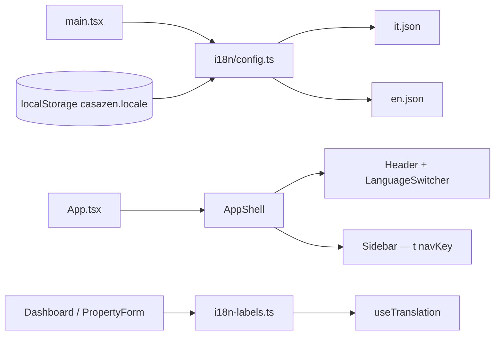

# Design Spec — Issue #251
# feat(i18n): restore UI labels and add EN/IT language support

**Stage**: 02 Design  
**Date**: 2026-06-10  
**Issue**: https://github.com/casazen/backend/issues/251  
**Branch target (Stage 03)**: `feature/251-i18n-en-it` in `casazen/frontend` (backend N/A)  
**Status**: COMPLETE — all gates passed

---

## Scope

Frontend-only internationalization. Restores broken UI labels (dashboard status badges showing slug keys) and introduces **Italian (default)** + **English** via `react-i18next`. No backend API, EF Core, or Auth0 changes.

### Regression root cause

`dashboard-page.tsx` `STATUS_LABELS` maps to English slugs (`confirmed`, `pending`) after removal of `@/lib/i18n-labels` imports during CIN pipeline TS fixes. OTA connection labels on the same page may show raw keys.

---

## API Contract

### Summary

| Change type | Count |
|---|---|
| New endpoints | 0 |
| Modified endpoints | 0 |
| Deprecated endpoints | 0 |

**No API changes for this issue.**

### Endpoints consumed (unchanged — reference only)

| Method / Path | Auth | Change in #251 | Frontend usage |
|---|---|---|---|
| `GET /api/bookings` | `[Authorize]` | N/A | Dashboard recent bookings |
| `GET /api/properties` | `[Authorize]` | N/A | Dashboard KPI |
| `GET /api/payments` | `[Authorize]` | N/A | Dashboard revenue KPI |
| `GET /api/ota/integrations` | `[Authorize]` | N/A | Dashboard OTA status card |

All endpoints retain existing `[Authorize]` — no public endpoints added.

---

## Frontend Flow

### i18n architecture



### New files

| File | Action | Purpose |
|---|---|---|
| `src/i18n/config.ts` | CREATE | `i18next` init, `it` default, `en` fallback, `localStorage` persistence key `casazen.locale` |
| `src/i18n/locales/it.json` | CREATE | Italian strings (nav, dashboard, booking/OTA status, property form) |
| `src/i18n/locales/en.json` | CREATE | English strings (same keys) |
| `src/lib/i18n-labels.ts` | CREATE | `getBookingStatusLabel(status, t)`, `getOtaConnectionStatusLabel(status, t)` |
| `src/components/layout/language-switcher.tsx` | CREATE | IT / EN toggle buttons, `aria-label` per locale |
| `src/i18n/i18n.test.ts` | CREATE | Vitest: locale persistence + label helpers |
| `e2e/i18n-language-switch.spec.ts` | CREATE | AC1–AC3 E2E in demo mode |

### Modified files

| File | Change |
|---|---|
| `package.json` | Add `i18next`, `react-i18next` |
| `src/main.tsx` | Import `./i18n/config` before render |
| `src/components/layout/header.tsx` | Render `<LanguageSwitcher />` before `<OrgBadge />` |
| `src/components/layout/sidebar.tsx` | Use `entry.navKey` + `t(entry.navKey)` instead of raw `navLabel` |
| `src/config/route-manifest.ts` | Add `navKey` for each nav item (e.g. `nav.dashboard`, `nav.properties`) |
| `src/features/dashboard/dashboard-page.tsx` | Replace `STATUS_LABELS` slugs with `getBookingStatusLabel` / `getOtaConnectionStatusLabel`; i18n page title and KPI labels |
| `src/features/properties/components/property-form.tsx` | Replace hardcoded field labels with `t('property.form.*')` |
| `src/features/bookings/schemas/booking.schema.ts` | Keep variant map; expose label via i18n helper (do not duplicate label strings) |

### Route / auth plan

No new routes. All existing authenticated routes remain wrapped in `<ProtectedRoute>` via router config — unchanged.

| Surface | ProtectedRoute | Change |
|---|---|---|
| `/app/short-rent` (dashboard) | Yes (existing) | i18n strings only |
| Property create/edit | Yes (existing) | i18n form labels |

### Language switcher UX

- Placement: app header, right cluster before org badge
- Control: two-segment toggle `IT | EN` (or dropdown on mobile)
- Default: `it`
- Persistence: `localStorage.setItem('casazen.locale', 'it'|'en')` on change; read on init
- Switching language re-renders all `useTranslation()` consumers without navigation

### Translation key namespaces (slice)

```
nav.*           — sidebar labels
dashboard.*     — page title, KPI cards, table headers, empty states
booking.status.* — Pending, Confirmed, CheckedIn, CheckedOut, Cancelled
ota.status.*    — connected, warning, disconnected
property.form.* — form field labels
common.*        — shared actions (optional)
```

### AC → test mapping

| AC | Test |
|---|---|
| AC1 | E2E asserts badge text ≠ slug; Vitest label helpers |
| AC2 | E2E toggles language, reload, asserts persistence |
| AC3 | E2E default IT, switch EN, assert English dashboard title |
| AC4 | Manual + E2E cover dashboard + nav + property form |
| AC5 | Full `npm run test:e2e` + new spec |
| AC6 | `src/i18n/i18n.test.ts` ≥ 2 tests |

---

## Security Notes

| Concern | Assessment |
|---|---|
| Auth gates | No new endpoints; existing JWT interceptor unchanged |
| OTA keys | Not affected — no config changes |
| PII in i18n | Translation files contain **no** guest names, emails, or booking IDs |
| localStorage | Stores only locale code (`it`/`en`) — not a secret, not PII |
| XSS via translations | Static JSON bundled at build time; no runtime user-supplied translations |
| Threat summary | Low risk — presentation-layer only |

---

## Migration Plan

**N/A — no schema changes.** Frontend dependency add only (`i18next`, `react-i18next`).

---

## GDPR Scope

**N/A** — no Guest entity fields read, written, or displayed differently. i18n affects UI chrome and status label strings only; guest PII rendering unchanged.

---

## Open Questions

(none — all resolved)

| # | Question | Resolution |
|---|---|---|
| 1 | Full-app i18n vs slice? | **Slice**: dashboard, shell nav, property form, status helpers — defer leases/billing/alloggiati to follow-up issues |
| 2 | Default locale? | **Italian (`it`)** per product policy |
| 3 | Backend `Accept-Language`? | **Out of scope** — client-side only for this issue |
