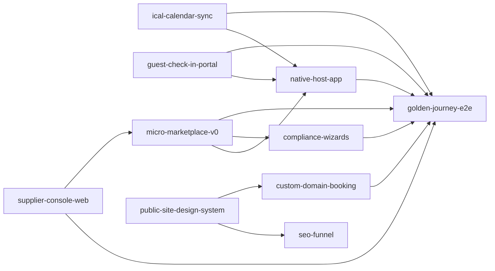

# Spec registry

Canonical index for all CasaZen specs. **Strategic order, phases, and freeze list** live in [`../PLANNING.md`](../PLANNING.md) (native app + premium sites + custom domain, 2026-06-19).

## Conventions

| Layer | Role | When it changes |
|---|---|---|
| **`Sessions/PLANNING.md`** | Vision, phases, priorities, next steps | Any reprioritization or phase shift |
| **`Sessions/specs/spec-*.md`** | Acceptance criteria + technical detail | When scope/AC changes |
| **GitHub issue** | Execution ticket (SDLC Stage 01+) | When work is ready to build |
| **`Sessions/pipeline-*/state.md`** | Pipeline run state (ephemeral) | During SDLC runs only |

New specs: copy [`_TEMPLATE.md`](./_TEMPLATE.md), fill YAML frontmatter, add a row below.

### Status values

| Status | Meaning |
|---|---|
| `idea` | On roadmap, no spec file yet |
| `specced` | Spec written, no GH issue |
| `planned` | GH issue open, not in dev |
| `in-dev` | Stage 03 active |
| `shipped` | In production |
| `blocked` | Escalated / external dependency |
| `deferred` | Explicitly parked |
| `frozen` | Do not start until PLANNING.md unfreezes |

### Phase mapping (current plan)

| Phase | Focus |
|---|---|
| 0 | Align + design brief siti + spike Expo + ADR custom domain |
| 1 | MVP: **native host app** + **siti host premium** + subdomain/custom domain + micro-marketplace |
| 2 | Ecosystem: supplier public site + **native supplier app** + billing |
| 3 | Expansion — paid marketplace, scale SEO |

### Spec dependency graph (MVP)

**Build order (Stage 02):** `supplier-console-web` → `micro-marketplace-v0` → `ical-calendar-sync` + `compliance-wizards` + `guest-check-in-portal` (parallel) → `public-site-design-system` → `custom-domain-booking` → `native-host-app` → `seo-funnel` → `golden-journey-e2e` (harness last).

### New specs (2026-06-19 council) — all specced

| Slug | Title | Status | File |
|---|---|---|---|
| `golden-journey-e2e` | GJ 12-step web + Maestro + supplier mobile | specced | `spec-golden-journey-e2e.md` |
| `ical-calendar-sync` | iCal import/export OTA bridge | specced | `spec-ical-calendar-sync.md` |
| `compliance-wizards` | Property, check-out wizards + cockpit | specced | `spec-compliance-wizards.md` |
| `guest-check-in-portal` | Guest link + Alloggiati auto | specced | `spec-guest-check-in-portal.md` |
| `supplier-console-web` | Console fornitore + activation wizard | specced | `spec-supplier-console-web.md` |
| `micro-marketplace-v0` | ServiceRequest + payment tracking | specced | `spec-micro-marketplace-v0.md` |
| `public-site-design-system` | Marketing public shell | specced | `spec-public-site-design-system.md` |
| `custom-domain-booking` | Subdomain + custom CNAME | specced | `spec-custom-domain-booking.md` |
| `native-host-app` | Expo host complement | specced | `spec-native-host-app.md` |
| `seo-funnel` | SEO comune → CTA | specced | `spec-seo-funnel.md` |
| `supplier-public-site` | Supplier vetrina (Fase 2) | specced | `spec-supplier-public-site.md` |
| `native-supplier-app` | Expo supplier (Fase 2) | specced | `spec-native-supplier-app.md` |

**Deprecated:** `pwa-host-shell` → replaced by `native-host-app`.

### GitHub epics (MVP 2026-06-19)

| Phase | Epic | Pre-requisites |
|---|---|---|
| Pre-F0 | [#282](https://github.com/casazen/backend/issues/282)–[#285](https://github.com/casazen/backend/issues/285) blocking fixes | Before GJ audit |
| Fase 0 | [#286](https://github.com/casazen/backend/issues/286) | Spikes #287–#290 |
| Fase 1 | [#291](https://github.com/casazen/backend/issues/291) | Features #292–#301, #271, #230 |
| Fase 2 | [#302](https://github.com/casazen/backend/issues/302) | #303–#304 |

Issue bodies: `Sessions/gh-issues/`

---

## Registry

### Phase 1 — MVP host (ecosystem minimo)

| ID | Slug | Title | Priority | Status | Issue | Notes |
|---|---|---|---|---|---|---|
| US-001 | `public-booking-readmodel` | Public booking read-model | P0 | shipped | [#212](https://github.com/casazen/backend/issues/212) | Anonymous DTO, no OwnerId leak |
| — | `connect-onboarding` | Stripe Connect onboarding (enabler) | P0 | shipped | [#224](https://github.com/casazen/backend/issues/224) | Unblocks checkout + LTR rent |
| US-002 | `direct-checkout` | Direct checkout (Connect, operator MoR) | P0 | shipped | [#226](https://github.com/casazen/backend/issues/226) | v1.1.11 |
| US-003 | `branded-booking-site` | Branded public booking site | P0 | shipped → **redesign** | [#215](https://github.com/casazen/backend/issues/215) | API ok; UI → design system |
| US-023 | `public-site-design-system` | Marketing-grade site templates | **P0** | planned | [#297](https://github.com/casazen/backend/issues/297) | Holidu-quality UX |
| US-024 | `custom-domain-booking` | Subdomain `*.casazen.it` + custom CNAME | **P0** | planned | [#298](https://github.com/casazen/backend/issues/298) | Holidu domain model |
| US-025 | `native-host-app` | Expo app — subset on-the-go (web = completa) | **P0** | planned | [#299](https://github.com/casazen/backend/issues/299) | Complemento web |
| US-022 | `supplier-console-web` | Console fornitore web — inbox, incarichi | **P0** | planned | [#292](https://github.com/casazen/backend/issues/292) | GJ step 1–2, 8–9 |
| US-019 | `compliance-wizards` | Wizard property, check-out + cockpit | **P0** | planned | [#295](https://github.com/casazen/backend/issues/295) | Guest portal separato |
| US-020 | `guest-check-in-portal` | Portale ospite self-service check-in | **P0** | planned | [#296](https://github.com/casazen/backend/issues/296) | GJ step 6 |
| GJ-001 | `golden-journey-e2e` | GJ 12-step web + Maestro + fornitore mobile | **P0** | planned | [#301](https://github.com/casazen/backend/issues/301) | Exit criterion MVP |
| US-018 | `ical-calendar-sync` | iCal import/export OTA calendar | **P0** | planned | [#294](https://github.com/casazen/backend/issues/294) | GJ step 5 |
| US-021 | `micro-marketplace-v0` | Service request + payment tracking | **P0** | planned | [#293](https://github.com/casazen/backend/issues/293) | GJ step 7–10 |
| US-026 | `seo-funnel` | SEO pages → signup CTA | **P0** | planned | [#300](https://github.com/casazen/backend/issues/300) | Builds on #258 |
| US-004 | `tenant-boundary` | Org + OrgId + plan entitlement | P0 | shipped | [#202](https://github.com/casazen/backend/issues/202) | v1.1.6 |
| — | `role-onboarding` | Role choice (STR/LTR/both) | P0 | shipped | [#198](https://github.com/casazen/backend/issues/198) | Pre-requisite PLG |
| US-005 | `saas-billing` | SaaS subscription billing | P1 | planned | [#230](https://github.com/casazen/backend/issues/230) | Reopened F1; freemium + Pro gate |
| US-006 | `onboarding-plg` | Self-serve onboarding + activation | **P0** | in-dev | [#271](https://github.com/casazen/backend/issues/271) | F0/F1 epic #286 #291 |

### Phase 1.5 — LTR (**frozen** — see PLANNING.md)

| ID | Slug | Title | Priority | Status | Issue | Notes |
|---|---|---|---|---|---|---|
| US-007 | `ltr-recurring-rent` | Recurring rent ledger + job | — | **frozen** | [#269](https://github.com/casazen/backend/issues/269) | Closed — do not resume |
| US-008 | `ltr-frontend` | LTR UI over LeasesController | — | **frozen** | — | |
| US-009 | `ltr-verification` | LTR E2E verification | — | **frozen** | — | |
| US-010 | `ltr-rli-registration` | RLI assisted / operator-attended | — | **frozen** | — | |

### Phase 2 — Ecosistema minimo (post-MVP)

| ID | Slug | Title | Priority | Status | Issue |
|---|---|---|---|---|---|
| US-027 | `supplier-public-site` | Supplier marketing vetrina | P1 | planned | [#303](https://github.com/casazen/backend/issues/303) | Fase 2 epic #302 |
| US-028 | `native-supplier-app` | Expo supplier app | P1 | planned | [#304](https://github.com/casazen/backend/issues/304) | Fase 2 |
| — | `supplier-directory` | Public supplier directory per comune | P1 | idea | — |
| US-011 | `unified-inbox` | Unified inbox (OTA + direct) | — | **frozen** | — |
| US-012 | `ai-copilot-messaging` | AI messaging copilot | — | **frozen** | — |
| US-013 | `org-seats-collaboration` | Org seats + team RBAC | P2 | specced | — |

### Phase 3 — Espansione (**frozen** items marked)

| ID | Slug | Title | Priority | Status | Issue |
|---|---|---|---|---|---|
| US-014 | `supplier-marketplace` | Supplier marketplace + take-rate (full) | P2 | **frozen** | — |
| US-015 | `google-vacation-rentals` | Google Vacation Rentals | — | **frozen** | — |

### Phase 4 — Scale + EU (**frozen**)

| ID | Slug | Title | Priority | Status | Issue |
|---|---|---|---|---|---|
| US-016 | `enterprise-scale` | Multi-brand, SSO, SLA, portfolio AI | — | **frozen** | — |
| US-017 | `eu-compliance-es-fr` | ES/FR compliance modules | — | **frozen** | — |

### Shipped / ancillary (pre-roadmap or cross-cutting)

| Slug | Title | Status | Issue |
|---|---|---|---|
| `admin-backend` | Admin panel API | shipped | [#11](https://github.com/casazen/backend/issues/11) |
| `property-detail` | Property detail page | shipped | [#152](https://github.com/casazen/backend/issues/152) |
| `pricing-adapter-verification` | Pricing adapter tests + smoke | shipped | — |
| `production-e2e-flow-verification` | Prod E2E smoke (Chrome) | ops | — |
| `split-layer` | STR/LTR context split (legacy) | shipped | — |

### Compliance backlog (normativa IT — non legato a una fase prodotto)

Tracked as GH issues from gap analysis; may spawn specs when scoped.

| Topic | Issue | Priority | Overlap |
|---|---|---|---|
| Regime fiscale / cedolare 2026 | [#3](https://github.com/casazen/backend/issues/3) | high | Parziale in LTR (`FiscalRegime`) |
| Imposta di soggiorno | [#4](https://github.com/casazen/backend/issues/4) | medium | `TouristTaxRate` esiste, calcolo manca |
| GDPR consent management | [#5](https://github.com/casazen/backend/issues/5) | medium | Coperto da US-006 in parte |
| ISTAT reportistica | [#6](https://github.com/casazen/backend/issues/6) | medium | — |
| Sicurezza strutturale | [#7](https://github.com/casazen/backend/issues/7) | low | — |
| Normativa regionale | [#8](https://github.com/casazen/backend/issues/8) | low | — |
| GDPR Party PII on expired leases | [#179](https://github.com/casazen/backend/issues/179) | high | — |

### Maintenance / tech debt (open GH issues)

| Topic | Issue | Priority |
|---|---|---|
| Billing: gate plan upgrade behind subscription | [#274](https://github.com/casazen/backend/issues/274) | P0 (security) |
| Billing: X-Forwarded-For hardening | [#273](https://github.com/casazen/backend/issues/273) | P0 (security) |
| OTA bookings endpoint | [#31](https://github.com/casazen/backend/issues/31) | **closed** — use #294 iCal |
| OTA availability endpoint | [#32](https://github.com/casazen/backend/issues/32) | **closed** — use #294 iCal |
| OTA adapter resilience tests | [#35](https://github.com/casazen/backend/issues/35) | **closed** — frozen |
| OTA setup documentation | [#34](https://github.com/casazen/backend/issues/34) | **closed** — frozen |
| RFC 7807 problem details | [#15](https://github.com/casazen/backend/issues/15) | P2 |
| Health checks DB + externals | [#16](https://github.com/casazen/backend/issues/16) | P2 |
| Auto-refund on cancellation | [#51](https://github.com/casazen/backend/issues/51) | P2 |
| Booking confirmation emails | [#58](https://github.com/casazen/backend/issues/58) | P2 |
