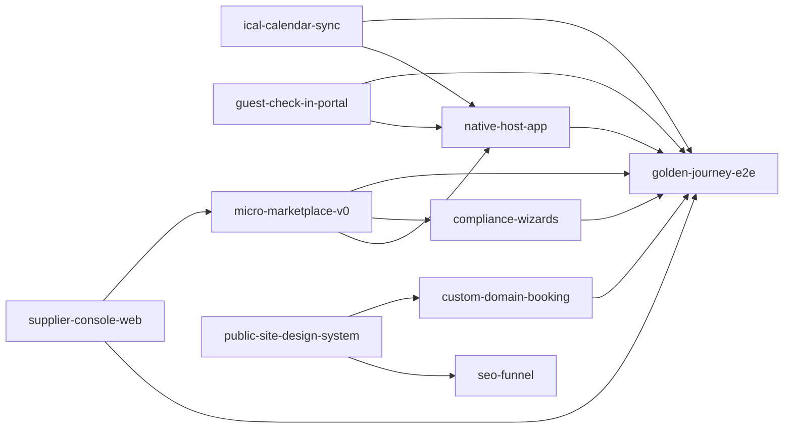

# Spec registry

Canonical index for all CasaZen specs. **Realigned to the real state on 2026-10-02 (task FN-05)**: the earlier "shipped" values came from closed GitHub issues (PR #400), not from verification (audit A9 §5, finding A7-30). Each row keeps the old value in "Registry before" and gives the verified state in "Real state"; evidence is a task ID with its commit (`be@` backend, `fe@` frontend, `mo@` mobile), a runbook or a test class. Per-task detail: [`../PIANO-RISANAMENTO-2026-09.md`](../PIANO-RISANAMENTO-2026-09.md) section 9 and [`../risanamento/RIEPILOGO-FINALE.md`](../risanamento/RIEPILOGO-FINALE.md). **Strategic order, phases, and freeze list** live in [`../PLANNING.md`](../PLANNING.md) (native app + premium sites + custom domain, 2026-06-19).

## Conventions

| Layer | Role | When it changes |
|---|---|---|
| **`Sessions/PLANNING.md`** | Vision, phases, priorities, next steps | Any reprioritization or phase shift |
| **`Sessions/specs/spec-*.md`** | Acceptance criteria + technical detail | When scope/AC changes |
| **GitHub issue** | Execution ticket | When work is ready to build |

New specs: copy [`_TEMPLATE.md`](./_TEMPLATE.md), fill YAML frontmatter, add a row below.

**Required sections in `_TEMPLATE.md`:**
- `## Verifiable Outcomes` — every ACn has an observable pass/fail
- `## UX / UI Quality` — when Frontend ACs exist
- `## Export / Report Criteria` — when CSV/PDF/Excel/export ACs exist

### Status values

| Status | Meaning |
|---|---|
| `idea` | On roadmap, no spec file yet |
| `specced` | Spec written, no GH issue |
| `planned` | GH issue open, not in dev |
| `in-dev` | Implementation in progress |
| `shipped` | Code **and** tests exist on the integration branch (merged to `develop` or awaiting its PR), and the E2E verification the spec requires was actually run. It does **not** mean "deployed to production": deploy state is tracked in `docs/runbooks/deploy-checklist.md` |
| `partial` | Parts are implemented and tested; the named parts are missing, unproven (only in CI, never run) or wait for external configuration |
| `in-progress` | Work started, no merged deliverable that can be tested yet |
| `blocked` | Escalated / external dependency |
| `deferred` | Explicitly parked |
| `frozen` | Do not start until PLANNING.md unfreezes |

### Phase mapping (current plan)

| Phase | Focus |
|---|---|
| 0 | Align + design brief siti + spike Expo + ADR custom domain |
| 1 | MVP: **native host app** + **siti host premium** + subdomain/custom domain + micro-marketplace |
| 2 | Ecosystem: supplier public site + **native supplier app** + billing |
| 3 | Expansion — paid marketplace, scale SEO |

### Spec dependency graph (MVP)

```mermaid
flowchart LR
    GJ[golden-journey-e2e]
    IC[ical-calendar-sync]
    CW[compliance-wizards]
    GC[guest-check-in-portal]
    SC[supplier-console-web]
    MM[micro-marketplace-v0]
    PS[public-site-design-system]
    CD[custom-domain-booking]
    NH[native-host-app]
    SF[seo-funnel]

    IC --> GJ
    CW --> GJ
    GC --> GJ
    SC --> MM --> GJ
    MM --> CW
    PS --> CD --> GJ
    PS --> SF
    MM --> NH --> GJ
    GC --> NH
    IC --> NH
    SC --> GJ
```

**Build order (Stage 02):** `supplier-console-web` → `micro-marketplace-v0` → `ical-calendar-sync` + `compliance-wizards` + `guest-check-in-portal` (parallel) → `public-site-design-system` → `custom-domain-booking` → `native-host-app` → `seo-funnel` → `golden-journey-e2e` (harness last).

### New specs (2026-06-19 council) — historical: all were `specced` at the time

The Status column below is the value of 2026-06-19 and is kept for history. **The current state is in the Registry below** (column "Real state").

| Slug | Title | Status on 2026-06-19 | File |
|---|---|---|---|
| `golden-journey-e2e` | GJ 12-step web + Maestro + supplier mobile | specced | `spec-golden-journey-e2e.md` |
| `ical-calendar-sync` | iCal import/export OTA bridge | specced | `spec-ical-calendar-sync.md` |
| `compliance-wizards` | Property, check-out wizards + cockpit | specced | `spec-compliance-wizards.md` |
| `guest-check-in-portal` | Guest link + Alloggiati auto | specced | `spec-guest-check-in-portal.md` |
| `supplier-console-web` | Console fornitore + activation wizard | specced | `spec-supplier-console-web.md` |
| `micro-marketplace-v0` | ServiceRequest + payment tracking | specced | `spec-micro-marketplace-v0.md` |
| `public-site-design-system` | Marketing public shell | specced | `spec-public-site-design-system.md` |
| `custom-domain-booking` | Subdomain + custom CNAME | specced | `spec-custom-domain-booking.md` |
| `native-host-app` | Expo host complement | specced | `spec-native-host-app.md` |
| `seo-funnel` | SEO comune → CTA | specced | `spec-seo-funnel.md` |
| `supplier-public-site` | Supplier vetrina (Fase 2) | specced | `spec-supplier-public-site.md` |
| `native-supplier-app` | Expo supplier (Fase 2) | specced | `spec-native-supplier-app.md` |

**Deprecated:** `pwa-host-shell` → replaced by `native-host-app`.

### GitHub epics (MVP 2026-06-19)

| Phase | Epic | Pre-requisites |
|---|---|---|
| Pre-F0 | [#282](https://github.com/casazen/backend/issues/282)–[#285](https://github.com/casazen/backend/issues/285) blocking fixes | Before GJ audit |
| Fase 0 | [#286](https://github.com/casazen/backend/issues/286) | Spikes #287–#290 |
| Fase 1 | [#291](https://github.com/casazen/backend/issues/291) | Features #292–#301, #271, #230 |
| Fase 2 | [#302](https://github.com/casazen/backend/issues/302) | #303–#304 |

Issue bodies live on GitHub. Canonical AC live in `Sessions/specs/spec-*.md`.

---

## Registry

"Real state" values are defined in *Status values* above. Evidence cites tasks of `Sessions/risanamento/tasks.json`.

### Phase 1 — MVP host (ecosystem minimo)

| ID | Slug | Title | Priority | Registry before | Real state | Issue | Why and evidence |
| --- | --- | --- | --- | --- | --- | --- | --- |
| US-001 | `public-booking-readmodel` | Public booking read-model | P0 | shipped | **shipped** | [#212](https://github.com/casazen/backend/issues/212) | Anonymous DTO without OwnerId; availability by property id with iCal blocks and 404 on unpublished (BK-05), public search fixed (BK-20). BK-05 be@da543279 fe@f154190; BK-20 be@f083d56b fe@7515086 |
| — | `connect-onboarding` | Stripe Connect onboarding (enabler) | P0 | shipped | **partial** | [#224](https://github.com/casazen/backend/issues/224) | Code and tests: no account reset on transient errors, idempotency keys, one account per org (BK-09, `ConnectOnboardingIntegrationTests`). Hosted Stripe onboarding cannot be automated: verify with a Stripe test account; the Stripe variant of the Golden Journey runs only in CI and has not been run (FN-03). BK-09 be@5be36091 fe@d5808a2 |
| US-002 | `direct-checkout` | Direct checkout (Connect, operator MoR) | P0 | shipped | **partial** | [#226](https://github.com/casazen/backend/issues/226) | Quote with tourist tax, "pay on site" with host approval (D5), real refunds, hold expiry, deferred charge, tolerant webhooks: code and tests. UI journey proven locally 5 times only in the "pay on site" variant; the card variant with Stripe test keys runs only in CI and has never run (FN-03). Live Stripe and `Billing__*` config pending. BK-02 be@446e6136 fe@8647bd6; BK-03 be@eea938f5 fe@201763a; BK-06 be@c9d08c9b fe@794ccab; BK-07 be@c3ce646b fe@953c5cd; BK-08 be@43f1c58b; BK-19 be@e989e46d; BK-21 be@3a4e1010; FN-03 be@a15df03e fe@8b10749 |
| US-003 | `branded-booking-site` | Branded public booking site | P0 | shipped → **redesign** | **shipped** | [#215](https://github.com/casazen/backend/issues/215) | Branding API and "Aspetto sito", three real themes, AA contrast, operator privacy and terms pages. Pending PO: aesthetic approval of palettes and fonts, no dark mode (DOMANDE-APERTE BK-12, BK-13). BK-12 be@9f6df2af fe@2e341d8; BK-13 fe@84c7bab activation-checklist.md; BK-14 be@aa7e243a fe@4a0f5dd |
| US-023 | `public-site-design-system` | Marketing-grade site templates | **P0** | shipped | **shipped** | [#297](https://github.com/casazen/backend/issues/297) | Public shell, themes, crawlable HTML for `/book` and `/p` (prerender, meta, JSON-LD, sitemap). BK-13 fe@84c7bab activation-checklist.md; BK-15 be@6cbfdc9d fe@85b0c55 |
| US-024 | `custom-domain-booking` | Subdomain `*.casazen.it` + custom CNAME | **P0** | shipped | **partial** | [#298](https://github.com/casazen/backend/issues/298) | Code and tests: public route and middleware, dynamic CORS, Vercel Domains API, CNAME verification and recheck job. Never exercised on a real domain: needs the Vercel token, team and project ids (runbook `seo-domain.md`). BK-16 be@30b5b95f fe@337da2e; BK-17 be@59c2be38 fe@cccb9bf |
| US-025 | `native-host-app` | Expo app — subset on-the-go (web = completa) | **P0** | shipped | **partial** | [#299](https://github.com/casazen/backend/issues/299) | Native Auth0 login, push registration and delivery from the backend, session refresh, calendar, booking detail, i18n: code and jest tests. The Maestro suite and the emulator CI job were delivered but have **never run** (FN-04). Auth0 Native client, real-device login and push delivery are manual checks (`auth0.md` §7, `mobile-e2e.md`). MO-01 be@4ce7bec8 mo@9c72a17; MO-03 be@f64bbf2f mo@c205a0a; MO-05 be@913f6bcd mo@36053a3; FN-04 be@fa064f8b mo@6105efb |
| US-022 | `supplier-console-web` | Console fornitore web — inbox, incarichi | **P0** | shipped | **shipped** | [#292](https://github.com/casazen/backend/issues/292) | Invite and self-serve, activation with real requirements, service request tied to booking or property, host timeline; supplier path proven locally with a distinct actor in the Golden Journey (FN-03). SU-01 be@19f6c311 fe@230c149; SU-05 be@64169bd2 fe@ceae373; SU-07 be@281a8b1a fe@8f4d773 mo@cbd0e98; SU-09 be@39dbfedd fe@e1bf950; PL-05 be@904641a2 |
| US-019 | `compliance-wizards` | Wizard property, check-out + cockpit | **P0** | shipped | **shipped** | [#295](https://github.com/casazen/backend/issues/295) | Activation wizard, 5-step check-out wizard, cockpit with real links, D.L. 145/2023 safety checklist, status re-evaluation. Alloggiati transmission: see `guest-check-in-portal`. CO-05 fe@3adb832; CO-06 be@b19aa4da; CO-07 be@656f0ab7 fe@6e7dabc; CO-17 be@dcac8b2e fe@f483dfb; CO-04 be@7182d418 fe@fae928a |
| US-020 | `guest-check-in-portal` | Portale ospite self-service check-in | **P0** | shipped | **partial** | [#296](https://github.com/casazen/backend/issues/296) | Portal (sex field, per-field errors, N guests per stay), host fallback, encrypted PII, honest Alloggiati status ("to send manually", D6), tracciato file generated. The Alloggiati **web-service client is not implemented** (CO-13 partial): the host sends manually. Spec taken from third-party copies of the official manuals: compare the SHA-256 with the portal (`alloggiati.md`). CO-02 fe@1cde0c7 alloggiati.md direct-booking.md CheckInHostFallbackPostgresTests.cs; CO-09 be@89dd5038 fe@826852d; CO-11 fe@0dee055 alloggiati.md hangfire.md AlloggiatiHonestStatusMigrationPostgresTests.cs; CO-12 be@23c1b0f1 fe@2253b6d; CO-13 be@094b11f0 fe@7aae9b3; CO-14 be@53d3ca0c fe@700ec2f |
| GJ-001 | `golden-journey-e2e` | GJ 12-step web + Maestro + fornitore mobile | **P0** | shipped | **partial** | [#301](https://github.com/casazen/backend/issues/301) | Real L3 workflow with host, supplier, guest and admin as distinct actors: proven locally 5 times (~55 s), "pay on site" variant. The GitHub Actions job, the Stripe variant and the Maestro/emulator job have never run; required secrets still to be created (runbooks `golden-journey-l3.md`, `mobile-e2e.md`). FN-03 be@a15df03e fe@8b10749; FN-04 be@fa064f8b mo@6105efb |
| US-018 | `ical-calendar-sync` | iCal import/export OTA calendar | **P0** | shipped | **shipped** | [#294](https://github.com/casazen/backend/issues/294) | Valid empty feed, per-feed error isolation, multi-feed with encrypted URL, correct export, safe fetch (SSRF), manual blocks, OTA stay from a block, supplier sync on Hangfire. PC-10 be@f30fda61; PC-11 be@df8b61c4 fe@b0d6d8e; PC-12 be@6f54a57d; PC-09 be@4786923e fe@b8ffcbb mo@dd2698e; FD-16 deploy-checklist.md external-fetch.md ExternalUrlPolicyTests.cs; CO-21 be@58a67736 fe@bf96631; SU-15 be@b086c2d1 fe@732b7bf |
| US-021 | `micro-marketplace-v0` | Service request + payment tracking | **P0** | shipped | **shipped** | [#293](https://github.com/casazen/backend/issues/293) | Request tied to booking (STR) or property (LTR, D2), concurrency control, host timeline with "Segna pagato"; payment stays a manual flag (undecided). `SupplierJob` and QR check-in removed (D12). SU-07 be@281a8b1a fe@8f4d773 mo@cbd0e98; SU-08 be@1226598b fe@efaec9c; SU-09 be@39dbfedd fe@e1bf950; SU-10 be@364e710c; SU-11 be@3a181713 fe@5777c11 |
| US-026 | `seo-funnel` | SEO pages → signup CTA | **P0** | planned | **partial** | [#300](https://github.com/casazen/backend/issues/300) | Featured properties, events without PII, admin widget, signup attribution, configurable canonical domain, real legal review: code and tests for 8 of 10 ACs. AC7 (LCP) and AC10 (pilot content) unverified; no L3. Spec realigned to the real files (A8-30), see its AC Test Map. SE-01 be@c4fd3ad3 fe@a8b7928; SE-02 be@abfd960a fe@4765769; SE-03 be@3a8f4441 fe@cb46cc5; SE-04 be@df071fea fe@455a6bb; SE-05 be@a76f24ae fe@bb9e213 |
| US-004 | `tenant-boundary` | Org + OrgId + plan entitlement | P0 | shipped | **shipped** | [#202](https://github.com/casazen/backend/issues/202) | Guest per org with data migration, automatic tenant filter (`ITenantOwned`, architecture test), OrgId on child entities, resource-based authorization, async tenant context. TN-1 fe@2859ccd encryption.md gdpr.md FieldEncryptionPostgresTests.cs; TN-2 alloggiati.md tenant-child-orgid-migration.md AdminServiceTests.cs; TN-3 alloggiati.md direct-booking.md AuthorizationAttributeTests.cs; TN-4 PlanLimitAndOrgProvisioningPostgresTests.cs |
| — | `role-onboarding` | Role choice (STR/LTR/both) | P0 | shipped | **shipped** | [#198](https://github.com/casazen/backend/issues/198) | No dead ends (admin, roles without org), numeric enum values answer 400. PL-01 be@4d596cee fe@8bb9678; PL-07 be@ba321332 |
| US-005 | `saas-billing` | SaaS subscription billing | P1 | shipped | **partial** | [#230](https://github.com/casazen/backend/issues/230) | Billing frontend, idempotent webhooks, no duplicate subscriptions, plan gating, Stripe Tax, environment config: code and tests. **No SDI provider**: invoices stay `manual_required`; checkout opens only with `Billing__VatNumber` and `Sdi__ManualIssuanceAccepted=true`. Price ids and live keys not set; no real-Stripe E2E (`billing-tax.md`, `stripe.md`). PL-10 be@9ef426fe; PL-11 be@8404cbb1 fe@8f1198a; PL-12 be@e966d767 fe@35d75fa; PL-13 be@8aa3c63e; PL-16 be@1489a358 fe@a2b1347; FD-18 fe@6811c04 |
| US-006 | `onboarding-plg` | Self-serve onboarding + activation | **P0** | in-dev | **partial** | [#271](https://github.com/casazen/backend/issues/271) | Enforced consents, org settings and slug, activation checklist with a real "site published" flag, separate supplier org. Still open: the "Nome attività" onboarding step and the contact email on the existing Stripe customer (A1-22). PL-02 be@2c11ed9e fe@d3daeb4 mo@eaa367d; PL-04 be@7524a174 fe@aa4ace8; PL-05 be@904641a2; PL-15 be@23c789db fe@7647d69 |

### Phase 1.5 — LTR (decision D1: **active feature**, no longer frozen)

The registry marked these rows `frozen` while the code was being developed (A7-30). Decision D1 (2026-09-23): LTR stays active and every A7 defect is fixed. Real state is `partial`: the manual flows are the default; external providers are off behind flags `RliProvider` and `ESignProvider` (`docs/runbooks/feature-flags.md`).

| ID | Slug | Title | Priority | Registry before | Real state | Issue | Why and evidence |
| --- | --- | --- | --- | --- | --- | --- | --- |
| US-007 | `ltr-recurring-rent` | Recurring rent ledger + job | — | **frozen** | **partial** | [#269](https://github.com/casazen/backend/issues/269) | Installments, `rent-collection` job and Stripe Connect payment links with code and tests; no real-Stripe E2E, issue #269 was closed without implementation before this task. LT-06 be@ec9f74e4 fe@7cacf10 |
| US-008 | `ltr-frontend` | LTR UI over LeasesController | — | **frozen** | **partial** | — | Solo-LTR landlord access, state labels, errors, DTO without PII, multiple parties and tax-code validation. LT-05 be@a978feea fe@6f9642f; LT-11 be@d1573a59 fe@901fbcc; LT-14 be@e066d398 fe@dbb56a8 |
| US-009 | `ltr-verification` | LTR E2E verification | — | **frozen** | **partial** | — | Real flow on PostgreSQL, coefficient matrix, lease e2e. Test coverage thresholds (coverlet) not added (A7-29 partial). LT-15 CanoneConcordatoCoefficientMatrixTests.cs |
| US-010 | `ltr-rli-registration` | RLI assisted / operator-attended | — | **frozen** | **partial** | — | Manual registration (default) with correct deadline and reminders, offline signature with upload, approved-template gate, Questura checklist 48 h, fiscal advisory, PDF library, GDPR anonymisation. External RLI filing and e-signature providers **off** (D15): no provider client exists. Retention period of lease parties undecided. LT-01 be@ca3b4c5a fe@d4359cf; LT-02 be@77436ef6 fe@2dd3229; LT-03 be@06eb8bee; LT-04 be@f45dcaf5 fe@833536e; LT-07 be@b87dff37 fe@f80d2f0; LT-08 be@b66a6d83 fe@f40aaa7; LT-09 be@af33eaa4; LT-12 be@8a4ebdea |
| — | `ltr-canone-concordato-calculator` | Canone concordato eligibility calculator + assisted IMU notification | — | **frozen** | **partial** | — | Contiguous bands, coefficient caps, duration by type, regulatory reference data on the database (admin CRUD), IMU button only when relevant. Pilot agreements Seveso and Cesano Maderno researched in RS-8 (`.claude/context/regulations/canone_concordato.md`). Research in `Sessions/research-canone-concordato-mb.md`. LT-10 be@34b9f939 fe@2f17b56; LT-13 be@6d04ee15 fe@4337081 |

### Phase 2 — Ecosistema minimo (post-MVP)

| ID | Slug | Title | Priority | Registry before | Real state | Issue | Why and evidence |
| --- | --- | --- | --- | --- | --- | --- | --- |
| US-027 | `supplier-public-site` | Supplier marketing vetrina | P1 | planned | **partial** | [#303](https://github.com/casazen/backend/issues/303) | v0 only: generated slug, unique index, preview, public shell. The page is `noindex` by design (indexing is a product decision); suppliers activated before SU-13 get a slug only when they open "Vetrina". SU-13 be@97e11e2b fe@7af4bbe |
| US-028 | `native-supplier-app` | Expo supplier app | P1 | planned | **planned** | [#304](https://github.com/casazen/backend/issues/304) | Unchanged: no task of the plan builds it. The MVP supplier is the responsive web console. Push registration on the supplier org exists (PL-05, MO-03). |
| — | `supplier-directory` | Public supplier directory per comune | P1 | idea | **idea** | — | Unchanged. Supplier discovery is off (D11). |
| US-011 | `unified-inbox` | Unified inbox (OTA + direct) | — | **frozen** | **frozen** | — | Unchanged. OTA partner APIs hidden behind flag `OtaPartnerApi` (D10, FD-20). |
| US-012 | `ai-copilot-messaging` | AI messaging copilot | — | **frozen** | **frozen** | — | Unchanged. AI supplier discovery off behind `AiSupplierDiscovery` with budget and rate limits (D11, FD-21). The new AI assistants plan (MCP, Wave 8) is a separate planned work: `docs/integrations/ai-assistants-plan.md`, tasks AI-01..AI-12, all pending. The CasaZen stay thread is a separate spec, `guest-messaging-hub`, and does not unfreeze this one. |
| — | `guest-messaging-hub` | Guest stay thread: templates, Jev router, rent-support agent, host cost approval | P1 | — | **specced** | — | Spec only (2026-10-08). One thread per short stay. Jev routes each guest message; ordinary replies come from the host's stay guide with no generative call. Paid work waits for the host unless auto-approve is on with a capped card. Safety emergencies always wait for the host. Does not unfreeze `unified-inbox` or US-012. |
| US-013 | `org-seats-collaboration` | Org seats + team RBAC | P2 | specced | **specced** | — | Unchanged. |

### Phase 3 — Espansione (**frozen** items marked)

| ID | Slug | Title | Priority | Registry before | Real state | Issue | Why and evidence |
| --- | --- | --- | --- | --- | --- | --- | --- |
| US-014 | `supplier-marketplace` | Supplier marketplace + take-rate (full) | P2 | **frozen** | **frozen** | — | Unchanged; supplier payment stays the manual "Pagato" flag. |
| US-015 | `google-vacation-rentals` | Google Vacation Rentals | — | **frozen** | **frozen** | — | Unchanged. |

### Phase 4 — Scale + EU (**frozen**)

| ID | Slug | Title | Priority | Registry before | Real state | Issue | Why and evidence |
| --- | --- | --- | --- | --- | --- | --- | --- |
| US-016 | `enterprise-scale` | Multi-brand, SSO, SLA, portfolio AI | — | **frozen** | **frozen** | — | Unchanged. |
| US-017 | `eu-compliance-es-fr` | ES/FR compliance modules | — | **frozen** | **frozen** | — | Unchanged. |

### Shipped / ancillary (pre-roadmap or cross-cutting)

| Slug | Title | Registry before | Real state | Issue | Why and evidence |
| --- | --- | --- | --- | --- | --- |
| `admin-backend` | Admin panel API | shipped | **shipped** | [#11](https://github.com/casazen/backend/issues/11) | Audit CIN route, multi-role change with audit, error states, SQL pagination, disabled user really blocked, stub `/api/auth/register` removed. PL-09 be@a7789c73 fe@3151ae4; PL-03 be@b78ffa05 fe@dd4bbd3; PL-08 be@7c2c64f0 |
| `property-detail` | Property detail page | shipped | **shipped** | [#152](https://github.com/casazen/backend/issues/152) | PATCH semantics, photo gallery on object storage, soft delete, address index per org, pause/activate. Legacy `IsActive=false` properties are not converted (DOMANDE-APERTE PC-03). PC-02 be@3feb0e91 fe@5fbbcd9; PC-03 be@5df9f958 fe@e706b7d; PC-04 be@9367e11a fe@fa6fc94; PC-05 be@d7c27339; PC-06 be@e1913159 fe@03823fe |
| `pricing-adapter-verification` | Pricing adapter tests + smoke | shipped | **shipped** | — | Renamed "Suggerimenti stagionali", no AI claim, based on the real price (D4). PC-15 be@b0f7f784 fe@f2a8c09 |
| `production-e2e-flow-verification` | Prod E2E smoke (Chrome) | ops | **ops** | — | Superseded by `golden-journey-e2e` (real state `partial`). |
| `split-layer` | STR/LTR context split (legacy) | shipped | **shipped** | — | Legacy; authorization now follows the policies of TN-3. TN-3 alloggiati.md direct-booking.md AuthorizationAttributeTests.cs |

### Compliance backlog (normativa IT — non legato a una fase prodotto)

Tracked as GH issues from gap analysis; may spawn specs when scoped.

| Topic | Issue | Priority | Registry before | Real state | Why and evidence |
| --- | --- | --- | --- | --- | --- |
| Regime fiscale / cedolare 2026 | [#3](https://github.com/casazen/backend/issues/3) | high | open (spec `spec-regime-fiscale-2026.md`) | **partial** | STR rules corrected and fiscal UI/PDF reports in Italian (CO-18, CO-19); open questions for the accountant in DOMANDE-APERTE §2. CO-18 be@833065f8 fe@95409af; CO-19 be@38b6e2a1 fe@b599c43 |
| Imposta di soggiorno | [#4](https://github.com/casazen/backend/issues/4) | medium | calculation missing | **partial** | Single calculator on `TouristTaxRate` (BK-03), admin rates and activation step (CO-03). Rates are **not verified at the source** and Seveso and Cesano Maderno have none (RS-7 partial, `.claude/context/regulations/imposta_soggiorno.md`). BK-03 be@eea938f5 fe@201763a; CO-03 fe@28d0509 tourist-tax-rates.md DateTimeUtcNormalizationPostgresTests.cs |
| GDPR consent management | [#5](https://github.com/casazen/backend/issues/5) | medium | covered in part | **partial** | Consents enforced by the backend and versioned (PL-02), legal pages and sub-processors (PL-14), GDPR rights and per-category retention (CO-15). Retention periods still "to be defined" (DOMANDE-APERTE §3). PL-02 be@2c11ed9e fe@d3daeb4 mo@eaa367d; PL-14 be@003ce5fc fe@5141aea; CO-15 be@0f3e8ac7 fe@f324d5d |
| ISTAT reportistica | [#6](https://github.com/casazen/backend/issues/6) | medium | — | **blocked** | Official specs not verifiable from this network; no code written (CO-22, runbook `ross1000.md`). |
| Sicurezza strutturale | [#7](https://github.com/casazen/backend/issues/7) | low | — | **partial** | D.L. 145/2023 safety checklist with "not applicable" (CO-07, RS-3). CO-07 be@656f0ab7 fe@6e7dabc |
| Normativa regionale | [#8](https://github.com/casazen/backend/issues/8) | low | — | **blocked** | Same as #6: Ross1000 and CIR portals not verifiable (CO-22, RS-9). |
| GDPR Party PII on expired leases | [#179](https://github.com/casazen/backend/issues/179) | high | — | **partial** | Anonymisation implemented (LT-12); the retention period `Gdpr__Retention__LeaseParties__Years` is unset, so nothing expires automatically. LT-12 be@8a4ebdea |

### Maintenance / tech debt (GH issues)

| Topic | Issue | Priority | Registry before | Real state | Evidence |
| --- | --- | --- | --- | --- | --- |
| Billing: gate plan upgrade behind subscription | [#274](https://github.com/casazen/backend/issues/274) | P0 (security) | open | **shipped** | FD-18 fe@6811c04 |
| Billing: X-Forwarded-For hardening | [#273](https://github.com/casazen/backend/issues/273) | P0 (security) | open | **shipped** | FD-10 deploy-checklist.md direct-booking.md CasazenWebApplicationFactory.cs |
| OTA bookings / availability endpoints | [#31](https://github.com/casazen/backend/issues/31), [#32](https://github.com/casazen/backend/issues/32) | — | closed — use #294 iCal | closed | Hidden behind `OtaPartnerApi` (D10). FD-20 fe@0b06afd deploy-checklist.md encryption.md ChildEntityTenantIsolationIntegrationTests.cs |
| OTA adapter resilience tests / setup docs | [#35](https://github.com/casazen/backend/issues/35), [#34](https://github.com/casazen/backend/issues/34) | — | closed — frozen | closed | Frozen. |
| RFC 7807 problem details | [#15](https://github.com/casazen/backend/issues/15) | P2 | open | **shipped** | ProblemDetails with stable `code` and localized messages. FD-05 auth0.md ical.md BookingsControllerTests.cs; FN-01 be@6cc2e656 |
| Health checks DB + externals | [#16](https://github.com/casazen/backend/issues/16) | P2 | open | **shipped** | `live` / `ready` with commit SHA. FD-12 ci-backend.md deploy-checklist.md BillingConfigurationTests.cs |
| Auto-refund on cancellation | [#51](https://github.com/casazen/backend/issues/51) | P2 | open | **shipped** | BK-02 be@446e6136 fe@8647bd6 |
| Booking confirmation emails | [#58](https://github.com/casazen/backend/issues/58) | P2 | open | **shipped** | BK-10 be@301927d5 |

