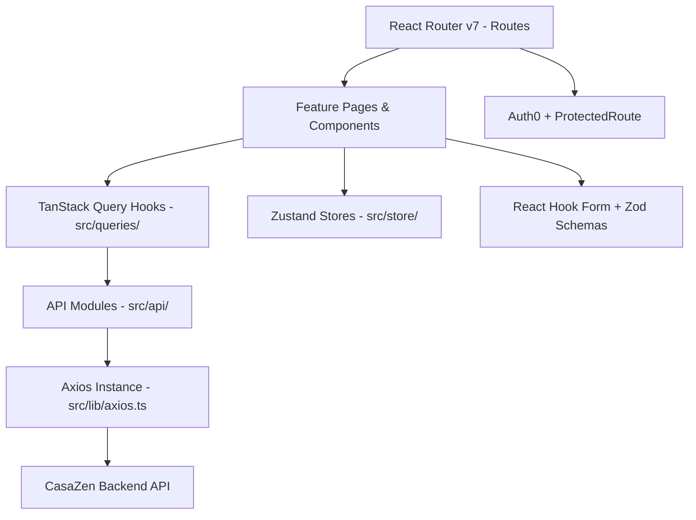

# CasaZen Frontend — Technical Documentation

> React 19 + TypeScript SPA following a feature-based architecture. Communicates exclusively with the CasaZen backend REST API via Axios + TanStack Query. All authenticated routes are protected via Auth0.

---

## Architecture

### Layer diagram



### Folder responsibilities

| Directory | Responsibility |
|---|---|
| `src/routes/` | `createBrowserRouter` definition — maps paths to page components |
| `src/features/` | Feature modules — each owns its pages, sub-components, and Zod schemas |
| `src/api/` | Per-domain API modules (thin wrappers around `ApiClient`) |
| `src/queries/` | TanStack Query hooks — `useQuery` + `useMutation` per domain |
| `src/types/` | TypeScript interfaces/types, re-exported from `index.ts` |
| `src/components/` | Shared components: auth wiring, layout shell, generic UI, Radix primitives |
| `src/store/` | Zustand stores — UI state (`useUiStore`) and auth user (`useUserStore`) |
| `src/config/` | Environment, Auth0, API, and demo mode configuration |
| `src/lib/` | Axios instance, React Query client singleton, utility helpers |
| `src/pages/` | Top-level pages that don't belong to a feature (`LoginPage`) |
| `src/hooks/` | Custom React hooks (`useAuth`) |
| `src/styles/` | Global CSS / Tailwind base styles |
| `e2e/` | Playwright end-to-end tests |

---

## Tech Stack

| Component | Technology | Version | Notes |
|---|---|---|---|
| Language | TypeScript | ~5.9 | Strict mode enabled |
| Framework | React | 19.2 | Concurrent features enabled |
| Build tool | Vite | 8 | `vite.config.ts`, `@/` path alias |
| Styling | Tailwind CSS | v4 | PostCSS integration; `tailwind.config.js` |
| UI primitives | Radix UI | — | Avatar, Checkbox, Dialog, DropdownMenu, Label, Popover, Select, Slot, Switch, Tabs |
| Routing | React Router | v7 | `createBrowserRouter`; all protected routes wrapped in `<ProtectedRoute>` |
| Server state | TanStack Query | v5 | Query keys per domain; invalidation on mutation success |
| Global state | Zustand | v5 | `useUiStore` (sidebar), `useUserStore` (authenticated user) |
| Forms | React Hook Form + Zod | v7 + v4 | `@hookform/resolvers/zod` for schema validation |
| HTTP client | Axios | v1 | JWT interceptor auto-attaches Bearer token |
| Authentication | Auth0 | v2 | `@auth0/auth0-react`; demo mode bypasses auth |
| Calendar | React Big Calendar | v1 | Booking calendar view |
| Charts | Recharts | v3 | Revenue and dashboard analytics |
| Icons | Lucide React | v1 | |
| Toasts | Sonner | v2 | `position="top-right"`, `richColors` |
| Unit tests | Vitest | v4 | `@testing-library/react` + `jsdom` |
| E2E tests | Playwright | v1.60 | `playwright.config.ts`; `npm run test:e2e` |

---

## Routing

All routes except `/login` and `/search` are wrapped in `<ProtectedRoute>`, which redirects to `/login` if the user is not authenticated. Unknown paths redirect to `/`.

| Path | Component | Auth required |
|---|---|---|
| `/login` | `LoginPage` | No |
| `/` | `DashboardPage` | Yes |
| `/properties` | `PropertiesPage` | Yes |
| `/properties/create` | `PropertyCreatePage` | Yes |
| `/properties/:id` | `PropertyDetailPage` | Yes |
| `/properties/:id/edit` | `PropertyEditPage` | Yes |
| `/properties/:id/pricing` | `PricingDashboardPage` | Yes |
| `/properties/:id/pricing/history` | `PricingHistoryPage` | Yes |
| `/bookings` | `BookingsPage` | Yes |
| `/bookings/create` | `BookingCreatePage` | Yes |
| `/bookings/calendar` | `CalendarPage` | Yes |
| `/bookings/:id` | `BookingDetailPage` | Yes |
| `/bookings/:id/edit` | `BookingEditPage` | Yes |
| `/payments` | `PaymentsPage` | Yes |
| `/payments/create` | `PaymentCreatePage` | Yes |
| `/payments/revenue` | `RevenuePage` | Yes |
| `/payments/:id` | `PaymentDetailPage` | Yes |
| `/ota` | `OtaPage` | Yes |
| `/ota/create` | `OtaSetupPage` | Yes |
| `/search` | `SearchPage` | No (public) |
| `/profile` | `ProfilePage` | Yes |

---

## API Layer

### Axios instance (`src/lib/axios.ts`)

Single Axios instance shared across all requests:
- **Base URL**: `VITE_API_BASE_URL` (default: `http://localhost:3000/api`)
- **Timeout**: configured in `src/config/api.config.ts`
- **Request interceptor**: calls `getAccessToken()` and attaches `Authorization: Bearer <token>` header. Skips auth for `/health`, `/auth/`, and `/properties/search`.
- **Response interceptor**: normalises error logging for 400/401/403/404/500 status codes. On 401, logs a warning and lets the component handle redirect.

### ApiClient (`src/api/client.ts`)

Static class with typed `get`, `getPaginated`, `post`, `put`, `patch`, `delete` methods. Includes an `unwrap()` helper that handles both raw responses (`T`) and enveloped responses (`{ data: T }`).

### API modules (`src/api/`)

| Module | Domain |
|---|---|
| `properties.api.ts` | CRUD + search + image management |
| `bookings.api.ts` | CRUD + check-in + check-out + calendar |
| `payments.api.ts` | CRUD + process + refund + revenue |
| `ota.api.ts` | Sync + status + pricing + availability + validate |
| `pricing-adapter.api.ts` | Config + history + preview + manual sync trigger |
| `guests.api.ts` | CRUD for guest records |
| `tourist-tax.api.ts` | Tourist tax rate management |
| `auth.api.ts` | Auth0 user profile |
| `property-images.api.ts` | Photo upload / reorder / delete |

---

## State Management

### Server state — TanStack Query (`src/queries/`)

| Hook file | Exposed hooks | Invalidation strategy |
|---|---|---|
| `use-properties.ts` | `useProperties`, `useProperty`, `useCreateProperty`, `useUpdateProperty`, `useDeleteProperty`, `useSearchProperties` | Invalidates `['properties']` on all mutations |
| `use-bookings.ts` | `useBookings`, `useBooking`, `useCreateBooking`, `useUpdateBooking`, `useDeleteBooking`, `useCheckIn`, `useCheckOut` | Invalidates `['bookings']` |
| `use-payments.ts` | `usePayments`, `usePayment`, `useCreatePayment`, `useProcessPayment`, `useRefundPayment`, `useRevenue` | Invalidates `['payments']` |
| `use-ota.ts` | `useOtaStatus`, `useSyncAll`, `useUpdatePricing`, `useValidateCredentials` | — |
| `use-pricing-adapter.ts` | `usePricingConfig`, `useSavePricingConfig`, `usePricingHistory`, `usePricingPreview`, `useTriggerSync` | Invalidates `['pricing-adapter']` |

All mutations show a toast on success and on error via Sonner.

### Global state — Zustand (`src/store/`)

| Store | State | Used for |
|---|---|---|
| `useUiStore` | `sidebarOpen` + `toggleSidebar` + `setSidebarOpen` | Sidebar collapse/expand in `AppShell` |
| `useUserStore` | `user: User \| null` + `setUser` | Authenticated Auth0 user profile across the app |

---

## Authentication

### Flow

```
Auth0Provider (wraps entire app)
  └── AuthInitializer
        └── registers getAccessToken() on the Axios instance
              └── QueryClientProvider
                    └── RouterProvider
                          └── ProtectedRoute (per route)
                                └── Page component
```

`AuthInitializer` (`src/components/auth/auth-initializer.tsx`) calls `setAccessTokenGetter(() => getAccessTokenSilently(...))` to wire the Axios interceptor. This means the token is fetched lazily on every protected HTTP request.

### Demo mode

Set `VITE_DEMO_MODE=true` (or run `npm run dev:demo`) to bypass Auth0. The app uses a static demo user (`demo@casazen.com`) and skips authentication. Used for CI demos and screenshots.

### Environment variables

| Variable | Required | Default | Purpose |
|---|---|---|---|
| `VITE_AUTH0_DOMAIN` | Yes (prod) | `dev-casazen.auth0.com` | Auth0 tenant domain |
| `VITE_AUTH0_CLIENT_ID` | Yes (prod) | — | Auth0 application client ID |
| `VITE_AUTH0_AUDIENCE` | No | `https://casazen-api` | Auth0 API identifier (JWT audience) |
| `VITE_API_BASE_URL` | No | `http://localhost:3000/api` | Backend API base URL |
| `VITE_DEMO_MODE` | No | `false` | Bypass Auth0 for demos |

---

## Component Architecture

### Shared components (`src/components/`)

| Directory | Components |
|---|---|
| `auth/` | `AuthInitializer`, `LoginButton`, `LogoutButton`, `ProtectedRoute`, `UserMenu` |
| `layout/` | `AppShell` (sidebar + header wrapper), `Header`, `Sidebar`, `PageHeader` |
| `shared/` | `ConfirmationDialog`, `DemoBanner`, `EmptyState`, `ErrorBoundary`, `ErrorFallback`, `LoadingScreen` |
| `ui/` | Radix-based design system: `Avatar`, `Badge`, `Button`, `Checkbox`, `Dialog`, `DropdownMenu`, `Input`, `Label`, `Skeleton`, `Spinner`, `Switch`, `Textarea` |

### Feature module pattern (`src/features/<feature>/`)

Each feature contains:
- `<feature>-page.tsx` — route-level page component (fetches data via query hooks)
- `components/` — feature-specific sub-components (lists, forms, dialogs)
- `schemas/` — Zod validation schemas for forms

### Form pattern

1. Define Zod schema in `features/<feature>/schemas/<feature>.schema.ts`
2. Use `useForm({ resolver: zodResolver(schema) })` in the form component
3. Wire `useMutation` from `src/queries/` for submit
4. Show Sonner toast on success/error

---

## Design Patterns

| Pattern | Location | Purpose |
|---|---|---|
| Feature slice | `src/features/` | Co-locates page, components, and schemas per domain; avoids cross-feature coupling |
| Query/mutation hooks | `src/queries/` | Centralises server-state logic; components never call `axios` directly |
| Repository (API modules) | `src/api/` | Each domain has one API module; components never construct request URLs |
| Adapter (unwrap) | `src/api/client.ts` | Shields components from backend response envelope changes |
| Guard (ProtectedRoute) | `src/components/auth/protected-route.tsx` | Centralised auth check before any protected route renders |
| Error boundary | `src/components/shared/error-boundary.tsx` | Catches unhandled React render errors at the top level |

---

## Testing

| Type | Tool | Location | Run command |
|---|---|---|---|
| Unit / component | Vitest + Testing Library | `src/**/__tests__/` | `npm test` |
| E2E | Playwright | `e2e/` | `npm run test:e2e` |

Tests present in: `src/api/__tests__/`, `src/queries/__tests__/`, `src/features/pricing/__tests__/`, `src/features/properties/schemas/__tests__/`.

---

## Development Setup

```bash
cd casazen/frontend

npm install

# Create env file
cp .env.example .env.local  # or create manually
# Set VITE_AUTH0_DOMAIN, VITE_AUTH0_CLIENT_ID, VITE_API_BASE_URL

# Dev server (port 5173 by default)
npm run dev

# Dev server in demo mode (no Auth0 required)
npm run dev:demo

# Build
npm run build

# Run unit tests
npm test

# Run E2E tests
npm run test:e2e

# Lint
npm run lint
```
