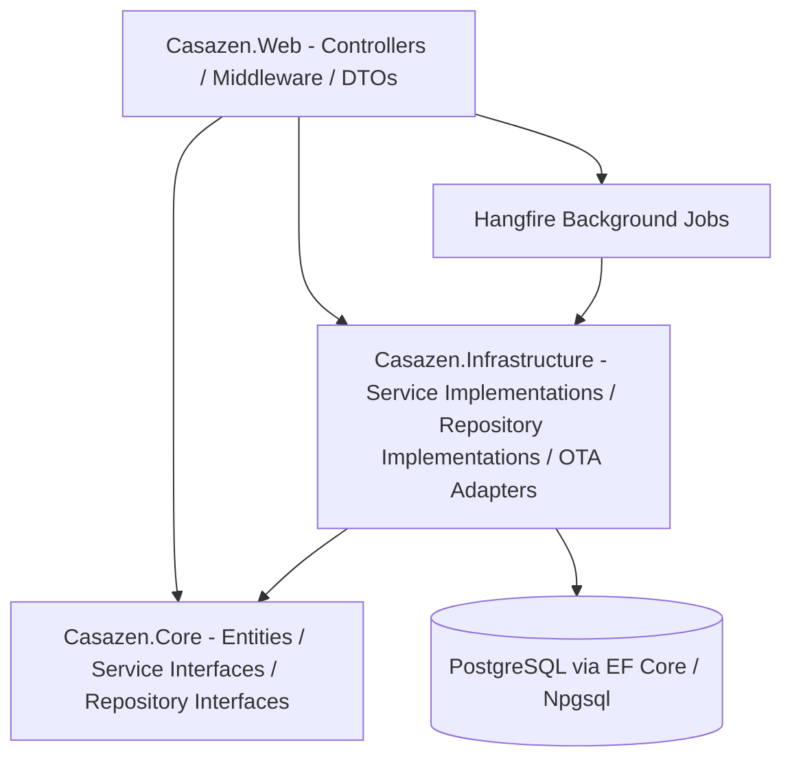
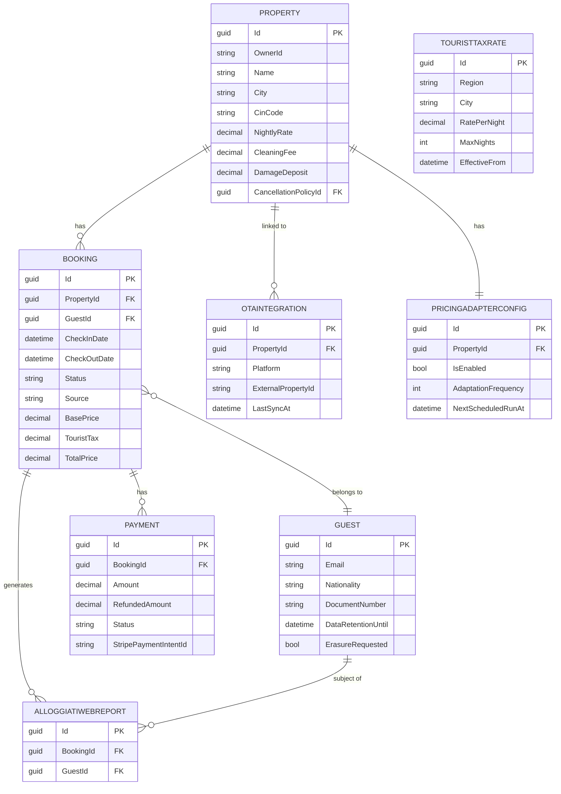

# CasaZen — Technical Documentation

> ASP.NET Core 10 REST API following a layered architecture (Presentation → Business Logic → Data Access), with PostgreSQL (Npgsql / Supabase) via EF Core, Auth0 JWT authentication, and Hangfire background jobs.

---

## Architecture

### Layer diagram



### Layer responsibilities

| Layer | Directory | Responsibility |
|---|---|---|
| Presentation | `Casazen.Web/` | HTTP controllers, DTOs, middleware, Swagger config, auth wiring, background job registration |
| Business Logic | `Casazen.Core/` | Domain entities, service interfaces, repository interfaces, enums, validators, utilities |
| Data Access | `Casazen.Infrastructure/` | EF Core DbContext, repository implementations, service implementations, OTA adapters, Stripe/email clients |
| Tests | `Casazen.Tests/` | Unit and integration tests |

### Dependency rule
`Casazen.Core` has no external project dependencies — it defines only interfaces and entities. `Casazen.Infrastructure` depends on `Casazen.Core` (implements its interfaces). `Casazen.Web` depends on both `Casazen.Core` (for interface injection) and `Casazen.Infrastructure` (registered in DI). This ensures the domain is framework-agnostic.

---

## Tech Stack

| Component | Technology | Version | Notes |
|---|---|---|---|
| Language | C# | 13 | Nullable reference types enabled |
| Framework | ASP.NET Core | 10.0 | Minimal hosting model in `Program.cs` |
| Database | PostgreSQL (Supabase) | — | Npgsql EF Core; in-memory DB used in CI / tests |
| ORM | Entity Framework Core | 10.x | Code-first, migrations in `Casazen.Infrastructure/Migrations/` |
| Authentication | Auth0 + JWT Bearer | — | `sub` claim used as user ID |
| Background jobs | Hangfire | 1.8.x | PostgreSQL storage; dashboard at `/hangfire` |
| Payment processing | Stripe .NET SDK | — | Webhook signature verification required |
| Email | MailKit (SMTP) | — | Any SMTP server; Gmail free tier recommended for dev |
| OTA resilience | Polly | — | Retry, circuit breaker, timeout, rate limiting per platform |
| Test framework | xUnit | — | `Casazen.Tests/` |
| API docs | Swashbuckle / Swagger | — | Swagger UI at `/swagger` (dev only) |

---

## API Reference

### Base URL
`/api`

### Authentication
All endpoints require a `Bearer` JWT token in the `Authorization` header (issued by Auth0), except anonymous routes noted below (public booking, legal, health, webhooks, guest check-in tokens, supplier register, plan catalogue, SEO sitemap).

Anonymous / public (non-exhaustive highlights):
- `GET /api/health`, `GET /api/properties/health`, `GET /api/properties/search`
- `POST /api/auth/register`, `GET /api/orgs/plans`
- All `/api/public/*`, `/api/checkin/*`, `/api/legal/*`, `/sitemap-compliance.xml`
- `POST /api/suppliers/register`, webhook receivers under `/webhooks/*`

There are **41** controller source files under `Casazen.Web/Controllers/` (plus nested `PublicCheckInController` in `SupplierJobController.cs`).

### Endpoints

#### Auth / identity / devices

| Method | Path | Auth | Description |
|---|---|---|---|
| `POST` | `/api/auth/register` | Anonymous | Register a new user |
| `GET` | `/api/auth/profile` | JWT | Current auth profile |
| `POST` | `/api/auth/logout` | JWT | Logout / invalidate session side-effects |
| `GET` | `/api/users` | Admin | Paginated user list |
| `GET` | `/api/users/{id}` | Admin | User detail |
| `GET` | `/api/users/me` | JWT | Current user profile |
| `PUT` | `/api/users/me` | JWT | Update current user profile |
| `POST` | `/api/users/onboarding` | JWT | Submit user onboarding payload |
| `PUT` | `/api/users/onboarding` | JWT | Update user onboarding payload |
| `PUT` | `/api/users/{id}/role` | Admin | Change user role |
| `DELETE` | `/api/users/{id}` | Admin | Delete user |
| `POST` | `/api/devices` | JWT | Register iOS/Android push device |
| `DELETE` | `/api/devices/{deviceId}` | JWT | Unregister device |

#### Multi-tenancy (orgs & workspace)

| Method | Path | Auth | Description |
|---|---|---|---|
| `GET` | `/api/me/contexts` | JWT | Workspace contexts (host / supplier / …); merges JWT roles with `UserContextMemberships` |
| `GET` | `/api/orgs/plans` | Anonymous | Plan catalogue and property limits |
| `GET` | `/api/orgs/me/entitlement` | short-rent property.read | Org plan tier, limits, usage, `canAddProperty`, `canUseCustomDomain` |
| `PUT` | `/api/orgs/me/plan` | JWT | Self-serve plan change (409 if Stripe-managed) |
| `GET` | `/api/orgs/{orgId}/domain` | JWT | Custom domain config for org |
| `POST` | `/api/orgs/{orgId}/domain` | JWT | Set custom domain |
| `POST` | `/api/orgs/{orgId}/domain/verify` | JWT | Verify DNS / domain ownership |

#### Onboarding

| Method | Path | Auth | Description |
|---|---|---|---|
| `GET` | `/api/onboarding/status` | JWT | Host / org onboarding wizard status |

#### Properties

| Method | Path | Description |
|---|---|---|
| `GET` | `/api/properties` | List properties owned by the authenticated user |
| `GET` | `/api/properties/{id}` | Get a single property |
| `POST` | `/api/properties` | Create a new property |
| `PUT` | `/api/properties/{id}` | Update a property (owner only) |
| `DELETE` | `/api/properties/{id}` | Delete a property (owner only) |
| `GET` | `/api/properties/search` | Search properties by city, bedrooms, max price (anonymous) |
| `POST` | `/api/properties/{id}/images` | Upload photos (max 20, JPEG/PNG/WebP, 10 MB each) |
| `GET` | `/api/properties/{id}/images` | List photo URLs |
| `DELETE` | `/api/properties/{id}/images/{imageIndex}` | Delete a photo by index |
| `PUT` | `/api/properties/{id}/images/order` | Reorder photos |
| `GET` | `/api/properties/health` | Anonymous health check |

#### Bookings

| Method | Path | Description |
|---|---|---|
| `GET` | `/api/bookings` | List bookings (filter by `?propertyId=`) |
| `GET` | `/api/bookings/{id}` | Get a single booking |
| `POST` | `/api/bookings` | Create a booking (availability check + tourist tax calculation) |
| `PUT` | `/api/bookings/{id}` | Update a booking |
| `DELETE` | `/api/bookings/{id}` | Cancel a booking |
| `GET` | `/api/bookings/calendar` | Calendar view (`?propertyId&startDate&endDate&timezone`) |
| `POST` | `/api/bookings/{id}/check-in` | Perform check-in (enqueues Alloggiati Web report) |
| `POST` | `/api/bookings/{id}/check-out` | Perform check-out |
| `GET` | `/api/bookings/{id}/alloggiati-status` | Get Alloggiati Web submission status |

#### Guests & digital check-in

| Method | Path | Auth | Description |
|---|---|---|---|
| `GET` | `/api/guests` | JWT | List guests |
| `GET` | `/api/guests/{id}` | JWT | Get a single guest |
| `POST` | `/api/guests` | JWT | Create a guest record |
| `PUT` | `/api/guests/{id}` | JWT | Update guest details |
| `DELETE` | `/api/guests/{id}` | JWT | Delete a guest |
| `GET` | `/api/checkin/{token}` | Anonymous | Guest check-in session by magic token |
| `POST` | `/api/checkin/{token}/guest-data` | Anonymous | Submit guest identity data |
| `POST` | `/api/checkin/{token}/document` | Anonymous | Upload ID document for check-in |

#### Leases (long-term)

| Method | Path | Auth | Description |
|---|---|---|---|
| `GET` | `/api/leases` | LongTermLandlord + lease.read | List leases |
| `GET` | `/api/leases/{id}` | LongTermLandlord + lease.read | Get lease |
| `POST` | `/api/leases` | lease.create | Create lease |
| `POST` | `/api/leases/{id}/signing` | lease.sign | Start / advance e-sign flow |
| `POST` | `/api/leases/{id}/registration` | lease.register | Submit lease registration |
| `GET` | `/api/leases/{id}/registration` | lease.read | Registration status |
| `GET` | `/api/leases/{id}/registration/receipt` | lease.read | Registration receipt |

#### Payments & Stripe Connect

| Method | Path | Auth | Description |
|---|---|---|---|
| `GET` | `/api/payments` | JWT | List all payments |
| `GET` | `/api/payments/{id}` | JWT | Get a single payment |
| `POST` | `/api/payments` | JWT | Create a payment record |
| `POST` | `/api/payments/{id}/process` | JWT | Charge the guest via Stripe |
| `POST` | `/api/payments/{id}/refund` | JWT | Refund (full or `?amount=` partial) |
| `GET` | `/api/payments/revenue` | JWT | Revenue report (`?propertyId&startDate&endDate`) |
| `POST` | `/api/connect/account` | short-rent property.write | Ensure Stripe Express connected account |
| `POST` | `/api/connect/onboarding-link` | short-rent property.write | Create Connect onboarding link |
| `GET` | `/api/connect/status` | short-rent property.write | Connect account status |

#### SaaS billing

| Method | Path | Auth | Description |
|---|---|---|---|
| `GET` | `/api/billing/plans` | JWT | Stripe plan catalogue |
| `POST` | `/api/billing/checkout-session` | OrgBillingAdmin | Create Stripe Checkout session |
| `POST` | `/api/billing/portal-session` | OrgBillingAdmin | Create Stripe Customer Portal session |
| `GET` | `/api/billing/subscription` | OrgBillingAdmin | Current org subscription |
| `PUT` | `/api/billing/profile` | OrgBillingAdmin | Update billing profile |

#### Pricing Adapter (AI Dynamic Pricing)

| Method | Path | Description |
|---|---|---|
| `POST` | `/api/pricing-adapter/config/{propertyId}` | Enable / update AI pricing config |
| `GET` | `/api/pricing-adapter/config/{propertyId}` | Get current AI pricing config |
| `DELETE` | `/api/pricing-adapter/config/{propertyId}` | Disable AI pricing |
| `GET` | `/api/pricing-adapter/history/{propertyId}` | Paginated price change history |
| `POST` | `/api/pricing-adapter/sync/{propertyId}` | Trigger a manual pricing sync (returns `jobId`) |
| `GET` | `/api/pricing-adapter/preview/{propertyId}` | Preview suggested prices for next 90 days |

#### OTA Channel Management

| Method | Path | Description |
|---|---|---|
| `POST` | `/api/ota/sync` | Sync all OTA platforms |
| `GET` | `/api/ota/status` | Get OTA sync status |
| `PUT` | `/api/ota/pricing` | Push pricing update to OTAs |
| `GET` | `/api/ota/bookings` | Fetch bookings from a specific OTA platform |
| `PUT` | `/api/ota/availability` | Push availability update to OTAs |
| `POST` | `/api/ota/validate` | Validate OTA API credentials |
| `GET` | `/api/properties/{propertyId}/ota-integrations` | List OTA integrations for a property |
| `GET` | `/api/properties/{propertyId}/ota-integrations/{id}` | Get one integration |
| `POST` | `/api/properties/{propertyId}/ota-integrations` | Create integration |
| `PUT` | `/api/properties/{propertyId}/ota-integrations/{id}` | Update integration |
| `DELETE` | `/api/properties/{propertyId}/ota-integrations/{id}` | Delete integration |

#### Compliance / legal

| Method | Path | Auth | Description |
|---|---|---|---|
| `GET` | `/api/compliance/summary` | PropertyOwner | Compliance cockpit summary (pending properties, check-ins, checkouts, Alloggiati failures) |
| `GET` | `/api/alloggiati/summary` | booking.read | Alloggiati queue / summary |
| `GET` | `/api/alloggiati/{bookingId}/status` | booking.read | Submission status for a booking |
| `POST` | `/api/alloggiati/{bookingId}/send` | booking.write | Manually send / retry Alloggiati report |
| `GET` | `/api/legal/subprocessors` | Anonymous | Sub-processors list |
| `GET` | `/api/legal/dpa` | Anonymous | Data Processing Agreement |
| `GET` | `/api/legal/tos` | Anonymous | Terms of Service |
| `GET` | `/api/legal/privacy` | Anonymous | Privacy policy |
| `GET` | `/api/gdpr/guests/{id}/export` | JWT | Export guest personal data |
| `DELETE` | `/api/gdpr/guests/{id}` | JWT | Erasure request (Art. 17) |
| `POST` | `/api/gdpr/guests/{id}/anonymize` | JWT | Anonymize guest record |
| `PUT` | `/api/gdpr/guests/{id}/consent` | JWT | Update GDPR consent |
| `GET` | `/api/tourist-tax-rates` | JWT | List tourist tax rates |
| `GET` | `/api/tourist-tax-rates/{id}` | JWT | Get rate by id |
| `GET` | `/api/tourist-tax-rates/city/{city}` | JWT | Rates for a city |
| `POST` | `/api/tourist-tax-rates/calculate` | JWT | Calculate tax for a stay |
| `POST` | `/api/tourist-tax-rates` | Admin | Create rate |
| `PUT` | `/api/tourist-tax-rates/{id}` | Admin | Update rate |
| `DELETE` | `/api/tourist-tax-rates/{id}` | Admin | Delete rate |
| `GET` | `/sitemap-compliance.xml` | Anonymous | Compliance SEO sitemap |

#### Supplier marketplace

| Method | Path | Auth | Description |
|---|---|---|---|
| `POST` | `/api/admin/suppliers/invite` | Admin | Invite supplier (email via SMTP); 409 pending invite; 502 email failure rolls back |
| `POST` | `/api/suppliers/register` | Anonymous | Self-serve or invite-token registration |
| `GET` | `/api/suppliers?comune=&category=` | JWT | List **Active** suppliers for host picker |
| `GET` | `/api/supplier/profile` | Supplier | Supplier profile for current org |
| `PUT` | `/api/supplier/profile` | Supplier | Update profile fields |
| `POST` | `/api/supplier/profile/photos` | Supplier | Upload profile photos (max 10, 5 MB) |
| `GET` | `/api/supplier/profile/activation` | Supplier | Activation wizard step statuses |
| `POST` | `/api/supplier/profile/activation/complete` | Supplier | Complete activation (ToS + blockers) |
| `GET` | `/api/supplier/inbox` | Supplier | Service-request inbox |
| `GET` | `/api/supplier/availability` | Supplier | Availability for date range |
| `PUT` | `/api/supplier/availability` | Supplier | Upsert availability by date |
| `GET` | `/api/supplier/dashboard` | Supplier | Aggregated KPIs |
| `GET` | `/api/supplier/calendar/status` | Supplier | Calendar sync status |
| `PUT` | `/api/supplier/calendar/ical` | Supplier | Set iCal feed URL and sync |
| `GET` | `/api/supplier/jobs` | Supplier | List supplier jobs |
| `POST` | `/api/supplier/jobs` | Supplier | Create job (host/admin assignment path) |
| `POST` | `/api/supplier/jobs/{jobId}/accept` | Supplier | Accept job; generates QR check-in token |
| `POST` | `/api/supplier/jobs/{jobId}/check-in` | Supplier | Job check-in |
| `POST` | `/api/supplier/jobs/{jobId}/check-out` | Supplier | Job check-out |
| `POST` | `/api/service-requests/match-supplier` | JWT | Match suppliers for a request |
| `POST` | `/api/service-requests` | JWT | Create service request |
| `GET` | `/api/service-requests` | JWT | List service requests |
| `GET` | `/api/service-requests/{id}` | JWT | Get service request |
| `POST` | `/api/service-requests/{id}/take` | Supplier | Take / claim request |
| `POST` | `/api/service-requests/{id}/complete` | Supplier | Complete request |
| `POST` | `/api/service-requests/{id}/reject` | Supplier | Reject request |
| `POST` | `/api/service-requests/{id}/mark-paid` | JWT | Mark request paid |
| `GET` | `/register` | Anonymous | Supplier register page (MVC) |

**Invite email:** `SupplierService.CreateInviteAsync` persists `SupplierInviteRecords`, then sends via `IEmailService` (MailKit SMTP) with HTML from `SupplierInviteEmailBuilder`. Signup URL: `{App:PublicSiteBaseUrl}/login?inviteToken={id}&email={email}&comune={comuneCode}`. Skipped in Testing/Development when no email config is present.

**Workspace context:** `GET /api/me/contexts` includes a `supplier` context when the JWT has role `Supplier`. Default route: `/supplier/inbox`.

#### Public-facing

| Method | Path | Auth | Description |
|---|---|---|---|
| `GET` | `/api/public/resolve-host` | Anonymous | Resolve host / org from Host header or query |
| `GET` | `/api/public/content/affitti-brevi/{regionSlug}/{comuneSlug}` | Anonymous | SEO content page (short-term rentals) |
| `GET` | `/api/public/content/tassa-soggiorno/{comuneSlug}` | Anonymous | SEO content page (tourist tax) |
| `POST` | `/api/public/tourist-tax/calculate` | Anonymous | Public tourist-tax calculator |
| `GET` | `/api/public/orgs/{slug}` | Anonymous | Public org landing by slug |
| `GET` | `/api/public/orgs/{slug}/properties` | Anonymous | Public property list for org |
| `GET` | `/api/public/orgs/{slug}/properties/{propertySlugOrId}` | Anonymous | Public property detail |
| `GET` | `/api/public/suppliers/{slug}` | Anonymous | Public supplier profile |
| `GET` | `/api/public/bookings/property/{propertyId}/availability` | Anonymous | Booked dates for public calendar |
| `GET` | `/api/public/bookings/{bookingId}/status` | Anonymous | Booking status (payment option) |
| `POST` | `/api/public/bookings/lookup` | Anonymous | Guest booking lookup by id + email (rate-limited) |
| `POST` | `/api/public/bookings` | Anonymous | Create direct booking (rate-limited) |
| `GET` | `/api/public/ical/{exportToken}` | Anonymous | Property iCal export feed |
| `GET` | `/api/public/checkin/{token}` | Anonymous | Public guest check-in session |
| `POST` | `/api/public/checkin/{token}` | Anonymous | Submit public guest check-in |
| `GET` | `/api/public/check-in/{jobId}` | Anonymous | Supplier job check-in status (`?token=`) |
| `POST` | `/api/public/check-in/{jobId}/check-in` | Anonymous | Supplier job public check-in |
| `POST` | `/api/public/check-in/{jobId}/check-out` | Anonymous | Supplier job public check-out |

#### Admin

| Method | Path | Auth | Description |
|---|---|---|---|
| `GET` | `/api/admin/stats` | Admin | Platform KPI dashboard stats |
| `GET` | `/api/admin/cin-compliance` | Admin | Paginated CIN compliance report |
| `GET` | `/api/admin/jobs` | Admin | Hangfire recurring job statuses |
| `PATCH` | `/api/admin/orgs/{orgId}/plan` | Admin | Override org plan tier |
| `GET` | `/api/admin/seo/pages` | Admin | SEO pages list / filter |
| `GET` | `/api/admin/seo/comuni` | Admin | Comuni catalogue for SEO |
| `POST` | `/api/admin/seo/approve-all-drafts` | Admin | Approve all draft SEO pages |
| `POST` | `/api/admin/seo/generate` | Admin | Generate SEO content |
| `PATCH` | `/api/admin/seo/pages/{id}/review-status` | Admin | Update page review status |
| `GET` | `/api/admin/seo/budget` | Admin | SEO generation budget |
| `POST` | `/api/admin/suppliers/invite` | Admin | See Supplier marketplace |

#### Webhooks & health

| Method | Path | Auth | Description |
|---|---|---|---|
| `POST` | `/webhooks/stripe` | Anonymous (signature) | Stripe platform webhook |
| `POST` | `/webhooks/stripe/connect` | Anonymous (signature) | Stripe Connect webhook |
| `POST` | `/webhooks/ota/{platform}` | Anonymous | OTA inbound webhook |
| `POST` | `/webhooks/esign` | Anonymous | E-sign provider webhook |
| `GET` | `/api/health` | Anonymous | Service health check |

---

## Data Model

### Entity-Relationship diagram



### Key entities

#### `Property`

| Field | Type | Constraints | Description |
|---|---|---|---|
| `Id` | `Guid` | PK | Auto-generated primary key |
| `OwnerId` | `string` | Required, max 255 | Auth0 `sub` claim of the owner |
| `Name` | `string` | Required, max 100 | Display name |
| `CinCode` | `string?` | Max 25, `[CinCode]` validated | Italian national ID code `IT-XXXXX-XXXXXXXXXX` |
| `NightlyRate` | `decimal` | Range €0.01–€100,000 | Base nightly rate |
| `Timezone` | `string` | Default `Europe/Rome` | IANA timezone for date handling |

#### `Booking`

| Field | Type | Constraints | Description |
|---|---|---|---|
| `Id` | `Guid` | PK | Auto-generated |
| `PropertyId` | `Guid` | FK | Owning property |
| `GuestId` | `Guid` | FK | Lead guest |
| `Status` | `BookingStatus` | Required | Pending / Confirmed / CheckedIn / CheckedOut / Cancelled |
| `Source` | `BookingSource` | Required | Direct / Airbnb / BookingCom / Expedia / … |
| `TouristTax` | `decimal(18,2)` | — | Calculated at creation from `TouristTaxRate` |
| `TotalPrice` | `decimal(18,2)` | — | BasePrice + TouristTax |

#### `Guest`

| Field | Type | Constraints | Description |
|---|---|---|---|
| `Id` | `Guid` | PK | Auto-generated |
| `Email` | `string` | Required, EmailAddress | Unique contact address |
| `DocumentType` | `DocumentType?` | — | Passport / IdentityCard / DriversLicense / Other |
| `DataRetentionUntil` | `datetime` | Default UtcNow+7yr | GDPR retention deadline |
| `ErasureRequested` | `bool` | Default false | GDPR Article 17 erasure flag |

#### `Payment`

| Field | Type | Constraints | Description |
|---|---|---|---|
| `Id` | `Guid` | PK | Auto-generated |
| `BookingId` | `Guid` | FK | Associated booking |
| `Amount` | `decimal(18,2)` | — | Charged amount |
| `RefundedAmount` | `decimal(18,2)` | Default 0 | Cumulative refunded total |
| `Status` | `PaymentStatus` | Required | Pending / Processing / Completed / Failed / Refunded / PartiallyRefunded |
| `StripePaymentIntentId` | `string?` | Max 255 | Stripe reference |

---

## Design Patterns

| Pattern | Where used | Purpose |
|---|---|---|
| Repository | `Casazen.Infrastructure/Repositories/`, `Casazen.Core/Repositories/` (interfaces) | Abstracts EF Core data access; enables unit testing with mocks |
| Service layer | `Casazen.Core/Services/` (interfaces), `Casazen.Infrastructure/Services/` (implementations) | Encapsulates business logic away from controllers |
| Background jobs (Queue) | `Casazen.Web/BackgroundJobs/` via Hangfire | Decouples long-running work (OTA sync, police reporting, pricing, email) from HTTP request cycle |
| Circuit breaker + Retry (Polly) | `Casazen.Infrastructure/OTA/Resilience/` | Production-grade fault tolerance for all OTA HTTP calls |
| Adapter | `Casazen.Infrastructure/OTA/` — implements `IChannelAdapter` | Uniform interface across 6 OTA platforms; swap implementations without changing business logic |
| Middleware pipeline | `Casazen.Web/Middleware/` | Global error handling, authentication, CORS applied as middleware |
| Webhook handler | `Casazen.Infrastructure/External/StripeWebhookHandler.cs` | Isolated, signature-verified handler for Stripe events |

---

## Infrastructure

### Database
- **Type**: PostgreSQL via Supabase / Npgsql (in-memory fallback for tests / CI when no connection string)
- **Connection**: Connection string key `DefaultConnection` in `appsettings.json`
- **Migrations**: EF Core code-first migrations in `Casazen.Infrastructure/Migrations/`; apply with `dotnet ef database update`

### Configuration

- **Config files**: `Casazen.Web/appsettings.json` (committed defaults), `appsettings.Development.json` (local secrets — **never commit**)
- **Key sections**: `Auth0`, `Stripe`, `Email` (SMTP), `OTA` (per-platform credentials and resilience settings)

### Background jobs

| Job | Schedule | Purpose |
|---|---|---|
| `OtaSyncJob` | Hourly | Full OTA availability and booking sync |
| `BookingPullJob` | Every 15 minutes | Pull new bookings from all OTA platforms |
| `DynamicPricingJob` | Daily at 02:00 UTC | AI-driven nightly rate adaptation |
| `AlloggiatiWebReportJob` | On check-in (enqueued) | Submit guest identity to Italian police system |
| `GdprDataRetentionJob` | Scheduled | Anonymise guest data past retention expiry |
| `EmailQueueProcessor` | Continuous | Process queued email notifications via SMTP |
| `StripeWebhookJob` | On Stripe event (enqueued) | Process Stripe webhook events asynchronously |

### Deployment
- **Containerisation**: `Dockerfile` and `docker-compose.yml` at repo root; `docker-compose up -d` starts the API
- **CI/CD**: GitHub Actions — build + test on push; deploy on release tag (`.github/workflows/ci-cd.yml`)
- **Environments**: Development (local), staging, production

### External service integrations

| Service | SDK / Client | Config location | Purpose |
|---|---|---|---|
| Auth0 | Microsoft JWT Bearer middleware | `appsettings.json → Auth0` | JWT validation on all `/api` endpoints |
| Stripe | Stripe .NET SDK | `appsettings.json → Stripe` | Payment processing and refunds |
| MailKit (SMTP) | MailKit + SMTP client | `appsettings.json → Email:SmtpHost` (or `Email:SendGridApiKey` for relay) | Transactional emails |
| Alloggiati Web | Custom HTTP client | `AlloggiatiWebService.cs` | Italian police guest registration |
| OTA platforms (6) | `IChannelAdapter` implementations | `appsettings.json → OTA` | Booking sync and pricing push |
| Public holidays API | `PublicHolidayService` | Configured in service | Feeds AI pricing seasonality |

---

## Testing

| Type | Framework | Location | Coverage target |
|---|---|---|---|
| Unit tests | xUnit | `Casazen.Tests/Unit/` | 80% for services, 100% for critical paths |
| Integration tests | xUnit | `Casazen.Tests/Integration/` | Critical API paths |

### Running tests

```bash
# Run all tests
dotnet test

# Run specific test class
dotnet test --filter "PropertyServiceTests"

# With coverage
dotnet test /p:CollectCoverage=true

# Check formatting
dotnet format --verify-no-changes
```

---

## Development Setup

```bash
# Clone and restore
git clone https://github.com/casazen/casazen-backend.git
cd casazen-backend
dotnet restore

# Configure
cp Casazen.Web/appsettings.json Casazen.Web/appsettings.Development.json
# Edit connection string and secrets in appsettings.Development.json

# Apply database migrations
dotnet ef database update --project Casazen.Infrastructure

# Run
dotnet run --project Casazen.Web

# Swagger UI (dev mode only)
# https://localhost:5001/swagger

# Run tests
dotnet test

# Check formatting before committing
dotnet format --verify-no-changes
```
