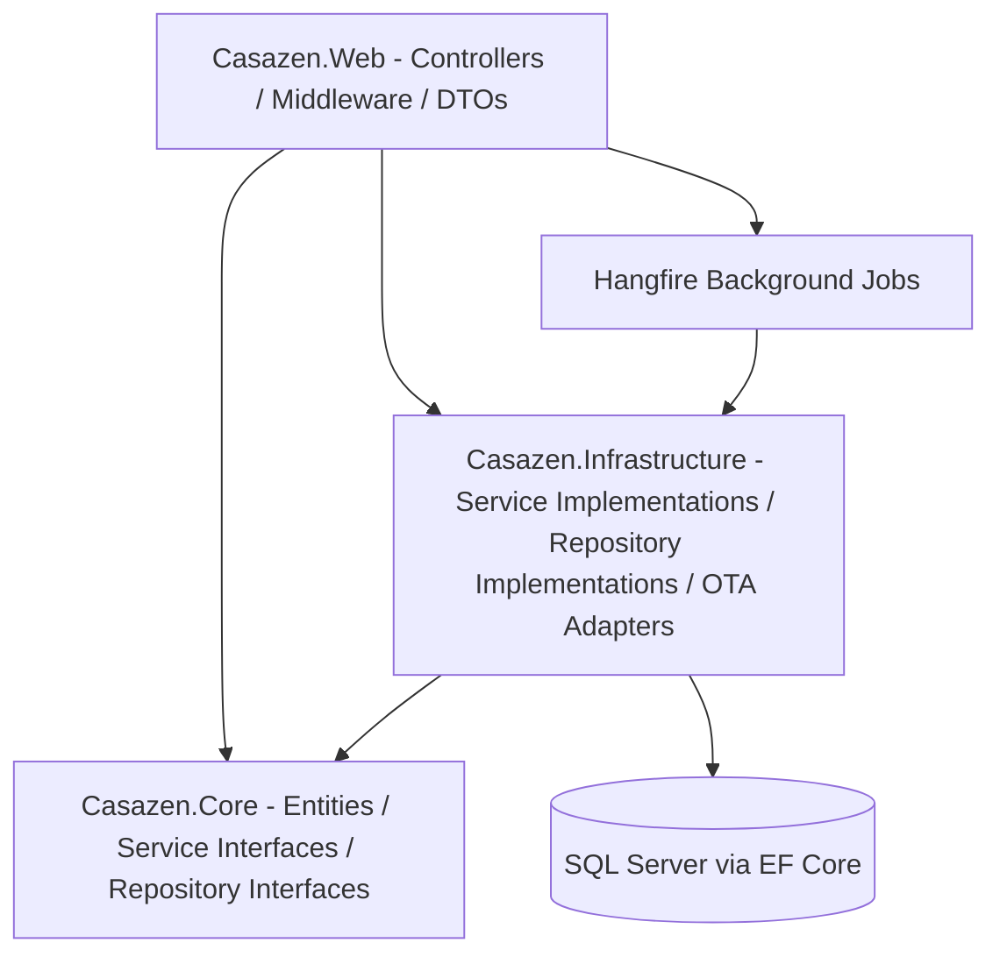
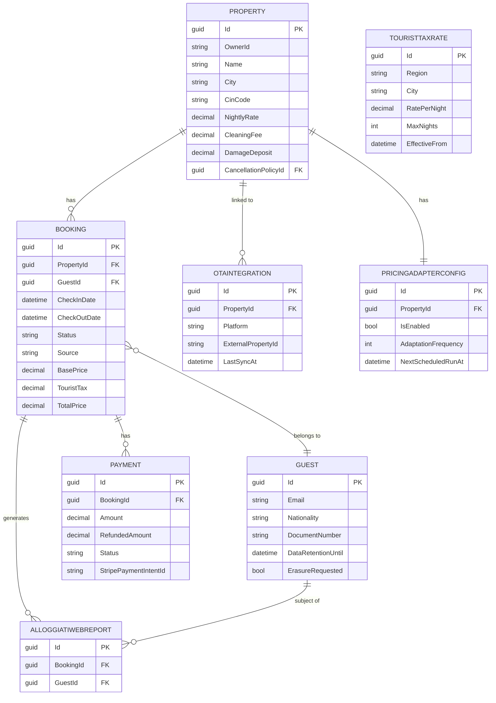

# CasaZen — Technical Documentation

> ASP.NET Core 10 REST API following a layered architecture (Presentation → Business Logic → Data Access), with SQL Server via EF Core, Auth0 JWT authentication, and Hangfire background jobs.

---

## Architecture

### Layer diagram



### Layer responsibilities

| Layer | Directory | Responsibility |
|---|---|---|
| Presentation | `Casazen.Web/` | HTTP controllers, DTOs, middleware, Swagger config, auth wiring, background job registration |
| Business Logic | `Casazen.Core/` | Domain entities, service interfaces, repository interfaces, enums, validators, utilities |
| Data Access | `Casazen.Infrastructure/` | EF Core DbContext, repository implementations, service implementations, OTA adapters, Stripe/email clients |
| Tests | `Casazen.Tests/` | Unit and integration tests |

### Dependency rule
`Casazen.Core` has no external project dependencies — it defines only interfaces and entities. `Casazen.Infrastructure` depends on `Casazen.Core` (implements its interfaces). `Casazen.Web` depends on both `Casazen.Core` (for interface injection) and `Casazen.Infrastructure` (registered in DI). This ensures the domain is framework-agnostic.

---

## Tech Stack

| Component | Technology | Version | Notes |
|---|---|---|---|
| Language | C# | 13 | Nullable reference types enabled |
| Framework | ASP.NET Core | 10.0 | Minimal hosting model in `Program.cs` |
| Database | SQL Server | 2022+ | In-memory DB used in CI / tests |
| ORM | Entity Framework Core | 10.x | Code-first, migrations in `Casazen.Infrastructure/Migrations/` |
| Authentication | Auth0 + JWT Bearer | — | `sub` claim used as user ID |
| Background jobs | Hangfire | 1.8.x | SQL Server storage; dashboard at `/hangfire` |
| Payment processing | Stripe .NET SDK | — | Webhook signature verification required |
| Email | MailKit (SMTP) | — | Any SMTP server; Gmail free tier recommended for dev |
| OTA resilience | Polly | — | Retry, circuit breaker, timeout, rate limiting per platform |
| Test framework | xUnit | — | `Casazen.Tests/` |
| API docs | Swashbuckle / Swagger | — | Swagger UI at `/swagger` (dev only) |

---

## API Reference

### Base URL
`/api`

### Authentication
All endpoints require a `Bearer` JWT token in the `Authorization` header (issued by Auth0), except:
- `GET /api/properties/health` — anonymous health check
- `GET /api/properties/search` — anonymous property search

### Endpoints

#### Properties

| Method | Path | Description |
|---|---|---|
| `GET` | `/api/properties` | List properties owned by the authenticated user |
| `GET` | `/api/properties/{id}` | Get a single property |
| `POST` | `/api/properties` | Create a new property |
| `PUT` | `/api/properties/{id}` | Update a property (owner only) |
| `DELETE` | `/api/properties/{id}` | Delete a property (owner only) |
| `GET` | `/api/properties/search` | Search properties by city, bedrooms, max price (anonymous) |
| `POST` | `/api/properties/{id}/images` | Upload photos (max 20, JPEG/PNG/WebP, 10 MB each) |
| `GET` | `/api/properties/{id}/images` | List photo URLs |
| `DELETE` | `/api/properties/{id}/images/{imageIndex}` | Delete a photo by index |
| `PUT` | `/api/properties/{id}/images/order` | Reorder photos |
| `GET` | `/api/properties/health` | Anonymous health check |

#### Bookings

| Method | Path | Description |
|---|---|---|
| `GET` | `/api/bookings` | List bookings (filter by `?propertyId=`) |
| `GET` | `/api/bookings/{id}` | Get a single booking |
| `POST` | `/api/bookings` | Create a booking (availability check + tourist tax calculation) |
| `PUT` | `/api/bookings/{id}` | Update a booking |
| `DELETE` | `/api/bookings/{id}` | Cancel a booking |
| `GET` | `/api/bookings/calendar` | Calendar view (`?propertyId&startDate&endDate&timezone`) |
| `POST` | `/api/bookings/{id}/check-in` | Perform check-in (enqueues Alloggiati Web report) |
| `POST` | `/api/bookings/{id}/check-out` | Perform check-out |
| `GET` | `/api/bookings/{id}/alloggiati-status` | Get Alloggiati Web submission status |

#### Guests

| Method | Path | Description |
|---|---|---|
| `GET` | `/api/guests` | List guests |
| `GET` | `/api/guests/{id}` | Get a single guest |
| `POST` | `/api/guests` | Create a guest record |
| `PUT` | `/api/guests/{id}` | Update guest details |
| `DELETE` | `/api/guests/{id}` | Delete a guest |

#### Payments

| Method | Path | Description |
|---|---|---|
| `GET` | `/api/payments` | List all payments |
| `GET` | `/api/payments/{id}` | Get a single payment |
| `POST` | `/api/payments` | Create a payment record |
| `POST` | `/api/payments/{id}/process` | Charge the guest via Stripe |
| `POST` | `/api/payments/{id}/refund` | Refund a payment (full or `?amount=` for partial) |
| `GET` | `/api/payments/revenue` | Revenue report (`?propertyId&startDate&endDate`) |

#### Pricing Adapter (AI Dynamic Pricing)

| Method | Path | Description |
|---|---|---|
| `POST` | `/api/pricing-adapter/config/{propertyId}` | Enable / update AI pricing config |
| `GET` | `/api/pricing-adapter/config/{propertyId}` | Get current AI pricing config |
| `DELETE` | `/api/pricing-adapter/config/{propertyId}` | Disable AI pricing |
| `GET` | `/api/pricing-adapter/history/{propertyId}` | Paginated price change history |
| `POST` | `/api/pricing-adapter/sync/{propertyId}` | Trigger a manual pricing sync (returns `jobId`) |
| `GET` | `/api/pricing-adapter/preview/{propertyId}` | Preview suggested prices for next 90 days |

#### OTA Channel Management

| Method | Path | Description |
|---|---|---|
| `POST` | `/api/ota/sync` | Sync all OTA platforms |
| `GET` | `/api/ota/status` | Get OTA sync status |
| `PUT` | `/api/ota/pricing` | Push pricing update to OTAs |
| `GET` | `/api/ota/bookings` | Fetch bookings from a specific OTA platform |
| `PUT` | `/api/ota/availability` | Push availability update to OTAs |
| `POST` | `/api/ota/validate` | Validate OTA API credentials |

#### Supplier console (US-022)

| Method | Path | Auth | Description |
|---|---|---|---|
| `POST` | `/api/admin/suppliers/invite` | Admin | Creates invite record and sends signup email via SMTP. Returns `inviteId`, `expiresAt`. 409 if pending invite exists; 502 if email delivery fails (invite rolled back). |
| `POST` | `/api/suppliers/register` | Anonymous | Self-serve or invite-token registration. Body: `email`, `legalName`, `phone`, `comuneCode`, optional `inviteToken` (invite UUID). |
| `GET` | `/api/suppliers?comune=&category=` | PropertyOwner+ | Lists **Active** suppliers for host picker. |
| `GET` | `/api/supplier/profile` | Supplier | Supplier profile for current org. |
| `PUT` | `/api/supplier/profile` | Supplier | Update profile fields. |
| `GET` | `/api/supplier/profile/activation` | Supplier | Activation wizard step statuses. |
| `POST` | `/api/supplier/profile/activation/complete` | Supplier | Complete activation (ToS + blockers). |
| `GET` | `/api/supplier/inbox` | Supplier | Service-request inbox (empty until marketplace v0). |
| `PUT` | `/api/supplier/availability` | Supplier | Upsert availability by date. |

**Invite email:** `SupplierService.CreateInviteAsync` persists `SupplierInviteRecords`, then sends via `IEmailService` (MailKit SMTP) with HTML from `SupplierInviteEmailBuilder`. Signup URL: `{App:PublicSiteBaseUrl}/login?inviteToken={id}&email={email}&comune={comuneCode}`. Skipped in Testing/Development when no email config is present.

**Workspace context:** `GET /api/me/contexts` includes a `supplier` context when the JWT has role `Supplier`. JWT bootstrap contexts are merged with DB `UserContextMemberships` so host users who gain `Supplier` still see the supplier tab. Default route: `/supplier/inbox`.

#### Other

| Method | Path | Description |
|---|---|---|
| `GET/POST` | `/api/touristtaxrates` | Manage tourist tax rates |
| `POST` | `/api/gdpr/consent` | Record GDPR consent |
| `GET` | `/api/gdpr/export/{guestId}` | Export guest personal data |
| `DELETE` | `/api/gdpr/erasure/{guestId}` | Request guest data erasure (Art. 17) |
| `POST` | `/api/webhooks/stripe` | Stripe webhook receiver (signature-verified) |
| `GET` | `/api/health` | Service health check |

---

## Data Model

### Entity-Relationship diagram



### Key entities

#### `Property`

| Field | Type | Constraints | Description |
|---|---|---|---|
| `Id` | `Guid` | PK | Auto-generated primary key |
| `OwnerId` | `string` | Required, max 255 | Auth0 `sub` claim of the owner |
| `Name` | `string` | Required, max 100 | Display name |
| `CinCode` | `string?` | Max 25, `[CinCode]` validated | Italian national ID code `IT-XXXXX-XXXXXXXXXX` |
| `NightlyRate` | `decimal` | Range €0.01–€100,000 | Base nightly rate |
| `Timezone` | `string` | Default `Europe/Rome` | IANA timezone for date handling |

#### `Booking`

| Field | Type | Constraints | Description |
|---|---|---|---|
| `Id` | `Guid` | PK | Auto-generated |
| `PropertyId` | `Guid` | FK | Owning property |
| `GuestId` | `Guid` | FK | Lead guest |
| `Status` | `BookingStatus` | Required | Pending / Confirmed / CheckedIn / CheckedOut / Cancelled |
| `Source` | `BookingSource` | Required | Direct / Airbnb / BookingCom / Expedia / … |
| `TouristTax` | `decimal(18,2)` | — | Calculated at creation from `TouristTaxRate` |
| `TotalPrice` | `decimal(18,2)` | — | BasePrice + TouristTax |

#### `Guest`

| Field | Type | Constraints | Description |
|---|---|---|---|
| `Id` | `Guid` | PK | Auto-generated |
| `Email` | `string` | Required, EmailAddress | Unique contact address |
| `DocumentType` | `DocumentType?` | — | Passport / IdentityCard / DriversLicense / Other |
| `DataRetentionUntil` | `datetime` | Default UtcNow+7yr | GDPR retention deadline |
| `ErasureRequested` | `bool` | Default false | GDPR Article 17 erasure flag |

#### `Payment`

| Field | Type | Constraints | Description |
|---|---|---|---|
| `Id` | `Guid` | PK | Auto-generated |
| `BookingId` | `Guid` | FK | Associated booking |
| `Amount` | `decimal(18,2)` | — | Charged amount |
| `RefundedAmount` | `decimal(18,2)` | Default 0 | Cumulative refunded total |
| `Status` | `PaymentStatus` | Required | Pending / Processing / Completed / Failed / Refunded / PartiallyRefunded |
| `StripePaymentIntentId` | `string?` | Max 255 | Stripe reference |

---

## Design Patterns

| Pattern | Where used | Purpose |
|---|---|---|
| Repository | `Casazen.Infrastructure/Repositories/`, `Casazen.Core/Repositories/` (interfaces) | Abstracts EF Core data access; enables unit testing with mocks |
| Service layer | `Casazen.Core/Services/` (interfaces), `Casazen.Infrastructure/Services/` (implementations) | Encapsulates business logic away from controllers |
| Background jobs (Queue) | `Casazen.Web/BackgroundJobs/` via Hangfire | Decouples long-running work (OTA sync, police reporting, pricing, email) from HTTP request cycle |
| Circuit breaker + Retry (Polly) | `Casazen.Infrastructure/OTA/Resilience/` | Production-grade fault tolerance for all OTA HTTP calls |
| Adapter | `Casazen.Infrastructure/OTA/` — implements `IOtaAdapter` | Uniform interface across 6 OTA platforms; swap implementations without changing business logic |
| Middleware pipeline | `Casazen.Web/Middleware/` | Global error handling, authentication, CORS applied as middleware |
| Webhook handler | `Casazen.Infrastructure/External/StripeWebhookHandler.cs` | Isolated, signature-verified handler for Stripe events |

---

## Infrastructure

### Database
- **Type**: SQL Server 2022+ (in-memory fallback for tests / CI when no connection string)
- **Connection**: Connection string key `DefaultConnection` in `appsettings.json`
- **Migrations**: EF Core code-first migrations in `Casazen.Infrastructure/Migrations/`; apply with `dotnet ef database update`

### Configuration

- **Config files**: `Casazen.Web/appsettings.json` (committed defaults), `appsettings.Development.json` (local secrets — **never commit**)
- **Key sections**: `Auth0`, `Stripe`, `Email` (SMTP), `OTA` (per-platform credentials and resilience settings)

### Background jobs

| Job | Schedule | Purpose |
|---|---|---|
| `OtaSyncJob` | Hourly | Full OTA availability and booking sync |
| `BookingPullJob` | Every 15 minutes | Pull new bookings from all OTA platforms |
| `DynamicPricingJob` | Daily at 02:00 UTC | AI-driven nightly rate adaptation |
| `AlloggiatiWebReportJob` | On check-in (enqueued) | Submit guest identity to Italian police system |
| `GdprDataRetentionJob` | Scheduled | Anonymise guest data past retention expiry |
| `EmailQueueProcessor` | Continuous | Process queued email notifications via SMTP |
| `StripeWebhookJob` | On Stripe event (enqueued) | Process Stripe webhook events asynchronously |

### Deployment
- **Containerisation**: `Dockerfile` and `docker-compose.yml` at repo root; `docker-compose up -d` starts the API
- **CI/CD**: GitHub Actions — build + test on push; deploy on release tag (`.github/workflows/ci-cd.yml`)
- **Environments**: Development (local), staging, production

### External service integrations

| Service | SDK / Client | Config location | Purpose |
|---|---|---|---|
| Auth0 | Microsoft JWT Bearer middleware | `appsettings.json → Auth0` | JWT validation on all `/api` endpoints |
| Stripe | Stripe .NET SDK | `appsettings.json → Stripe` | Payment processing and refunds |
| MailKit (SMTP) | MailKit + SMTP client | `appsettings.json → Email:SmtpHost` (or `Email:SendGridApiKey` for relay) | Transactional emails |
| Alloggiati Web | Custom HTTP client | `AlloggiatiWebService.cs` | Italian police guest registration |
| OTA platforms (6) | `IOtaAdapter` implementations | `appsettings.json → OTA` | Booking sync and pricing push |
| Public holidays API | `PublicHolidayService` | Configured in service | Feeds AI pricing seasonality |

---

## Testing

| Type | Framework | Location | Coverage target |
|---|---|---|---|
| Unit tests | xUnit | `Casazen.Tests/Unit/` | 80% for services, 100% for critical paths |
| Integration tests | xUnit | `Casazen.Tests/Integration/` | Critical API paths |

### Running tests

```bash
# Run all tests
dotnet test

# Run specific test class
dotnet test --filter "PropertyServiceTests"

# With coverage
dotnet test /p:CollectCoverage=true

# Check formatting
dotnet format --verify-no-changes
```

---

## Development Setup

```bash
# Clone and restore
git clone https://github.com/casazen/casazen-backend.git
cd casazen-backend
dotnet restore

# Configure
cp Casazen.Web/appsettings.json Casazen.Web/appsettings.Development.json
# Edit connection string and secrets in appsettings.Development.json

# Apply database migrations
dotnet ef database update --project Casazen.Infrastructure

# Run
dotnet run --project Casazen.Web

# Swagger UI (dev mode only)
# https://localhost:5001/swagger

# Run tests
dotnet test

# Check formatting before committing
dotnet format --verify-no-changes
```
