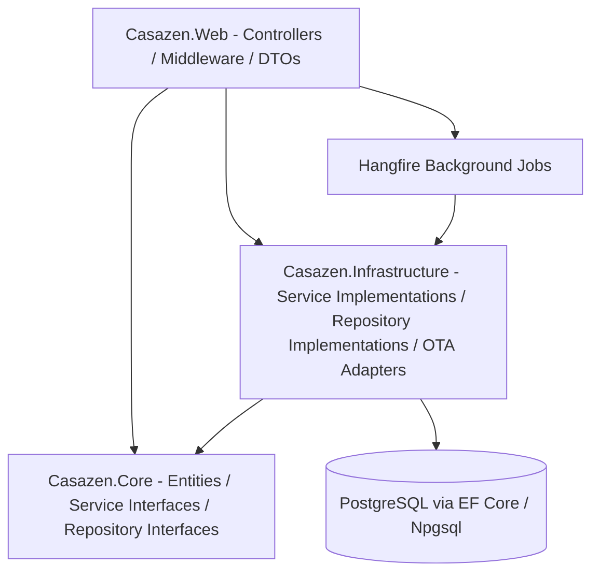
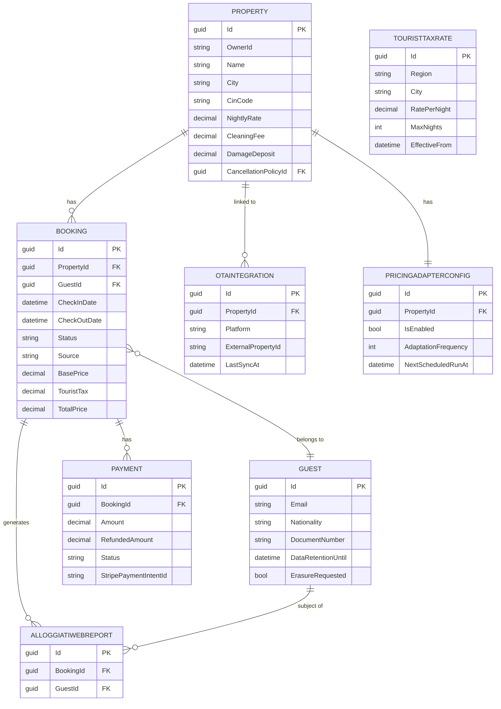

# CasaZen — Technical Documentation

> ASP.NET Core 10 REST API following a layered architecture (Presentation → Business Logic → Data Access), with PostgreSQL (Npgsql / Supabase) via EF Core, Auth0 JWT authentication, and Hangfire background jobs.

---

## Architecture

### Layer diagram


```mermaid
graph TD
    A[Casazen.Web - Controllers / Middleware / DTOs] --> B[Casazen.Core - Entities / Service Interfaces / Repository Interfaces]
    A --> C[Casazen.Infrastructure - Service Implementations / Repository Implementations / OTA Adapters]
    C --> B
    C --> D[(PostgreSQL via EF Core / Npgsql)]
    A --> E[Hangfire Background Jobs]
    E --> C
```

### Layer responsibilities

| Layer | Directory | Responsibility |
|---|---|---|
| Presentation | `Casazen.Web/` | HTTP controllers, DTOs, middleware, Swagger config, auth wiring, background job registration |
| Business Logic | `Casazen.Core/` | Domain entities, service interfaces, repository interfaces, enums, validators, utilities |
| Data Access | `Casazen.Infrastructure/` | EF Core DbContext, repository implementations, service implementations, OTA adapters, Stripe/email clients |
| Tests | `Casazen.Tests/` | Unit and integration tests |

### Dependency rule
`Casazen.Core` has no external project dependencies — it defines only interfaces and entities. `Casazen.Infrastructure` depends on `Casazen.Core` (implements its interfaces). `Casazen.Web` depends on both `Casazen.Core` (for interface injection) and `Casazen.Infrastructure` (registered in DI). This ensures the domain is framework-agnostic.

---

## Tech Stack

| Component | Technology | Version | Notes |
|---|---|---|---|
| Language | C# | 13 | Nullable reference types enabled |
| Framework | ASP.NET Core | 10.0 | Minimal hosting model in `Program.cs` |
| Database | PostgreSQL (Supabase) | — | Npgsql EF Core; integration tests run on real PostgreSQL (see Testing) |
| ORM | Entity Framework Core | 10.x | Code-first, migrations in `Casazen.Infrastructure/Migrations/` |
| Authentication | Auth0 + JWT Bearer | — | `sub` claim used as user ID |
| Background jobs | Hangfire | 1.8.x | PostgreSQL storage; dashboard at `/hangfire` |
| Payment processing | Stripe .NET SDK | — | Webhook signature verification required |
| Email | Resend SDK (`ResendEmailService`) | — | Only provider; emails queued on Hangfire, templates IT/EN (`docs/runbooks/email.md`) |
| OTA resilience | Polly | — | Retry, circuit breaker, timeout, rate limiting per platform |
| Test framework | xUnit | — | `Casazen.Tests/` |
| API docs | Swashbuckle / Swagger | — | Swagger UI at `/swagger` (dev only) |

---

## API Reference

### Base URL
`/api`

### Authentication
All endpoints require a `Bearer` JWT token in the `Authorization` header (issued by Auth0), except anonymous routes noted below (public booking, legal, health, webhooks, guest check-in tokens, supplier register, plan catalogue, SEO sitemap).

Anonymous / public (non-exhaustive highlights):
- `GET /api/health`, `GET /api/health/live`, `GET /api/health/ready`, `GET /api/properties/search`
- `GET /api/orgs/plans`
- All `/api/public/*` (including the SEO sitemap `/api/public/sitemap.xml` and the guest check-in portal `/api/public/checkin/*`), `/api/legal/*`
- `POST /api/suppliers/register`, webhook receivers under `/webhooks/*`

### Authorization (TN-3)

Every action is either `[AllowAnonymous]` or protected by a policy from `Casazen.Web/Authorization/CasazenPolicies.cs`
(the complete set registered at startup; `EndpointAuthorizationArchitectureTests` fails for a policy used but not
registered, registered but unused, or an action with neither).

| Policy (constant) | Who passes |
|---|---|
| `Authenticated` | any signed-in user, suppliers included: only user-scoped endpoints, each listed with its reason in the test allow-list |
| `AdminOnly` | JWT role `Admin` |
| `Supplier` (`RequireSupplier`) | JWT role `Supplier` (backfilled from the DB supplier link) |
| `OrgBillingAdmin` (`RequireOrgBillingAdmin`) | org administrator in either rental context (PL-16): owner `PropertyOwner` or `LongTermLandlord` (JWT role, or DB membership with the owner's role key: `property_owner` of short-rent, `long_term_landlord` of long-rent, `OrgOwnerRoles`), platform `Admin`; never `Staff`/`Guest`, never a `PropertyManager` (D12) nor any other member role. Plan, entitlement, billing, Stripe Connect account, branding, domain, site documents |
| `SharedPropertyRead` / `SharedPropertyWrite` | `property.*` in short-rent **or** long-rent: only the property core a long-term landlord needs (list, record, create/update, documents/APE) — A7-06 |
| `PropertyRead` / `PropertyWrite` | short-rent `property.*`: the short-stay side of a property (photos, CIN, iCal, activation, detail with bookings/OTA, pricing, fiscal, service requests) |
| `BookingRead/Write`, `PaymentRead/Write`, `GuestRead/Write`, `OtaRead/Write` | short-rent context permission |
| `LeaseRead/Create/Sign/Register` | long-rent context permission |

Context permissions come from the DB memberships (`UserContextMemberships` → `Roles` → `RolePermissions`) with the JWT
roles as fallback (`ContextAuthorizationService`). A permission counts only in the context that grants it: the long-rent
`property.*` never satisfies a short-rent policy (`RequireContext:short-rent|long-rent:…` lists both contexts where an
endpoint serves both). The class carries the read permission, writing actions add the write one.

The policy says what kind of operation a user may do; the row itself is checked with
`IAuthorizationService.AuthorizeAsync(User, HostResource, operation)` (`PropertyOperations`, `SharedPropertyOperations`,
`BookingOperations`, `GuestOperations`, `PaymentOperations`, `OtaOperations`, `LeaseOperations`): `HostResourceAuthorizationHandler` grants it only when the row
is in the caller's org, the caller holds the permission and, for property-bound rows, owns the property or has an
org-wide role (`HostRoles.OrgWide`: `PropertyManager`, `Admin`). Lists use `User.GetHostScope(orgId)` → `HostScope`,
filtered in SQL. Services never check roles: they receive the org / scope decided by the web layer. A row that is not in
the caller's org answers 404; a visible row the caller may not use answers 403.

There are **48** controller source files under `Casazen.Web/Controllers/`. The supplier jobs with QR check-in (`SupplierJobController`, `PublicCheckInController`) were removed by SU-11 (decision D12): supplier work is a `ServiceRequest` only.

### Endpoints

#### Auth / identity / devices

| Method | Path | Auth | Description |
|---|---|---|---|
| `GET` | `/api/auth/profile` | JWT | Current auth profile |
| `POST` | `/api/auth/logout` | JWT | Logout / invalidate session side-effects |
| `GET` | `/api/users` | Admin | Paginated user list |
| `GET` | `/api/users/{id}` | Admin | User detail |
| `GET` | `/api/users/me` | JWT | Current user profile |
| `PUT` | `/api/users/me` | JWT | Update current user profile |
| `POST` | `/api/users/onboarding` | JWT | Submit user onboarding payload |
| `PUT` | `/api/users/onboarding` | JWT | Update user onboarding payload |
| `PUT` | `/api/users/{id}/role` | Admin | Change user role |
| `DELETE` | `/api/users/{id}` | Admin | Delete user |
| `POST` | `/api/devices` | JWT | Register iOS/Android push device |
| `DELETE` | `/api/devices/{deviceId}` | JWT | Unregister device |

#### Multi-tenancy (orgs & workspace)

| Method | Path | Auth | Description |
|---|---|---|---|
| `GET` | `/api/me/contexts` | JWT | Workspace contexts (host / supplier / …); merges JWT roles with `UserContextMemberships` |
| `GET` | `/api/orgs/plans` | Anonymous | Plan catalogue and property limits |
| `GET` | `/api/orgs/me/entitlement` | OrgBillingAdmin (org policy, any rental context, PL-16) | Org plan tier (the effective one), limits, usage, `canAddProperty`, `canUseCustomDomain`; BL-01: `openAccess` (`true` when the tier shown is raised by `Entitlement:OpenAccess`, [`open-access.md`](runbooks/open-access.md)) |
| `PUT` | `/api/orgs/me/plan` | Org billing admin | Downgrade / back to Starter only; upgrade without an active subscription → 403 `subscription_required`, Stripe-managed plan → 409 `managed_by_stripe` (#274) |
| `GET` | `/api/orgs/{orgId}/domain` | JWT | Custom domain config for org |
| `POST` | `/api/orgs/{orgId}/domain` | JWT | Set custom domain |
| `POST` | `/api/orgs/{orgId}/domain/verify` | JWT | Verify DNS / domain ownership |

#### Onboarding

| Method | Path | Auth | Description |
|---|---|---|---|
| `GET` | `/api/onboarding/status` | JWT | Host / org onboarding wizard status |

#### Properties

| Method | Path | Description |
|---|---|---|
| `GET` | `/api/properties` | Properties of the caller's org the caller may handle (own ones; whole org for org-wide roles). Short-rent or long-rent. Each row carries `rentalMode` (`Short`/`Long`, PM-01); `?mode=short\|long` narrows the list (400 `validation_error` for another value), without it every property is listed |
| `GET` | `/api/properties/{id}` | The property record (`PropertyResponse`): no bookings, check-in tokens, OTA integrations or documents (PC-02, A2-32; bookings come from the booking endpoints). Short-rent or long-rent |
| `GET` | `/api/properties/cancellation-policies` | Cancellation policies a property can reference (global catalog). Short-rent only |
| `POST` | `/api/properties` | Create a new property. Short-rent or long-rent; `nightlyRate`/`maxGuests` may be `0` (long-term only property, blocks short-stay activation); `bedrooms` may be `0` (studio). Optional `rentalMode` (`Short`/`Long`, PM-01): without it, no guests **and** no rate create a `Long` property, anything else a `Short` one ([`property-rental-mode.md`](runbooks/property-rental-mode.md)) |
| `PUT` | `/api/properties/{id}` | Update a property (owner or org-wide role) with **PATCH semantics** (PC-02, A2-04): a field left out of the body (or `null`) keeps its stored value; `cinCode`, `slug` and `cancellationPolicyId` sent as `null` are cleared. 400 `validation_error` for an invalid field, 422 `cancellation_policy_not_found`, 422 `property_rental_mode_change_not_allowed` for a `rentalMode` that is not the stored one (the mode is never changed by this save). Short-rent or long-rent |
| `GET` | `/api/properties/{id}/mode` | Behind `Features:PropertyModeChange` (PM-02). The mode of the property, the change waiting for its day and the last one that is over. Short-rent or long-rent ([`property-rental-mode.md` §8](runbooks/property-rental-mode.md#8-the-scheduled-change-of-mode-pm-02-decision-d16)) |
| `GET` | `/api/properties/{id}/mode/preview?to=short\|long&date=` | PM-02. What a change to `to` on `date` (default: the first possible day) meets: stays, imported calendar blocks or leases in the way, the first free day, the `issues` the creation would answer. Ids and dates only |
| `POST` | `/api/properties/{id}/mode/change` | PM-02. Programs the change (`{ to, effectiveDate }`, tomorrow at the earliest). 201, 404 `property_not_found`, 409 `property_mode_change_exists` / `property_mode_blocked_by_bookings` / `property_mode_blocked_by_lease` / `property_mode_blocked_by_draft_lease`, 422 `property_mode_unchanged` / `property_mode_date_too_early` / `property_mode_date_too_far`. To long-term the calendar closes from the night before the day |
| `DELETE` | `/api/properties/{id}/mode/change/{changeId}` | PM-02. Withdraws a change that is still waiting: 204, 404 `property_mode_change_not_found`, 409 `property_mode_change_not_scheduled` |
| `GET`/`POST` | `/api/properties/{id}/documents` | List (with `documentType`) / upload documents such as the APE. Short-rent or long-rent |
| `DELETE` | `/api/properties/{id}/documents/{docId}` | Delete a document. Short-rent or long-rent |
| `GET` | `/api/properties/{id}/documents/{docId}/download` | Authenticated download from the private bucket (FD-07). Short-rent or long-rent |
| `DELETE` | `/api/properties/{id}` | Delete a property (owner only). Short-rent only |
| `GET` | `/api/properties/search` | Search properties by city, bedrooms, max price (anonymous) |
| `GET` | `/api/properties/{id}/images` | The photo gallery (PC-04): `photoUrls` in display order (absolute public URLs, the first is the cover) plus the upload rules (`maxPhotos`, `maxFilesPerRequest`, `maxFileSizeBytes`, `allowedContentTypes`). Short-rent only |
| `POST` | `/api/properties/{id}/images` | Upload photos (multipart field `images`; at most 10 files per request, 10 MB each, 20 per property; JPEG/PNG/WebP checked on their content). All or none. 422 `property_photo_none`/`_too_many_files`/`_invalid_type`/`_invalid_size`/`_limit_reached`. Answers with the gallery |
| `DELETE` | `/api/properties/{id}/images?url=...` | Delete a photo **by URL** (not by position) from the gallery and its object from the storage. 404 `property_photo_not_found`. Answers with the gallery |
| `PUT` | `/api/properties/{id}/images/order` | Set the order: body = every photo URL of the gallery, each once. 409 `property_photos_changed` when the list is not the current gallery. Answers with the gallery |
| `PUT` | `/api/properties/{id}/images/cover` | Make a photo the cover (body `{ "url": ... }`): it moves first. Answers with the gallery |

Property record choices (PC-02):
- **Update = PUT with PATCH semantics**, not a full PUT: a client that does not know or show a field (the long-term
  form, the pause toggle of the list, an older app build) can never reset the cleaning fee, deposit, house rules,
  timezone or cancellation policy. The web forms still send every field they show (`toPropertyPayload`), never the
  photos (managed by the image endpoints; a `photoUrls` sent to create or update is ignored, PC-04).
- **Bathrooms stay a whole number** (`int` in the model and the database, 1-50): the form accepts whole numbers only,
  no migration. **Bedrooms 0-100**, `0` = studio (monolocale); the activation wizard no longer requires a bedroom.
- **No country nor currency** on the property: amounts are in euros and the form has no such fields.

#### Bookings

| Method | Path | Description |
|---|---|---|
| `GET` | `/api/bookings` | List bookings (filter by `?propertyId=`) |
| `GET` | `/api/bookings/{id}` | Get a single booking |
| `POST` | `/api/bookings` | Create a booking (availability check + tourist tax calculation) |
| `PUT` | `/api/bookings/{id}` | Update a booking |
| `DELETE` | `/api/bookings/{id}` | Cancel a booking |
| `GET` | `/api/bookings/calendar` | Calendar view (`?propertyId&startDate&endDate&timezone`) |
| `POST` | `/api/bookings/{id}/check-in` | Perform check-in: records `ArrivedAt`, schedules the Alloggiati Web job (idempotent) |
| `POST` | `/api/bookings/{id}/check-out` | Perform check-out |
| `GET` | `/api/bookings/{id}/alloggiati-status` | Alloggiati Web status (same as `/api/alloggiati/{id}/status`) |

#### Host dashboard (PC-16)

| Method | Path | Auth | Description |
|---|---|---|---|
| `GET` | `/api/dashboard/kpis?period=Month&month=yyyy-MM` \| `?period=Last30Days` | short-rent booking.read | KPIs of the period computed on the server (default: current Europe/Rome month); 400 `dashboard_invalid_period` |
| `GET` | `/api/dashboard/ical-feeds` | short-rent booking.read + property.read | iCal import feeds of the caller's properties: last sync, status, error code and localized message, feeds with an error first; never the URL |

Both are limited to the caller's `HostScope` (org, and the owned properties unless the role is org-wide), in SQL.
Definitions (`IHostDashboardService`, `StayKpiRules`; days are Europe/Rome calendar dates, `RomeCalendar`):
- **Period**: a calendar month, or the 30 nights ending with tonight (`Last30Days`). A night belongs to the date it
  starts on.
- **Occupancy** = occupied property-nights / available property-nights, over the active properties of the scope. A
  night is occupied as in `PropertyOccupancy` (the nights the booking site shows as taken): a booking that occupies
  its dates (`CheckoutHolds.OccupiesDates`: not cancelled, not an expired checkout hold; a valid hold or a pending "pay
  at the property" request counts) or a block imported by an iCal feed. A night closed only by a manual block (owner
  stay, maintenance) is neither occupied nor available. Available = nights of the period × properties − closed nights.
  `rate` is `null` when nothing is available.
- **Revenue** of the period: confirmed stays (Confirmed, CheckedIn, CheckedOut) **pro rata per night**: `BasePrice`
  (lodging + cleaning, tourist tax excluded) × nights of the stay in the period / nights of the stay, rounded to the
  cent on the total. A stay across two months counts in each for its nights there. Pending requests, cancelled
  bookings and what a cancellation retains are not counted. Amounts are in euros.
- **Arrivals / departures today**: confirmed stays whose check-in / check-out date is today in Europe/Rome (between
  22:00/23:00 UTC and midnight UTC this is already the next day). A stay date stored with a time (e.g. `23:30Z`) counts
  on its Rome date.
- **Upcoming check-ins**: `Confirmed` bookings from today on (today's arrivals until the host registers them), soonest
  first; never a cancelled booking. **Recent bookings**: the last five created, any status.

The bookings summary of `GET /api/properties/{id}/detail` (A2-36) uses the same rules: `totalBookings` = confirmed
stays, `upcomingBookings` = upcoming check-ins, `activeBookings` = stays in progress today (checked in, or confirmed
with the check-in day passed), `nextCheckIn` / `nextCheckOut` as Rome dates. The detail answers 404 only when the
property is not found; any other failure is a 500.

#### Guests & digital check-in

| Method | Path | Auth | Description |
|---|---|---|---|
| `GET` | `/api/guests` | JWT | List guests |
| `GET` | `/api/guests/{id}` | JWT | Get a single guest |
| `POST` | `/api/guests` | JWT | Create a guest record |
| `PUT` | `/api/guests/{id}` | JWT | Update guest details |
| `DELETE` | `/api/guests/{id}` | JWT | Delete a guest |

#### Leases (long-term)

| Method | Path | Auth | Description |
|---|---|---|---|
| `GET` | `/api/leases` | lease.read | List leases (own properties; whole org for org-wide roles) |
| `GET` | `/api/leases/{id}` | lease.read | Get lease (property owner or org-wide role of its org) |
| `POST` | `/api/leases` | lease.create | Create lease (property owner or org-wide role of its org, e.g. PropertyManager) |
| `GET` | `/api/leases/{id}/contract.pdf` | lease.sign | Final contract to sign offline (approved template only, LT-02/LT-03) |
| `GET` | `/api/leases/{id}/contract/preview` | lease.sign | Contract preview marked BOZZA / ANTEPRIMA (never valid for signature) |
| `POST` | `/api/leases/{id}/signed-document` | lease.sign | Offline signature: signed PDF + stipula date; lease Signed (LT-02) |
| `GET` | `/api/leases/{id}/signed-document` | lease.read | Signed contract (private bucket) |
| `POST` | `/api/leases/{id}/stipula` | lease.sign | Declare the stipula date of a lease signed before LT-02 (once) |
| `GET` | `/api/leases/{id}/signers` | lease.read | Signature panel: persisted signers, provider availability, contract availability |
| `POST` | `/api/leases/{id}/signing` | lease.sign | E-sign provider path, behind `Features:ESignProvider` (off, 404) and a configured provider |
| `POST` | `/api/leases/{id}/registration` | lease.register | Submit lease registration |
| `GET` | `/api/leases/{id}/registration` | lease.read | Registration status |
| `GET` | `/api/leases/{id}/registration/receipt` | lease.read | Registration receipt |
| `PUT` | `/api/leases/{id}/rli/questura/delivery-date` | lease.register | Delivery date of the property (48 hours of the Questura communication count from it; null = start date, LT-07) |
| `POST` | `/api/leases/{id}/rli/questura/mark-done` | lease.register | Landlord declares the Questura communication for an extra-EU tenant: date + optional receipt PDF (LT-07) |
| `GET` | `/api/leases/{id}/rli/questura/receipt` | lease.read | Receipt of the Questura communication (private bucket) |

#### Payments & Stripe Connect

| Method | Path | Auth | Description |
|---|---|---|---|
| `GET` | `/api/payments` | JWT | List all payments |
| `GET` | `/api/payments/{id}` | JWT | Get a single payment |
| `POST` | `/api/payments` | JWT | Create a payment record |
| `POST` | `/api/payments/{id}/process` | JWT | Charge the guest via Stripe |
| `POST` | `/api/payments/{id}/refund` | JWT | Refund (full or `?amount=` partial) |
| `GET` | `/api/payments/revenue` | JWT | Revenue report (`?propertyId&startDate&endDate`) |
| `POST` | `/api/connect/account` | short-rent property.write | Ensure Stripe Express connected account |
| `POST` | `/api/connect/onboarding-link` | short-rent property.write | Create Connect onboarding link |
| `GET` | `/api/connect/status` | short-rent property.write | Connect account status |

#### SaaS billing

| Method | Path | Auth | Description |
|---|---|---|---|
| `GET` | `/api/billing/plans` | JWT | Stripe plan catalogue |
| `POST` | `/api/billing/checkout-session` | OrgBillingAdmin | Create Stripe Checkout session; one per org at a time, same open session reused, 409 `already_subscribed` when a subscription exists (A1-10). Optional `returnPath`: plan/billing page of the caller's shell (allow-list, PL-16), otherwise 400 (`docs/runbooks/stripe.md`) |
| `POST` | `/api/billing/portal-session` | OrgBillingAdmin | Create Stripe Customer Portal session; optional body `{ returnPath }`, same allow-list (PL-16) |
| `GET` | `/api/billing/subscription` | OrgBillingAdmin | Current org subscription; `status`: `none`, `trialing`, `active`, `past_due`, `unpaid`, `incomplete`, `canceled` |
| `PUT` | `/api/billing/profile` | OrgBillingAdmin | Update billing profile |

#### Seasonal suggestions ("Suggerimenti stagionali", PC-15; `docs/runbooks/seasonal-suggestions.md`)

| Method | Path | Description |
|---|---|---|
| `POST` | `/api/pricing-adapter/config/{propertyId}` | Enable / update frequency and rules (computes the suggestions when enabled) |
| `GET` | `/api/pricing-adapter/config/{propertyId}` | Current config (example rule when never saved) |
| `DELETE` | `/api/pricing-adapter/config/{propertyId}` | Disable and delete the suggestions |
| `GET` | `/api/pricing-adapter/suggestions/{propertyId}` | Suggestions by date (real nightly rate x rule), read-only |
| `POST` | `/api/pricing-adapter/recalculate/{propertyId}` | Recompute now (same logic as the nightly job) |

#### OTA Channel Management

| Method | Path | Description |
|---|---|---|
| `POST` | `/api/ota/sync` | Sync all OTA platforms |
| `GET` | `/api/ota/status` | Get OTA sync status |
| `PUT` | `/api/ota/pricing` | Push pricing update to OTAs |
| `GET` | `/api/ota/bookings` | Fetch bookings from a specific OTA platform |
| `PUT` | `/api/ota/availability` | Push availability update to OTAs |
| `POST` | `/api/ota/validate` | Validate OTA API credentials |
| `GET` | `/api/properties/{propertyId}/ota-integrations` | List OTA integrations for a property |
| `GET` | `/api/properties/{propertyId}/ota-integrations/{id}` | Get one integration |
| `POST` | `/api/properties/{propertyId}/ota-integrations` | Create integration |
| `PUT` | `/api/properties/{propertyId}/ota-integrations/{id}` | Update integration |
| `DELETE` | `/api/properties/{propertyId}/ota-integrations/{id}` | Delete integration |

#### Compliance / legal

| Method | Path | Auth | Description |
|---|---|---|---|
| `GET` | `/api/compliance/summary` | short-rent booking.read | Compliance cockpit summary (pending properties, check-ins, checkouts, Alloggiati errors, Alloggiati to send manually); items carry an action and its target, never a path (see below) |
| `GET` | `/api/alloggiati/summary` | booking.read | Alloggiati queue / summary |
| `GET` | `/api/alloggiati/{bookingId}/status` | booking.read | Submission status for a booking |
| `GET` | `/api/alloggiati/{bookingId}/guest-summary` | booking.read | Per-guest data to copy on the Questura portal, in record order |
| `GET` | `/api/alloggiati/{bookingId}/record-file` | booking.read + guest.read | The record file to upload on the portal (CO-13): one 168-character line per guest, UTF-8, CR+LF; built on request, never stored, `private, no-store`; `422 alloggiati_file_not_ready` / `alloggiati_file_stay_days_invalid` / `alloggiati_file_name_not_representable`. Downloading changes no status (`docs/runbooks/alloggiati.md`) |
| `POST` | `/api/alloggiati/{bookingId}/mark-sent-manually` | booking.write | Host declares the schedina sent on the portal (`{ sentOn }`) → `InviatoManualmente` |
| `POST` | `/api/alloggiati/{bookingId}/send` | booking.write | Always `422 alloggiati_transmission_unavailable`: CasaZen has no web service client |
| `GET` | `/api/legal/subprocessors` | Anonymous | Sub-processors actually used by the configuration (GDPR art. 28, `docs/runbooks/legal-documents.md`) |
| `GET` | `/api/legal/dpa` | Anonymous | Data Processing Agreement |
| `GET` | `/api/legal/tos` | Anonymous | Terms of Service |
| `GET` | `/api/legal/privacy` | Anonymous | Privacy policy |
| `GET` | `/api/gdpr/guests/{id}/export` | JWT | Export guest personal data |
| `DELETE` | `/api/gdpr/guests/{id}` | JWT | Erasure request (Art. 17) |
| `POST` | `/api/gdpr/guests/{id}/anonymize` | JWT | Anonymize guest record |
| `PUT` | `/api/gdpr/guests/{id}/consent` | JWT | Update GDPR consent |
| `GET` | `/api/tourist-tax-rates` | JWT | List tourist tax rates |
| `GET` | `/api/tourist-tax-rates/{id}` | JWT | Get rate by id |
| `GET` | `/api/tourist-tax-rates/city/{city}` | JWT | Rates for a city |
| `POST` | `/api/tourist-tax-rates/calculate` | JWT | Calculate tax for a stay |
| `POST` | `/api/tourist-tax-rates` | Admin | Create rate |
| `PUT` | `/api/tourist-tax-rates/{id}` | Admin | Update rate |
| `DELETE` | `/api/tourist-tax-rates/{id}` | Admin | Delete rate |
| `GET` | `/api/public/sitemap.xml` | Anonymous | Compliance SEO sitemap, URLs on `App:PublicSiteBaseUrl`; served on the web app domain as `/sitemap.xml` (runbook `seo-domain.md`) |

**Cockpit links (CO-04, A5-09).** Each item of `GET /api/compliance/summary` is
`{ id, label, action, propertyId, bookingId }`: `action` is the enum `ComplianceCockpitAction` by name and `id` its
target, repeated in `propertyId` (`ActivateProperty`) or `bookingId` (every other action; the other field is `null`).
The API sends no front-end path: the paths it used to invent (`/bookings/{id}/check-in`, ...) were no page of the web
app, whose router sent every row to the dashboard. Each client builds the route from its own routing table; the web app
from the `ROUTE_MANIFEST` in `src/lib/compliance-routes.ts`, whose vitest checks that every action opens a route of the
manifest, short-rent context.

| `action` | Section | Web screen |
|---|---|---|
| `ActivateProperty` | `propertiesPending` (pending or suspended) | `/app/short-rent/properties/{id}/activation`, first blocking step still open (CO-05); property detail without `property.write` |
| `CompleteGuestCheckIn` | `guestCheckInsIncomplete` | `/app/short-rent/bookings/{id}?tab=alloggiati`: missing data guest by guest and the host form (CO-09, CO-12), same tab as the other "complete the guest data" links; the check-in link to send or copy is on the "Ospite" tab |
| `CheckOut` | `checkoutsDue` | `/app/short-rent/bookings/{id}/checkout`; booking detail without `booking.write` |
| `SendAlloggiati` | `alloggiatiManualRequired` | `/app/short-rent/bookings/{id}?tab=alloggiati` (CO-11) |
| `ResolveAlloggiatiFailure` | `alloggiatiFailures` | `/app/short-rent/bookings/{id}?tab=alloggiati` |

A new action is added to the enum and to the clients together: until then the web app shows the item without a link,
never a link to the dashboard.

#### Supplier marketplace

| Method | Path | Auth | Description |
|---|---|---|---|
| `POST` | `/api/admin/suppliers/invite` | Admin | Invite supplier (email queued on Hangfire, Resend); 409 pending invite |
| `POST` | `/api/suppliers/register` | Anonymous (rate limited) | Self-serve registration for a pilot comune, or invite acceptance by the signed-in invited account (SU-01) |
| `POST` | `/api/suppliers/claim` | JWT (own account) | Links the caller to a profile registered anonymously: claim token of that registration, or verified email without token; assigns the `Supplier` role (SU-02) |
| `POST` | `/api/suppliers/invites/lookup` | Anonymous (rate limited) | Invite of a link token (email, comune, expiry) for the web registration page |
| `GET` | `/api/suppliers/registration-options` | Anonymous (rate limited) | Self-serve on/off and pilot comuni (`Suppliers:PilotComuni`) |
| `GET` | `/api/suppliers?comune=&category=` | JWT | List **Active** suppliers for host picker |
| `GET` | `/api/supplier/profile` | Supplier | Supplier profile for current org |
| `PUT` | `/api/supplier/profile` | Supplier | Update profile fields |
| `POST` | `/api/supplier/profile/photos` | Supplier | Upload profile photos (max 10, 5 MB) |
| `GET` | `/api/supplier/profile/activation` | Supplier | Activation wizard step statuses |
| `POST` | `/api/supplier/profile/activation/complete` | Supplier | Complete activation (ToS + blockers) |
| `GET` | `/api/supplier/inbox` | Supplier | Service-request inbox; filters `tab`, `service`, `comune`, `when`, `clientId`, `status`, `from`, `to` (SP-04); until the take no property name and no notes (D9) |
| `GET` | `/api/supplier/availability` | Supplier | Availability for date range |
| `PUT` | `/api/supplier/availability` | Supplier | Upsert availability by date |
| `GET` | `/api/supplier/dashboard` | Supplier | Profile completion, activation, availability and calendar sync |
| `GET` | `/api/supplier/dashboard/kpis?period=` | Supplier | Service-request KPIs of the caller's supplier org (Europe/Rome period, SU-11) |
| `GET` | `/api/supplier/calendar/status` | Supplier | Calendar sync status |
| `PUT` | `/api/supplier/calendar/ical` | Supplier | Set iCal feed URL and sync |
| `GET` | `/api/supplier/services` | Supplier | The supplier's catalog of services with prices (SP-02): the services that are not deleted, with the limit (30) |
| `POST` | `/api/supplier/services` | Supplier | Create a service as a draft (name and category are enough); 201 |
| `GET` | `/api/supplier/services/{id}` | Supplier | One service of the caller's catalog (another supplier's, or a deleted one: 404) |
| `PUT` | `/api/supplier/services/{id}` | Supplier | Replace the content; carries the `version` (`xmin`) the client read, a stale one is 409 |
| `DELETE` | `/api/supplier/services/{id}` | Supplier | Soft delete (204) |
| `POST` | `/api/supplier/services/{id}/publish` | Supplier | Draft or paused → active; 422 with `fields` while name, category, duration or price (or quote) is missing |
| `POST` | `/api/supplier/services/{id}/pause` | Supplier | Active → paused |
| `POST` | `/api/supplier/services/{id}/duplicate` | Supplier | A draft copy with a new slug; 201 |
| `POST` | `/api/supplier/services/{id}/photos` | Supplier | Upload photos of a service (up to 6 files of 10 MB, JPEG/PNG/WebP, 6 per service, all or none) |
| `GET` | `/api/supplier/availability/hours` | Supplier | The weekly working hours (SP-03): seven days, Monday first, each with its bands (minutes after midnight, Rome wall clock) |
| `PUT` | `/api/supplier/availability/hours` | Supplier | Replace the week (up to 3 bands a day, no overlap); 422 `supplier_hours_invalid` with `fields` |
| `GET` | `/api/supplier/availability/time-off` | Supplier | Time off that has not ended (limit 100) |
| `POST` | `/api/supplier/availability/time-off` | Supplier | Add a time off `{ fromDate, toDate, reason?, label? }`; 201 |
| `DELETE` | `/api/supplier/availability/time-off/{id}` | Supplier | Delete a time off (204; another supplier's: 404) |
| `GET` | `/api/supplier/availability/blocks` | Supplier | Blocks and extra openings set by hand that have not ended (limit 200) |
| `POST` | `/api/supplier/availability/blocks` | Supplier | Block hours or add an extra opening `{ kind, startUtc, endUtc, label? }`; 201 |
| `DELETE` | `/api/supplier/availability/blocks/{id}` | Supplier | Delete a manual block (204; one of the calendar feed or another supplier's: 404) |
| `GET` | `/api/supplier/availability/rules` | Supplier | Buffer, jobs a day, notice, horizon and slot step (the defaults while none was saved) |
| `PUT` | `/api/supplier/availability/rules` | Supplier | Replace the five rules (all required) |
| `GET` | `/api/supplier/calendar?from&to` | Supplier | Hours, closed days, time off, blocks and the requests that have a day as whole-day items, for at most 62 days (SP-03) |
| `POST` | `/api/service-requests/match-supplier` | JWT | Match suppliers for a request |
| `POST` | `/api/service-requests` | JWT | Create service request |
| `GET` | `/api/service-requests` | JWT | List service requests |
| `GET` | `/api/service-requests/{id}` | JWT | Get service request |
| `POST` | `/api/service-requests/{id}/take` | Supplier | Take / claim request; optional body `{ scheduledStartUtc, scheduledEndUtc, quotedAmountCents }` (SP-04) |
| `POST` | `/api/service-requests/{id}/start` | Supplier | Start the work: `PresoInCarico → InCorso` (SP-04) |
| `POST` | `/api/service-requests/{id}/complete` | Supplier | Complete request; optional body `{ notes, finalAmountCents, extras[] }`; the notes no longer replace the host's (SP-04) |
| `POST` | `/api/service-requests/{id}/photos` | Supplier | Photos of the work (multipart `photos`, max 6, private bucket) (SP-04) |
| `GET` | `/api/service-requests/{id}/photos/{photoId}` | Supplier / JWT | One photo of the work, for the supplier it was sent to and for the host (SP-04) |
| `POST` | `/api/service-requests/{id}/reject` | Supplier | Reject request |
| `POST` | `/api/service-requests/{id}/cancel` | Supplier / JWT | Cancel with a reason: the host up to the work in progress, the supplier before it starts (SP-04) |
| `POST` | `/api/service-requests/{id}/propose-time` | Supplier | Propose another time on a new request (SP-04) |
| `POST` | `/api/service-requests/{id}/proposal/accept` | JWT | The host accepts the proposed time: the request is taken at that time (SP-04) |
| `POST` | `/api/service-requests/{id}/proposal/reject` | JWT | The host turns the proposed time down (SP-04) |
| `POST` | `/api/service-requests/{id}/remind` | JWT | The host reminds the supplier, at most once every 6 hours (SP-04) |
| `POST` | `/api/service-requests/{id}/mark-paid` | JWT | Mark request paid |
| `POST` | `/api/long-rent/service-requests/{id}/cancel` \| `remind` \| `proposal/accept` \| `proposal/reject` | JWT (long-rent) | The same host actions for a long-rent request (SP-04) |
| `GET` | `/api/long-rent/service-requests/{id}/photos/{photoId}` | JWT (long-rent) | A photo of the work of a long-rent request (SP-04) |
| `POST` | `/api/supplier/inbox/accept` | Supplier | Accept up to 20 new requests at once, one result per row (SP-04) |
| `GET` | `/api/supplier/today` | Supplier | The jobs of the day, the new requests by deadline, the month's earnings (estimate) and the average time to answer (SP-04) |
| `GET` | `/api/supplier/checklist` | Supplier | The supplier's first steps: profile, services, hours, showcase, first request, payments (null for now) (SP-04) |

**Invite email:** `SupplierService.CreateInviteAsync` stores the invite with the SHA-256 of a random token, then queues the email (`EmailTemplates.SupplierInvite`, Hangfire). Signup URL: `{App:PublicSiteBaseUrl}/register?inviteToken={token}` (web app page; the backend no longer serves a `/register` page). Runbook: `docs/runbooks/suppliers.md`.

**Supplier link (SU-02):** an account reaches a supplier org only through its own link (`User.SupplierOrgId`), set by an accepted invite, a signed-in registration or `POST /api/suppliers/claim`; never by matching the email. `GET /api/users/me` returns `supplierOrgId`. Runbook: `docs/runbooks/suppliers.md` §2.

**Supplier service catalog (SP-02):** `SupplierServiceListings` is keyed by the supplier org (not `ITenantOwned`: a supplier-only account has no `User.OrgId`), every statement carries an explicit `OrgId` predicate, the changes of one supplier's catalog run under a PostgreSQL advisory lock and the row carries `xmin` as its concurrency token. Not behind a feature flag. Runbook: `docs/runbooks/suppliers.md` §19.

**Supplier agenda (SP-03):** `SupplierWorkingHours`, `SupplierTimeOff`, `SupplierBusyWindows` and `SupplierSettings` are keyed by the supplier org (not `ITenantOwned`, same reason as the catalog), every statement carries an explicit `OrgId` predicate, and every write runs under the PostgreSQL advisory lock `SupplierCalendarSync` of the supplier (the lock of the iCal sync). `SupplierSlotPlanner` (`Casazen.Core/Suppliers`) is a pure function that turns them, and whatever else takes the supplier's time (`SupplierOccupancy`), into free slots; `RomeCalendar.ToUtc` converts the wall-clock hours of Rome with a rule for the daylight saving change. No public endpoint and no feature flag yet (slots are SP-09). Runbook: `docs/runbooks/suppliers.md` §20.

**Service requests with a time and a price (SP-04):** `ServiceRequest` carries the service, the time (`ScheduledStartUtc/EndUtc`, checked with the planner of SP-03 under the supplier's `SupplierCalendarSync` lock), the price (estimate, quote, final amount with extras, the 20 % flag of decision D7), the deadline `ResponseDueAt`, the cancellation (`Annullato = 6`, `CancelledBy`), the supplier's closing notes in their own field and the photos of the work (private bucket). Every transition is saved under the `xmin` check. The job `service-request-auto-cancel` (every 10 minutes) is behind the flag `SupplierRequestAutoCancel`, off by default. Emails and pushes of the lifecycle name the comune, never the property, to the supplier. Runbook: `docs/runbooks/suppliers.md` §21.

**Booking from the supplier showcase (SP-10):** a customer without an account books a service and a free slot of a supplier: `ShowcaseBookingHold` (30 minutes, the data typed encrypted in one payload) → e-mail check → `ServiceRequest` with `RentalContext = Showcase`, `Source = Showcase`, `PropertyId` null, a `ServiceCustomer` (per supplier; name, e-mail, phone encrypted, found by an HMAC of the address) and a public code. Every hold and every check takes the supplier's `SupplierCalendarSync` lock and judges the slot with the planner without cache, so one slot is never booked twice; the hold counts in the planner like a request with hours. `CK_ServiceRequests_Context` keeps host and showcase requests apart in the database; every host read filters on the rental context as well as on the org. The jobs `service-request-expiry` (`*/5`) and `service-request-reminders` (hourly) are always registered; the retention of the customers is part of `gdpr-data-retention` (`Gdpr:Retention:SupplierCustomers`, off until configured). Migration `AddShowcaseBooking`. Runbook: `docs/runbooks/suppliers.md` §23.

**Customer's own area of a showcase booking (SP-11):** the customer who booked with no account finds the booking again with the supplier's slug, the code and the e-mail address (all in the body, never in a URL), cancels it, moves it while the supplier has not answered, and accepts or turns down a time the supplier proposed (`api/public/supplier-bookings/*`, same flag as the booking). One 404 for everything that does not identify a booking (the address is compared after the decryption, in constant time, and the same statements run for every attempt); two limits answer one 429 (per IP `PublicGuestBookingLookup`, per address and supplier `SupplierBookingManagePerEmail`, `Retry-After` always the whole window). The actions are the supplier's own (state machine, `xmin`, `SupplierCalendarSync` lock, slot planner) with the party `Customer`: the customer's cancellation is free until `Suppliers:Showcase:FreeCancellationHours` before the work (24) and allowed after it at no cost (D6); a proposal the customer lets lapse cancels the request with the reason `ProposalNotAnswered`. No migration. Runbook: `docs/runbooks/suppliers.md` §24.

**Workspace context:** `GET /api/me/contexts` includes a `supplier` context when the JWT has role `Supplier` (added from the DB supplier link at token validation). Default route: `/supplier/inbox`.

#### Public-facing

| Method | Path | Auth | Description |
|---|---|---|---|
| `GET` | `/api/public/resolve-host` | Anonymous | Resolve host / org from Host header or query |
| `GET` | `/api/public/content` | Anonymous | SEO hub: the published pages (same as the sitemap) and the hub canonical URL |
| `GET` | `/api/public/content/affitti-brevi/{regionSlug}/{comuneSlug}` | Anonymous | SEO content page (short-term rentals) |
| `GET` | `/api/public/content/tassa-soggiorno/{comuneSlug}` | Anonymous | SEO content page (tourist tax) |
| `POST` | `/api/public/tourist-tax/calculate` | Anonymous | Public tourist-tax calculator |
| `GET` | `/api/public/orgs/{slug}` | Anonymous | Public org landing by slug |
| `GET` | `/api/public/orgs/{slug}/properties` | Anonymous | Public property list for org |
| `GET` | `/api/public/orgs/{slug}/properties/{propertySlugOrId}` | Anonymous | Public property detail |
| `GET` | `/api/public/suppliers/{slug}` | Anonymous | Public supplier profile (with the published services and the measured response time when `SupplierShowcaseBooking` is on) |
| `GET` | `/api/public/suppliers/{slug}/services` | Anonymous | Published services of a supplier (flag `SupplierShowcaseBooking`) |
| `GET` | `/api/public/suppliers/{slug}/services/{serviceSlug}` | Anonymous | One published service with its supplements (flag `SupplierShowcaseBooking`) |
| `GET` | `/api/public/suppliers/{slug}/slots` | Anonymous | Free slots of a service, from the supplier's planner (flag `SupplierShowcaseBooking`, rate-limited) |
| `POST` | `/api/public/suppliers/{slug}/quote` | Anonymous | Price estimate of a service (flag `SupplierShowcaseBooking`, rate-limited) |
| `POST` | `/api/public/suppliers/{slug}/bookings` | Anonymous | A customer holds a free slot for 30 minutes and receives the e-mail that checks its address; the supplier hears nothing yet (SP-10, flag `SupplierShowcaseBooking`, 5 per 10 minutes per IP, 3 per hour per address and supplier) |
| `POST` | `/api/public/suppliers/{slug}/bookings/{id}/confirm-email` | Anonymous | The token of the e-mail link, in the body: only now the request (`Richiesto`, context `Showcase`) exists and reaches the supplier; a second click answers the same (SP-10, flag `SupplierShowcaseBooking`) |
| `POST` | `/api/public/supplier-bookings/lookup` | Anonymous | The customer's booking, found with `{ slug, code, email }`: status, time, price, place, proposal and what it can do; one 404 for everything else (SP-11, flag `SupplierShowcaseBooking`, 10 per 5 minutes per IP, 10 per 15 minutes per address and supplier) |
| `POST` | `/api/public/supplier-bookings/cancel` | Anonymous | The customer cancels its booking (free until 24 h before the work, allowed after it; optional `reason`); the supplier is told (SP-11) |
| `POST` | `/api/public/supplier-bookings/reschedule` | Anonymous | The customer moves a new request to another free slot (`startUtc`); 409 `supplier_slot_unavailable` if it is not free (SP-11) |
| `POST` | `/api/public/supplier-bookings/proposal/accept` | Anonymous | The customer accepts the time the supplier proposed: the request is taken on the supplier's behalf, the slot checked again (SP-11) |
| `POST` | `/api/public/supplier-bookings/proposal/reject` | Anonymous | The customer turns the proposed time down: the request stays new at its time (SP-11) |
| `GET` | `/api/public/bookings/property/{propertyId}/availability` | Anonymous | Booked dates for public calendar |
| `GET` | `/api/public/bookings/{bookingId}/status` | Anonymous | Booking status (payment option) |
| `POST` | `/api/public/bookings/lookup` | Anonymous | Guest booking lookup by id + email (rate-limited) |
| `POST` | `/api/public/bookings` | Anonymous | Create direct booking (rate-limited) |
| `GET` | `/api/public/ical/{exportToken}` | Anonymous | Property iCal export feed |
| `GET` | `/api/public/checkin/{token}` | Anonymous | Public guest check-in session |
| `POST` | `/api/public/checkin/{token}` | Anonymous | Submit public guest check-in |

#### Admin

| Method | Path | Auth | Description |
|---|---|---|---|
| `GET` | `/api/admin/stats` | Admin | Platform KPI dashboard stats |
| `GET` | `/api/admin/cin-compliance` | Admin | Paginated CIN compliance report |
| `GET` | `/api/admin/jobs` | Admin | Hangfire recurring job statuses |
| `PATCH` | `/api/admin/orgs/{orgId}/plan` | Admin | Change org plan tier: 409 `managed_by_stripe` with an active subscription, 409 `subscription_required` for an upgrade without one |
| `GET` | `/api/admin/seo/pages` | Admin | SEO pages list / filter, server-side paging (`page` ≥ 1, `pageSize` 1-100, else 400) |
| `GET` | `/api/admin/seo/pages/{id}` | Admin | Review screen: published and pending revision (sanitized), review audit |
| `POST` | `/api/admin/seo/pages/{id}/approve` | Admin | Publish the revision read (`revisionId`, `counselApproved`, `note`): 409 newer revision / already published, 422 not publishable / legal review not confirmed (SE-01) |
| `POST` | `/api/admin/seo/pages/{id}/withdraw` | Admin | Withdraw the published text (back to draft, off the public site and the sitemap), audited |
| `GET` | `/api/admin/seo/comuni` | Admin | Comuni catalogue for SEO |
| `POST` | `/api/admin/seo/generate` | Admin | Generate SEO content as drafts (never approved automatically) |
| `GET` | `/api/admin/seo/budget` | Admin | SEO generation budget |
| `POST` | `/api/admin/suppliers/invite` | Admin | See Supplier marketplace |

#### Webhooks & health

| Method | Path | Auth | Description |
|---|---|---|---|
| `POST` | `/webhooks/stripe` | Anonymous (signature) | Stripe platform webhook; processed once per event id (`docs/runbooks/stripe.md`) |
| `POST` | `/webhooks/stripe/connect` | Anonymous (signature) | Stripe Connect webhook; processed once per event id |
| `POST` | `/webhooks/ota/{platform}` | Anonymous | OTA inbound webhook |
| `POST` | `/webhooks/esign` | Anonymous | E-sign provider webhook |
| `GET` | `/api/health/live` | Anonymous | Liveness: the process answers (always 200) |
| `GET` | `/api/health/ready` | Anonymous | Readiness: database, Hangfire, email, storage, Stripe, Auth0; 200 healthy/degraded, 503 unhealthy; `commit` of the build (`docs/runbooks/health-checks.md`) |
| `GET` | `/api/health` | Anonymous | Same as `/api/health/ready` |

---

## Data Model

### Entity-Relationship diagram


```mermaid
erDiagram
    PROPERTY {
        guid Id PK
        string OwnerId
        string Name
        string City
        string CinCode
        decimal NightlyRate
        decimal CleaningFee
        decimal DamageDeposit
        guid CancellationPolicyId FK
    }
    BOOKING {
        guid Id PK
        guid PropertyId FK
        guid GuestId FK
        datetime CheckInDate
        datetime CheckOutDate
        string Status
        string Source
        decimal BasePrice
        decimal TouristTax
        decimal TotalPrice
    }
    GUEST {
        guid Id PK
        string Email
        string Nationality
        string DocumentNumber
        datetime DataRetentionUntil
        bool ErasureRequested
    }
    PAYMENT {
        guid Id PK
        guid BookingId FK
        decimal Amount
        decimal RefundedAmount
        string Status
        string StripePaymentIntentId
    }
    TOURISTTAXRATE {
        guid Id PK
        string Region
        string City
        decimal RatePerNight
        int MaxNights
        datetime EffectiveFrom
    }
    OTAINTEGRATION {
        guid Id PK
        guid PropertyId FK
        string Platform
        string ExternalPropertyId
        datetime LastSyncAt
    }
    ALLOGGIATIWEBREPORT {
        guid Id PK
        guid BookingId FK
        guid GuestId FK
    }
    PRICINGADAPTERCONFIG {
        guid Id PK
        guid PropertyId FK
        bool IsEnabled
        int AdaptationFrequency
        datetime NextScheduledRunAt
    }

    PROPERTY ||--o{ BOOKING : "has"
    PROPERTY ||--o{ OTAINTEGRATION : "linked to"
    PROPERTY ||--|| PRICINGADAPTERCONFIG : "has"
    BOOKING }o--|| GUEST : "belongs to"
    BOOKING ||--o{ PAYMENT : "has"
    BOOKING ||--o{ ALLOGGIATIWEBREPORT : "generates"
    GUEST ||--o{ ALLOGGIATIWEBREPORT : "subject of"
```

### Key entities

#### `Property`

| Field | Type | Constraints | Description |
|---|---|---|---|
| `Id` | `Guid` | PK | Auto-generated primary key |
| `OwnerId` | `string` | Required, max 255 | Auth0 `sub` claim of the owner |
| `Name` | `string` | Required, max 100 | Display name |
| `CinCode` | `string?` | Max 25, `[CinCode]` validated, stored normalized | Italian national ID code, e.g. `IT058091C27G5FFZDZ` (`CinFormat`) |
| `NightlyRate` | `decimal` | Range €0.01–€100,000 | Base nightly rate |
| `Timezone` | `string` | Default `Europe/Rome` | IANA timezone for date handling |

#### `Booking`

| Field | Type | Constraints | Description |
|---|---|---|---|
| `Id` | `Guid` | PK | Auto-generated |
| `PropertyId` | `Guid` | FK | Owning property |
| `GuestId` | `Guid` | FK | Lead guest |
| `Status` | `BookingStatus` | Required | Pending / Confirmed / CheckedIn / CheckedOut / Cancelled |
| `Source` | `BookingSource` | Required | Direct / Airbnb / BookingCom / Expedia / … |
| `TouristTax` | `decimal(18,2)` | — | Calculated at creation from `TouristTaxRate` |
| `TotalPrice` | `decimal(18,2)` | — | BasePrice + TouristTax |

#### `Guest`

| Field | Type | Constraints | Description |
|---|---|---|---|
| `Id` | `Guid` | PK | Auto-generated |
| `Email` | `string` | Required, EmailAddress | Unique contact address |
| `DocumentType` | `DocumentType?` | — | Passport / IdentityCard / DriversLicense / Other |
| `DataRetentionUntil` | `datetime` | Default UtcNow+7yr | GDPR retention deadline |
| `ErasureRequested` | `bool` | Default false | GDPR Article 17 erasure flag |

#### `Payment`

| Field | Type | Constraints | Description |
|---|---|---|---|
| `Id` | `Guid` | PK | Auto-generated |
| `BookingId` | `Guid` | FK | Associated booking |
| `Amount` | `decimal(18,2)` | — | Charged amount |
| `RefundedAmount` | `decimal(18,2)` | Default 0 | Cumulative refunded total |
| `Status` | `PaymentStatus` | Required | Pending / Processing / Completed / Failed / Refunded / PartiallyRefunded |
| `StripePaymentIntentId` | `string?` | Max 255 | Stripe reference |

---

## Design Patterns

| Pattern | Where used | Purpose |
|---|---|---|
| Repository | `Casazen.Infrastructure/Repositories/`, `Casazen.Core/Repositories/` (interfaces) | Abstracts EF Core data access; enables unit testing with mocks |
| Service layer | `Casazen.Core/Services/` (interfaces), `Casazen.Infrastructure/Services/` (implementations) | Encapsulates business logic away from controllers |
| Background jobs (Queue) | `Casazen.Web/BackgroundJobs/` via Hangfire | Decouples long-running work (OTA sync, police reporting, pricing, email) from HTTP request cycle |
| Circuit breaker + Retry (Polly) | `Casazen.Infrastructure/OTA/Resilience/` | Production-grade fault tolerance for all OTA HTTP calls |
| Adapter | `Casazen.Infrastructure/OTA/` — implements `IChannelAdapter` | Uniform interface across 6 OTA platforms; swap implementations without changing business logic |
| Middleware pipeline | `Casazen.Web/Middleware/` | Global error handling, authentication, CORS applied as middleware |
| Webhook handler | `Casazen.Infrastructure/External/StripeWebhookHandler.cs` | Isolated, signature-verified handler for Stripe events |

---

## Infrastructure

### Database
- **Type**: PostgreSQL via Supabase / Npgsql (the app falls back to EF InMemory only when no connection string is set)
- **Connection**: Connection string key `DefaultConnection` in `appsettings.json`
- **Migrations**: EF Core code-first migrations in `Casazen.Infrastructure/Migrations/`; apply with `dotnet ef database update`

### Configuration

- **Config files**: `Casazen.Web/appsettings.json` (committed defaults), `appsettings.Development.json` (local secrets — **never commit**)
- **Key sections**: `Auth0`, `Stripe`, `Email` (Resend), `OTA` (per-platform credentials and resilience settings)

### Background jobs

| Job | Schedule | Purpose |
|---|---|---|
| `OtaSyncJob` | Hourly | Full OTA availability and booking sync |
| `BookingPullJob` | Every 15 minutes | Pull new bookings from all OTA platforms |
| `DynamicPricingJob` | Daily at 02:00 UTC | Recomputes the seasonal suggestions due by Rome date (daily/weekly), upsert per date |
| `AlloggiatiWebReportJob` | Scheduled at 00:00 Europe/Rome of the arrival day | Marks the communication "to send manually" (CasaZen does not transmit: no web service client) |
| `GdprDataRetentionJob` | Scheduled | Anonymise guest data past retention expiry |
| `EmailDeliveryJob` | On email queued (`IEmailQueue`) | Hands one queued email to Resend; retried on transient errors (`docs/runbooks/email.md`) |
| `StripeWebhookJob` | On Stripe event (enqueued) | Process Stripe webhook events asynchronously |

### Deployment
- **Containerisation**: `Dockerfile` at repo root. Local API uses PostgreSQL/Supabase per `docs/INFRA.md`. Hosting in revisione: Railway è stato cancellato dal PO (2026-10-02), vedi `docs/runbooks/free-hosting-analysis.md` (task HOSTING).
- **CI/CD**: GitHub Actions — build + test on push (`.github/workflows/ci-cd.yml`); deploys are not run by Actions and tags `v*` do not deploy (see `docs/INFRA.md`, deploy model in revision)
- **Environments**: Development (local), staging, production

### External service integrations

| Service | SDK / Client | Config location | Purpose |
|---|---|---|---|
| Auth0 | Microsoft JWT Bearer middleware | `appsettings.json → Auth0` | JWT validation on all `/api` endpoints |
| Stripe | Stripe .NET SDK | `appsettings.json → Stripe` | Payment processing and refunds |
| Resend | `Resend` SDK (`ResendEmailService`, the only `IEmailService`) | `Email` section (`Email__Provider`, `Email__ApiKey`, `Email__FromAddress`, `Email__FromName`); see `docs/runbooks/email.md` | Transactional emails (queued on Hangfire) |
| Alloggiati Web | None yet (manual submission, CO-13 adds the SOAP client) | `AlloggiatiWebService.cs`, `docs/runbooks/alloggiati.md` | Italian police guest registration |
| OTA platforms (6) | `IChannelAdapter` implementations | `appsettings.json → OTA` | Booking sync and pricing push |

---

## Testing

| Type | Framework | Location | Coverage target |
|---|---|---|---|
| Unit tests | xUnit | `Casazen.Tests/Unit/` | 80% for services, 100% for critical paths |
| Integration tests | xUnit | `Casazen.Tests/Integration/` | Critical API paths |

### Integration test database

Integration tests run on **real PostgreSQL**, so FKs, unique indexes, `timestamptz` and transactions behave as in production.

- `CasazenWebApplicationFactory` (and derived factories such as `LeaseFlowWebApplicationFactory`) creates a dedicated database `it_<guid>` per factory instance, applies **all** EF migrations with `Database.Migrate()` and drops it on dispose. Test classes sharing a class fixture share that database: seed data idempotently or with unique keys.
- Server resolution (`Casazen.Tests/Integration/Postgres/PostgresTestServer.cs`):
  1. `TEST_POSTGRES_CONNECTION` (e.g. `Host=localhost;Port=5432;Username=postgres;Password=<local password>`), used by CI with a `postgres:16` service;
  2. otherwise a Testcontainers `postgres:16-alpine` container, when Docker is reachable;
  3. otherwise, on a local run only, EF InMemory with a warning on stderr, and tests marked `[PostgresFact]` (migrations, backfill, RLI reservation) are skipped with the reason. On CI (`CI`/`GITHUB_ACTIONS` set) a missing PostgreSQL fails the run.
- `PostgresMigrationTests` applies every migration to an empty database and asserts `HasPendingModelChanges() == false`: add a migration whenever the model changes.
- A test that migrates to an older point (`IMigrator.Migrate(<the migration before the one under test>)`) and seeds rows there must **not** save entities through the model: the model writes the columns of the latest schema, so every column added later broke it (`42703: column "RentalMode" of relation "Properties" does not exist`, after PC-03, PC-05, SU-04 and PC-06 had broken the same tests). Write the rows by SQL naming only the columns that exist at that point: `Casazen.Tests/Integration/Postgres/Legacy{Org,Property,Guest,Lease,Booking}Rows` (or an `INSERT` of your own, as most of the `*MigrationPostgresTests` do), and read through the model only after the last `MigrateAsync()`. `LegacyRowsSchemaTests` (no database) replays the migrations and checks that each helper fits the schema at every point where a test uses it: add the new use to its `Uses` list.
- A test that fails because of a known product bug owned by another task is marked `Skip = "<task id>: <reason>"`.

### Dates, "today" and the clock (FD-06, QA-CLOCK)

The calendar "today" of hosts, guests and properties is the date in **Europe/Rome**. Every night between 22:00 and 24:00 UTC (23:00 and 24:00 in winter) the UTC date is still yesterday in Rome, so code or tests that take "today" from the UTC clock are wrong in that window only.

- **Application code:** "today" comes only from `RomeCalendar` on the injected `TimeProvider`: `timeProvider.TodayInRome()` / `TodayInRomeAsDateOnly()`, `RomeCalendar.DateInRome(instant)` for the Rome date of a stored instant, `RomeCalendar.StartOfDayUtc(date)` for the instant a Rome day starts. Date-only values (check-in, check-out, contract and deadline dates) are compared with that date, never with `DateTime.UtcNow` or `GetUtcNow()`. Instants (`CreatedAt`, token expiries, job windows) keep using the UTC clock.
- **Tests:** a unit test that depends on "today" injects a `FixedTimeProvider` or `FakeTimeProvider` (`Casazen.Tests/Unit`). When the result depends on the hour, it covers both noon UTC and 23:30 UTC (for example with an `[InlineData]` for each). An integration test against the host's real clock takes "today" from `TimeProvider.System.TodayInRome()`, the same clock the app uses. Never `Skip` or wait for midnight: a test that fails between 22:00 and 24:00 UTC is a bug in the test or in the code.
- **Guard:** `CalendarTodayArchitectureTests` fails on `DateTime.Today`, `DateTime.Now`/`DateTimeOffset.Now`, `GetLocalNow()` (application code only), `UtcNow.Date`, `GetUtcNow().Date`, `UtcDateTime.Date`, `now.Date` and `DateOnly.FromDateTime(DateTime.UtcNow)`. It checks the application projects, where `RomeCalendar.cs` is the only exception, and the test project. It cannot see a UTC date built in any other way (for example `new DateTime(utcNow.Year, utcNow.Month, utcNow.Day)`): the rule above still applies.

### Running tests

```bash
# Run all tests (integration tests on a local PostgreSQL)
export TEST_POSTGRES_CONNECTION="Host=localhost;Port=5432;Username=postgres;Password=<local password>"
dotnet test

# Run specific test class
dotnet test --filter "PropertyServiceTests"

# With coverage
dotnet test /p:CollectCoverage=true

# Check formatting
dotnet format --verify-no-changes
```

---

## Development Setup

```bash
# Clone and restore
git clone https://github.com/casazen/casazen-backend.git
cd casazen-backend
dotnet restore

# Configure
cp Casazen.Web/appsettings.json Casazen.Web/appsettings.Development.json
# Edit connection string and secrets in appsettings.Development.json

# Apply database migrations
dotnet ef database update --project Casazen.Infrastructure

# Run
dotnet run --project Casazen.Web

# Swagger UI (dev mode only)
# https://localhost:5001/swagger

# Run tests
dotnet test

# Check formatting before committing
dotnet format --verify-no-changes
```
